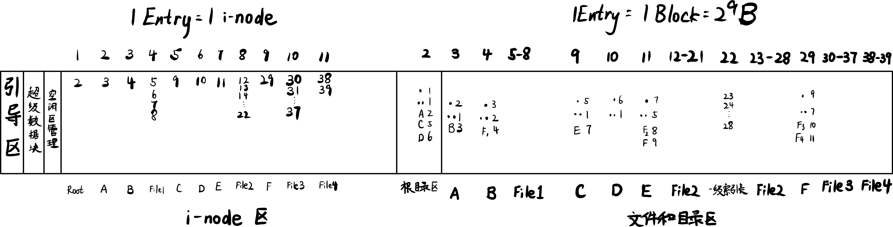
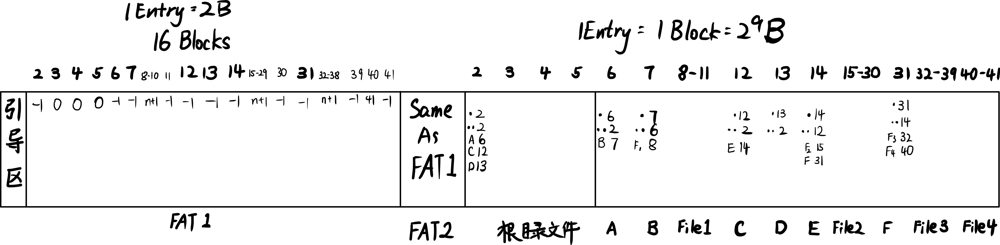

# 2018年秋季学期操作系统期末考试题目总结

## 第一大题：简答题 (共6问, 30分)

1. 关于中断向量表：一个支持100个 system call 的操作系统是如何实现的？

    **解答**:
    操作系统通过一个统一的入口点来处理所有系统调用，从而支持大量的系统调用（如100个），具体实现如下：
    1.  **统一的入口**：操作系统在中断向量表（或中断描述符表 IDT）中保留一个特定的门（例如，在x86上是`0x80`号中断），并使其指向一个统一的系统调用入口处理程序（如Linux的`system_call`）。所有系统调用都通过触发这个中断进入内核。
    2.  **系统调用号**：每个系统调用被分配一个唯一的编号（例如，0-99）。当应用程序需要调用某个系统调用时，它会将对应的编号放入一个指定的寄存器（例如，`EAX`寄存器）。
    3.  **系统调用表**：内核维护一个"系统调用表"（`sys_call_table`），这个表是一个函数指针数组，存储了所有系统调用服务例程的地址。
    4.  **分发执行**：当系统调用入口处理程序被触发后，它会从指定的寄存器中读取系统调用号，然后以该编号为索引，在系统调用表中查找到对应服务例程的地址，并跳转执行。

    这种机制的优点是，只需要一个中断向量就能管理所有系统调用，扩展性强，实现清晰。

2. 进程通过 `fopen` 系统调用读取文件的过程与 PCB (进程控制块)、FCB (文件控制块) 的关系是什么？

    **解答**:
    `fopen`是C库函数，它会调用如`open`等系统调用。整个过程将进程控制块（PCB）和文件控制块（FCB）关联起来：

    1.  **PCB与文件描述符**：每个进程的PCB中都包含一个指向其"文件描述符表"的指针。这个表记录了该进程所有打开的文件。
    2.  **打开文件**：
        *   当进程调用 `fopen`（最终是`open`系统调用）时，操作系统内核会根据文件名找到存储在磁盘上的对应**FCB**。FCB包含了文件的元数据（如权限、大小、数据块位置等）。
        *   内核将FCB的内容加载到内存（形成i-node或v-node），并在内核的"系统级打开文件表"中创建一个条目。该条目指向内存中的i-node，并记录了当前的读写位置等信息。
        *   内核在**进程的文件描述符表**中创建一个新条目，使其指向系统级打开文件表中的对应条目，并返回该条目在进程文件描述符表中的索引，即**文件描述符 (fd)**。
    3.  **读取文件**：后续的`fread`（最终是`read`系统调用）操作会使用这个文件描述符。内核通过`PCB` -> `文件描述符表` -> `系统级打开文件表` -> `内存i-node(来自FCB)`的路径，找到文件的具体信息和数据块位置，从而完成读取。

3. 虚拟内存技术中的 Page Table Entry (页表项) 包含哪些内容？为何这样设计？

    **解答**:
    页表项 (Page Table Entry, PTE) 是页表的基本组成单元，它包含了将虚拟页映射到物理页框所需的信息以及相关的控制位。

    **PTE 通常包含以下内容：**

    1.  **物理页框号 (Physical Frame Number)**：PTE的核心部分，用于和虚拟地址中的页内偏移量组合成最终的物理地址。
    2.  **有效位/驻留位 (Valid/Present Bit)**：指示该虚拟页当前是否在物理内存中。如果为0，访问该页会触发**缺页异常 (Page Fault)**。
    3.  **保护位 (Protection Bits)**：控制对该页的访问权限，如只读（R）、读写（RW）、可执行（X）。非法访问（如向只读页写入）会触发保护异常。
    4.  **修改位/脏位 (Modified/Dirty Bit)**：标记该页在加载到内存后是否被修改过。当页面被换出到磁盘时，如果此位为1，操作系统必须先将页面内容写回磁盘，否则可以直接丢弃。
    5.  **访问位/引用位 (Accessed/Referenced Bit)**：标记该页近期是否被访问过。该位用于页面置换算法（如Clock、LRU的近似实现），以判断哪些页面是"冷"的，可以被优先换出。
    6.  **其他控制位**：如禁用缓存位 (Cache-Disable)、用户/内核位 (User/Supervisor) 等，用于更精细的内存访问控制。

    **这样设计的原因：**

    这种设计将地址转换与内存管理和保护策略紧密地结合在一起，体现了软硬件协同工作的思想：
    *   **实现虚拟内存**：通过"有效位"和"页框号"，操作系统可以在磁盘和内存之间按需移动页面，实现了远大于物理内存的虚拟地址空间。
    *   **提供内存保护**：通过"保护位"，操作系统可以隔离进程地址空间，并防止程序发生越权访问，增强了系统的稳定性。
    *   **提高效率**：
        *   "修改位"避免了对未修改页面的不必要写回操作，减少了磁盘I/O。
        *   "访问位"为页面置换算法提供了硬件支持，使其能高效地做出决策。
    *   **功能和性能的平衡**：PTE的设计在硬件（MMU）快速进行地址翻译和操作系统进行复杂管理策略之间取得了平衡。硬件处理最频繁的地址转换，而将复杂的、低频的事件（如缺页）交给软件（操作系统）处理。

4. 存储管理中的 Invert Page Table (反向页表) 的设计思路是什么？它如何将虚拟地址转化为物理地址？

    **解答**:

    **设计思想**:
    传统页表为每个进程维护一套独立的映射关系，当进程数量多或地址空间巨大（特别是64位系统）时，页表本身会占用巨量的内存空间。反向页表的设计思想就是为了解决这个问题，它颠覆了传统"一个进程一张页表"的模式，改为**整个系统只维护一张页表**。这张表的大小与**物理内存大小**成正比，而不是与所有进程的虚拟地址空间总和成正比。

    表中的每个条目（Entry）对应一个物理页框，记录着哪个进程的哪个虚拟页面占用了这个页框。

    **地址转化过程**:
    由于反向页表是根据物理页框组织的，所以不能再像传统页表那样直接用虚拟页号做索引。它的地址转换过程是一个**搜索过程**：

    1.  **分解虚拟地址**：将给定的虚拟地址 `(进程ID, 虚拟页号p, 页内偏移d)` 分解。
    2.  **搜索页表**：操作系统需要在整个反向页表中搜索一个匹配 `(进程ID, 虚拟页号p)` 的条目。
    3.  **计算物理地址**：
        *   如果搜索成功，找到了对应的条目，该条目在反向页表中的**索引 `i`** 就直接对应了**物理页框号**。
        *   将物理页框号 `i` 与页内偏移 `d` 组合，就得到了最终的物理地址。
    4.  **处理失败**：如果在表中没有找到匹配的条目，说明该虚拟页不在内存中，触发一次缺页异常。

    为了加速这个搜索过程，通常会使用**哈希表 (Hash Table)** 来辅助实现。将虚拟地址 `(进程ID, p)` 通过哈希函数计算出一个哈希值，以此为索引在哈希表中查找，哈希表的条目指向反向页表中的对应条目。

5. 根据课件12 (文件模型2) 第23页的图，阐述其体现的设计思想。
   
   

   **解答**:

   该图展示了 **内存映射文件 (Memory-Mapped File)** 的设计思想，其核心在于将文件内容直接映射到进程的虚拟地址空间中，从而将文件I/O操作转换为内存访问操作。

   这种设计体现了以下几点核心思想：

   1.  **统一文件与内存的访问方式**：程序员可以像访问内存数组一样（例如通过指针）直接读写文件数据，而无需调用 `read()`/`write()` 等传统I/O系统调用，简化了编程模型。

   2.  **利用系统缓存（Page Cache）提升性能**：
       *   所有文件操作实际上都在内核的 **系统缓存 (System Cache)** 中完成。当进程首次访问映射区域时，会触发缺页中断，由内核负责从磁盘将文件块读入缓存。
       *   后续的读写直接在高速的内存缓存中进行，避免了频繁的、低效的磁盘I/O。对文件的修改（写操作）也是先写入缓存，再由操作系统在合适的时机统一写回磁盘（延迟写/Lazy Writing），提高了I/O效率。

   3.  **实现高效的数据共享**：多个进程可以将同一个文件映射到各自的地址空间。由于它们都指向系统缓存中的同一份物理页面，这便成为了一种高效的数据共享和进程间通信（IPC）机制，避免了在不同进程间进行多次数据复制。

   4.  **与虚拟内存机制的深度集成**：该机制无缝地整合了文件系统和虚拟内存系统。文件被当作虚拟内存的一个"后备存储"（Backing Store），其管理方式与普通内存页的换入换出（Paging）非常相似，充分复用了操作系统成熟的内存管理能力。

6. 内存映射编址 (Memory-mapped I/O) 和 I/O 独立编址 (Port-mapped I/O) 的区别是什么？

    **解答**:
    Memory-mapped I/O 和 Port-mapped I/O 是两种不同的处理器与I/O设备通信的地址空间组织方式：

    **内存映射编址 (Memory-mapped I/O):**
    *   **地址空间统一:** I/O设备的寄存器和控制器被映射到系统的主内存地址空间中，与普通内存位置一样使用相同的地址总线和数据总线。
    *   **访问方式:** CPU使用普通的内存访问指令（如load/store、mov等）来读写I/O设备，无需特殊的I/O指令。
    *   **地址分配:** 部分内存地址空间被保留给I/O设备使用，这些地址不对应实际的物理内存。
    *   **优点:** 
        - 编程简单，可以使用任何能操作内存的指令来操作I/O设备
        - 不需要专门的I/O指令集
        - 可以使用常规的内存保护机制
    *   **缺点:** 占用部分内存地址空间，在地址空间有限的系统中可能造成地址浪费

    **I/O独立编址 (Port-mapped I/O):**
    *   **地址空间分离:** I/O设备拥有独立的端口地址空间，与内存地址空间完全分离。
    *   **访问方式:** CPU使用专门的I/O指令（如x86的IN/OUT指令）来访问I/O端口。
    *   **地址分配:** I/O设备使用独立的端口号进行寻址，不占用内存地址空间。
    *   **优点:**
        - 内存地址空间得到完全保留
        - I/O操作和内存操作在指令级别上区分清楚
        - 端口地址通常较短，节省指令编码空间
    *   **缺点:** 
        - 需要专门的I/O指令，增加了指令集复杂度
        - 编程相对复杂，需要使用特定的I/O函数或指令

    **示例对比:**
    *   **Memory-mapped I/O:** `*(volatile uint32_t*)0xA0000000 = data;` // 通过内存地址访问I/O设备
    *   **Port-mapped I/O:** `outb(0x3F8, data);` // 通过端口号访问I/O设备

    **实际应用:** 现代系统通常采用混合方式，高速设备（如GPU、网卡）多使用内存映射方式以获得更好的性能，而传统的简单设备（如串口、并口）仍使用端口映射方式。

## 第二大题：存储管理 (共2问, 20分)

1. 关于 Windows 虚拟存储管理：

   

   *   解释以下页面状态转换分别对应什么场景：
       *   工作集 → 空闲 (Working Set → Free)
       *   空闲 → 工作集 (Free → Working Set)
       *   工作集 → 后备 (Working Set → Standby)
       *   工作集 → 修改 (Working Set → Modified)
       *   后备 → 工作集 (Standby → Working Set)
       *   修改 → 工作集 (Modified → Working Set)
   *   这些转换体现了什么设计思路？

    **解答**:

    **1. 页面状态转换对应的场景：**

    *   **工作集 → 空闲 (Working Set → Free):**
        - 场景：进程终止或虚拟地址解除映射时，该页面从进程工作集中移除，且页面内容是干净的（未被修改）
        - 操作：直接将页面加入空闲链表，可立即被其他进程使用

    *   **空闲 → 工作集 (Free → Working Set):**
        - 场景：进程发生缺页异常，需要分配新的物理页框（如请求零页面 Demand Zero）
        - 操作：从空闲链表中取出页面，分配给进程，加入其工作集

    *   **工作集 → 后备 (Working Set → Standby):**
        - 场景：内存不足时，工作集管理器执行工作集修整（Trimming），移除"老"的页面，且页面内容是干净的
        - 操作：页面PTE标记为无效，但页面内容保留在内存中，加入后备链表

    *   **工作集 → 修改 (Working Set → Modified):**
        - 场景：内存不足时，工作集管理器执行修整，移除"老"的页面，但页面内容是"脏"的（被修改过）
        - 操作：页面PTE标记为无效，加入修改页链表，等待写回磁盘

    *   **后备 → 工作集 (Standby → Working Set):**
        - 场景：进程再次访问刚被移除的页面，发生软缺页（Soft Fault）
        - 操作：快速将页面从后备链表重新加入工作集，无需磁盘I/O

    *   **修改 → 工作集 (Modified → Working Set):**
        - 场景：较少见，通常修改页需要先写回磁盘变为干净状态
        - 操作：可能发生在写回过程中进程又立即访问该页面的情况

    **2. 设计思路：**

    这些转换体现了**页缓冲技术 (Page Buffering)** 和**工作集模型**的设计思想：

    *   **性能优化：** 通过维护后备（Standby）和修改（Modified）链表，被置换的页面不立即丢弃，而是暂时保留在内存中，支持快速回收（软缺页），避免不必要的磁盘I/O

    *   **簇写回优化：** 修改页链表中的脏页可以累积起来成簇地写回磁盘，提高I/O效率

    *   **工作集动态管理：** 根据内存压力和进程行为动态调整工作集大小，平衡性能和内存利用率

    *   **分层缓存策略：** 类似CPU缓存的层次结构，通过多种页面状态实现了一个分层的内存管理系统

2. 请详细写出 Copy-on-Write (写时复制) 技术的实现细节，包括设计思路和所用到的数据结构。

    **解答**:

    **1. 设计思路：**

    Copy-on-Write是一种延迟复制的优化技术，核心思想是在真正需要时才进行物理复制，而在此之前通过共享来节省资源。

    *   **目标：** 优化`fork()`系统调用和私有内存映射的性能
    *   **策略：** 初始共享 + 延迟复制 + 异常驱动

    **2. 实现机制：**

    *   **第一阶段 - 共享初始副本：**
        1. `fork()`创建子进程时，不立即复制父进程的物理内存页面
        2. 子进程的页表项指向与父进程相同的物理页框
        3. 两个进程共享同一份物理内存

    *   **第二阶段 - 保护设置：**
        1. 将共享页框在父子进程的页表项中都标记为只读（清除写权限位）
        2. 在VMA中标记为COW属性（如Linux的`VM_MAYWRITE | VM_SHARED`）
        3. 增加物理页框的引用计数

    *   **第三阶段 - 写操作触发：**
        1. 任一进程尝试写入共享页面
        2. MMU检测到写权限违规，触发保护性页错误（Protection Fault）
        3. CPU切换到内核态，调用页错误处理程序

    *   **第四阶段 - 异常处理：**
        1. **异常识别：** 内核检查PTE状态和VMA属性，确认是COW操作
        2. **分配新页框：** 为触发写操作的进程分配新的物理页框
        3. **内容复制：** 将原始页框内容完整复制到新页框
        4. **页表更新：** 修改写操作进程的PTE，指向新页框，恢复写权限
        5. **引用计数管理：** 减少原页框引用计数，新页框引用计数设为1

    *   **第五阶段 - 恢复执行：**
        1. 内核返回用户态
        2. 重新执行触发异常的写指令
        3. 写操作在私有副本上正常完成

    **3. 关键数据结构：**

    *   **页表项 (PTE)：**
        ```c
        struct pte {
            unsigned long pfn;        // 物理页框号
            unsigned present : 1;     // 驻留位
            unsigned write : 1;       // 写权限位（COW时清除）
            unsigned user : 1;        // 用户/内核位
            unsigned dirty : 1;       // 修改位
            unsigned accessed : 1;    // 访问位
            // 其他控制位
        };
        ```

    *   **虚拟内存区域 (VMA)：**
        ```c
        struct vm_area_struct {
            unsigned long vm_start;   // 起始虚拟地址
            unsigned long vm_end;     // 结束虚拟地址
            unsigned long vm_flags;   // 标志位（包含COW标记）
            struct file *vm_file;     // 映射文件指针
            // 其他字段
        };
        ```

    *   **物理页框描述符：**
        ```c
        struct page {
            atomic_t count;           // 引用计数（关键）
            unsigned long flags;      // 页面状态标志
            struct address_space *mapping;  // 地址空间映射
            void *virtual;           // 虚拟地址
            // 其他管理信息
        };
        ```

    *   **内存描述符：**
        ```c
        struct mm_struct {
            struct vm_area_struct *mmap;     // VMA链表
            pgd_t *pgd;                      // 页目录指针
            atomic_t mm_count;               // 引用计数
            // 其他进程内存管理信息
        };
        ```

    **4. 优点：**

    *   **提高`fork()`效率：** 避免大量不必要的内存复制，特别适用于fork后立即exec的场景
    *   **节省内存：** 只要页面不被修改，多个进程可以持续共享同一物理副本
    *   **降低系统开销：** 减少内存分配和页面置换的压力

    **5. 应用场景：**

    *   **进程创建：** `fork()`系统调用
    *   **私有内存映射：** `mmap(MAP_PRIVATE)`
    *   **动态链接库加载：** 共享库的私有数据段
    *   **程序加载：** 可执行文件的数据段

## 第三大题：文件管理 (共3问, 24分)

1.  为一块 32 GB 的 U 盘设计一个文件系统，需满足以下要求：
    *   可从 U 盘启动。
    *   每个磁盘块大小为 1024 B。
    *   最大支持 2 GB 的文件大小。
    *   空闲块管理只使用一个磁盘块。
    *   支持随机访问。
    *   注重文件性能。

    **解答：**

    可以设计一个类UNIX的索引文件系统，其磁盘布局和关键设计如下：

    1.  **磁盘布局**：
        *   **引导块 (Boot Block)**：位于0号块，使其支持从U盘启动。
        *   **超级块 (Superblock)**：位于1号块，存储文件系统的全局元数据（如块大小、总块数、i-node总数、根目录i-node号、空闲块管理区指针等）。
        *   **空闲块管理区 (Free Space Management)**：使用一个块（如2号块）作为**空闲块链表的头部**。此块中存储了尽可能多的空闲块地址，其中最后一个地址指向下一个同样存储空闲块地址的盘块，形成链式结构（分组链）。
        *   **i-node区**：一块连续的区域，用于存放所有文件的i-node（文件元数据）。
        *   **数据区**：磁盘的剩余部分，用于存放所有文件和目录的数据块。

    2.  **文件索引结构 (i-node)**：为支持2GB大文件和随机访问，i-node需采用混合索引方案。假设块地址为4字节，一个1024B的块可以存256个地址。
        *   **直接指针**：12个，可覆盖 `12 * 1KB = 12KB`。
        *   **一级间接指针**：1个，可覆盖 `256 * 1KB = 256KB`。
        *   **二级间接指针**：1个，可覆盖 `256 * 256 * 1KB = 64MB`。
        *   **三级间接指针**：1个，可覆盖 `256 * 256 * 256 * 1KB = 16GB`。
        *   **总支持大小**：超过2GB，满足要求。此结构通过少量磁盘访问即可定位到任意数据块，实现高效随机访问。

2.  画出进行一系列指定文件操作后，磁盘块的最终布局。

    这里给出课上例题作为参考。

    *   假设一块刚格式化好的磁盘大小为 2MB；每块/簇 大小为 512 字节。
    *   要求画出 (或描述) 在执行下列操作后，一个简化的 UNIX 文件系统和一个 FAT16 文件系统的布局。
    *   操作序列:
        1.  `mkdir /A`
        2.  `mkdir /A/B`
        3.  `create /A/B/File1` (占用 4 块/簇)
        4.  `mkdir /C`
        5.  `mkdir /D`
        6.  `mkdir /C/E`
        7.  `create /C/E/File2` (占用 16 块/簇)
        8.  `mkdir /C/E/F`
        9.  `create /C/E/F/File3` (占用 8 块/簇)
        10. `create /C/E/F/File4` (占用 2 块/簇)

    **解答**:

    UNIX:

    

    FAT16:

    

3.  阐述你的设计中：
    *   如何寻找根目录的起始地址？
    *   如何提升文件系统的性能？
    *   读取某个文件的某个特定字节需要多少次磁盘块操作？

    **解答：**

    *   **如何寻找根目录的起始地址？**
        1.  **读取超级块**：超级块位于磁盘的固定位置（例如1号块）。首先读入此块。
        2.  **获取根i-node号**：从超级块中解析出根目录的i-node号。
        3.  **读取根i-node**：根据根i-node号，在i-node区中计算出其位置并读取该i-node。
        4.  **访问根目录数据**：根i-node中包含了指向存储根目录内容（即文件名与i-node号的对应列表）的数据块指针。通过这些指针即可访问根目录。

    *   **如何提升文件系统的性能？**
        1.  **块缓存 (Buffer Cache)**：在内存中开辟一块区域，缓存最近访问过的磁盘块（包括超级块、i-node、数据块）。后续访问若命中缓存，则无需I/O操作。
        2.  **预读 (Read-Ahead)**：当系统检测到对文件进行顺序读取时，会提前将后续的数据块读入缓存，减少等待时间。
        3.  **优化的磁盘布局**：采用类似FFS（Fast File System）的策略，将磁盘划分为柱面组（Cylinder Group），每个组有自己的i-node和数据块。文件的i-node和其数据块会尽可能分配在同一个组内，以减少磁头寻道时间。
        4.  **延迟写 (Delayed Write)**：对数据的写操作先在内存缓存中完成，稍后或在系统空闲时批量写回磁盘，可以合并多次小写入，提高I/O效率。

    *   **读取某个文件的某个特定字节需要多少次磁盘块操作？**
        假设没有任何缓存命中（最坏情况），并且已经知道文件的i-node。
        1.  **读取i-node**：从i-node区读入该文件的i-node。（**1次I/O**）
        2.  **读取间接块**：根据要访问的字节位置计算出它所在的逻辑块号。
            *   若在**直接块**中：无需额外I/O。
            *   若在**一级间接块**中：需先读取该一级间接块。（**1次I/O**）
            *   若在**二级间接块**中：需先读二级间接块，再读一级间接块。（**2次I/O**）
            *   若在**三级间接块**中：需先读三级，再读二级，再读一级间接块。（**3次I/O**）
        3.  **读取数据块**：根据从i-node或间接块中获得的地址，读取最终的目标数据块。（**1次I/O**）
        
        **总结：**
        *   对于小文件（直接指针）：共需 **2** 次磁盘I/O。
        *   对于中等文件（一级间接）：共需 **3** 次磁盘I/O。
        *   对于大文件（二级间接）：共需 **4** 次磁盘I/O。
        *   对于非常大的文件（三级间接）：共需 **5** 次磁盘I/O。

## 第四大题：死锁 (共2问, 16分)

1.  死锁预防的思路是什么？如何将这种思路应用在哲学家就餐问题上？

    **答：**

    **01. 死锁预防的思路**

    死锁预防的思路是通过在系统设计中施加限制，**破坏产生死锁的四个必要条件之一**，从而从根本上杜绝死锁的发生。这四个必要条件是：

    *   **互斥使用 (Mutual Exclusion)**：资源是独占的。
    *   **占有且等待 (Hold and Wait)**：进程占有至少一个资源，同时又在等待其他资源。
    *   **不可抢占 (No Preemption)**：资源不能被强制抢走。
    *   **循环等待 (Circular Wait)**：存在进程-资源的循环等待链。

    只要破坏其中任意一个，死锁就不会发生。

    **02. 在哲学家就餐问题上的应用**

    哲学家就餐问题的死锁风险主要源于所有哲学家同时"占有"左手边的筷子，并"等待"右手边的筷子，形成了"循环等待"。以下是将死锁预防思路应用于此问题的几种方法：

    *   **破坏"占有且等待"条件**：
        *   **方法**: 要求哲学家必须**同时（原子地）**拿起左右两只筷子，如果不能同时获得，则一只也不拿，并放弃已拿到的筷子。
        *   **实现**: 在"状态数组法"中，`take_forks()`函数通过互斥锁保护，先将哲学家状态设为`HUNGRY`，然后通过`test()`函数检查其左右邻居是否在进食。只有当两只筷子都可用时，才能将状态变为`EATING`并开始进食。这个过程确保了哲学家在无法获得所有必需资源时，不会占有部分资源。

    *   **破坏"循环等待"条件**：
        *   **方法1：非对称/奇偶数限制**：奇数号哲学家先拿左筷子再拿右筷子，而偶数号哲学家相反，先拿右筷子再拿左筷子。这破坏了对称性，从而打破了潜在的等待环路。
        *   **方法2：资源有序分配**：对所有筷子进行编号（如 0 到 4）。强制要求所有哲学家必须先申请编号较小的筷子，再申请编号较大的筷子。这样，需要同时申请 0 号和 4 号筷子的哲学家必须先拿 0 号，从而打破了 P4->P0 的等待依赖，消除了环路。

    *   **通过限制并发进程数（间接破坏循环等待）**：
        *   **方法**：最多只允许四位哲学家同时进入餐厅（即同时尝试拿筷子）。这可以通过一个初值为 4 的信号量 `room` 来实现。只要桌上至少有一位哲学家尚未拿起筷子，就总能保证至少有一根筷子是可用的，从而避免了所有人都占有一根筷子并等待的僵局。

2.  给出一个系统资源状态，判断：
    *   当前系统是否处于安全状态？
    *   此时一个进程发出的资源申请能否被批准？

    这里给出课上例题作为参考。

    5个进程 (P1-P5)，3类资源 (A,B,C)。

    |        | 已分配 (Allocation) | 最大需求 (Max) | 尚需要 (Need) |
    | :----- | :-----------------: | :------------: | :-----------: |
    |        |        A B C        |     A B C      |     A B C     |
    | **P1** |        0 1 0        |     7 5 3      |     7 4 3     |
    | **P2** |        2 0 0        |     3 2 2      |     1 2 2     |
    | **P3** |        3 0 2        |     9 0 2      |     6 0 0     |
    | **P4** |        2 1 1        |     2 2 2      |     0 1 1     |
    | **P5** |        0 0 2        |     4 3 3      |     4 3 1     |

    给定一个系统状态，判断：
    1.  此状态是否为安全状态？
    2.  P2申请(1,0,2)能否分配？
    3.  P5申请(3,3,0)能否分配？
    4.  P1申请(0,2,0)能否分配？

    **解答**:

    **1. 判断当前状态是否安全**

    使用安全性算法。`Work = Available = (3,3,2)`。`Finish = {F,F,F,F,F}`。
    * **Step 1**: 找一个 `Need[i] <= Work` 的进程。
        * P1? (7,4,3) > (3,3,2) No
        * P2? (1,2,2) <= (3,3,2) Yes. P2可以执行。
        * `Work = Work + Allocation[P2] = (3,3,2) + (2,0,0) = (5,3,2)`. `Finish[P2]=T`.
    * **Step 2**:
        * P1? (7,4,3) > (5,3,2) No
        * P3? (6,0,0) > (5,3,2) No
        * P4? (0,1,1) <= (5,3,2) Yes. P4可以执行。
        * `Work = Work + Allocation[P4] = (5,3,2) + (2,1,1) = (7,4,3)`. `Finish[P4]=T`.
    * **Step 3**:
        * P1? (7,4,3) <= (7,4,3) Yes. P1可以执行。
        * `Work = Work + Allocation[P1] = (7,4,3) + (0,1,0) = (7,5,3)`. `Finish[P1]=T`.
    * **Step 4**:
        * P3? (6,0,0) <= (7,5,3) Yes. P3可以执行。
        * `Work = Work + Allocation[P3] = (7,5,3) + (3,0,2) = (10,5,5)`. `Finish[P3]=T`.
    * **Step 5**:
        * P5? (4,3,1) <= (10,5,5) Yes. P5可以执行。
        * `Work = Work + Allocation[P5] = (10,5,5) + (0,0,2) = (10,5,7)`. `Finish[P5]=T`.
        所有进程都可执行完毕，所以 **当前状态是安全的**。一个安全序列是 **<P2, P4, P1, P3, P5>**。

    **2. P2申请 (1,0,2)**
    * **检查1**: `Request[P2] <= Need[P2]`? (1,0,2) <= (1,2,2) Yes.
    * **检查2**: `Request[P2] <= Available`? (1,0,2) <= (3,3,2) Yes.
    * **假定分配**:
        * `Available = (3,3,2) - (1,0,2) = (2,3,0)`
        * `Allocation[P2] = (2,0,0) + (1,0,2) = (3,0,2)`
        * `Need[P2] = (1,2,2) - (1,0,2) = (0,2,0)`
    * **安全性检查**: 新状态下的 `Work = (2,3,0)`.
        * P2? `Need=(0,2,0) <= (2,3,0)` Yes. `Work = (2,3,0)+(3,0,2) = (5,3,2)`.
        * P4? `Need=(0,1,1) <= (5,3,2)` Yes. `Work = (5,3,2)+(2,1,1) = (7,4,3)`.
        * P1? `Need=(7,4,3) <= (7,4,3)` Yes. `Work = (7,4,3)+(0,1,0) = (7,5,3)`.
        * P3? `Need=(6,0,0) <= (7,5,3)` Yes. `Work = (7,5,3)+(3,0,2) = (10,5,5)`
        * P5? `Need=(4,3,1) <= (10,5,5)` Yes.
        * 系统仍然安全。所以 **可以分配**。

    **3. P5申请 (3,3,0)**
    * **检查1**: `Request[P5] <= Need[P5]`? (3,3,0) <= (4,3,1) Yes.
    * **检查2**: `Request[P5] <= Available`? (3,3,0) <= (3,3,2) Yes.
    * **假定分配**:
        * `Available = (3,3,2) - (3,3,0) = (0,0,2)`
        * `Allocation[P5] = (0,0,2) + (3,3,0) = (3,3,2)`
        * `Need[P5] = (4,3,1) - (3,3,0) = (1,0,1)`
    * **安全性检查**: 新状态下的 `Work = (0,0,2)`.
        * 此时，没有一个进程的`Need`向量小于等于`Work`向量。系统进入不安全状态。
        * 所以 **不能分配**。

    **4. P1申请 (0,2,0)**
    * **检查1**: `Request[P1] <= Need[P1]`? (0,2,0) <= (7,4,3) Yes.
    * **检查2**: `Request[P1] <= Available`? (0,2,0) <= (3,3,2) Yes.
    * **假定分配**:
        * `Available = (3,3,2) - (0,2,0) = (3,1,2)`
        * `Allocation[P1] = (0,1,0) + (0,2,0) = (0,3,0)`
        * `Need[P1] = (7,4,3) - (0,2,0) = (7,2,3)`
    * **安全性检查**: 新状态下的 `Work = (3,1,2)`.
        * P1? No. P2? No. P3? No. P4? (0,1,1) <= (3,1,2) Yes.
        * `Work = (3,1,2) + (2,1,1) = (5,2,3)`
        * P2? `Need=(1,2,2) <= (5,2,3)` Yes. `Work = (5,2,3) + (2,0,0) = (7,2,3)`
        * P1? `Need=(7,2,3) <= (7,2,3)` Yes. `Work = (7,2,3) + (0,3,0) = (7,5,3)`
        * P3? `Need=(6,0,0) <= (7,5,3)` Yes. `Work = (7,5,3) + (3,0,2) = (10,5,5)`
        * P5? `Need=(4,3,1) <= (10,5,5)` Yes.
        * 系统仍然安全。所以 **可以分配**。

## 第五大题：同步互斥机制 (共1问, 10分)

1.  设计一个管程 (Monitor) 来实现以下同步互斥问题：
    *   一个仓库中保存两种材料 A 和 B，每种材料的最大库存量为 M。
    *   有两个生产者分别提供材料 A 和 B。
    *   有两个消费者分别取用材料 A 和 B。
    *   规定：
        *   库存的材料必须先进先出 (FIFO)。
        *   当一种材料的库存比另一种多出 N 个时 (N < M)，暂停该材料的生产。
    *   要求写出完整的管程实现代码。 

    **答：**

    下面是一个使用管程（Monitor）解决该问题的伪代码实现。

    *   **设计思路**：
        *   **共享数据**：使用 `countA` 和 `countB` 记录两种材料的库存；使用两个队列 `queueA` 和 `queueB` 来存放材料，以满足 FIFO (先进先出) 的要求。
        *   **条件变量**：
            *   `canProduceA`, `canProduceB`: 当库存达到上限 M，或者不满足数量差约束（即 `countA >= countB + N` 或 `countB >= countA + N`）时，相应的生产者在此条件变量上等待。
            *   `canConsumeA`, `canConsumeB`: 当库存为空时，相应的消费者在此条件变量上等待。
        *   **管程方法**：对外提供四个方法：`produceA`, `consumeA`, `produceB`, `consumeB`。所有方法都自动满足互斥性。
        *   **同步逻辑**：在每个方法内部，使用 `while` 循环来检查是否需要等待。这是管程的标准实践，可以正确处理"虚假唤醒"问题，保证健壮性。当一个线程改变了系统状态（如生产或消费了材料）后，它会调用 `signal()` 来唤醒其他可能因为此状态改变而能继续执行的线程。

    *   **完整管程伪代码**：

    ```c++
    class Warehouse {
        // 共享变量
        int countA = 0;
        int countB = 0;
        Queue queueA; // 存放材料A的队列, 实现FIFO
        Queue queueB; // 存放材料B的队列, 实现FIFO
        final int M;  // 每种材料的最大库存
        final int N;  // 材料数量最大差值

        // 条件变量
        condition canProduceA, canProduceB;
        condition canConsumeA, canConsumeB;

        // 初始化构造函数
        public Warehouse(int max_storage, int max_diff) {
            M = max_storage;
            N = max_diff;
        }

        // 生产者A调用的方法
        public void produceA(Item item) {
            // 当A的库存已满, 或A比B的数量多出N个时, 等待
            while (countA == M || countA >= countB + N) {
                canProduceA.wait();
            }

            queueA.enqueue(item); // 放入材料 (FIFO)
            countA++;

            // 唤醒可能在等待A的消费者
            canConsumeA.signal();
            // 生产了A, 可能会让B的生产条件满足, 唤醒B的生产者
            // (因为countA增加, countB >= countA + N 的条件变得更难满足)
            canProduceB.signal();
        }

        // 消费者A调用的方法
        public Item consumeA() {
            // 当A的库存为空时, 等待
            while (countA == 0) {
                canConsumeA.wait();
            }

            Item item = queueA.dequeue(); // 取出材料 (FIFO)
            countA--;

            // 唤醒可能在等待生产A的生产者 (因为countA减少, 货架空出)
            canProduceA.signal();

            return item;
        }

        // 生产者B调用的方法
        public void produceB(Item item) {
            // 当B的库存已满, 或B比A的数量多出N个时, 等待
            while (countB == M || countB >= countA + N) {
                canProduceB.wait();
            }

            queueB.enqueue(item); // 放入材料 (FIFO)
            countB++;

            // 唤醒可能在等待B的消费者
            canConsumeB.signal();
            // 生产了B, 可能会让A的生产条件满足, 唤醒A的生产者
            canProduceA.signal();
        }

        // 消费者B调用的方法
        public Item consumeB() {
            // 当B的库存为空时, 等待
            while (countB == 0) {
                canConsumeB.wait();
            }

            Item item = queueB.dequeue(); // 取出材料 (FIFO)
            countB--;

            // 唤醒可能在等待生产B的生产者
            canProduceB.signal();

            return item;
        }
    }
    ``` 
