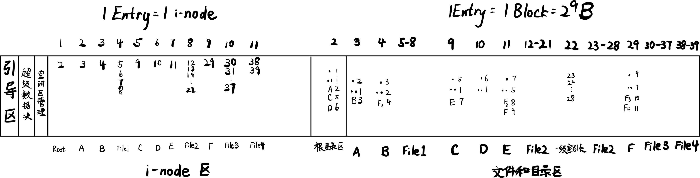

# 2019年春季学期操作系统期末考试题目总结

## 1. 简答题

1.  画出进程的虚拟空间的布局。说明 PCB 中是如何体现进程虚拟空间的?
2.  "内存映射文件"是什么？与虚拟内存管理有什么联系？
3.  使用"磁盘高速缓存"有什么好处？
4.  "打开文件"这一操作的意义和流程。
5.  I/O 管理的主要任务是什么？

## 2. 中断/异常/系统调用

1.  如何新加 n 个系统调用？（每个系统调用有 1-3 个参数）
2.  调用 `boo(p1, p2)` 这个新增的系统调用的过程是怎样的？

## 3. 虚存设计

1.  对于大小为 248 的虚拟地址空间，如何设计页表？
2.  根据你的设计，说明如何将虚拟地址转换成物理地址。

## 4. UNIX 文件系统

1.  UNIX 文件系统的设计中，根目录区前面有哪些部分？
2.  如何确定根目录的起始地址？如何设计空闲区管理？
3.  给出一系列新建文件和文件夹的操作，画出文件系统的布局

这里给出课上例题作为参考。

*   假设一块刚格式化好的磁盘大小为 2MB；每块/簇 大小为 512 字节。
*   要求画出 (或描述) 在执行下列操作后，一个简化的 UNIX 文件系统和一个 FAT16 文件系统的布局。
*   操作序列:
    1.  `mkdir /A`
    2.  `mkdir /A/B`
    3.  `create /A/B/File1` (占用 4 块/簇)
    4.  `mkdir /C`
    5.  `mkdir /D`
    6.  `mkdir /C/E`
    7.  `create /C/E/File2` (占用 16 块/簇)
    8.  `mkdir /C/E/F`
    9.  `create /C/E/F/File3` (占用 8 块/簇)
    10. `create /C/E/F/File4` (占用 2 块/簇)

**解答**:

UNIX:

FAT16:

4.  根据上一问，将某个目录里的某个文件复制到另一个目录下，过程是怎样的？总共要启动硬盘几次？

## 5. 管程

类似于食品供货问题，用管程解决，说明各个变量和条件变量的含义，关键代码加注释。

二手东卖手机 A 和手机壳 B，仓库里最大数量各为 M 个。二手东将 A、B 搭配出售。有两个供应商不断地向二手东供应 A、B。当仓库里 A 比 B 的数量超过 N（$N<M$）个时，二手东暂停 A 的进货。
