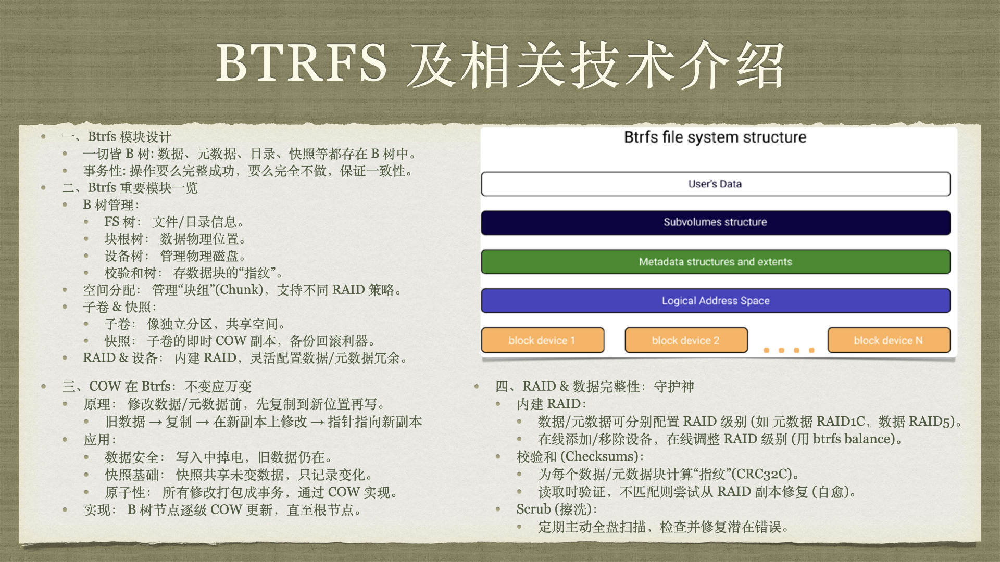

# 操作系统作业 4 —— 文件系统

<center><div style='height:2mm;'></div><div style="font-size:10pt;">梁昱桐 2100013116</div></center>
<center><span style="font-size:9pt;line-height:9mm"><i>Peking University</i></span></center>

> [!NOTE]
> AIGC Declaration: 在完成本作业的过程中，我使用了 `Gemini 2.5 Pro` (`gemini-2.5-pro-preview-05-06`) 进行辅助。

## 文件系统设计

某虚拟文件系统空间的最大容量为 4TB，磁盘块 (基本分配单位) 大小为 1KB。文件控制块 (FCB) 包含一个 512B 的主索引表，请回答下列问题。

### 问题1

假设主索引表只采用直接索引结构，主索引表中保存文件占用的磁盘块号。主索引表表项最少要占多少个字节？可支持的单个文件最大长度是多少字节？

**Answer:**

首先，我们计算系统的基本参数：
-   系统最大容量 = 4TB = $4 \times 2^{40}$ Bytes
-   磁盘块大小 = 1KB = $2^{10}$ Bytes
-   系统中的总磁盘块数 = $\frac{4 \times 2^{40} \text{ B}}{2^{10} \text{ B/block}} = 2^{32}$ blocks.

为了能够唯一标识每一个磁盘块，磁盘块号至少需要 $\log_2(2^{32}) = 32$ 位。
-   磁盘块号所需字节数 = $32 \text{ bits} / (8 \text{ bits/byte}) = 4$ Bytes.

-   **主索引表表项最少字节数：**
    如上计算，为了能寻址系统中所有的 $2^{32}$ 个磁盘块，每个磁盘块号需要 32 位，即 **4 字节**。因此，主索引表中的每个表项 (用于存储磁盘块号) 最少需要 4 字节。

-   **可支持的单个文件最大长度：**
    -   FCB 中主索引表的大小 = 512 Bytes.
    -   每个索引表项的大小 = 4 Bytes (用于存储一个磁盘块号).
    -   主索引表中可包含的索引项数量 = $\frac{512 \text{ B}}{4 \text{ B/entry}} = 128$ entries.
    -   由于是直接索引，每个索引项指向一个磁盘块，磁盘块大小为 1KB.
    -   因此，可支持的单个文件最大长度 = $128 \text{ entries} \times 1 \text{ KB/entry} = 128 \text{ KB}$.

### 问题2

假设主索引表采用如下结构：第 0~7 字节采用 <起始块号，块数> 的格式，表示文件创建时连续分配给文件的磁盘空间。其中起始块号占 6B、块数占 2B，剩余 504B 采用直接索引结构，一个索引项占 6B。
试问:
1. 采用这种结构可支持的单个文件的最大长度是多少字节？
2. 为了使单个文件的长度达到最大，起始块号和块数分别所占的合理字节数是多少？请简要说明理由。

**Answer:**

-   **1. 采用给定结构可支持的单个文件的最大长度：**
    FCB 主索引表总大小仍为 512B。
    1.  **连续分配部分 (前 8 字节):**
        -   起始块号 (start\_block\_no) 占 6 Bytes. (足以寻址 $2^{48}$ 个块，远超系统 $2^{32}$ 个块的需求).
        -   块数 (num\_blocks) 占 2 Bytes = 16 bits.
        -   这部分可表示的最大连续块数 = $2^{16} = 65536$ blocks.
        -   这部分贡献的文件长度 = $2^{16} \text{ blocks} \times 1 \text{ KB/block} = 65536 \text{ KB} = 64 \text{ MB}$.

    2.  **直接索引部分 (剩余 504 字节):**
        -   用于直接索引的空间 = 512B - 8B = 504 Bytes.
        -   每个直接索引项的大小 = 6 Bytes.
        -   直接索引项的数量 = $\frac{504 \text{ B}}{6 \text{ B/entry}} = 84$ entries.
        -   这部分贡献的文件长度 = $84 \text{ entries} \times 1 \text{ KB/entry} = 84 \text{ KB}$.

    3.  **总的最大文件长度：**
        -   总长度 = 长度 (连续部分) + 长度 (直接索引部分)
        -   总长度 = $64 \text{ MB} + 84 \text{ KB} = 65536 \text{ KB} + 84 \text{ KB} = 65620 \text{ KB}$.

-   **2. 为了使单个文件的长度达到最大，起始块号和块数分别所占的合理字节数及理由：**

    系统总共有 $2^{32}$ 个磁盘块。因此，"起始块号" 字段至少需要 4 字节 (32 位) 才能寻址到系统中的任何一个块。对应的块数最大为 4 字节。使用 4 字节存储 "块数"，可以表示最多 $2^{8 \times 4} = 2^{32}$ 个连续块。这允许连续分配部分描述一个最大为 $2^{32} \text{ blocks} \times 1 \text{ KB/block} = 4 \text{ TB}$ 的文件段。

---

## Btrfs 及相关技术运用介绍

在课件 7-文件系统 1 中，我们提到一个常用文件系统 Btrfs，这是一种基于 B 树的文件系统，有写时复制、快照、数据压缩、RAID、子卷管理等多种功能；在课件 8-文件系统 2 中，我们详细讲解了 RAID 技术，并在之前的学习中学习了 COW (写时复制) 技术。现在请你基于课上学习的内容，查阅相关资料，允许使用大模型辅助 (但请不要直接复制粘贴及使用大模型生成的回答格式) ， 制作一个主题为 "Btrfs 及相关技术运用介绍" 的 poster，内容层面至少需要包含：

- btrfs 的模块设计，
- btrfs 重要模块介绍，
- COW 技术在 btrfs 中的运用和实现，
- RAID 以及其他数据完整性技术在 btrfs 中的运用和实现。


Poster 的具体格式和字数不限，根据完成程度可获得加分 (参考课件 0-课程简介-课程成绩评定部分) 。考虑到格式需求，本题 poster 可单独放在另一个 pdf 文件里提交。

**Answer:**



---

## `xv6` 源代码阅读相关问题——文件系统部分

请阅读 `xv6-riscv` 源代码及 `xv6-book` 的相关章节进行学习后，回答下列问题。

参考 `xv6-book` 章节：8.1~8.14。

参考 `xv6-riscv` 相关源代码文件： `kernel` ⽬录下： `buf.h`, `bio.c`, `log.c`, `fs.h`, `fs.c`, `file.h`, `file.c`。

### 问题1: 磁盘块高速缓存

阅读 `xv6-riscv` 的 `bio` 和 `bcache` 部分代码， 结合课上讲述的磁盘块高速缓存相关知识，回答以下问题：

#### `bpin` 和 `bunpin` 两个函数的作用是什么？

**Answer:**

-   **`bpin(struct buf *b)`**:
    -   这个函数用于增加一个缓冲区 (`buf`) 的引用计数 (`refcnt`)。
    -   当一个内核线程或进程需要确保一个特定的磁盘块缓冲区在内存中保持有效，并且不会被回收重用时，就会调用 `bpin`。
    -   增加引用计数可以防止该缓冲区被 `bget` 函数中的 LRU (Least Recently Used) 回收机制选中并重新分配给其他磁盘块，即使它暂时没有被某个进程通过 `acquiresleep` 持有锁。
    -   在函数实现中，它会获取 `bcache.lock` 锁，增加 `b->refcnt`，然后释放锁。

    ```c
    // kernel/bio.c
    void
    bpin(struct buf *b) {
      acquire(&bcache.lock);
      b->refcnt++;
      release(&bcache.lock);
    }
    ```

-   **`bunpin(struct buf *b)`**:
    -   这个函数用于减少一个缓冲区 (`buf`) 的引用计数 (`refcnt`)。
    -   它是 `bpin` 的对应操作。当一个内核线程或进程不再需要固定某个缓冲区时，会调用 `bunpin` 来减少其引用计数。
    -   当引用计数 `refcnt` 降为 0 时，意味着没有活动的引用指向这个缓冲区 (除了可能的 LRU 链表中的存在) ，这使得该缓冲区有资格被 LRU 机制回收。
    -   在函数实现中，它会获取 `bcache.lock` 锁，减少 `b->refcnt`，然后释放锁。

    ```c
    // kernel/bio.c
    void
    bunpin(struct buf *b) {
      acquire(&bcache.lock);
      b->refcnt--;
      release(&bcache.lock);
    }
    ```

#### 为什么要获取 `bcache` 对应的锁？

**Answer:**

在 `xv6` 的 `bio.c` 中，`bcache` 是一个全局的磁盘块高速缓存结构，它包含一个缓冲区数组 (`buf[NBUF]`) 和一个维护这些缓冲区的链表 (LRU 列表) 。

```c
// kernel/bio.c
struct {
  struct spinlock lock; // The bcache lock
  struct buf buf[NBUF];

  // Linked list of all buffers, through prev/next.
  // Sorted by how recently the buffer was used.
  // head.next is most recent, head.prev is least.
  struct buf head;
} bcache;
```

获取 `bcache.lock` 这把自旋锁 (spinlock) 原因如下：

1.  **保护共享数据结构的并发访问:**
    `bcache` 结构，特别是 `bcache.head` (LRU 链表的头节点) 以及各个 `buf` 结构中的 `refcnt` 字段和它们在 LRU 链表中的 `next`/`prev` 指针，可能会被多个内核进程或中断处理程序并发地访问和修改。
    -   例如，`bget` 函数在查找缓存块或选择一个 LRU 块进行回收时，会遍历和修改 LRU 链表。
    -   `brelse` 函数在释放缓冲区时，如果 `refcnt` 变为 0，也会修改 LRU 链表，将缓冲区移到链表头部。
    -   `bpin` 和 `bunpin` 直接修改 `buf->refcnt`。
    如果没有锁的保护，并发的读写操作可能导致数据竞争 (data races) 和不一致的状态，例如链表损坏、`refcnt` 计数错误等，从而导致系统崩溃或数据损坏。

2.  **确保操作的原子性:**
    某些操作需要原子地完成。例如，在 `bget` 中查找一个块并增加其引用计数，或者在 LRU 策略中找到一个未被引用的块并将其分配出去，这些步骤需要作为一个不可分割的整体执行。`bcache.lock` 确保在这些关键代码段执行期间，没有其他执行绪可以干扰 `bcache` 的状态。
    -   在 `bpin` 和 `bunpin` 中，虽然操作看起来简单 (只是增减 `refcnt`) ，但 `refcnt` 的值对于 LRU 逻辑至关重要。如果两个进程同时尝试 `bpin` 同一个缓冲区，或者一个 `bpin` 一个 `bunpin`，没有锁就可能导致 `refcnt` 的最终值错误。

3.  **维护 LRU 链表的完整性:**
    `brelse` 函数会将引用计数为 0 的 `buf` 移到 LRU 链表的头部。`bget` 函数会从 LRU 链表的尾部寻找可重用的 `buf`。这些链表操作必须在 `bcache.lock` 的保护下进行，以防止链表指针在并发修改时出错。

#### `bpin` 在什么场景下被使用？

**Answer:**

`bpin` 函数用于增加缓冲区的引用计数，以防止其被回收。这在以下场景中非常重要：

1.  **日志系统 (Logging System - `log.c`):**
    `xv6` 的文件系统使用日志来保证操作的原子性 (例如，一个系统调用可能需要修改多个磁盘块，日志确保这些修改要么全部完成，要么全不完成) 。
    -   当一个块被添加到当前事务的日志中时 (在 `log_write()` 函数内) ，会调用 `bpin()` 来增加该缓冲区的引用计数。
    -   这样做是为了确保在事务提交 (`commit()`) 并将日志内容写到磁盘上的日志区域之前，这些被日志记录的块 (它们的内容已经被修改，但可能还未写回其在文件系统中的最终位置) 不会因为 LRU 机制而被回收或重用。
    -   如果这些块在事务提交前被回收，那么内存中的修改就会丢失，日志系统就无法正确地将这些修改写入磁盘。
    -   在事务提交并将所有相关的日志块写入磁盘后，这些缓冲区的引用计数会通过 `bunpin()` 减少。

    在 `kernel/log.c` 的 `log_write` 函数中可以看到：
    ```c
    // kernel/log.c
    // inside log_write(struct buf *b)
    // ...
    // b->refcnt is incremented by bpin(), so it will not be collected by bget.
    // ...
    bpin(b); 
    // ...
    ```

2.  **长时间持有但暂时不通过 sleep lock 锁定的缓冲区 (Buffers held for extended periods but not locked by a sleep lock):**
    `bpin` 的设计意图是通用的：任何时候，如果一个内核模块需要确保一个缓冲区在一段时间内不会被 `bget` 回收，即使它没有通过 `acquiresleep(&b->lock)` 持有该缓冲区的独占锁，也可以使用 `bpin`。引用计数确保了只要 `refcnt > 0`，缓冲区就不会被 `bget` 中的 LRU 逻辑视为"未使用" (`if(b->refcnt == 0)` 是 `bget` 选择回收块的条件之一) 。

总的来说，`bpin` 主要用于确保那些内容重要、需要在内存中保留一段时间 (例如，直到某个原子操作完成) 的缓冲区不会被意外回收。在 `xv6` 中，最典型的例子就是文件系统日志记录的块。

#### 当 `bunpin` 函数中的操作使得 `refcnt` 变为 0 时，当前 `buf` 块会立即被释放吗？(buffer)

**Answer:**

不，当 `bunpin(struct buf *b)` 操作使得 `b->refcnt` 变为 0 时，该 `buf` 块**不会立即被释放** (这里的"释放"指释放内存或将其归还给空闲列表) 。

`bunpin` 函数本身只做一件事：减少 `refcnt`。
```c
// kernel/bio.c
void
bunpin(struct buf *b) {
  acquire(&bcache.lock);
  b->refcnt--;
  release(&bcache.lock);
}
```
它并不检查 `refcnt` 是否变为 0，也不执行任何基于此条件的额外操作。

缓冲区的"释放"或更准确地说是"可回收性"是由其他机制管理的：

1.  **`brelse(struct buf *b)` 函数:**
    当一个进程使用完一个缓冲区后，会调用 `brelse`。`brelse` 会首先释放与该缓冲区关联的 `sleeplock`，然后获取 `bcache.lock`，减少 `refcnt`。**如果此时 `refcnt` 变为 0**，`brelse` 会将该缓冲区移到 LRU 链表的头部，表示它是最近被释放 (且未被引用) 的块。
    ```c
    // kernel/bio.c
    void
    brelse(struct buf *b)
    {
      // ...
      releasesleep(&b->lock);
    
      acquire(&bcache.lock);
      b->refcnt--;
      if (b->refcnt == 0) { // <<< Key condition
        // no one is waiting for it.
        // Move to the head of the most-recently-used list.
        b->next->prev = b->prev;
        b->prev->next = b->next;
        b->next = bcache.head.next;
        b->prev = &bcache.head;
        bcache.head.next->prev = b;
        bcache.head.next = b;
      }
      release(&bcache.lock);
    }
    ```
    即使在 `brelse` 中 `refcnt` 变为 0，该缓冲区也只是被标记为可回收 (通过移动到 LRU 头部) ，其内容 (`b->data`) 仍然保留，并且 `b->valid` 位仍然有效。它并没有被"释放"掉。

2.  **`bget(uint dev, uint blockno)` 函数:**
    当需要获取一个磁盘块的缓冲区时，会调用 `bget`。`bget` 首先会检查块是否已在缓存中。如果不在，或者需要分配新缓冲区，它会从 LRU 链表的尾部 (即最久未被使用的块) 开始查找一个 `refcnt == 0` 的缓冲区进行回收。
    ```c
    // kernel/bio.c
    // Inside bget()
    // ...
    // Not cached.
    // Recycle the least recently used (LRU) unused buffer.
    for(b = bcache.head.prev; b != &bcache.head; b = b->prev){ // Iterate from LRU end
      if(b->refcnt == 0) { // <<< Found an unreferenced buffer
        b->dev = dev;
        b->blockno = blockno;
        b->valid = 0;      // Mark as invalid, data needs to be read from disk
        b->refcnt = 1;     // New user is referencing it
        release(&bcache.lock);
        acquiresleep(&b->lock);
        return b;
      }
    }
    // ...
    ```
    只有当 `bget` 选中一个 `refcnt == 0` 的缓冲区进行重用时，该缓冲区的旧内容才会被视为无效 (`b->valid = 0`)，并准备加载新的磁盘块数据。这才是缓冲区被"实际回收并重用"的时刻。

**总结:**
`bunpin` 仅仅减少引用计数。如果 `refcnt` 因此变为 0，这个缓冲区并不会立即被"释放"或其内容被丢弃。它只是表明现在没有任何活动的"pin"或通过 `bget` 获取的活跃的引用。它能否被回收以及何时被回收，取决于 `brelse` 将其置于 LRU 链表的位置，以及后续 `bget` 的回收逻辑。一个 `refcnt == 0` 的缓冲区是 LRU 回收策略的候选者。

### 问题2: 文件操作流程

在课件 7-文件系统 1 部分， 已经简单介绍了 `xv6` 文件系统对应的系统调用 `sys_open` 和 `sys_read` 的主要流程。请阅读相关部分代码  (例如 `file.c`, `sysfile.c` 部分)  ，分别简要总结 `xv6-riscv` 中 `sys_write` 和 `sys_fstat` 对应的文件操作流程  (包含从 `syscall` 到 `inode` 的相关操作) 。

 (提示： `sys_write` 可参考 `filewrite` 函数， `sys_fstat` 可参考 `filestat` 函数，文件系统的系统调用可参考 `xv6-book` 的 8.14 节)  (file operation)

**Answer:**

#### `sys_write`

`sys_write` 系统调用用于将数据从用户空间写入文件。其主要流程如下：

1.  **`syscall` (Trap Handling):**
    *   用户程序执行 `ecall` 指令，触发 trap，进入内核态。
    *   Trap 处理程序 (`usertrap` in `trap.c`) 保存用户态寄存器，设置内核栈，并调用 `syscall()` (`kernel/syscall.c`)。

2.  **`syscall()` (`kernel/syscall.c`):**
    *   `syscall()` 根据系统调用号 (`p->trapframe->a7`) 从 `syscalls` 数组中找到并调用对应的系统调用处理函数，即 `sys_write`。

3.  **`sys_write()` (`kernel/sysfile.c`):**
    *   **参数获取 (Argument Fetching):**
        *   `argfd(0, 0, &f)`: 获取第一个参数 (文件描述符 `fd`) ，并将其转换为对应的 `struct file *f`。
        *   `argaddr(1, &p)`: 获取第二个参数 (用户空间数据缓冲区的地址 `uint64 p`) 。
        *   `argint(2, &n)`: 获取第三个参数 (要写入的字节数 `int n`) 。
    *   **调用 `filewrite()`:**
        *   如果参数有效，调用 `filewrite(f, p, n)` 来执行实际的文件写入操作。

    ```c
    // kernel/sysfile.c
    uint64
    sys_write(void)
    {
      struct file *f;
      int n;
      uint64 p; // User buffer address
      
      argaddr(1, &p); // Get user buffer address
      argint(2, &n);  // Get number of bytes to write
      if(argfd(0, 0, &f) < 0) // Get file struct from file descriptor
        return -1;
    
      return filewrite(f, p, n); // Call filewrite to do the work
    }
    ```

4.  **`filewrite(struct file *f, uint64 addr, int n)` (`kernel/file.c`):**
    *   **权限检查:** 检查文件是否可写 (`f->writable == 0`)。
    *   **根据文件类型分派:**
        *   **管道 (`FD_PIPE`):** 调用 `pipewrite()`。
        *   **设备 (`FD_DEVICE`):** 调用设备驱动的 `write` 函数。
        *   **Inode (Regular File/Directory, `FD_INODE`):**
            *   **分块写入:** 为避免超出日志事务大小，写入操作可能被分解。
            *   **循环写入:**
                *   `begin_op()`: 开始日志事务。
                *   `ilock(f->ip)`: 锁定 inode。
                *   `writei(f->ip, 1, addr + i, f->off, n1)`: 调用 `writei` 将数据写入 inode。 `1` 表示数据源自用户空间，`addr + i` 是用户数据地址，`f->off` 是文件偏移，`n1` 是本次写入的字节数。
                *   `f->off += r`: 更新文件偏移。
                *   `iunlock(f->ip)`: 解锁 inode。
                *   `end_op()`: 结束日志事务。
            *   **`writei(struct inode *ip, int user_src, uint64 src, uint off, uint n)` (`kernel/fs.c`):**
                *   负责将 `n` 字节数据从 `src` 地址写入到 inode `ip` 的 `off` 偏移处。
                *   通过 `bmap()` 查找或分配数据块。如果文件增长，`bmap` 可能调用 `balloc` 分配新块。
                *   数据通过 `either_copyin` (用户源) 或 `memmove` (内核源) 从源地址拷贝到通过 `bread()` 获取的磁盘块缓冲区 (`bp->data`)。
                *   调用 `log_write(bp)` 将修改后的缓冲区记录到日志中。
                *   更新 inode 的大小 (`ip->size`)。
  ```c
  // kernel/file.c
  // Write to file f.
  // addr is a user virtual address.
  int
  filewrite(struct file *f, uint64 addr, int n)
  {
    int r, ret = 0;

    if(f->writable == 0)
      return -1;

    if(f->type == FD_PIPE){
      ret = pipewrite(f->pipe, addr, n);
    } else if(f->type == FD_DEVICE){
      if(f->major < 0 || f->major >= NDEV || !devsw[f->major].write)
        return -1;
      ret = devsw[f->major].write(1, addr, n);
    } else if(f->type == FD_INODE){
      // write a few blocks at a time to avoid exceeding
      // the maximum log transaction size, including
      // i-node, indirect block, allocation blocks,
      // and 2 blocks of slop for non-aligned writes.
      // this really belongs lower down, since writei()
      // might be writing a device like the console.
      int max = ((MAXOPBLOCKS-1-1-2) / 2) * BSIZE;
      int i = 0;
      while(i < n){
        int n1 = n - i;
        if(n1 > max)
          n1 = max;

        begin_op();
        ilock(f->ip);
        if ((r = writei(f->ip, 1, addr + i, f->off, n1)) > 0)
          f->off += r;
        iunlock(f->ip);
        end_op();

        if(r != n1){
          // error from writei
          break;
        }
        i += r;
      }
      ret = (i == n ? n : -1);
    } else {
      panic("filewrite");
    }

    return ret;
  }
  ```

5.  **返回到用户空间:** 结果 (写入的字节数或错误码) 通过 `a0` 寄存器返回。

**总结 `sys_write` 到 `inode` 的流程:**

`sys_write` (`sysfile.c`) -> `filewrite` (`file.c`) -> (for `FD_INODE`) `begin_op`, `ilock`, `writei` (`fs.c`), `iunlock`, `end_op`.
`writei` 内部: 调用 `bmap` (`fs.c`) 来定位/分配磁盘块 (可能调用 `balloc` (`fs.c`))，调用 `bread` (`bio.c`) 读取块，复制数据到缓冲区，调用 `log_write` (`log.c`) 记录缓冲区到日志，最后 `brelse` (`bio.c`) 释放缓冲区。`iupdate` (`fs.c`) (通常在 `end_op` 或 `iput` 中被间接调用) 负责将 inode 的元数据更改写入磁盘。

#### `sys_fstat`

`sys_fstat` 系统调用用于获取一个已打开文件的元数据信息。

1.  **`syscall` (Trap Handling):** 与 `sys_write` 类似。

2.  **`syscall()` (`kernel/syscall.c`):** 调用 `sys_fstat` 处理函数。

3.  **`sys_fstat()` (`kernel/sysfile.c`):**
    *   **参数获取:**
        *   `argfd(0, 0, &f)`: 获取文件描述符对应的 `struct file *f`。
        *   `argaddr(1, &st_user_addr)`: 获取用户空间 `struct stat` 的地址 `st_user_addr`。
    *   **调用 `filestat()`:** 调用 `filestat(f, st_user_addr)`。

    ```c
    // kernel/sysfile.c
    uint64
    sys_fstat(void)
    {
      struct file *f;
      uint64 st_user_addr; // user pointer to struct stat
    
      argaddr(1, &st_user_addr); // Get user address for struct stat
      if(argfd(0, 0, &f) < 0) // Get file struct from file descriptor
        return -1;
      return filestat(f, st_user_addr); // Call filestat
    }
    ```

4.  **`filestat(struct file *f, uint64 addr)` (`kernel/file.c`):**
    *   **类型检查:** 仅对 `FD_INODE` 和 `FD_DEVICE` 类型有效。
    *   **获取 Inode 状态:**
        *   `struct stat st_kernel;`: 在内核中创建 `struct stat`。
        *   `ilock(f->ip)`: 锁定 inode。
        *   **`stati(f->ip, &st_kernel)` (`kernel/fs.c`):** 从 `f->ip` (inode) 提取元数据 (如 `dev`, `ino`, `type`, `nlink`, `size`) 并填充到 `st_kernel`。
        *   `iunlock(f->ip)`: 解锁 inode。
    *   **复制到用户空间:**
        *   `copyout(p->pagetable, addr, (char *)&st_kernel, sizeof(st_kernel))`: 将内核的 `st_kernel` 复制到用户提供的地址 `addr`。
    *   返回 0 表示成功，-1 表示失败。

    ```c
    // kernel/file.c
    int
    filestat(struct file *f, uint64 addr) // addr is user virtual address for struct stat
    {
      struct proc *p = myproc();
      struct stat st; // Kernel's copy of struct stat
      
      if(f->type == FD_INODE || f->type == FD_DEVICE){
        ilock(f->ip);             // Lock the inode
        stati(f->ip, &st);      // Populate kernel's stat struct from inode
        iunlock(f->ip);           // Unlock the inode
        // Copy stat struct to user space
        if(copyout(p->pagetable, addr, (char *)&st, sizeof(st)) < 0)
          return -1; // Error during copyout
        return 0; // Success
      }
      return -1; // Invalid file type for fstat
    }
    ```

5.  **返回到用户空间:** 结果 (0 或 -1) 通过 `a0` 寄存器返回。

**总结 `sys_fstat` 到 `inode` 的流程:**

`sys_fstat` (`sysfile.c`) -> `filestat` (`file.c`) -> (for `FD_INODE` or `FD_DEVICE`) `ilock`, `stati` (`fs.c`), `iunlock`.
`stati` 函数直接从 `struct inode` (`f->ip`) 的字段 (如 `ip->dev`, `ip->inum`, `ip->type`, `ip->nlink`, `ip->size`) 读取信息并填充到 `struct stat` 中。然后 `copyout` 将此结构复制到用户空间。

---