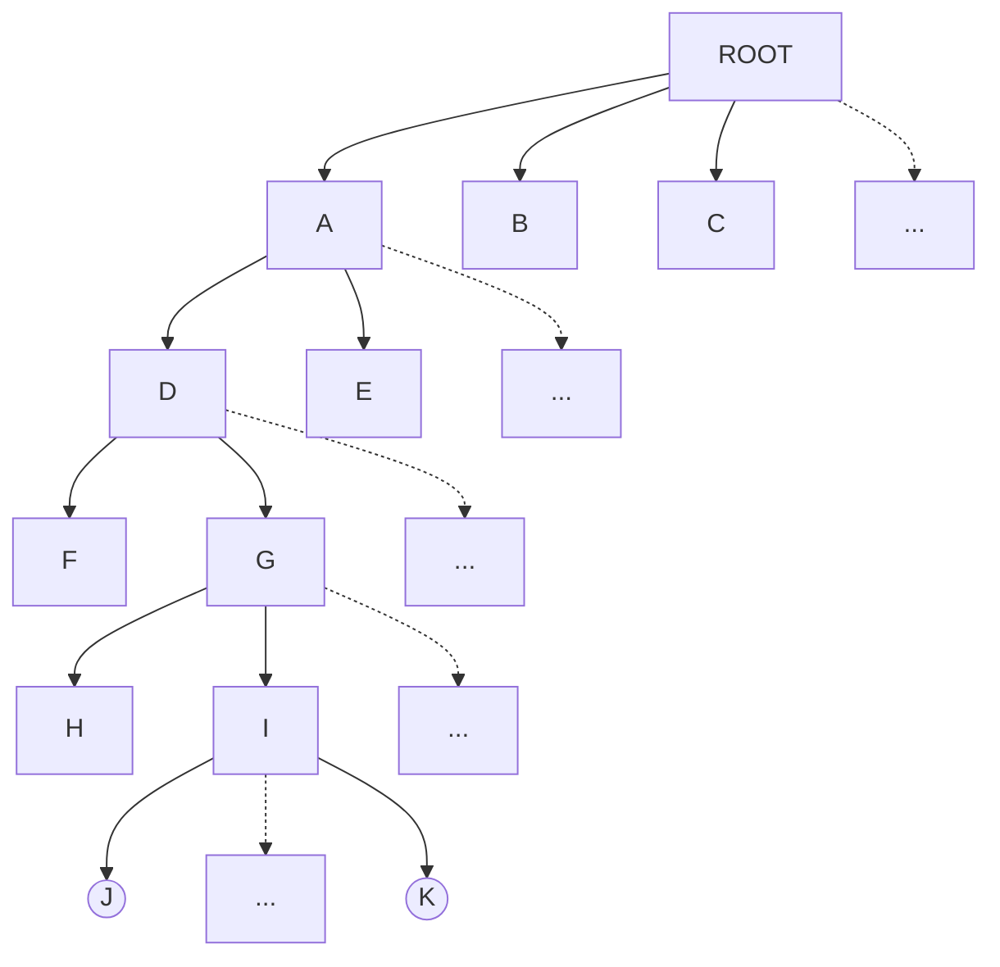

## 0. 核心内容大纲

- [x] 文件和文件目录
- [x] 文件系统的实现
- [x] 文件系统实例
- [x] Windows NTFS简介
- [ ] 文件系统的管理
- [ ] 文件系统的性能
- [ ] 文件系统结构

* **怎样理解"文件系统是对磁盘的抽象"这句话?**
    * **解释:** 磁盘就像一个巨大的、没有任何组织的仓库 (物理存储) , 里面存放着无数的字节数据, 地址可能是某个盘片、某个磁道、某个扇区. 直接管理这个仓库是非常复杂的. 文件系统就像一个仓库管理员, 它提供了一套管理方法和视图 (逻辑结构) , 将杂乱无章的字节组织成一个个有名字、有结构的文件和文件夹 (目录) . 用户只需要告诉管理员想要哪个文件 (通过文件名) , 管理员就会负责找到文件在哪里、如何读取出来, 用户无需关心仓库底层的物理细节. 这种隐藏底层复杂性, 提供更高层、更易用接口的过程, 就是"抽象". 
* **从用户角度怎样看文件系统的功能?**
    * **回答:** 对用户来说, 文件系统是一个工具箱, 可以用来：
        * **组织信息:** 创建文件夹 (目录) 来分类存放文件. 
        * **存储信息:** 创建文件 (如文档、图片、程序) , 将数据保存进去. 
        * **检索信息:** 通过文件名或路径找到需要的文件. 
        * **修改信息:** 打开文件, 编辑内容, 然后保存. 
        * **管理信息:** 复制、移动、删除、重命名文件或文件夹. 
        * **控制访问:** 设置文件的权限, 决定谁可以读取、写入或执行文件. 
* **从系统的角度看待文件系统如何实现?**
    * **回答:** 从操作系统的角度, 文件系统是一个复杂的软件模块, 需要完成以下任务：
        * **元数据管理:** 为每个文件维护详细信息 (如文件名、大小、创建时间、存储位置等) , 通常存储在像FCB或inode这样的数据结构中. 
        * **命名空间管理:** 实现目录结构 (如树形结构) , 并将用户提供的文件名 (路径) 映射到对应的文件元数据. 
        * **存储空间管理:** 跟踪磁盘上哪些空间是空闲的、哪些已被占用, 并在需要时分配空闲空间给文件, 在文件删除时回收空间. 
        * **数据存储与检索:** 实现文件的物理存储方式 (连续、链接、索引等) , 并根据元数据中的地址信息, 将用户对文件逻辑位置 (如第100个字节) 的访问请求转换为对磁盘物理块的读写操作. 
        * **数据一致性与可靠性:** 确保文件操作 (尤其是涉及多个步骤的操作) 要么完全成功, 要么完全失败 (原子性) , 并在系统崩溃后能恢复到一致状态 (如通过日志) . 
        * **性能优化:** 使用缓存、预读、合理的块分配策略等技术提高文件访问速度. 
        * **接口提供:** 向应用程序提供标准的系统调用接口 (如 `open`, `read`, `write`, `close`, `seek`) . 
* **文件系统还要考虑哪些需求?**
    * **回答:** 除了基本功能, 现代文件系统还需关注：
        * **性能:** 读写速度、处理大量小文件或大文件的效率. 
        * **安全性:** 防止未授权访问 (权限控制) 、数据加密. 
        * **可靠性/容错性:** 数据冗余 (如RAID) 、错误检测与恢复、日志功能防止意外中断导致数据损坏. 
        * **可扩展性:** 支持大容量磁盘和海量文件. 
        * **并发控制:**允许多个进程同时访问文件系统而不会相互干扰或破坏数据. 
* **文件系统与其他操作系统功能的接口?**
    * **回答:** 文件系统不是孤立的, 它需要与OS其他部分紧密协作：
        * **I/O子系统:** 文件系统最终需要通过I/O子系统向设备驱动程序发出指令, 来读写物理存储设备 (如磁盘、SSD) . 
        * **内存管理:** 文件系统广泛使用内存缓存 (Buffer Cache / Page Cache) 来提高性能, 减少磁盘I/O次数. 数据的读写通常先经过内存缓存. 
        * **进程管理:** 文件系统需要管理每个进程打开的文件 (如通过文件描述符表) , 维护进程的当前工作目录等. 

---

## 1. 文件系统基础概念

### 1.1 文件 (File)

* **核心定义:** 文件是操作系统对持久性存储介质 (主要是磁盘) 上存储数据的一种**抽象**. 它将底层存储的物理细节 (如扇区、磁道) 隐藏起来, 提供给用户一个逻辑上的、带名字的数据单元. 
* **逻辑视图:** 文件被视为一组**带标识** (文件名) 的、在逻辑上有完整意义的**信息项的序列**. 
    * **信息项:** 可以是字节、字符、记录 (如数据库中的一行) 等, 具体取决于文件的类型和用途. 关键在于它们是**有序**的. 
    * **意义:** 文件存储什么内容、这些内容如何解释 (是文本、图像还是程序？) , 是由创建和使用该文件的用户或应用程序决定的, 文件系统本身通常不关心. 
* **读写指针:** 文件系统通常为每个打开的文件维护一个内部指针, 指示下一次读或写操作应该在文件的哪个位置进行. 这个指针会随着读写操作自动移动. 
* **Unix/Linux的哲学 - "万物皆文件":**
    * 这是一个极具影响力的设计思想. 在Unix/Linux中, 不仅普通的用户数据存储在文件中, 系统中的许多其他资源也被抽象成了文件. 
    * **例子:**
        * 硬件设备: 磁盘分区 (`/dev/sda2`)、终端 (`/dev/tty2`)、打印机等都表现为 `/dev` 目录下的特殊文件. 对这些文件进行读写操作就相当于与对应的硬件设备交互. 
        * 内核信息: 内核本身 (`/boot/vmlinuz...`) 和内核运行时的状态、参数 (`/proc` 目录下的各种"文件") 也都以文件形式存在. 
    * **好处:** 提供了统一的访问接口. 应用程序可以使用相同的系统调用 (`open`, `read`, `write`, `close`) 来处理普通文件、设备、管道等, 大大简化了编程模型. 

### 1.2 文件系统 (File System)

* **定义:** 文件系统是操作系统中负责**管理文件** (即管理持久性数据) 的子系统. 它是硬件 (磁盘) 和用户/应用程序之间的桥梁. 
* **核心功能:**
    * **组织与管理:** 统一管理存储介质上的信息资源, 提供文件的存储、检索、更新机制. 
    * **共享与保护:** 允许多个用户安全、可靠地共享文件, 并提供权限控制机制. 
    * **易用性:** 提供一个方便用户使用的接口 (命令行、图形界面) 和管理工具. 
* **具体职责 (更详细):**
    * **空间管理:** 像一个地产商, 管理磁盘这块"土地", 知道哪些"地块" (磁盘块) 空着, 哪些已经"盖了房子" (被文件占用) . 负责"批地" (分配块) 和"拆迁回收" (回收块) . 
    * **命名与定位:** 实现"按名存取". 用户提供一个"地址" (文件名或路径) , 文件系统负责找到对应的"房子" (文件数据) 在磁盘上的实际物理位置. 这是一个从逻辑名字到物理地址的映射过程. 
    * **共享与安全:** 允许多人"合租"一个文件 (共享) , 并设置门禁 (权限控制) , 保证数据的安全和可靠. 
    * **用户接口:** 提供一套标准的操作工具 (系统调用) , 让用户能方便地"建房子" (创建文件) 、"装修" (写入数据) 、"查看" (读取数据) 、"改名" (重命名) 、"拆除" (删除文件) 等. 
    * **性能优化:** 通过缓存、预读、合理的布局等手段, 让文件的读写尽可能快. 
    * **设备无关性:** 与I/O子系统协作, 使得上层应用不需要关心底层是HDD、SSD还是其他存储设备. 

### 1.3 文件分类 (按UNIX)

 (这是UNIX/Linux系统中常见的文件类型, 可以通过 `ls -l` 命令的第一个字符看到) 

* **`-` 普通文件 (Regular File):** 最常见的文件类型, 包含用户数据. 可以是文本文件 (ASCII/UTF-8) 、二进制文件 (可执行程序、图片、音视频) . 内容由应用程序解释. 
* **`d` 目录文件 (Directory File):** 特殊的文件, 其内容是该目录下包含的文件和子目录的列表 (目录项) . 它提供了文件系统的层级结构. 
* **`c` 字符特殊文件 (Character Special File):** 用于与字符设备 (一次传输一个字符, 无缓冲) 进行交互的文件. 例如：
    * 终端 (`/dev/tty1`)
    * 串口 (`/dev/ttyS0`)
    * 空设备 (`/dev/null`)：写入它的数据被丢弃, 读取它得到文件结束符. 
    * 随机数生成器 (`/dev/random`, `/dev/urandom`)
* **`b` 块特殊文件 (Block Special File):** 用于与块设备 (一次传输固定大小的数据块, 有缓冲) 进行交互的文件. 例如：
    * 硬盘驱动器 (`/dev/sda`, `/dev/nvme0n1`)
    * 磁盘分区 (`/dev/sda1`)
    * 光驱 (`/dev/sr0`)
* **`p` 管道文件 (Pipe File / FIFO):** 用于实现进程间通信. 一个进程写入管道的数据可以被另一个进程读取, 遵循"先进先出" (FIFO) 原则. 
* **`s` 套接字 (Socket):** 用于网络通信或本地进程间通信. 网络通信的端点. 
* **`l` 符号链接文件 (Symbolic Link File):** 包含指向另一个文件或目录的路径名. 访问符号链接时, 系统会沿着它指向的路径去访问目标. 类似于Windows快捷方式. 

### 1.4 文件属性与文件控制块 (FCB)

* **文件属性 (Metadata):** "关于文件的数据", 描述文件本身特征的信息, 而不是文件内容. 
* **文件控制块 (File Control Block, FCB):**
    * **核心数据结构:** 操作系统为了管理文件而创建和维护的一个内部数据结构. **每个文件都有一个对应的FCB**. 
    * **内容:** 存储了该文件的**所有属性信息**. 可以理解为文件的"身份证"或"档案". 
    * **位置:** FCB通常存储在磁盘上, 当文件被打开时, 其FCB (或部分信息) 会被加载到内存中. 
* **常用属性 (FCB中包含的信息):**
    * **标识信息:**
        * 文件名 (用户可见的名字)
        * 文件内部标识符 (文件号/inode号, 系统内部使用的唯一ID)
    * **所有权与权限:**
        * 创建者ID、当前拥有者ID、用户组ID
        * 访问权限 (如读、写、执行权限, 通常分为拥有者、用户组、其他用户三类)
        * 口令 (较少见, 用于额外保护)
    * **结构与类型:**
        * 文件类型 (普通、目录、特殊文件等)
        * 文件逻辑结构 (流式、记录式等)
        * 文件物理结构 (连续、链接、索引)
    * **存储信息:**
        * 文件大小 (字节数)
        * **文件地址:** 指向文件数据在磁盘上存储位置的关键信息 (如：起始块号和长度；或指向第一个块的指针；或指向索引块的指针). 这是FCB最重要的部分之一. 
    * **时间戳:**
        * 创建时间
        * 最后修改时间
        * 最后访问时间
    * **管理信息:**
        * 共享计数 (有多少进程打开了这个文件)
        * 各种标志位: 只读、隐藏、系统、归档 (备份标记)、ASCII/二进制、顺序/随机访问、临时文件、锁状态等. 

---

## 2. 文件结构与访问

### 2.1 文件的逻辑结构

* **定义:** 从**用户视角**看, 文件内部的数据是如何组织的. 这决定了用户如何访问文件内容 (是按字节流、按记录, 还是按某种结构化方式) . 它与文件如何在磁盘上物理存储 (物理结构) 是不同的概念. 
* **常见类型:**
    * **流式文件 (Stream File):**
        * **结构:** 文件被看作一个无结构的、连续的**字节序列**. 这是最简单、最通用的逻辑结构. 
        * **访问:** 通常按字节顺序读写, 也可以通过 `seek` 操作定位到任意字节位置进行随机访问. 
        * **例子:** UNIX/Linux 文件、C语言标准I/O流处理的文件. 
    * **记录式文件 (Record File):**
        * **结构:** 文件由一系列逻辑**记录**组成. 记录可以是定长的, 也可以是变长的. 
        * **访问:** 通常按记录为单位进行读写. 可以顺序访问记录, 或 (如果支持) 直接访问第 N 条记录. 
        * **例子:** 某些数据库文件、COBOL等语言处理的商业数据文件. 
    * **其他结构化文件:**
        * **堆 (Heap):** 记录无序存放, 通常用于临时存储或需要快速插入的场景. 
        * **顺序文件:** 记录按某个键值有序排列. 适合顺序处理, 随机访问效率低. 
        * **索引文件:** 包含一个或多个索引, 根据键值快速定位记录. 索引本身可能是一个小文件或文件的一部分. 
        * **索引顺序文件 (Indexed Sequential File):** 结合了顺序存储和索引, 既支持高效的顺序处理, 也支持较快的随机访问. 
        * **散列文件 (Hashed File):** 通过散列函数将记录键值映射到存储地址, 提供非常快的随机访问速度, 但可能存在冲突和空间浪费问题. 

### 2.2 文件的访问方式

* **顺序存取 (Sequential Access):**
    * **方式:** 文件信息按其逻辑顺序 (字节或记录) 被依次处理. 读写指针自动向前移动. 
    * **特点:** 最简单、最常用. 适用于大多数文件处理场景. 磁带等设备只支持顺序访问. 
    * **例子:** 编辑文本文件、编译源代码、播放音视频. 
* **随机存取 (Random Access) / 直接存取 (Direct Access):**
    * **方式:** 可以不按顺序, 直接读写文件中的任意位置 (字节或记录) . 
    * **前提:** 文件系统需要提供定位操作 (如 `seek`) , 允许程序显式地移动读写指针到指定位置. 
    * **特点:** 效率取决于文件的物理结构. 对于采用连续或索引结构的文件, 随机访问效率较高；对于链接结构, 效率很低. 
    * **例子:** 数据库文件访问 (快速定位到某条记录) 、编辑大型文件的中间部分. 

---

## 3. 存储介质与文件物理结构

### 3.1 存储介质与物理块

* **存储介质:** 文件最终需要存储在物理设备上, 这些设备具有持久性 (断电后数据不丢失) . 
    * **常见类型:** 机械硬盘 (HDD)、固态硬盘 (SSD)、U盘 (Flash Drive)、光盘 (CD/DVD/Blu-ray)、磁带. 
* **磁盘结构 (HDD - Hard Disk Drive):**
    * **物理组成:** 由一个或多个高速旋转的**盘片 (Platter)** 叠加而成, 盘片表面涂有磁性材料. 每个盘面都有一个对应的**读写磁头 (Head)**, 安装在可移动的**磁臂 (Arm)** 上. 
    * **数据组织:**
        * **磁道 (Track):** 盘面上的同心圆. 
        * **扇区 (Sector):** 磁道被划分为若干个弧形小段, 是磁盘**物理读写的最小单位** (传统为512字节, 现在也有4KB的). 扇区包含数据本身, 以及用于定位和校验的额外信息 (如扇区头、ECC) . 
        * **柱面 (Cylinder):** 所有盘面上半径相同的磁道组成的虚拟圆柱. 磁头臂一次移动到位后, 可以访问同一柱面上的所有磁道, 无需再次寻道, 因此访问同一柱面的数据效率较高. 
    * **物理地址:** 传统上用 (柱面号, 磁头号, 扇区号) 来定位一个物理扇区. 
* **物理块 (Block) / 簇 (Cluster):**
    * **文件系统的视角:** 文件系统为了方便管理, **不直接操作物理扇区**, 而是将磁盘空间划分为若干个**大小相等**的逻辑单元, 称为**块 (Block)** 或 **簇 (Cluster)**. 
    * **定义:** 一个块/簇通常包含**一个或多个连续的物理扇区** (大小通常是2的幂, 如512B, 1KB, 2KB, 4KB, 8KB...) . 
    * **作用:** 块/簇是文件系统进行**空间分配、数据传输、寻址的基本单位**. 文件占用的空间是块/簇的整数倍. 
    * **选择块大小的影响:**
        * **小块:** 空间利用率高 (内部碎片少) , 但管理开销大 (需要更多元数据来跟踪小块) , 访问文件可能需要更多次I/O. 
        * **大块:** 管理开销小, 读写大文件效率高 (一次I/O传输更多数据) , 但空间浪费可能严重 (内部碎片多, 一个小文件也要占用一个大块) . 
    * **寻址:** 文件系统使用逻辑块号 (LBA - Logical Block Addressing) 来访问这些块, 屏蔽了底层的物理地址 (柱面/磁头/扇区 或 SSD内部地址) . 
* **磁盘访问时间 (HDD):** 一次磁盘I/O操作的时间主要由三部分构成：
    1.  **寻道时间 (Seek Time):** 移动磁臂将磁头定位到目标磁道所需的时间. 这是**最主要**的耗时部分, 通常是毫秒级. 
    2.  **旋转延迟 (Rotational Latency):** 等待磁盘旋转, 使得目标扇区的起始位置到达磁头下方所需的时间. 取决于磁盘转速, 平均为旋转一周时间的一半. 也是毫秒级. 
    3.  **数据传输时间 (Transfer Time):** 数据在磁盘和内存之间实际传输所需的时间. 取决于传输数据量和磁盘传输速率, 通常远小于前两者. 
    * **优化关键:** 减少寻道次数和旋转延迟是提高磁盘I/O性能的关键. 文件系统设计 (如块的物理布局) 会直接影响这些时间. 
* **SSD vs HDD 寻址:**
    * **LBA (Logical Block Addressing):** 操作系统 (文件系统) 与存储设备交互时使用的地址. 它是一个线性的、从0开始编号的逻辑块地址空间. 
    * **PBA (Physical Block Address):** 存储设备内部实际存储数据的物理位置. 
    * **LBA到PBA的映射:**
        * **HDD:** 映射相对固定和简单, LBA地址可以通过公式大致计算出对应的柱面、磁头、扇区. 
        * **SSD:** SSD内部结构复杂 (由闪存页、块组成, 有擦写次数限制) . **FTL (Flash Translation Layer)** 是SSD控制器中的一个关键固件层, 负责管理LBA到PBA的动态映射. FTL进行**磨损均衡 (Wear Leveling)** (将写操作分散到不同物理块, 延长寿命) 和**垃圾回收 (Garbage Collection)** (回收无效数据页所在的块以便重新写入) , 因此同一个LBA可能在不同时间映射到不同的PBA. 这对文件系统是透明的. 

### 3.2 文件的物理结构 (磁盘空间分配方式)

* **定义:** 指文件的数据块在磁盘上是如何组织和存放的. 这直接影响文件的访问效率和存储空间的利用率. 
* **核心问题:** 如何为文件的逻辑块序列分配物理磁盘块？

#### 3.2.1 连续结构 (顺序分配 / Contiguous Allocation)

* **方式:** 将文件所需的所有物理块**连续地**分配在一起. 
* **FCB记录:** 只需记录文件的**起始物理块号**和文件的**总长度 (块数)**. 
* **优点:**
    * **实现简单:** 管理开销小. 
    * **访问速度快:**
        * **顺序访问:** 磁头只需一次寻道定位到起始块, 然后可以连续读取, 无需额外寻道和旋转延迟. 
        * **随机访问:** 可以通过简单的计算 (起始块号 + 逻辑块号) 直接得到物理块号, 定位速度快. 
* **缺点:**
    * **文件大小需预知:** 创建文件时通常需要指定文件大小, 以便分配足够的连续空间. 
    * **文件动态增长困难:** 如果文件需要扩展超出预留空间, 很难找到相邻的足够大的连续空闲区. 可能需要移动整个文件到别处, 开销巨大. 
    * **外部碎片 (External Fragmentation):** 随着文件的创建和删除, 磁盘上会产生许多不连续的小空闲块. 即使空闲总空间足够, 也可能因为找不到足够大的**连续**空闲区而无法创建新文件. 需要运行磁盘碎片整理程序来合并空闲空间, 但这很耗时. 
    * **存储空间浪费:** 即使预分配了空间, 如果文件实际大小小于预分配大小, 剩余部分也无法被其他文件使用 (除非文件被删除) . 

#### 3.2.2 链接结构 (链式分配 / Linked Allocation)

* **方式:** 将组成文件的物理块**分散地**存放在磁盘各处, 通过在每个块中设置一个**指针**指向下一个物理块, 将这些块链接成一个链表. 
* **FCB记录:** 只需记录文件的**起始物理块号**和**结束物理块号** (或者只记录起始块号, 文件结束通过块内特殊指针值判断) . 
* **优点:**
    * **解决了外部碎片问题:** 可以利用任何位置的空闲块, 提高了磁盘空间利用率. 
    * **文件动态增长容易:** 只需在链表末尾追加新的空闲块即可. 
    * **插入删除相对方便:**  (理论上) 只需修改相邻块的指针. 
* **缺点:**
    * **仅适合顺序访问:** 随机访问效率极低. 要访问第 N 块, 必须从第一块开始, 沿着指针链顺序访问 N-1 次才能找到. 
    * **可靠性差:** 链表中任何一个指针损坏或丢失, 都会导致后续所有数据丢失. 
    * **指针开销:** 每个块都需要额外空间存储指针, 降低了实际数据存储空间. 
    * **寻道次数多:** 由于块物理上不连续, 读取文件时磁头可能需要频繁移动, 访问速度慢. 
* **变形：文件分配表 (FAT - File Allocation Table)**
    * **核心思想:** 将所有块的**链接指针集中存放在磁盘开头的一个特殊区域** (FAT表) , 而不是分散在每个数据块内部. 
    * **结构:** FAT表是一个大数组, 数组的**下标**对应磁盘数据区的**物理块 (簇) 号**. 数组**单元的内容**则表示该块的**下一块的块号**. 
    * **FCB记录:** 只需记录文件的**起始块 (簇) 号**. 
    * **FAT表项值:**
        * `0`: 表示该块未使用 (空闲) . 
        * `下一个块号`: 指向文件逻辑上的下一块. 
        * `文件结束标记` (如-1, FFF, FFFFFFFF): 表示这是文件的最后一个块. 
        * `坏块标记`: 表示该块已损坏, 不可用. 
    * **优点:**
        * **随机访问性能改善:** 要访问第 N 块, 只需在内存中 (如果FAT表已缓存) 查找FAT表 N-1 次即可找到块号, 无需访问数据块本身. 
        * 指针不占用数据块空间. 
    * **缺点:**
        * **FAT表可能很大:** 需要占用额外的磁盘空间. 为了提高效率, FAT表通常需要全部或部分加载到内存中. 
        * **访问文件仍需两次访问:** 第一次访问FAT表确定物理块号, 第二次才访问实际数据块. 
        * **可靠性:** FAT表是关键数据结构, 损坏会导致整个文件系统瘫痪 (因此通常有备份FAT) . 

#### 3.2.3 索引结构 (索引分配 / Indexed Allocation)

* **方式:** 为每个文件创建一个**索引块 (Index Block)** (或称为索引表) . 索引块中存储一个**地址数组**, 数组的每个元素指向文件占用的一个物理数据块. 文件的数据块可以分散存储在磁盘各处. 
* **FCB记录:** 只需记录该文件的**索引块的地址**. 
* **优点:**
    * **支持高效的随机访问:** 要访问文件的第 N 个逻辑块, 只需读取索引块, 从中直接获取第 N 个物理块的地址, 然后访问该物理块即可. 
    * **没有外部碎片问题:** 可以利用任何空闲块. 
    * **文件动态增长容易:** 只需分配新的数据块, 并在索引块中添加指向新块的条目.  (但索引块本身可能需要扩展) . 
* **缺点:**
    * **索引块开销:** 每个文件都需要一个或多个索引块, 这占用了额外的磁盘空间. 对于非常小的文件, 索引块的空间开销可能比文件数据本身还大. 
    * **访问开销:** 访问文件数据至少需要两次磁盘访问：一次读取索引块, 一次读取实际数据块. 对于小文件, 这比连续分配效率低. 
* **处理大文件的索引表组织方式:** 当一个文件非常大, 其所有数据块的地址无法放在一个索引块中时, 需要扩展索引机制：
    * **链接索引块 (Linked Index Blocks):** 将多个索引块链接起来. FCB指向第一个索引块, 每个索引块包含指向下一个索引块的指针. 缺点是访问后面的数据块需要遍历索引块链. 
    * **多级索引 (Multilevel Index):** 建立索引的索引. 例如, 两级索引：FCB指向一个**一级索引块**, 一级索引块中的每个条目指向一个**二级索引块**, 二级索引块中的条目才指向实际的数据块. 级数可以继续增加. 优点是支持非常大的文件, 且访问任意块所需的最大索引查找次数是固定的 (等于级数) . 
    * **综合模式 / 混合索引 (Combined Scheme - 如UNIX i-node):**
        * **思想:** 结合直接地址和间接 (多级) 索引的优点. 
        * **结构 (典型i-node):**
            * **直接块指针 (Direct Blocks):** i-node 中直接包含 N 个 (如12个) 指针, 分别指向文件的前 N 个数据块. 访问这些块只需要一次间接访问 (读i-node) + 一次直接访问 (读数据块) . 
            * **一级间接指针 (Single Indirect):** i-node 中有一个指针, 指向一个索引块, 该索引块包含 M 个指向数据块的指针. 访问这些块需要两次间接访问 (i-node -> 一级索引块 -> 数据块) . 
            * **二级间接指针 (Double Indirect):** i-node 中有一个指针, 指向一个一级索引块, 该块包含 M 个指向二级索引块的指针, 每个二级索引块又包含 M 个指向数据块的指针. 访问需三次间接访问. 
            * **三级间接指针 (Triple Indirect):** 再加一层间接. 访问需四次间接访问. 
        * **优点:**
            * **小文件访问快:** 大部分文件较小, 可以直接通过直接块指针快速访问. 
            * **支持大文件:** 多级间接索引可以支持非常巨大的文件. 
            * **结构相对紧凑:** i-node 本身大小固定. 
        * **计算示例:** 假设块大小为 4KB (4096 B), 块地址为 4B. 一个索引块可以存放 $4096 / 4 = 1024$ 个地址 (M=1024). i-node 有 12 个直接指针, 1个一级、1个二级、1个三级间接指针. 
            * 直接块: $12 \times 4KB = 48 KB$
            * 一级间接: $1024 \times 4KB = 4 MB$
            * 二级间接: $1024 \times 1024 \times 4KB = 4 GB$
            * 三级间接: $1024 \times 1024 \times 1024 \times 4KB = 4 TB$
            * 最大文件大小约为 4TB + 4GB + 4MB + 48KB. 

---

## 4. 文件目录

### 4.1 目录、目录项与目录文件

* **文件目录 (File Directory):**
    * **作用:** 文件系统用于组织和管理文件的核心机制. 它提供了**从文件名到文件属性和位置信息的映射**. 
    * **逻辑结构:** 通常表现为层次结构 (树形) , 方便用户组织文件. 
    * **实现:** 本质上是一个**符号表**, 存储了文件名与其对应文件控制信息 (FCB或inode) 之间的关联. 
* **目录项 (Directory Entry):**
    * **定义:** 目录文件中的基本组成单位. 每个目录项代表目录下的一个文件或子目录. 
    * **内容:** 通常至少包含两部分信息：
        1.  **文件名:** 用户看到的名字. 
        2.  **文件属性或其指针:** 指向该文件/子目录的 FCB 或 inode (或其编号) . 可能还包含少量常用属性 (如文件类型) 以加速某些操作. 
* **目录文件 (Directory File):**
    * **存储:** 文件目录本身也需要持久化存储在磁盘上. 操作系统通常将目录实现为一种**特殊类型的文件**, 称为目录文件. 
    * **内容:** 目录文件的内容就是一系列的**目录项**. 
    * **访问:** 对目录的操作 (如创建文件、删除文件、列出目录内容) 实际上就是对相应目录文件的读写操作. 但为了维护文件系统的一致性, 通常只允许操作系统内核直接修改目录文件, 应用程序通过系统调用间接访问. 

### 4.2 目录结构

* **树形目录结构 (Tree-structured Directory):**
    * **结构:** 目前操作系统最广泛采用的目录结构. 有一个**根目录 (Root Directory)** 作为起点, 每个目录可以包含文件和其他子目录, 形成一个倒置的树状结构. 
    * **优点:** 结构清晰, 易于组织和管理文件, 不同用户可以拥有自己的子目录, 文件名只需在同一目录下唯一. 
    * **关键概念:**
        * **路径名 (Pathname):** 从根目录或当前目录出发, 到达指定文件或目录所经过的目录序列. 是文件/目录在树中的唯一标识. 
            * **绝对路径名 (Absolute Pathname):** 从**根目录**开始的完整路径, 通常以特定字符开头 (如 `/` in Unix/Linux, `C:\` in Windows) . 示例: `/home/user/documents/report.txt`
            * **相对路径名 (Relative Pathname):** 从**当前工作目录**开始的路径. 不以根目录起始符开头. 示例: 如果当前目录是 `/home/user`, 则相对路径 `documents/report.txt` 指向与上面绝对路径相同的文件. 
        * **当前目录 (Current Directory) / 工作目录 (Working Directory):** 每个运行的进程都有一个关联的当前目录. 当用户使用相对路径名时, 系统会从这个目录开始查找. 用户可以通过命令 (如 `cd`) 改变当前目录. 
* **目录操作 (常用系统调用或命令):**
    * `mkdir` / `CreateDirectory`: 创建一个新的空目录. 
    * `rmdir` / `RemoveDirectory`: 删除一个**空**目录. 
    * `opendir`: 打开一个目录以准备读取其内容. 返回一个目录流指针. 
    * `readdir`: 读取目录流中的下一个目录项. 
    * `closedir`: 关闭先前打开的目录流. 
    * `rename`: 重命名文件或目录, 或将其移动到同一文件系统下的另一个目录. 
    * `link`: 创建一个指向现有文件的新链接 (硬链接) . 
    * `unlink` / `remove`: 删除一个文件名 (目录项) . 如果是硬链接, 减少链接计数；如果是最后一个链接, 则删除文件. 
    * `ls` / `dir`: 列出目录内容. 

* **示例：解析文件名 `/User_B/Draw/ABC` (在提供的示例图中)**
    1.  **从根开始:** 文件系统从已知的根目录 (或主控目录 Master Directory) 的目录文件开始查找. 
    2.  **查找 `User_B`:** 在根目录文件中搜索名为 "User_B" 的目录项. 
    3.  **进入 `User_B`:** 找到该项, 获取它指向的 "User_B" 目录文件的位置 (比如起始块号或inode号) . 读取 "User_B" 目录文件. 
    4.  **查找 `Draw`:** 在 "User_B" 目录文件中搜索名为 "Draw" 的目录项. 
    5.  **进入 `Draw`:** 找到该项, 获取 "Draw" 目录文件的位置并读取. 
    6.  **查找 `ABC`:** 在 "Draw" 目录文件中搜索名为 "ABC" 的文件项. 
    7.  **定位文件:** 找到该项, 获取文件 "ABC" 的FCB或inode信息. 至此, 文件名解析完成, 系统知道了访问文件 "ABC" 所需的所有元数据. 

### 4.3 目录文件的组织方式

 (目录文件内部如何存储和组织目录项) 

* **顺序表 (Linear List):**
    * **方式:** 将目录项一个接一个地顺序存放在目录文件中. 可以是定长记录 (简单) 或变长记录. 
    * **优点:** 实现简单. 
    * **缺点:**
        * **查找效率低:** 需要线性扫描目录项来查找特定文件名, 对于大目录非常慢 (O(n)). 
        * **删除复杂:** 删除目录项可能需要在文件中留下空洞, 或者需要移动后续项来填补空洞. 
        * **插入复杂:** 如果保持有序, 插入可能需要移动大量项. 
* **散列表 (Hash Table):**
    * **方式:** 使用文件名作为键, 通过散列函数计算出一个索引值, 直接定位到散列表中的一个桶 (slot) . 目录项存储在对应的桶中. 
    * **冲突处理:** 如果多个文件名散列到同一个桶, 需要使用链表或其他方法解决冲突. 
    * **优点:** 查找速度非常快 (平均 O(1)) . 
    * **缺点:** 需要设计好的散列函数和冲突解决策略. 表的大小需要预估. 删除操作相对简单. 
* **B树 / B+树:**
    * **方式:** 使用平衡树结构 (特别是B+树) 来组织目录项. 目录项按文件名排序存储在树的叶子节点中. 
    * **优点:**
        * **查找、插入、删除效率都较高且稳定** (O(log n)). 
        * **支持范围查询** (按字母顺序列出文件). 
        * 树结构可以动态增长和收缩. 
    * **缺点:** 实现相对复杂. 
    * **应用:** 现代文件系统 (如 NTFS, ext4, APFS) 常用 B 树或 B+ 树来组织目录. 

### 4.4 文件目录检索

* **核心任务:** 将用户提供的**文件名** (可能带路径) 转换为**文件在磁盘上的物理位置**. 
* **过程:** 分为两个主要步骤：
    1.  **目录检索 (Directory Lookup / Name Resolution):**
        * **输入:** 文件路径名 (绝对或相对) . 
        * **过程:** 文件系统根据路径名, 从根目录或当前目录开始, 逐级在目录文件中查找路径中的每个分量 (目录名或最终的文件名) , 直到找到目标文件或目录对应的**目录项/FCB/inode**. 
        * **输出:** 目标文件的 FCB 或 inode (或其在磁盘上的地址) . 
    2.  **文件寻址 (File Addressing):**
        * **输入:** 目录检索找到的 FCB 或 inode, 以及用户想要访问的文件内逻辑地址 (如字节偏移量或逻辑块号) . 
        * **过程:** 根据 FCB/inode 中记录的文件**物理结构信息** (起始块号、块链指针、索引表地址等) , 计算出该逻辑地址对应的**物理磁盘块号**和块内偏移. 
        * **输出:** 最终要读写的物理磁盘地址. 

### 4.5 目录文件的改进 (加速目录检索)

* **动机:** 目录检索是文件访问的必经之路, 其效率直接影响系统性能. 如果目录文件很大 (因为FCB包含很多信息) , 线性搜索会很慢. 
* **解决方案：目录项分解法 (以UNIX i-node为例)**
    * **思想:** 将原来庞大的 FCB 拆分成两部分, 减小目录文件的大小. 
    * **拆分:**
        1.  **符号目录项 (Symbolic Directory Entry):** 只包含**最基本**的查找信息：**文件名** 和 指向完整文件信息的**文件号 (i-node number)**. 这部分非常小. 
        2.  **基本目录项 (Inode / Basic FCB):** 包含**除文件名外**的所有其他文件属性 (权限、大小、时间戳、磁盘地址等) . 
    * **存储:**
        * **目录文件:** 只存储**符号目录项**的列表. 由于符号项很小, 一个磁盘块可以容纳很多项, 整个目录文件占用的块数大大减少. 
        * **i-node区 (Inode Table):** 所有文件的**基本目录项 (i-node) 集中存放在磁盘的一个或多个专用区域**. 可以通过 i-node 号快速定位并读取对应的 i-node. 
    * **查找过程:**
        1.  在 (较小的) 目录文件中查找文件名, 获取对应的 **i-node 号**. 这一步访盘次数较少. 
        2.  根据 i-node 号, 直接去磁盘上的 i-node 区读取完整的 i-node 信息. 这一步通常只需要一次额外的访盘. 
    * **优点:**
        * **显著减少目录检索时的平均访盘次数:** 因为大部分查找工作是在较小的目录文件中进行的. 
        * **提高了查找速度. **
        * **方便文件共享 (硬链接) ：** 多个目录项可以包含相同的 i-node 号, 指向同一个 i-node. 
    * **计算示例对比:**  (课件中的例子, 说明效果) 
        * **分解前:** FCB=48B, 块大小=512B, 目录有128项. 需13块存目录. 平均查找访盘 ≈ (1+13)/2 = 7 次. 
        * **分解后:** 符号项=8B, 基本项(inode)=42B. 
            * 符号目录文件只需 2 块 ($128 \times 8 / 512 = 2$). 
            * 基本项(i-node)集中存放 (假设需11块, 但这部分查找是直接按号定位) . 
            * 查找过程：平均读 $\frac{1+2}{2} = 1.5$ 次目录块 + 1 次 i-node 块 ≈ 2.5 次访盘. 
        * **结论:** 访盘次数从 7 次减少到 2.5 次, 效率大幅提升. 

---

## 5. 文件系统的实现

### 5.1 概述

* **挑战:** 如何在磁盘这种线性存储介质上高效地实现文件和目录的抽象, 并管理好存储空间. 
* **核心考虑:**
    * **磁盘布局 (On-Disk Layout):** 文件系统如何在磁盘分区上组织其自身的控制信息 (元数据) 和用户数据？引导信息放哪里？目录怎么存？文件数据怎么存？空闲空间怎么记录？
    * **内存结构 (In-Memory Structures):** 当文件被访问时, 操作系统需要在内存中维护哪些数据结构来加速访问、跟踪状态、管理并发？

### 5.2 相关术语

* **磁盘分区 (Partition):** 将一个物理磁盘 (如 HDD 或 SSD) 在逻辑上划分为一个或多个独立的区域. 每个分区可以安装不同的操作系统或格式化成不同的文件系统. 分区信息通常记录在磁盘的主引导记录 (MBR) 或 GUID 分区表 (GPT) 中. 
* **文件卷 (Volume):** 一个**已格式化**的逻辑存储单元, 包含一个**完整的文件系统**. 
    * 一个卷通常对应一个分区, 但也可能跨越多个分区或磁盘 (如逻辑卷管理 LVM 或 RAID) . 
    * 卷是文件系统管理的**独立单元**, 拥有自己的根目录、元数据 (如超级块、空闲空间图、inode表等) 和数据区. 
    * 在 Windows 中, 卷通常被分配一个驱动器号 (如 C:, D:) . 在 Unix/Linux 中, 卷需要被**挂载 (mount)** 到目录树的某个挂载点才能访问. 
* **物理块 (Block) / 簇 (Cluster):** 见 3.1 节. 文件系统在卷上进行空间分配和数据读写的最小单位. 
* **格式化 (Format):** 在一个**卷 (分区) **上**创建文件系统**的过程. 
    * 主要工作是**写入文件系统的元数据结构**, 并将卷的数据区初始化为空闲状态. 例如, 创建超级块、inode 表、空闲块位图、根目录等. 
    * 格式化会**清除**该卷上原有的所有数据. 
* **元数据 (Metadata):** "描述数据的数据". 在文件系统中, 指描述文件系统结构、状态以及文件属性的信息. 
    * **例子:** 超级块、空闲空间图/链表、inode/FCB、目录项、日志文件等. 元数据对于文件系统的正常运行至关重要. 

### 5.3 磁盘上的内容布局

 (不同文件系统布局不同, 但通常包含以下部分) 

* **引导区 (Boot Block / Boot Sector):**
    * 位于卷的最开始部分 (通常是第一个扇区) . 
    * 包含一小段**引导代码 (Bootloader)**, 用于加载操作系统. 
    * 还可能包含该卷的文件系统参数 (如块大小、卷大小等) , 有时称为 **BIOS 参数块 (BPB)** 或 **卷引导记录 (VBR)**. 
* **文件系统控制块 / 超级块 (Superblock):**
    * 包含整个文件卷的**全局关键信息**. 是文件系统的"总控台". 
    * **内容:** 文件系统类型、版本、块大小、块总数、inode 总数、空闲块数、空闲 inode 数、指向空闲管理区和 inode 区的指针、魔数 (用于识别文件系统类型) 、卷名、挂载状态等. 
    * **重要性:** 超级块损坏会导致文件系统无法识别或挂载, 因此通常在磁盘上有多个备份副本. 
* **空闲空间管理信息:**
    * 用于记录卷上哪些块是空闲可用的数据结构. 
    * 可能是**位图 (Bitmap)**、**空闲块链表 (Free Block List)** 或其他结构 (如成组链接法的专用块) . 
* **文件元数据区 (Inode Table / MFT):**
    * 用于存储文件的**核心属性信息** (除文件名外) . 
    * **UNIX:** **i-节点区 (i-node Area)**, 集中存放所有文件的 i-node. 
    * **NTFS:** **主控文件表 (Master File Table, MFT)**, 存放所有文件 (包括系统文件) 的文件记录. 
* **根目录区:** 存放文件系统**根目录**的目录文件内容. 
* **数据区 (Data Area):** 磁盘上剩余的大部分空间, 用于存放**普通文件的数据**和**除根目录外的其他目录文件**. 

#### 5.3.1 UNIX 文件系统布局示例

* **分区布局:**
    1.  **引导块 (Boot Block):** (可选, 通常分区第一个块)
    2.  **超级块 (Superblock):** 存储文件系统全局信息. 
    3.  **空闲空间管理:** i-node 位图、数据块位图 (或链表信息). 
    4.  **i-节点区 (Inode Table):** 连续存放所有 i-node. 
    5.  **数据块区 (Data Blocks):** 存放根目录、其他目录文件和普通文件的数据块. 

#### 5.3.2 FAT 文件系统布局示例

* **分区/卷布局:**
    1.  **引导扇区 (Boot Sector):** 含 BPB 和引导代码. 
    2.  **文件分配表 1 (FAT1):** 主要 FAT. 
    3.  **文件分配表 2 (FAT2):** FAT1 的备份. 
    4.  **根目录区 (Root Directory Area):** (FAT12/16 中大小固定, 位于 FAT 之后；FAT32 中是数据区的一部分, 大小可变). 
    5.  **数据区 (Data Area):** 存放所有文件 (包括根目录和子目录) 的数据簇. 

#### 5.3.3 NTFS 文件系统布局示例

* **卷布局:** (相对复杂, 核心是 MFT)
    1.  **分区引导扇区 (Partition Boot Sector):** 含引导代码和 BPB. 
    2.  **主控文件表 (MFT):** 包含卷上所有文件 (包括元数据文件) 的文件记录. MFT 自身也是一个文件, 其位置在引导扇区中指定. 通常 MFT 的一部分会被预留, 并有 $MftMirr 作为备份. 
    3.  **系统文件:** MFT 中的前若干条记录描述重要的元数据文件, 如 `$LogFile` (日志), `$Volume` (卷信息), `$AttrDef` (属性定义), `$\` (根目录), `$Bitmap` (卷空间位图), `$Boot` (引导文件副本), `$BadClus` (坏簇文件) 等. 这些文件的内容可以分布在数据区. 
    4.  **文件存储区:** 磁盘上除 MFT 预留空间和引导扇区外的其余部分, 用于存放用户文件数据和非常驻属性. 

### 5.4 内存中的数据结构 (以UNIX为例)

* **目的:** 为了提高文件访问效率和管理并发访问, 操作系统在内存中维护一系列与文件系统相关的数据结构. 
* **主要结构:**
    * **1. (用户)进程打开文件表 (Per-Process Open File Table):**
        * **归属:** 每个进程都有自己独立的一张表. 通常位于进程控制块 (PCB) 中. 
        * **索引:** **文件描述符 (File Descriptor, fd)**. 这是一个小的非负整数 (如 0, 1, 2...) , 是用户程序用来指代打开文件的"句柄". fd 0, 1, 2 通常预留给标准输入、标准输出、标准错误. 
        * **内容:** 每个表项对应一个由该进程打开的文件, 包含：
            * **指向系统打开文件表对应表项的指针:** 连接到全局信息. 
            * **当前读写指针 (Current File Offset/Pointer):** 记录该进程对此文件下一次读写的位置. 每个进程对同一文件的读写指针是独立的 (除非文件以特定共享模式打开) . 
            * **访问模式 (Access Mode):** 记录打开文件时指定的权限 (如只读 O_RDONLY, 只写 O_WRONLY, 读写 O_RDWR) . 
            * **打开标志 (Flags):** 如 O_APPEND (追加写) , O_CREAT (创建) , O_TRUNC (截断) 等. 
    * **2. 系统打开文件表 (System-Wide Open File Table):**
        * **归属:** 整个操作系统只有一张表. 
        * **索引:** 由进程打开文件表中的指针指向. 
        * **内容:** 每个表项对应一个**当前被至少一个进程打开**的文件, 包含：
            * **文件 FCB/i-node 信息 (内存副本):** 包含文件的元数据, 如文件大小、权限、所有者、时间戳、物理块地址信息 (或指向更详细地址信息的指针) . 这是从磁盘读入的缓存信息. 
            * **引用计数 (Reference Count):** 记录**当前有多少个进程打开文件表项指向此表项**. 当进程关闭文件时, 计数减1. 当计数变为0时, 表示没有任何进程再使用这个文件, 该系统表项可以被释放, 内存中的 i-node 缓存可能需要写回磁盘 (如果被修改过) . 
            * **文件类型和访问权限:** (从 i-node 获取). 
            * **可能包含全局读写指针或锁信息:** 用于某些类型的文件或共享模式. 
    * **3. (可选) 目录项缓存 / 活动 i-node 缓存:**
        * 为了加速路径名解析和 i-node 访问, 系统通常还会维护一个最近使用的目录项和 i-node 的缓存. 即使文件没有被显式打开, 其 i-node 或相关目录项也可能被缓存. 

* **文件打开流程关联:** 当进程 `open()` 一个文件时：
    1.  内核解析路径名, 找到文件的 i-node. 
    2.  内核检查系统打开文件表：
        * 如果该 i-node 已在表中, 则引用计数加1. 
        * 如果不在, 则从磁盘读取 i-node, 在表中创建一个新表项, 引用计数置1. 
    3.  内核在进程打开文件表中找到一个空闲槽位 (得到 fd) . 
    4.  进程表项指向系统表项, 记录访问模式和初始读写指针. 
    5.  `open()` 返回 fd 给用户进程. 
* **文件读写流程关联:** 当进程 `read(fd, ...)` 或 `write(fd, ...)` 时：
    1.  内核通过 fd 找到进程打开文件表项. 
    2.  通过进程表项找到系统打开文件表项, 获取 i-node 信息. 
    3.  使用进程表项中的**当前读写指针**和 i-node 中的**物理地址信息**来定位磁盘块. 
    4.  执行读写操作. 
    5.  更新进程表项中的**读写指针**. 

### 5.5 磁盘空间管理

* **目标:** 高效地跟踪和管理磁盘上哪些块是空闲的, 以便进行分配和回收. 

#### 5.5.1 位图法 (Bitmap / Bit Vector)

* **方式:** 使用一个**位向量 (Bit Array)**, 其中**每一位**对应磁盘上的**一个物理块**. 例如, 位图的第 `i` 位代表磁盘上的第 `i` 块. 
* **状态表示:** 通常用 `1` 表示块空闲, `0` 表示块已分配 (或者反过来, 约定一致即可) . 
* **分配:** 需要分配 `k` 个块时, 在位图中搜索 `k` 个连续的 `1` (对于连续分配) 或任意 `k` 个 `1` (对于非连续分配). 找到后, 将对应的位设置为 `0`, 并返回块号. 
* **回收:** 文件删除释放块 `i` 时, 将位图中第 `i` 位设置为 `1`. 
* **优点:**
    * 实现简单直观. 
    * 很容易找到连续的空闲块. 
* **缺点:**
    * **位图本身可能很大:** 对于大容量磁盘, 位图需要占用相当大的存储空间. 例如, 一个 1TB ( $2^{40}$ Bytes) 的磁盘, 如果块大小为 4KB ($2^{12}$ Bytes), 则需要 $2^{40} / 2^{12} = 2^{28}$ 个块, 对应需要 $2^{28}$ 位 = $2^{25}$ 字节 = 32 MB 的位图. 位图通常需要加载到内存以提高效率. 

#### 5.5.2 空闲块链表 (Free Block Linked List)

* **方式:** 将所有空闲的磁盘块通过指针链接成一个**链表**. 文件系统只需要在超级块或特定位置存储**链表的头指针** (指向第一个空闲块) . 每个空闲块内部存储指向下一个空闲块的指针. 
* **分配:** 从链表头部取下一个块进行分配, 并更新头指针指向原来的第二个块. 
* **回收:** 将被释放的块插入到链表的头部 (最简单) , 更新其指针指向原来的头块, 然后更新头指针指向这个新回收的块. 
* **优点:** 实现简单, 管理开销小 (只需一个头指针) . 
* **缺点:**
    * **分配回收效率低:** 每次分配/回收都需要读写磁盘块来获取/修改指针. 
    * **难以分配连续块:** 无法方便地找到连续的空闲块. 
    * **链表可能遍历整个磁盘:** 如果空闲块分散, 效率更低. 

#### 5.5.3 成组链接法 (Grouping / Counting - UNIX V6 采用)

* **方式:** 对空闲链表的改进, 旨在减少磁盘 I/O 次数. 
    1.  将空闲块分成若干**组** (例如, 每组最多100个块) . 
    2.  每组的**第一个块** ("组长块") 不直接存储数据, 而是用来存储：
        * 下一组空闲块的**组长块号** (指针). 
        * 本组内包含的空闲块**数量** (如 count = 99). 
        * 本组内其余 99 个空闲块的**块号列表**. 
    3.  文件系统在**内存中** (如超级块的一部分, 称为"专用块"或栈) 维护当前可直接分配的一组块的信息：
        * 当前组剩余空闲块数量 (s.n). 
        * 当前组空闲块的块号列表 (s.free[1]...s.free[s.n]). 
        * (隐含) 下一组的组长块号 (存储在 s.free[0] 或类似位置) . 
* **分配:**
    1.  检查内存中当前组的空闲块数 `s.n`. 
    2.  如果 `s.n > 0`, 直接从内存列表 `s.free` 中取出一个块号 (如 `s.free[s.n]`) , 将 `s.n` 减 1, 返回该块号. **(无磁盘 I/O)**
    3.  如果 `s.n == 0` (内存中的组已用完) ：
        * 获取下一组的组长块号 `next_group_leader` (可能存在 `s.free[0]` 中). 
        * 如果 `next_group_leader == 0`, 表示磁盘空间已满, 分配失败. 
        * 否则, **读取** `next_group_leader` 这个磁盘块的内容 (包含下一组的数量和块号列表) 到内存的 `s.n` 和 `s.free` 中.  **(一次磁盘读)**
        * 将 `next_group_leader` 这个块本身作为本次分配的结果返回. 
* **回收:** (回收块号为 `block_num`)
    1.  检查内存中当前组的空闲块列表是否已满 (比如 `s.n == 100`). 
    2.  如果**未满**, 将 `block_num` 加入内存列表 `s.free`, 并将 `s.n` 加 1. **(无磁盘 I/O)**
    3.  如果**已满**:
        * 将内存中 `s.n` 和 `s.free` 列表 (包含100个块号) **写入**到要回收的 `block_num` 这个磁盘块中, 使其成为新的组长块. **(一次磁盘写)**
        * 将内存中的 `s.n` 置为 1. 
        * 将内存列表 `s.free[1]` (或 `s.free[0]`) 设置为 `block_num` (现在只知道这一个新的组长块是空闲的). 
* **优点:**
    * **分配和回收通常在内存中完成, 速度快.** 只有当内存中的组用完或满了时才需要进行一次磁盘 I/O. 
    * 可以方便地一次性获取或管理一组空闲块. 

---

## 6. 文件操作的实现

### 6.1 文件访问模式

* **典型的生命周期:** 应用程序访问文件通常遵循以下模式：
    1.  **打开 (Open):** 告诉操作系统要访问哪个文件, 以及打算如何访问 (读、写、追加等) . 操作系统进行权限检查, 并在内存中建立管理该文件访问所需的数据结构 (如打开文件表项) . 成功则返回一个**文件描述符 (File Descriptor)** 或**文件句柄 (File Handle)** 给应用程序. 
    2.  **读 (Read) / 写 (Write) / 定位 (Seek):** 使用上一步获取的文件描述符/句柄, 对文件进行读数据、写数据或移动读写指针的操作. 
    3.  **关闭 (Close):** 通知操作系统访问结束. 操作系统会释放相关的内存数据结构, 并将缓存中可能修改过的数据写回磁盘. 
* **示例代码流程:** `f = open(name, flag); ... read(f, ...); write(f,...); seek(f,...); ... close(f);`

### 6.2 创建文件 (Create)

* **目标:** 在文件系统中注册一个新文件, 分配必要的元数据结构, 并在指定的目录下建立一个指向它的条目. 
* **大致步骤:** `create(文件路径名, 访问权限)` (可能作为 `open` 的一个标志 O_CREAT)
    1.  **解析路径, 找到父目录:** 确定新文件应该在哪个目录下创建. 检查父目录是否存在以及是否有写入权限. 
    2.  **检查文件名冲突:** 查看父目录下是否已存在同名文件. 如果存在, 根据 `open` 标志决定是报错还是覆盖 (截断) . 
    3.  **分配 FCB/i-node:** 从文件系统的空闲 FCB/i-node 池中获取一个新的. 
    4.  **初始化 FCB/i-node:** 设置文件类型 (普通文件) 、权限 (基于参数和系统默认设置) 、所有者、时间戳、链接计数 (初始为1) 、文件大小 (初始为0) 、磁盘地址 (初始为空) . 
    5.  **在父目录中添加目录项:** 在父目录文件中找到一个空闲位置 (或扩展目录文件) , 写入新文件的**文件名**和对应的 **FCB/i-node 号**. 
    6.  **写回磁盘:** 将修改过的父目录文件和新分配的 FCB/i-node 写回磁盘持久化. 
    7.  **返回:** 成功则可能返回文件描述符 (如果 `open` 时创建) , 或返回成功状态. 

### 6.3 打开文件 (Open)

* **目标:** 根据文件名找到文件, 检查权限, 将文件元数据加载到内存, 并返回一个文件描述符供后续操作使用. 
* **大致步骤:** `fd = open(文件路径名, 打开方式)`
    1.  **路径名解析与目录检索:** 从根目录或当前目录开始, 逐级查找路径中的目录, 最终找到目标文件的**目录项**, 从中获取其 **FCB/i-node 号**. 
    2.  **检查系统打开文件表:** 使用 FCB/i-node 号查找系统范围的打开文件表. 
        * **找到 (文件已被其他进程打开):** 获取指向该表项的指针, 并将该表项的**引用计数加 1**. 
        * **未找到 (文件首次被打开):**
            * 从磁盘**读取**该文件的 FCB/i-node 到内存. 
            * 在系统打开文件表中分配一个**新表项**. 
            * 将 FCB/i-node 信息填入新表项, 并将**引用计数初始化为 1**. 
    3.  **权限检查:** 根据请求的 `打开方式` (读/写/读写) 和用户的身份 (UID/GID), 与从 FCB/i-node 中获取的文件权限进行比较. 如果权限不足, 打开失败, 返回错误. 
    4.  **分配进程打开文件表项:** 在当前进程的打开文件表中找到一个未使用的槽位, 获取其索引作为**文件描述符 `fd`**. 
    5.  **填写进程表项:**
        * 设置指向**系统打开文件表对应表项**的指针. 
        * 记录**打开方式** (读/写/读写) . 
        * 设置**初始读写指针** (通常为 0, 文件开头) . 
    6.  **返回 `fd`:** 将文件描述符返回给调用进程. 

### 6.4 关闭文件 (Close)

* **目标:** 断开进程与文件的关联, 释放内存资源, 确保数据持久化. 
* **大致步骤:** `close(fd)`
    1.  **查找进程表项:** 使用 `fd` 在当前进程的打开文件表中定位到对应的表项. 如果 `fd` 无效, 返回错误. 
    2.  **获取系统表项指针:** 从进程表项中得到指向系统打开文件表项的指针. 
    3.  **释放进程表项:** 将该进程打开文件表项标记为可用 (清空或置无效) . 
    4.  **递减系统表项引用计数:** 将系统打开文件表项的引用计数减 1. 
    5.  **检查引用计数:**
        * 如果引用计数**仍大于 0**, 表示还有其他进程在使用该文件, `close` 操作完成, 直接返回. 
        * 如果引用计数**变为 0**, 表示这是最后一个关闭该文件的进程：
            * 检查内存中的 FCB/i-node 副本是否有**未保存的修改** (例如, 文件大小改变、内容被写入缓存但未刷盘) . 如果有, 则将修改**写回磁盘** (Flush Cache) . 
            * **释放系统打开文件表项**, 使其可被重用. 
            *  (可选) 释放内存中缓存的 i-node 或其他相关资源. 
    6.  **返回:** 操作成功或失败状态. 

### 6.5 读文件 (Read)

* **大致步骤:** `bytes_read = read(fd, buffer, length)`
    1.  **查找表项:** 通过 `fd` 定位到进程打开文件表项, 再找到系统打开文件表项, 获取 i-node/FCB 信息和当前进程的**读写指针**. 
    2.  **权限检查:** 确认文件是以可读方式打开的. 
    3.  **确定读取范围:** 从当前读写指针开始, 最多读取 `length` 字节, 但不能超过文件末尾. 计算出需要读取的逻辑块号范围和块内偏移. 
    4.  **逻辑块到物理块转换:** 使用 i-node/FCB 中的地址信息 (直接块、间接块指针或 FAT 链) , 将逻辑块号转换为物理磁盘块号. 
    5.  **缓存检查 (Buffer Cache):** 检查所需的数据块是否已经在内存缓存中. 
        * **命中 (Cache Hit):** 直接从缓存中将数据拷贝到用户提供的 `buffer`. 
        * **未命中 (Cache Miss):**
            * **申请内核缓冲区:** 分配一块内存作为临时缓冲区. 
            * **启动磁盘 I/O:** 向磁盘驱动发出读请求, 将对应的物理块从磁盘读入内核缓冲区. 可能需要多次 I/O. 
            * **拷贝数据:** 将数据从内核缓冲区拷贝到用户 `buffer`. 
    6.  **更新读写指针:** 将进程表项中的读写指针向后移动实际读取的字节数 (`bytes_read`). 
    7.  **更新访问时间:**  (可选) 更新 i-node/FCB 中的最后访问时间戳. 
    8.  **返回:** 返回实际读取的字节数 `bytes_read` (可能小于 `length`, 如果遇到文件尾或错误) . 

### 6.6 写文件 (Write)

* **大致步骤:** `bytes_written = write(fd, buffer, length)`
    1.  **查找表项:** 同读操作, 获取 i-node/FCB 和读写指针. 
    2.  **权限检查:** 确认文件是以可写方式打开的. 
    3.  **确定写入位置和范围:** 从当前读写指针开始, 准备写入 `length` 字节. 计算涉及的逻辑块号. 
    4.  **空间分配 (如果需要):** 如果写入操作超出了当前文件大小, 需要调用磁盘空间管理模块**分配新的物理块**. 并将新块的地址信息更新到 i-node/FCB (如添加到地址列表、索引块或 FAT 链) . 同时更新 i-node/FCB 中的**文件大小**. 
    5.  **逻辑块到物理块转换:** 将要写入的逻辑块号转换为物理块号. 
    6.  **缓存处理:** 通常写入操作是**写到内存缓存 (Write Cache)** 中. 数据从用户 `buffer` 拷贝到内核管理的缓存页. 这些缓存页被标记为"脏页 (Dirty Page)". 
    7.  **延迟写回 (Write Back):** 操作系统通常不会立即将脏页写入磁盘, 而是等待一段时间 (如几秒钟) 或积累一定量的脏页后, 或在特定事件 (如 `sync` 命令、`close` 文件且引用计数为0) 发生时, 才批量地将脏页数据**写回磁盘**. 这可以提高性能 (合并写操作、利用磁盘调度) . 也可以配置为**写穿 (Write Through)** 模式, 即每次写都立即同步到磁盘, 可靠性更高但性能较低. 
    8.  **更新读写指针:** 将进程表项中的读写指针向后移动实际写入的字节数 (`bytes_written`). 
    9.  **更新修改时间:** 更新 i-node/FCB 中的最后修改时间戳. 
    10. **返回:** 返回实际写入的字节数 `bytes_written` (通常等于 `length`, 除非磁盘空间不足或发生错误) . 

### 6.7 指针定位 (Seek)

* **目标:** 改变后续读写操作在文件中的起始位置, 实现随机访问. 
* **大致步骤:** `new_offset = lseek(fd, offset, whence)`
    1.  **查找进程表项:** 通过 `fd` 定位到对应的进程打开文件表项. 
    2.  **计算新位置:**
        * `whence` 参数指定 `offset` 的基准：
            * `SEEK_SET`: `offset` 是相对于文件开头的绝对位置. 
            * `SEEK_CUR`: `offset` 是相对于当前读写指针的相对位移. 
            * `SEEK_END`: `offset` 是相对于文件末尾的相对位移 (通常 `offset` 为负或0) . 
        * 根据 `whence`, `offset` 和当前文件大小, 计算出新的绝对偏移量 `new_offset`. 需要检查新位置是否有效 (如不能为负, 有时不允许超出文件尾) . 
    3.  **更新读写指针:** 将进程表项中的**读写指针**设置为计算出的 `new_offset`. 
    4.  **返回:** 返回新的绝对偏移量 `new_offset`, 或返回 -1 表示错误. 

### 6.8 其他操作讨论

* **重命名 (Rename):** `rename(old_path, new_path)`
    * **核心:** 操作目录项, 通常不涉及文件数据的移动. 
    * **场景1: 同一目录下重命名 (`mv oldname newname`)**
        * 找到 `old_path` 父目录中的 `oldname` 目录项. 
        * 修改该目录项中的文件名部分为 `newname`. 
        * 检查 `newname` 是否已存在 (可能需要先删除或报错) . 
    * **场景2: 移动到同一文件系统下的不同目录 (`mv old_path /new_dir/newname`)**
        * 找到 `old_path` 的目录项, 获取其指向的 FCB/i-node 号. 
        * 检查目标目录 `/new_dir` 是否存在且有写权限. 
        * 检查目标路径 `/new_dir/newname` 是否已存在. 
        * 在 `/new_dir` 目录文件中创建一个**新的目录项**, 文件名为 `newname`, 指向与 `old_path` **相同的 FCB/i-node 号**. 
        * 从 `old_path` 的父目录文件中**删除**原来的目录项. 
        * **注意:** 对于硬链接, 这意味着源目录项的链接计数减1, 目标目录项的链接计数加1 (如果FCB/i-node有链接计数的话, 如Unix) . 如果目标目录项已经存在且是目录, 操作可能失败或有不同行为. 
    * **跨文件系统移动:** `rename` 系统调用通常不支持跨文件系统移动. 需要应用程序先复制文件, 再删除源文件. 
* **复制文件 (Copy):** `cp source_path destination_path`
    * **核心:** 创建一个全新的、独立的文件, 其内容与源文件相同. 这不是一个单一的原子系统调用, 而是由库函数或 shell 实现的一系列操作. 
    * **步骤:**
        1.  **打开源文件:** `open(source_path, O_RDONLY)` 获取源文件描述符 `fd_src`. 
        2.  **打开/创建目标文件:** `open(destination_path, O_WRONLY | O_CREAT | O_TRUNC)` 获取目标文件描述符 `fd_dest`.  (`O_TRUNC` 表示如果目标文件已存在则清空) . 
        3.  **循环读写:**
            * `while ((bytes_read = read(fd_src, buffer, BUFFER_SIZE)) > 0)`: 从源文件读取一块数据到内存缓冲区 `buffer`. 
            * `write(fd_dest, buffer, bytes_read)`: 将缓冲区的数据写入目标文件. 
        4.  **关闭文件:** `close(fd_src); close(fd_dest);`
        5.  **(可选) 复制属性:** 获取源文件的权限、时间戳等元数据, 并设置到目标文件上. 

---

## 7. 文件共享

* **定义:** 允许多个用户或进程访问同一个文件. 
* **目的:**
    * **节省存储空间:** 避免相同内容存储多份副本. 
    * **方便协作与信息交换:** 多个用户可以共同处理一个文件. 
* **主要实现方式:** 文件别名 (File Alias), 即让多个不同的路径名指向同一个物理文件. 

### 7.1 硬链接 (Hard Link)

* **概念:** 创建一个**新的目录项** (可以在不同目录下, 文件名也可不同) , 该目录项与原始文件的目录项**指向完全相同的底层文件表示** (即同一个 FCB 或 i-node) . 
* **工作原理 (以 i-node 为例):**
    * 每个 i-node 内部维护一个**链接计数 (Link Count)** 字段, 记录当前有多少个目录项指向这个 i-node. 
    * **创建硬链接 (`ln target link_name`):**
        1.  找到 `target` 文件的 i-node. 
        2.  在指定位置创建新的目录项 `link_name`. 
        3.  将 `link_name` 目录项中的 i-node 号设置为与 `target` 相同的 i-node 号. 
        4.  将该 i-node 的**链接计数加 1**. 
    * **删除链接 (`rm link_name` 或 `rm target`):**
        1.  找到要删除的名字对应的目录项. 
        2.  获取其指向的 i-node 号. 
        3.  **删除该目录项**. 
        4.  将对应 i-node 的**链接计数减 1**. 
        5.  **检查链接计数:** 如果减为 **0**, 表示这是最后一个指向该 i-node 的目录项, 此时操作系统才会**真正删除文件** (回收 i-node 和其占用的所有数据块) . 如果计数仍大于 0, 则文件数据和 i-node 保持不变. 
* **特点:**
    * **地位平等:** 所有指向同一个 i-node 的硬链接都是平等的, 没有主次之分. 删除任何一个链接都不影响其他链接 (除非是最后一个) . 
    * **指向 inode:** 硬链接直接指向文件的 inode. 
    * **限制:**
        * 通常**不能对目录创建硬链接**. 这是为了防止在目录结构中形成循环, 导致遍历算法 (如查找、磁盘空间计算) 陷入死循环. 
        * 通常**不能跨文件系统 (分区/卷) 创建硬链接**. 因为 i-node 号只在当前文件系统内唯一且有意义. 
    * **示例:** 用户 A 创建文件 `/home/A/data.txt`. 用户 B 执行 `ln /home/A/data.txt /home/B/shared_data.txt`. 此时, 两个路径指向同一个 inode, 链接计数为 2. 用户 A 删除 `/home/A/data.txt` 后, 文件依然存在, 用户 B 仍可通过 `/home/B/shared_data.txt` 访问, 链接计数变为 1. 只有当用户 B 也删除 `/home/B/shared_data.txt` 后, 文件才会被真正删除. 

### 7.2 软链接 / 符号链接 (Soft Link / Symbolic Link)

* **概念:** 创建一个**特殊类型的文件** (类型为 Link) , 该文件的**内容**仅仅是**另一个文件或目录的路径名字符串**. 
* **工作原理:**
    * **创建软链接 (`ln -s target link_name`):** 创建一个类型为 'l' 的新文件 `link_name`, 并将字符串 `target` (可以是绝对路径或相对路径) 写入该文件的内容区域. 
    * **访问软链接:** 当操作系统访问 `link_name` 时, 它会识别出这是一个软链接文件, 然后读取其内容 (即路径字符串 `target`) , 并**重新**开始从该路径 `target` 去查找目标文件. 这个过程称为**符号链接解析 (Dereferencing)**. 
    * **不涉及 inode 链接:** 软链接本身有自己的 i-node, 它并不直接指向目标文件的 i-node, 链接计数也不相关. 
* **特点:**
    * **类似快捷方式:** 功能上类似于 Windows 的快捷方式. 
    * **可以指向目录:** 可以为目录创建软链接. 
    * **可以跨文件系统:** 因为它存储的是路径名字符串, 所以可以指向位于其他分区或网络共享上的文件. 
    * **可以指向不存在的文件 (悬空链接 / Dangling Link):** 如果目标文件被删除或移动, 软链接依然存在, 但访问它时会报告"文件未找到"错误. 
    * **删除原始文件不影响软链接本身:** 软链接文件依然存在, 只是失效了. 删除软链接本身不影响原始文件. 
    * **系统开销:** 解析软链接需要额外的路径查找步骤, 比硬链接访问稍慢. 
    * **可能形成链接环路:** 例如 A 指向 B, B 又指向 A. 文件系统需要有机制检测并处理这种情况 (如限制解析深度) . 
    * **权限:** 软链接文件本身的权限通常不重要, 访问权限取决于最终解析到的目标文件的权限. 

---

## 8. 文件系统挂载 (Mount) 与卸载 (Unmount)

* **挂载 (Mount):**
    * **概念:** 将一个**独立的、已存在的文件系统** (通常位于另一个存储设备或分区上, 如U盘、硬盘分区、网络共享) **接入**到当前操作系统的**主文件系统目录树**中的一个**指定位置**, 使其内容可见并可访问. 
    * **挂载点 (Mount Point):** 这个指定的接入位置, 通常是主文件系统目录树中的一个**空目录**. 
    * **过程:**
        1.  用户 (通常是管理员) 执行 `mount` 命令, 提供两个主要参数：
            * **设备/源:** 要挂载的文件系统所在的设备名 (如 `/dev/sdb1`) 、卷标、UUID 或网络路径 (如 `server:/share`). 
            * **挂载点:** 主目录树中用于接入的目录路径 (如 `/mnt/usb`, `/media/cdrom`). 
        2.  操作系统验证设备和挂载点是否有效, 检查权限. 
        3.  操作系统读取源设备上的文件系统**超级块**, 获取文件系统类型和信息. 
        4.  在内存中记录**挂载信息** (例如, 在 VFS 层的挂载表中记录设备、挂载点、文件系统类型、根 inode 等) . 
        5.  将**挂载点目录**在内存中的 VFS 表示 (dentry/inode) 标记为"已挂载", 并链接到被挂载文件系统的**根目录 inode**. 
    * **效果:** 挂载后, 访问挂载点目录 (如 `ls /mnt/usb`) 实际上访问的是被挂载文件系统的根目录. 挂载点目录下原来的内容会被**临时隐藏**, 直到卸载. 
* **卸载 (Unmount):**
    * **概念:** 断开已挂载文件系统与主目录树的连接. 
    * **过程:**
        1.  用户执行 `unmount` 命令, 提供设备名或挂载点路径. 
        2.  操作系统检查该文件系统当前是否**没有被任何进程使用** (没有进程的当前目录在此文件系统内, 也没有打开的文件在此文件系统上) . 如果有, 卸载通常会失败 (提示 "device is busy") . 
        3.  将内存中缓存的属于该文件系统的**脏数据写回磁盘** (Flush Cache) . 
        4.  从内存的挂载表中移除该文件系统的挂载信息. 
        5.  恢复挂载点目录原来的状态 (解除"已挂载"标记, 恢复对其下原来内容的访问) . 
    * **重要性:** 在移除可移动设备 (如U盘) 前, 应先执行卸载操作, 以确保所有数据已写入设备, 防止数据丢失或文件系统损坏. 

---

## 9. 文件系统实例

### 9.1 UNIX 文件系统 (以传统 System V 或 BSD 风格为例)

* **核心设计哲学:** 简洁、一致性、"万物皆文件". 
* **关键组件:**
    * **超级块 (Superblock):** 文件系统的"心脏", 包含全局元数据. 
    * **i-node (Index Node):** 每个文件或目录对应一个 i-node, 存储其**所有元数据** (类型、权限、所有者、时间戳、大小、**数据块地址**等) , **除了文件名**. i-node 有一个唯一的编号 (i-number). 所有 i-node 集中存储在磁盘的 **i-node 表 (Inode Table)** 中. 
    * **目录项 (Directory Entry):** 存储在**目录文件**中, 只包含两项内容：**文件名** 和 该文件名对应的 **i-node 号**. 
    * **数据块 (Data Blocks):** 存储文件实际内容和目录文件内容. 
* **文件表示:** 一个文件由一个**目录项** (提供文件名和 i-node 号) 和一个 **i-node** (提供所有其他属性和数据块地址) 共同定义. 
* **数据块寻址 (混合索引):** i-node 中包含指向数据块的指针, 通常采用混合策略：
    * **直接指针 (Direct Pointers):** 10-12个指针直接指向文件的前几个数据块. 
    * **一级间接指针 (Single Indirect Pointer):** 指向一个索引块, 该索引块包含一批指向数据块的指针. 
    * **二级间接指针 (Double Indirect Pointer):** 指向一个一级索引块, 该块再指向二级索引块, 二级索引块才指向数据块. 
    * **三级间接指针 (Triple Indirect Pointer):** 再加一级间接. 
* **查找示例: `/usr/ast/mbox` (结合课件图)**
    1.  **定位根目录 i-node:** 超级块中通常记录了根目录 (`/`) 的 i-node 号 (假设为 2) . 
    2.  **读取根 i-node:** 从 i-node 表中读取 i-node 2. 
    3.  **读取根目录数据块:** 根据 i-node 2 中的地址信息, 找到并读取根目录文件的数据块. 
    4.  **查找 "usr":** 在根目录数据块中搜索目录项, 找到名为 "usr" 的项, 获取其 i-node 号 (图中为 7) . 
    5.  **读取 "usr" i-node:** 从 i-node 表读取 i-node 7. 
    6.  **读取 "/usr" 目录数据块:** 根据 i-node 7 的地址信息, 读取目录 "/usr" 的数据块 (图中块 128) . 
    7.  **查找 "ast":** 在块 128 中搜索目录项 "ast", 获取其 i-node 号 (图中为 62) . 
    8.  **读取 "ast" i-node:** 从 i-node 表读取 i-node 62. 
    9.  **读取 "/usr/ast" 目录数据块:** 根据 i-node 62 的地址信息, 读取目录 "/usr/ast" 的数据块 (图中块 496) . 
    10. **查找 "mbox":** 在块 496 中搜索文件项 "mbox", 获取其 i-node 号 (图中为 80) . 
    11. **读取 "mbox" i-node:** 从 i-node 表读取 i-node 80. 
    12. **访问文件:** 现在拥有了文件 "mbox" 的 i-node 80, 其中包含了访问其数据块所需的所有地址信息. 

### 9.2 FAT 文件系统 (FAT12/FAT16/FAT32)

* **设计思想:** 结构简单, 广泛兼容 (尤其在早期 PC 和移动存储中) . 
* **核心组件:**
    * **引导扇区 (Boot Sector):** 包含 BPB (BIOS Parameter Block), 定义文件系统布局和参数. 
    * **文件分配表 (FAT - File Allocation Table):** 核心数据结构. 本质上是一个数组, 每个元素对应数据区的一个**簇 (Cluster)**. 元素的值表示：0 (空闲) 、下一簇号 (形成文件链) 、文件结束标记、坏簇标记. FAT 表通常有两份备份. 
    * **目录项 (Directory Entry):** 每个文件或子目录在父目录中都有一个 32 字节的目录项. 
    * **数据区 (Data Area):** 存储文件内容和目录文件内容的区域, 被划分为**簇** (最小分配单位) . 
* **文件表示:** 一个文件由一个**目录项** (包含文件名、属性、**起始簇号**、大小) 和 **FAT 表**中的**簇链**共同定义. 
* **查找文件数据:**
    1.  从根目录 (或子目录) 开始, 查找文件的目录项. 
    2.  从目录项中获取文件的**起始簇号**. 
    3.  以起始簇号作为索引访问 **FAT 表**. 
    4.  FAT 表中该簇号对应的内容是文件的**下一个簇号**. 
    5.  继续以新的簇号访问 FAT 表, 直到遇到**文件结束标记**. 
    6.  这个过程中得到的簇号序列就是文件占用的所有簇. 
* **长文件名 (LFN) 支持 (VFAT - 在 FAT32 中普遍使用):**
    * **问题:** 原始 FAT 只支持 8.3 格式的短文件名 (8个字符主名 + 3个字符扩展名, 大写) . 
    * **解决方案:**
        1.  引入一种**特殊的、隐藏的**目录项类型, 称为 **LFN 项**. 
        2.  一个长文件名 (支持 Unicode, 大小写混合) 被分割成若干段 (每段最多13个字符) . 
        3.  每个 LFN 项存储一段长文件名字符, 并包含一个**序号**和一个**校验和** (根据短文件名计算) . 
        4.  多个 LFN 项**逆序**存储在目录文件中, 紧邻在其对应的**短文件名 (SFN) 目录项**之前. 
        5.  系统会自动为长文件名生成一个兼容的 8.3 格式短文件名 (如 `LONGFI~1.TXT`) . 
    * **兼容性:** 支持 LFN 的系统会读取并组合 LFN 项来显示长文件名；不支持 LFN 的旧系统会忽略这些特殊项, 只看到自动生成的短文件名. 
* **FAT32 vs FAT16:**
    * **簇地址:** FAT32 使用 28 位 (理论 32 位, 高 4 位保留) 表示簇号, 支持更大的卷容量 (最大 2TB 理论, 实际常限制到 32GB-2TB) 和更多的簇, 可以使用更小的簇大小, 减少空间浪费. FAT16 使用 16 位, 卷大小限制通常在 2GB 或 4GB. 
    * **根目录:** FAT32 的根目录是数据区的一部分, 大小可变, 像普通目录一样管理；FAT16 的根目录在磁盘上有固定位置和固定大小 (条目数有限) . 
    * **效率和鲁棒性:** FAT32 结构上有所改进, 但仍缺乏现代文件系统的高级特性. 

### 9.3 NTFS (New Technology File System)

* **设计目标:** 取代 FAT, 提供更高的可靠性、安全性和性能, 支持大容量存储. Windows NT 及后续版本的主要文件系统. 
* **核心概念:**
    * **万物皆文件, 文件即属性 (Everything is a File, File is a Set of Attributes):** NTFS 中几乎所有东西, 包括文件系统自身的元数据, 都被视为文件. 而每个文件 (包括目录) 被看作是**一系列属性 (Attributes)** 的集合. 
    * **MFT (Master File Table):** NTFS 卷的**核心数据库**. 它本身也是一个特殊文件 ($Mft$). MFT 由一系列**文件记录 (File Record)** 组成 (通常 1KB 大小) , 卷上的**每一个文件或目录都至少对应一个 MFT 记录**. 这个记录存储了该文件的所有属性 (或指向属性的指针) . 
    * **属性 (Attribute):** 文件信息的基本单元. 每个属性由类型、名称 (可选) 和值 (**流 Stream**) 组成. 
        * **例子:**
            * `$STANDARD_INFORMATION`: 包含时间戳、权限标志等标准信息. 
            * `$FILE_NAME`: 文件名 (可以有多个, 如长文件名、DOS 短文件名、硬链接名) . 
            * `$DATA`: 文件的数据内容 (默认的、未命名的流) . 一个文件可以有多个数据流 (备用数据流 Alternate Data Streams) . 
            * `$SECURITY_DESCRIPTOR`: 文件的访问控制列表 (ACL). 
            * `$INDEX_ROOT`, `$INDEX_ALLOCATION`, `$BITMAP`: 用于实现目录 (索引) 的属性. 
        * **存储:**
            * **常驻属性 (Resident):** 如果属性值很小, 可以直接存储在 MFT 文件记录内部. 
            * **非常驻属性 (Non-resident):** 如果属性值很大 (如文件数据流) , 则存储在 MFT 外部的**数据区 (Runs/Extents)** 中. MFT 记录只存储指向这些数据区的**映射信息** (描述一系列连续簇的起始位置和长度) . 
* **目录实现:**
    * 目录也被视为文件, 其核心属性是用于**索引**其内容的属性. 
    * **小目录:** 其所有目录项 (包含文件名和对目标文件 MFT 记录的引用) 可以直接存储在 MFT 记录内的 `$INDEX_ROOT` 属性中 (常驻) , 并按文件名排序. 
    * **大目录:** `$INDEX_ROOT` 只存储部分信息和 B+ 树的根节点. 实际的目录项存储在 MFT 外部的**索引缓冲区** (通常 4KB 大小的簇) 中, 这些缓冲区通过 **B+ 树**结构组织和链接. MFT 记录中的 `$INDEX_ALLOCATION` 属性 (非常驻) 存储指向这些索引缓冲区的映射信息, `$BITMAP` 属性跟踪索引缓冲区的分配情况. 这使得大目录的查找、插入、删除效率很高. 
* **可靠性:**
    * **日志 (Journaling):** NTFS 是一个日志文件系统. 所有对文件系统元数据的修改操作, 在实际执行前都会先将操作意图写入一个特殊的日志文件 ($LogFile). 如果在操作过程中系统崩溃, 重启后可以通过检查日志来**重做 (Redo)** 未完成的操作或**撤销 (Undo)** 部分完成的操作, 使文件系统快速恢复到一致状态. 这大大减少了运行磁盘检查工具 (如 `chkdsk`) 的需要. 
    * **元数据冗余:** MFT 的关键部分有镜像备份 ($MftMirr). 
* **其他特性:** 文件压缩、加密 (EFS)、磁盘配额、卷影副本 (VSS)、硬链接和符号链接 (称为 Junction Points 和 Symbolic Links) 等. 

### 9.4 其他文件系统 (简述)

* **ext4:** Linux 主流文件系统. 是 ext3 的演进, 引入了**区段 (Extents)** (用一个指针描述一大片连续块, 替代传统的块映射, 减少大文件元数据开销和碎片) 、**延迟分配 (Delayed Allocation)** (写数据时先缓存, 推迟物理块分配, 以便分配更连续的空间) 、日志功能、支持超大卷和文件. 
* **Btrfs (B-Tree File System):** Linux 下较新的文件系统, 设计目标是解决 ext 文件系统的一些限制. 核心基于写时复制 (Copy-on-Write, CoW) B 树. 特性包括：快照 (Snapshots)、子卷 (Subvolumes)、内建 RAID 支持、在线碎片整理、数据和元数据校验和等. 
* **ZFS:** 最初由 Sun Microsystems 为 Solaris 开发, 后移植到 Linux、BSD 等. 集成了文件系统和逻辑卷管理功能. 以**数据完整性**为核心设计目标. 特性包括：端到端校验和、写时复制 (CoW)、快照、克隆、动态条带化 (类似 RAID-0)、镜像 (类似 RAID-1)、RAID-Z (类似 RAID-5/6)、透明压缩、重复数据删除等. 
* **APFS (Apple File System):** 苹果为 macOS, iOS 等平台设计, 针对闪存/SSD 优化. 特性包括：写时复制 (CoW)、快照、克隆 (文件或目录的快速、低空间占用的副本) 、空间共享 (同一容器内多个卷共享空闲空间) 、强加密支持. 
* **NFS (Network File System):** 一种**分布式文件系统协议**, 允许客户端计算机通过网络像访问本地文件一样访问远程服务器上的文件. 它定义了客户端和服务器之间的通信规则. 
* **VFS (Virtual File System / Virtual Filesystem Switch):**
    * **目的:** 在操作系统内核中提供一个**统一的、抽象的文件系统接口**, 以屏蔽底层具体文件系统 (如 ext4, NTFS, FAT, NFS 等) 的差异. 
    * **作用:** 应用程序可以使用**一套标准的文件操作相关的系统调用** (如 `open`, `read`, `write`, `stat` 等) , VFS 层会根据操作的文件路径判断其属于哪个实际的文件系统 (通过挂载点信息) , 然后调用该具体文件系统驱动提供的相应实现函数. 
    * **核心对象:** 通常涉及 `inode` (代表文件元数据) 和 `dentry` (Directory Entry Cache, 代表路径名组件) 等 VFS 层抽象对象, 以及 `file` (代表打开的文件实例) 和 `superblock` (代表挂载的文件系统实例) 对象, 这些对象都包含指向具体文件系统实现的操作函数指针表. 
* **FUSE (Filesystem in Userspace):** 一个框架, 允许开发者在**用户空间**实现文件系统, 而无需修改内核. 内核中的 FUSE 模块会将 VFS 请求转发给用户空间的守护进程来处理. 这使得开发新类型的文件系统 (如访问云存储、压缩文件、网络资源等) 更加容易. 

---

## 10. 练习与工具

### 10.1 练习题

**练习1 (Exercise 1)**

*   **题目 (Problem Statement):**
    *   有一个文件系统，根目录常驻内存，如图所示的目录结构。
    *   目录文件采用链接结构，规定一个目录下最多存放60个下级文件/目录项。每个磁盘块可存放10个目录项。若下级文件为目录文件，则目录项给出该目录文件的第一块地址；若为普通文件，则目录项给出该普通文件的FCB的地址。
    *   假设文件按自左向右的顺序建立 (`A`->`B`->`C`, `D`->`E`, `F`->`G`, etc.)。图中省略号表示有若干内容未显示。

*   **(1) 假设普通文件采用UNIX的三级索引结构：** FCB中给出13个磁盘地址。前10个是直接地址，指向文件前10块；第11个指向一级索引表 (含256个地址)；第12个指向二级索引表 (含256个一级索引表地址)；第13个指向三级索引表 (含256个二级索引表地址)。若要读取文件 `/A/D/G/I/K` 中的**某一块**，最少要启动磁盘几次？最多要启动磁盘几次？
*   **(2) 若普通文件采用链接结构：** 要读取 `/A/D/G/I/K` 的**第55块**，最少启动硬盘几次？最多几次？
*   **(3) 若普通文件采用顺序结构 (连续分配)：** 要读取 `/A/D/G/I/K` 的**第5555块**，最少启动硬盘几次？最多几次？

*   **解答 (Solution):**

    *   **分析共同部分：路径查找 (Path Traversal)**
        *   目标文件路径：`/A/D/G/I/K`
        *   根目录 (ROOT) 在内存中，访问它不计入磁盘 I/O 次数。
        *   需要依次访问目录 `A`, `D`, `G`, `I` 来找到文件 `K` 的目录项 (其中包含 `K` 的 FCB 地址)。
        *   目录文件采用**链接结构**。一个目录最多 60 项，每块存 10 项，因此一个目录文件最多占用 `60 / 10 = 6` 个磁盘块。
        *   访问链接结构的目录文件以查找某个目录项：
            *   **最少情况 (Min):** 该目录项位于目录文件的第 1 块。需要读 1 次磁盘。
            *   **最多情况 (Max):** 该目录项位于目录文件的最后一块 (第 6 块)。因为是链接结构，必须先读取前 5 块才能找到第 6 块。需要读 6 次磁盘。
        *   **路径 `/A/D/G/I` 的磁盘访问次数：**
            *   访问 `A` (Root 在内存): 读目录 `A` 找 `D`，最少 1 次，最多 6 次。
            *   访问 `D` (在 `A` 中找到入口): 读目录 `D` 找 `G`，最少 1 次，最多 6 次。
            *   访问 `G` (在 `D` 中找到入口): 读目录 `G` 找 `I`，最少 1 次，最多 6 次。
            *   访问 `I` (在 `G` 中找到入口): 读目录 `I` 找 `K` 的 FCB 地址，最少 1 次，最多 6 次。
            *   **总路径查找次数:**
                *   **最少 (Path_min):** 1 + 1 + 1 + 1 = 4 次磁盘访问。
                *   **最多 (Path_max):** 6 + 6 + 6 + 6 = 24 次磁盘访问。

    *   **分析文件访问部分 (File Access - K):**
        *   找到 `K` 的目录项后，需要读取 `K` 的 FCB。
        *   **读取 FCB (FCB_read):** 需要 1 次磁盘访问。

    *   **综合计算各问题：**
        *   **(1) UNIX 三级索引结构**
            *   读取 FCB 后 (已用 Path + 1 次)，根据要访问的块的位置决定后续读盘次数：
                *   直接块 (前 10 块): 再读 1 次数据块。
                *   一级间接块: 读 1 次一级索引块 + 读 1 次数据块 = 2 次。
                *   二级间接块: 读 1 次二级索引块 + 读 1 次一级索引块 + 读 1 次数据块 = 3 次。
                *   三级间接块: 读 1 次三级索引块 + 读 1 次二级索引块 + 读 1 次一级索引块 + 读 1 次数据块 = 4 次。
            *   **最少次数 (Min):** 假设访问的是直接块。
                *   `Min_Total = Path_min + FCB_read + Data_read = 4 + 1 + 1 = 6` 次。
            *   **最多次数 (Max):** 假设访问的块必须通过三级间接索引。
                *   `Max_Total = Path_max + FCB_read + Index_reads + Data_read = 24 + 1 + 3 + 1 = 29` 次。 (3 次索引块读取 + 1 次数据块读取)
        *   **(2) 链接结构**
            *   要读取**第 55 块**。需要从 FCB 指向的第一块开始，顺序读取 54 次指针，再读第 55 块本身，共 55 次数据读取。
            *   **最少次数 (Min):**
                *   `Min_Total = Path_min + FCB_read + Data_reads = 4 + 1 + 55 = 60` 次。
            *   **最多次数 (Max):**
                *   `Max_Total = Path_max + FCB_read + Data_reads = 24 + 1 + 55 = 80` 次。
        *   **(3) 顺序结构 (连续分配)**
            *   要读取**第 5555 块**。FCB 中有起始地址，可以直接计算第 5555 块的地址。
            *   只需要读取目标数据块本身 (1 次数据读取)。
            *   **最少次数 (Min):**
                *   `Min_Total = Path_min + FCB_read + Data_read = 4 + 1 + 1 = 6` 次。
            *   **最多次数 (Max):**
                *   `Max_Total = Path_max + FCB_read + Data_read = 24 + 1 + 1 = 26` 次。

    *   **总结:**
        *   **(1) UNIX 索引:** 最少 6 次，最多 29 次。
        *   **(2) 链接结构:** 最少 60 次，最多 80 次。
        *   **(3) 顺序结构:** 最少 6 次，最多 26 次。

---

**练习2 (Exercise 2)**

*   **题目 (Problem Statement):**
    *   假设一块刚格式化好的磁盘大小为 2MB；每块/簇 大小为 512 字节。
    *   要求画出 (或描述) 在执行下列操作后，一个简化的 UNIX 文件系统和一个 FAT16 文件系统的布局。
    *   操作序列:
        1.  `mkdir /A`
        2.  `mkdir /A/B`
        3.  `create /A/B/File1` (占用 4 块/簇)
        4.  `mkdir /C`
        5.  `mkdir /D`
        6.  `mkdir /C/E`
        7.  `create /C/E/File2` (占用 16 块/簇)
        8.  `mkdir /C/E/F`
        9.  `create /C/E/F/File3` (占用 8 块/簇)
        10. `create /C/E/F/File4` (占用 2 块/簇)

*   **解答 (Solution):**

    *   **磁盘和块信息:**
        *   磁盘大小: 2MB = 2 * 1024 * 1024 Bytes = 2,097,152 Bytes
        *   块/簇大小: 512 Bytes
        *   总块/簇数: 2,097,152 / 512 = 4096 个

    *   **1. 简化 UNIX 文件系统布局描述:**
        *   **假设布局:**
            *   Block 0: Boot Block
            *   Block 1: Superblock
            *   Block 2: Inode Bitmap
            *   Block 3: Data Bitmap
            *   Blocks 4-19: Inode Table (假设)
            *   Blocks 20 onwards: Data Blocks
        *   **最终状态概述:**
            *   **Superblock (Block 1):** 记录总块数 4096, inode 数 (假设), 数据块起始 20 等。
            *   **Inode 位图 (Block 2):** 标记 inode 0 (root), inode 1 (A), ..., inode 10 (File4) 已使用。
            *   **数据块位图 (Block 3):** 标记 blocks 20 (root dir data), 21 (A dir data), ..., 46 (File2 index block), ..., 57 (File4 data) 已使用。
            *   **Inode 表 (Blocks 4-19):**
                *   Inode 0 (/): type=dir, block[0]=20, ...
                *   Inode 1 (A): type=dir, block[0]=21, ...
                *   Inode 2 (B): type=dir, block[0]=22, ...
                *   Inode 3 (File1): type=file, size=2048, direct[0-3] -> 23-26, ...
                *   Inode 4 (C): type=dir, block[0]=27, ...
                *   Inode 5 (D): type=dir, block[0]=28, ...
                *   Inode 6 (E): type=dir, block[0]=29, ...
                *   Inode 7 (File2): type=file, size=8192, direct[0-9] -> 30-39, indirect[0] -> 46, ...
                *   Inode 8 (F): type=dir, block[0]=47, ...
                *   Inode 9 (File3): type=file, size=4096, direct[0-7] -> 48-55, ...
                *   Inode 10 (File4): type=file, size=1024, direct[0-1] -> 56-57, ...
            *   **数据块区 (Blocks 20-4095):**
                *   Block 20: Root Dir data (entries: A, C, D)
                *   Block 21: Dir A data (entries: B)
                *   Block 22: Dir B data (entries: File1)
                *   Blocks 23-26: File1 data
                *   Block 27: Dir C data (entries: E)
                *   Block 28: Dir D data
                *   Block 29: Dir E data (entries: File2, F)
                *   Blocks 30-45: File2 data
                *   Block 46: File2 index block (pointers to blocks 40-45)
                *   Block 47: Dir F data (entries: File3, File4)
                *   Blocks 48-55: File3 data
                *   Blocks 56-57: File4 data
                *   Blocks 58-4095: Free

    *   **2. FAT16 文件系统布局描述:**
        *   **假设布局:** (1 Cluster = 1 Block = 512 Bytes)
            *   Block 0: Boot Sector
            *   Blocks 1-16: FAT1
            *   Blocks 17-32: FAT2
            *   Blocks 33-64: Root Directory Area
            *   Blocks 65-4095: Data Area (Clusters 2-4032)
        *   **最终状态概述:**
            *   **Boot Sector (Block 0):** 含 BPB 信息。
            *   **FAT1/FAT2 (Blocks 1-32):**
                *   Entry 0, 1: Reserved
                *   Entry 2: FFFF (End of Chain for Dir A)
                *   Entry 3: FFFF (End of Chain for Dir B)
                *   Entries 4-7: 5, 6, 7, FFFF (Chain for File1)
                *   Entry 8: FFFF (End of Chain for Dir C)
                *   Entry 9: FFFF (End of Chain for Dir D)
                *   Entry 10: FFFF (End of Chain for Dir E)
                *   Entries 11-26: 12, 13, ..., 26, FFFF (Chain for File2)
                *   Entry 27: FFFF (End of Chain for Dir F)
                *   Entries 28-35: 29, 30, ..., 35, FFFF (Chain for File3)
                *   Entries 36-37: 37, FFFF (Chain for File4)
                *   Other entries (38-4095): 0000 (Free)
            *   **根目录区 (Blocks 33-64):**
                *   Entry for "A": Attr=DIR, StartCluster=2
                *   Entry for "C": Attr=DIR, StartCluster=8
                *   Entry for "D": Attr=DIR, StartCluster=9
            *   **数据区 (Blocks 65-4095):**
                *   Block 65 (Cluster 2): Dir A data (entry for B)
                *   Block 66 (Cluster 3): Dir B data (entry for File1)
                *   Blocks 67-70 (Clusters 4-7): File1 data
                *   Block 71 (Cluster 8): Dir C data (entry for E)
                *   Block 72 (Cluster 9): Dir D data
                *   Block 73 (Cluster 10): Dir E data (entries for File2, F)
                *   Blocks 74-89 (Clusters 11-26): File2 data
                *   Block 90 (Cluster 27): Dir F data (entries for File3, File4)
                *   Blocks 91-98 (Clusters 28-35): File3 data
                *   Blocks 99-100 (Clusters 36-37): File4 data
                *   Blocks 101-4095 (Clusters 38-4032): Free

### 10.2 mkfs 工具

* **作用:** 在指定的存储设备 (分区) 上**创建** (即格式化) 一个**新的、空的文件系统**. 
* **过程:**
    1.  向设备写入文件系统的**引导扇区** (如果需要) . 
    2.  创建并初始化文件系统的**核心元数据结构**, 如：
        * **超级块 (Superblock):** 写入文件系统类型、块大小、总大小等信息. 
        * **空闲空间管理结构:** 初始化位图或空闲链表, 标记所有 (或大部分) 块为空闲. 
        * **i-node 表 / MFT:** 创建并初始化 i-node 表或 MFT 区域. 
        * **根目录:** 创建根目录的 i-node/FCB 和对应的目录文件 (通常包含 `.` 和 `..` 两个特殊项) . 
    3.  根据文件系统类型, 可能还会创建其他预定义的系统文件或目录. 
* **常用选项:**
    * `-t <type>`: 指定要创建的文件系统类型 (如 `ext4`, `vfat`, `ntfs`, `xfs`). 
    * `-F <fat_type>` (for mkfs.vfat): 指定 FAT 类型 (如 12, 16, 32). 
    * `-b <block_size>`: 指定块大小. 
    * `-L <label>`: 设置卷标. 
    * `-N <number_of_inodes>` (for mkfs.ext*): 指定 i-node 数量. 
* **用途:**
    * 准备新的硬盘分区以供使用. 
    * 格式化 U 盘或其他可移动介质. 
    * 创建用于虚拟机或容器的磁盘映像文件. 

---

## 11. 重点小结

* **核心抽象:** 文件系统将物理存储抽象为逻辑的**文件**和**目录**, 提供按名存取. 
* **关键数据结构:** **FCB/i-node** (存储文件元数据)、**目录项** (文件名到元数据的映射)、**文件分配表/索引块** (文件数据块定位)、**超级块** (文件系统全局信息)、**空闲空间管理结构** (位图/链表). 
* **逻辑 vs 物理:** 理解文件**逻辑结构** (用户视角：字节流、记录) 与**物理结构** (磁盘存储：连续、链接、索引) 的区别与联系. 
* **目录实现:** 目录本身是特殊文件, 其组织方式 (顺序、哈希、B+树) 影响查找效率. 目录项分解 (如 UNIX i-node) 是重要优化. 
* **内存中的作用:** 打开文件表 (进程级、系统级) 和缓存是提高性能、管理并发的关键. 
* **基本操作流程:** 理解 Create, Open, Read, Write, Close, Seek 等操作在文件系统内部的执行步骤和涉及的数据结构. 
* **共享机制:** **硬链接** (多名同体, 基于 i-node 链接计数) vs **软链接** (快捷方式, 基于路径名). 
* **实例对比:** 掌握 **FAT** (简单, 基于 FAT 表簇链)、**UNIX** (基于 i-node 和混合索引) 和 **NTFS** (基于 MFT 和属性流, 日志化) 的核心设计思想和主要特点. 
