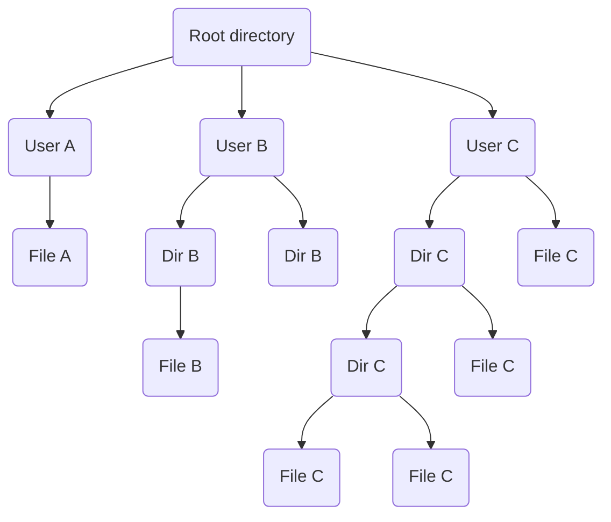
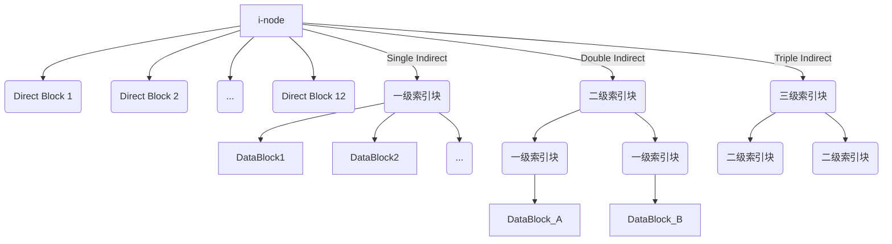
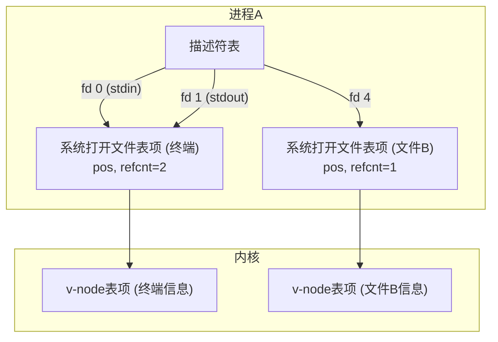

## 1. 文件系统的基本概念

### 1.1 问题导引

在我们开始之前，请大家先思考几个问题，这些问题将贯穿我们整个章节的学习：
* 怎样理解“文件系统是对磁盘的抽象”这句话?
* 从用户角度看，文件系统的功能是什么？我们如何建立、删除、打开、关闭、读写文件？如何确定和修改文件的权限？
* 从系统角度看，文件系统是如何实现的？它如何管理每个文件？如何设计并实现文件目录？如何管理磁盘空间？
* 文件系统还需要考虑哪些其他需求？比如性能和安全。
* 文件系统与其他操作系统功能（如I/O系统）的接口是怎样的？

带着这些问题，我们来逐一揭开文件系统的神秘面纱。

### 1.2 文件 (File)

#### 1.2.1 什么是文件？

**“文件是对磁盘的抽象”**。这是一个非常重要的概念。磁盘的物理结构是磁道、扇区，它只能通过低级的指令（如“读写第X磁道第Y扇区”）来访问，这非常不便。文件系统将这些底层细节隐藏起来，提供给我们一个更高层次、更易于理解和操作的视图。

在逻辑上，**文件**是指一组带标识（标识即为文件名）的、有完整意义的信息项的序列。
* **信息项**: 构成文件内容的基本单位，可以是一个字节，也可以是多个字节。这些信息项之间具有顺序关系。
* **文件内容的意义**: 由创建和使用文件的用户或程序来解释。操作系统本身不关心文件内容是文本、图像还是可执行程序。

一个文件可以看作是信息项的线性序列，通常会有一个**读写指针**来标识当前访问的位置。

```
| 信息项0 | 信息项1 | ... | 信息项i | ... | 信息项n-1 |
                      ^
                      |
                    读写指针
```

在UNIX/Linux系统中，这个抽象被推向了极致，也就是著名的**“万物皆文件” (Everything is a file)**。
* 普通文件 (如 `my_document.txt`) 是文件。
* 硬件设备 (如磁盘分区 `/dev/sda2`，终端 `/dev/tty2`) 也是文件。
* 甚至内核的各种数据结构也通过 `/proc` 目录以文件的形式暴露出来。

这极大地简化了应用程序与系统各种资源的交互方式，因为它们都可以使用同一套文件操作API（`open`, `read`, `write`, `close`）来访问。

#### 1.2.2 文件的分类

根据文件的性质和用途，特别是在UNIX系统中，文件可以分为以下几类：
* **普通文件 (Regular File)**: 包含用户的信息，内容通常是ASCII文本或二进制数据。这是我们最常见的文件类型。
* **目录文件 (Directory File)**: 用于管理文件系统的系统文件。它的内容是该目录下包含的文件和子目录的列表。
* **特殊文件 (Special File)**: 用于I/O。
    * **字符设备文件**: 用于模拟串行I/O设备，如终端、打印机。数据以字符为单位进行传输。
    * **块设备文件**: 用于模拟磁盘等块设备。数据以数据块为单位进行传输。
* **管道文件 (Pipe)**: 用于进程间通信。
* **套接字 (Socket)**: 用于不同机器间的网络通信。
* **符号链接文件 (Symbolic Link)**: 其内容是到另一个文件的路径。

#### 1.2.3 文件的逻辑结构

文件的逻辑结构是指在用户看来，文件内部是如何组织的。这由用户的访问方式决定，主要有以下几种：
* **流式文件 (Stream File)**: 文件被看作一个无结构的字节序列（如UNIX中的文件）。这是最简单、最常用的一种结构。
* **记录式文件 (Record File)**: 文件由一组定长或变长的记录构成。
* **树形结构**: 文件由记录的树状结构组织而成，便于按键值查找。


此外，还有一些更复杂的结构，如索引结构、索引顺序结构、散列结构等，它们通常用于数据库系统中，以优化数据检索效率。

#### 1.2.4 文件的访问方式

* **顺序存取 (Sequential Access)**: 从文件开头按字节或记录的顺序依次读写。这是最基本的方式。
* **随机存取 (Random Access)**: 可以从文件中的任意位置开始读写。这需要操作系统提供`seek`之类的操作来移动读写指针。

### 1.3 文件属性与文件控制块 (FCB)

操作系统为了管理文件，需要记录每个文件的相关信息。这些信息被称为**文件属性 (File Attributes)** 或 **元数据 (Metadata)**。它们存放在一个称为**文件控制块 (File Control Block, FCB)** 的数据结构中。

一个FCB通常包含以下属性：
* **标识信息**: 文件名，文件系统内部唯一的文件号。
* **类型信息**: 文件类型（普通、目录、特殊等）。
* **物理位置信息**: 文件在磁盘上的存放地址。
* **大小信息**: 文件当前的大小。
* **权限保护信息**: 谁可以读、写、执行该文件（创建者、拥有者、访问控制列表）。
* **管理信息**: 创建时间、最后修改时间、最后访问时间。
* **其他**: 共享计数、只读/隐藏/系统等标志位。

### 1.4 文件操作

操作系统提供了一系列系统调用来支持对文件的操作：
* `create`: 创建一个新文件。
* `delete`: 删除一个文件。
* `open`: 打开一个已存在的文件，为后续的读写操作做准备。
* `close`: 关闭一个已打开的文件，释放相关资源。
* `read`: 从文件中读取数据。
* `write`: 向文件中写入数据。
* `append`: 在文件末尾追加数据。
* `seek`: 移动文件读写指针到指定位置（用于随机存取）。
* `get attributes` / `set attributes`: 获取或设置文件属性。
* `rename`: 重命名文件。

一个典型的文件访问模式是：先 `open`，然后进行若干次 `read`/`write`，最后 `close`。
`f = open(name, flag);`
`...`
`read(f, ...);`
`...`
`close(f);`

### 1.5 文件目录 (Directory)

#### 1.5.1 基本概念
* **文件目录 (File Directory)**: 为了统一管理所有文件的FCB，我们将它们组织起来，形成的这个集合就是文件目录。所以，**文件目录是文件控制块的有序集合**。
* **目录项 (Directory Entry)**: 构成文件目录的基本单元，每个目录项对应一个文件或子目录。在简单系统中，目录项就是FCB。在复杂系统中（如UNIX），目录项可能只包含文件名和指向一个更完整数据结构（如i-node）的指针。
* **目录文件 (Directory File)**: 为了持久化存储，文件目录通常会以一种特殊文件的形式存放在磁盘上，这个文件就叫目录文件。其内容由一系列目录项组成。为保证文件系统的一致性，目录文件通常只允许内核进行修改，应用程序通过系统调用来访问。

#### 1.5.2 目录结构

最常用的是**树形目录结构 (Tree-structured Directory)**。
* **根目录 (Root Directory)**: 整个文件系统的起点。
* **子目录 (Subdirectory)**: 允许用户将文件分组，形成层次化结构。
* **路径名 (Pathname)**: 唯一标识一个文件或目录在树中的位置。
    * **绝对路径名**: 从根目录开始的路径，例如 `/User_B/Draw/ABC`。
    * **相对路径名**: 从当前目录开始的路径。
* **当前目录 (Current/Working Directory)**: 每个进程都有一个当前目录。这使得用户可以使用更短的相对路径名来访问文件。


#### 1.5.3 目录操作
* `create` / `delete`: 创建或删除一个目录。
* `opendir` / `closedir`: 打开和关闭目录以读取其内容。
* `readdir`: 读取目录中的下一个目录项。
* `rename`: 重命名目录。
* `link` / `unlink`: 创建或删除文件的链接（别名）。

#### 1.5.4 思考题：文件名解析

**问题**: 观察下图，试画出对应的树形目录结构，并给出解析文件名 `/User_B/Draw/ABC` 的步骤。
**图示**: (根据幻灯片 Page 25 的图)
* Master Directory (Root)
    * User_A (Dir) -> ...
    * User_B (Dir)
        * Word (Dir) -> ...
        * Draw (Dir) -> ABC (File)
    * User_C (Dir) -> ...

**回答**:
1.  **树形结构**:
    ```mermaid
    graph TD
        Root("Master Directory") --> UserA("User_A")
        Root --> UserB("User_B")
        Root --> UserC("User_C")

        UserB --> Word("Word")
        UserB --> Draw("Draw")

        Draw --> ABC("File ABC")
    ```

2.  **文件名解析步骤 (/User_B/Draw/ABC)**:
    1.  从根目录（Master Directory）开始查找。
    2.  在根目录中，查找名为 `User_B` 的目录项。找到后，获取该目录文件的位置信息。
    3.  读取 `User_B` 目录文件的内容，在其中查找名为 `Draw` 的目录项。找到后，获取该目录文件的位置信息。
    4.  读取 `Draw` 目录文件的内容，在其中查找名为 `ABC` 的目录项。
    5.  找到 `ABC` 的目录项，从中获取文件的FCB信息（如物理地址、大小、权限等），解析完成。此时，文件就可以被打开和访问了。

### 1.6 文件系统 (File System)

文件系统是操作系统中负责**管理持久性数据**的部分。它不仅管理文件，还负责它们底层的存储。

其主要功能可以总结为：
* **实现文件的按名存取**: 用户通过文件名来访问数据，而无需关心物理地址。文件系统负责完成“名字空间”到“磁盘空间”的映射。
* **统一管理磁盘空间**: 实施磁盘空间的分配与回收，跟踪哪些块是空闲的，哪些块已被占用。
* **文件信息的共享与保护**: 提供数据可靠性和安全保障机制，如访问控制。
* **提供便捷的接口**: 向用户提供一套方便使用的文件和目录操作命令。
* **提高性能**: 通过各种技术（如缓存、优化的布局策略）来提高文件系统的访问速度。
* **与I/O系统的统一接口**: 为上层应用提供与具体设备无关的I/O操作。

## 2. 文件系统的实现

现在我们从系统内部视角，看看文件系统是如何被设计和实现的。

### 2.1 存储介质与物理块

* **存储介质**: 文件通常存储在持久性存储介质上，如磁盘（HDD）、固态硬盘（SSD）、U盘等。
* **抽象**: 操作系统将磁盘抽象为一维的逻辑块（Block）数组，从 `0` 到 `n-1`。
* **数据块 (Block)**: 存储设备被划分为大小相等的块，块是信息存储、传输和分配的基本单位。Windows中称为**簇 (Cluster)**。一个块通常由若干个连续的扇区组成。扇区是物理存储单元，而块是逻辑存储单元。

**HDD vs SSD 寻址**:
* **LBA (Logical Block Addressing)**: 操作系统使用的是逻辑块地址。
* **PBA (Physical Block Address)**: 存储设备内部的实际物理地址。
* **映射**:
    * 在HDD中，LBA到PBA的映射相对固定，由硬盘固件管理。物理地址通常由柱面号、磁头号、扇区号组成。
    * 在SSD中，由于闪存的写入限制（磨损均衡），LBA到PBA的映射是动态的，由FTL（Flash Translation Layer）管理。

一次典型的HDD访盘请求包括三个主要时间开销：
1.  **寻道时间**: 移动磁臂到指定磁道。
2.  **旋转延迟时间**: 等待目标扇区旋转到磁头下方。
3.  **数据传输时间**: 实际读写数据的时间。

### 2.2 文件系统布局

在实现文件系统时，首先要考虑的是它在磁盘上和内存中的内容布局。

#### 2.2.1 相关术语

* **磁盘分区 (Partition)**: 把一个物理磁盘的存储空间划分为几个相互独立的部分。
* **文件卷 (Volume)**: 一个逻辑分区，可以是一个分区，也可以跨越多个磁盘（如RAID）。同一个文件卷使用同一份管理数据（元数据）来进行文件分配和空间管理。
* **格式化 (Format)**: 在一个文件卷上建立文件系统的过程。这包括创建和初始化用于文件分配和磁盘空间管理的元数据。

#### 2.2.2 磁盘上的内容

一个格式化好的文件卷通常包含以下几个部分：
1.  **引导区 (Boot Block / Boot Sector)**: 包含从该卷引导操作系统所需的信息。通常是分区的第一个扇区。
2.  **卷管理信息 (Superblock)**: 描述整个文件卷的信息，如块大小、块总数、空闲块数量、i-node数量等。这是文件系统的“元数据中的元数据”。
3.  **空闲空间管理区**: 用于记录哪些磁盘块是空闲的数据结构（如位图或空闲块链表）。
4.  **文件元数据区**: 存放文件控制块（如UNIX中的i-node区）的区域。
5.  **数据区**: 存放实际的用户文件和目录文件内容的区域。

**UNIX文件系统布局 (分区内)**:
```
| 引导记录 | 超级块 | 空闲区管理 | i-node区 | 根目录及数据区 |
```

**FAT文件系统布局**:
```
| 引导区 | 文件分配表1 (FAT1) | 文件分配表2 (FAT2) | 根目录 | 其他目录和文件 |
```

### 2.3 文件的物理结构

这是文件系统实现的核心之一，决定了文件在物理介质上的存放方式。

#### 2.3.1 连续结构 (Contiguous Allocation)

文件的信息存放在若干**连续**的物理块中。
* **FCB中如何记录?** 只需记录起始块号和文件长度（总块数）。
* **优点**:
    * 实现简单，读写效率高，因为磁头移动最少。
    * 支持顺序存取和随机存取。
* **缺点**:
    * **文件不能动态增长**: 如果创建时分配的空间不够，后续增长会很困难。
    * **外部碎片问题**: 随着文件的创建和删除，磁盘空间会产生很多不连续的小空闲区，无法存放大文件。需要定期进行“磁盘碎片整理”来解决。
    * 不利于文件内容的插入和删除。

#### 2.3.2 链接结构 (Linked Allocation)

文件的信息存放在若干**不连续**的物理块中，各块之间通过指针连接。每个块中都包含指向下一个块的指针。
* **FCB中如何记录?** 只需记录起始块号。
* **优点**:
    * 有效利用磁盘空间，没有外部碎片问题。
    * 文件可以动态增长。
    * 有利于文件内容的插入删除。
* **缺点**:
    * **不支持高效的随机存取**: 要访问第 N 块，必须从头开始沿着指针链顺序访问前 N-1 块。
    * **可靠性问题**: 指针丢失或损坏会导致文件数据丢失。
    * **指针占用空间**: 每个块都需要一部分空间来存储指针。
    * 寻道次数多，存取速度慢。

**变形：文件分配表 (File Allocation Table, FAT)**
为了解决链接结构的缺点，FAT文件系统将所有块的链接指针集中存放在磁盘开头的一个特殊区域——**文件分配表 (FAT)** 中。FAT本身是一个大数组，数组的下标对应磁盘块号，数组元素的值表示下一个块的块号。
* **FCB/目录项中如何记录?** 仍然是记录起始块号。
* **优点**: 整个FAT可以被读入内存，使得随机访问变得高效。要找第 N 块，只需在内存的FAT数组中查找 N 次即可，无需访问磁盘数据区。

#### 2.3.3 索引结构 (Indexed Allocation)

为每个文件建立一个专用的**索引表 (Index Block)**，这个表中存放了文件所有数据块的块号。索引表本身也需要一个磁盘块来存储。
* **FCB中如何记录?** 记录该文件的索引表的地址。
* **优点**:
    * 保留了链接结构的优点（无外部碎片，动态增长）。
    * **支持高效的随机存取**: 要访问第 N 块，只需先读入索引表，然后在索引表中直接找到第 N 项，就能得到目标块的地址。
* **缺点**:
    * 索引表本身带来了系统开销（占用磁盘空间和内存）。
    * 对于小文件，索引表的开销可能显得过大。

**问题：索引表很大，一个块放不下怎么办？**
1.  **链接方式**: 将多个索引表块链接起来。
2.  **多级索引**: 用一个顶级索引表来索引次级索引表，形成层次结构。
3.  **综合模式**: 将直接地址和间接（多级）索引结合起来。

**UNIX 多级索引结构 (综合模式)**
UNIX的i-node中通常包含一个包含15个地址项的数组：
* **前12项 (直接寻址)**: 直接指向文件的前12个数据块。
* **第13项 (一级间接)**: 指向一个索引块，该索引块里存放了更多数据块的地址。
* **第14项 (二级间接)**: 指向一个二级索引块，该块中的每一项都指向一个一级索引块。
* **第15项 (三级间接)**: 指向一个三级索引块。



**思考题**: UNIX中采用了三级索引结构后, 文件最大可达到多少个物理块? 假设扇区大小为512字节, 物理块等于扇区块大小, 一级索引表可以存放256个物理块号(一个块号占2字节)。
**回答**:
* 直接块: 12 块
* 一级间接: 256 块
* 二级间接: $256 \times 256 = 65,536$ 块
* 三级间接: $256 \times 256 \times 256 = 16,777,216$ 块
* **总计**: $12 + 256 + 65,536 + 16,777,216 = 16,843,020$ 个物理块。
* **最大文件大小**: $16,843,020 \times 512$ 字节 $\approx$ 8 GB。

### 2.4 目录文件的实现

#### 2.4.1 目录项组织方式
* **顺序表**: 最简单的方式，将目录项一个接一个地存放。查找文件时需要线性扫描，效率低。
* **散列表 (Hash Table)**: 根据文件名计算散列值，快速定位到目录项。解决了查找速度问题，但需要处理冲突。
* **B+树**: 很多现代文件系统（如NTFS）使用B+树来组织目录项。B+树是一种平衡树，能保证目录的增、删、查操作都有稳定且高效的性能。

#### 2.4.2 目录检索的加速
**问题**: 如何加快目录检索？一个很大的目录文件，如果线性查找所有FCB会很慢。

**解决方案：目录项分解法 (UNIX i-node)**
将FCB拆分为两部分：
1.  **目录项**: 只包含**文件名**和指向文件元数据的**文件号 (i-node number)**。
2.  **i-node (索引节点)**: 包含文件名之外的所有其他元数据（权限、大小、物理地址等）。

所有i-node集中存放在磁盘的**i-node区**。目录文件变得更小，因为每个条目只占几个字节。

**思考题**: 假设一个FCB有48字节，物理块大小512字节。一个目录文件有128个目录项。分解前，符号目录项占8字节（文件名6B，文件号2B），基本目录项占42字节。计算查找一个文件的平均访盘次数。
**回答**:
* **分解前**:
    * 一个块能放 $\frac{512}{48} \approx 10$ 个FCB。
    * 128个目录项需要 $\frac{128}{10} \approx 13$ 个块。
    * 假设目录文件是连续存放的，平均查找的期望为，$\sum_{i=1}^{13} \frac{i}{13} = \frac{13 \times (13 + 1)}{2 \times 13} = 7$ 次访盘。
* **分解后**:
    * 目录文件只存符号目录项。一个块能放 $\frac{512}{8} = 64$ 个符号目录项。
    * 128个目录项需要 $\frac{128}{64} = 2$ 个块。
    * i-node区存放基本目录项。一个块能放 $\frac{512}{42} \approx 12$ 个i-node。
    * 128个i-node需要 $\frac{128}{12} \approx 11$ 个块。
    * 查找过程：
        1.  读目录文件，找到文件名对应的i-node号。平均需要 $\frac{1}{2}+\frac{2}{2}=1.5$ 次访盘。
        2.  根据i-node号去i-node区读取i-node信息。需要1次访盘。
    * 总平均访盘次数：$1.5 + 1 = 2.5$ 次。
* **结论**: 改进后，通过先在小型的目录文件中快速定位，再精确访问i-node，显著减少了磁盘访问次数，提高了检索速度。

### 2.5 磁盘空间管理
文件系统需要跟踪所有空闲的磁盘块。
* **位图法 (Bitmap)**: 用一个二进制位串来表示所有磁盘块。`1`代表空闲，`0`代表已分配（或反之）。
    * 优点: 简单直观，很容易找到连续的空闲块。
    * 缺点: 对于大磁盘，位图本身可能很大。
    * **计算公式**:
        * 已知块号`b`，字长`w`：位图中的字号 $i = b / w$，位号 $j = b \pmod w$。
* **空闲块链表**: 把所有空闲块用指针链接起来。
    * 优点: 实现简单。
    * 缺点: 申请/归还多个块时效率低，因为要多次读写链表。
* **成组链接法 (UNIX)**: 空闲链表的改进版。将空闲块分组，每组的第一个块记录了该组其他块的块号以及下一组的地址。
    * 分配时，从当前组取出一个块。如果当前组用完，则从下一组中读入新的空闲块信息。
    * 回收时，将块加入当前组。如果当前组满了，就将当前组的信息写入回收的块中，使其成为新的“信息块”，并链接到空闲链表的头部。
    * 这种方法在分配和回收大量块时效率很高。

### 2.6 内存中的数据结构 (UNIX)
为了提高效率，操作系统会在内存中维护一些与文件系统相关的数据结构。
1.  **系统级打开文件表 (System-wide Open File Table)**:
    * 整个系统只有一张。
    * 当任何进程第一次打开一个文件时，该文件的i-node被从磁盘读入内存，并在此表中创建一个条目。
    * 条目内容包括i-node的拷贝、引用计数（记录有多少个进程打开了此文件）等。
2.  **进程级打开文件表 (Per-process Open File Table)**:
    * 每个进程都有一张。
    * 当进程打开一个文件时，会在自己的这张表中创建一个条目。这个条目被称为**文件描述符 (File Descriptor)**。
    * 条目内容包括打开方式（读/写）、当前的读写指针（**重要：读写指针是每个打开实例私有的**）、以及一个指向系统级打开文件表对应条目的指针。

**文件共享与fork**:
* 当一个进程`fork`一个子进程时，子进程会继承父进程的打开文件表。
* 父子进程的文件描述符将指向**同一个**系统级打开文件表条目。
* 这意味着它们共享同一个读写指针。如果一个进程移动了指针，另一个进程也会看到变化。

**I/O重定向 (`dup2`)**:
* `dup2(oldfd, newfd)`系统调用可以使`newfd`指向`oldfd`所指向的同一个系统级文件表条目。
* 这使得我们可以将标准输出（`fd=1`）重定向到一个文件，从而实现命令输出到文件的功能。



### 2.7 文件操作的实现
* **`create(文件名, ...)`**:
    1.  在目录中查找，确保没有重名文件。
    2.  申请一个新的i-node。
    3.  在目录文件中增加一个新条目（文件名, i-node号）。
* **`open(文件名, ...)`**:
    1.  解析路径名，找到文件的i-node号。
    2.  检查系统打开文件表，看文件是否已被其他进程打开。
        * 是：引用计数加1。
        * 否：从磁盘读入i-node到系统打开文件表的新条目中，引用计数置为1。
    3.  在当前进程的打开文件表中创建一个新条目（文件描述符）。
    4.  将该文件描述符指向系统打开文件表的对应条目。
    5.  返回文件描述符给用户。
* **`read(fd, ...)`**:
    1.  通过`fd`在进程和系统打开文件表中找到文件的i-node。
    2.  根据文件描述符中的读写指针和i-node中的物理地址信息，计算出要读取的物理块号。
    3.  启动磁盘I/O操作，将数据从磁盘读入内核缓冲区，再从内核缓冲区复制到用户指定的内存地址。
    4.  更新读写指针。
* **`seek(fd, ...)`**:
    1.  通过`fd`找到进程打开文件表中的条目。
    2.  修改其中的读写指针值。

### 2.8 文件共享

* **硬链接 (Hard Link)**:
    * 多个目录项（可以在不同目录，有不同文件名）指向**同一个i-node**。
    * i-node中有一个**链接计数 (link count)**，记录有多少个目录项指向它。
    * 创建链接时，计数加1。
    * 删除文件（即删除一个目录项）时，计数减1。
    * 只有当链接计数减为0时，操作系统才会真正删除i-node并回收数据块。
    * 所有硬链接是平等的，没有主次之分。
* **软链接/符号链接 (Soft/Symbolic Link)**:
    * 创建一个特殊类型的文件，其内容是**另一个文件的路径名**。
    * 访问软链接时，系统会读取其内容（路径名），然后去访问真正的文件。
    * 优点: 可以跨文件系统、可以链接到目录。
    * 缺点: 如果原文件被删除，软链接会失效（悬空指针）；解析需要额外的开销。

## 3. 文件系统实例

### 3.1 UNIX 文件系统
* **核心**: i-node。
* **结构**: 目录项（文件名+i-node号）和i-node（元数据）分离。
* **查找示例 `/usr/ast/mbox`**:
    1.  内核从根目录（i-node号已知，通常是2）开始。
    2.  读取根目录的数据块，查找名为 `usr` 的条目，得到其i-node号（例如 7）。
    3.  读取i-node 7，找到 `usr` 目录的数据块地址。
    4.  读取 `usr` 目录的数据块，查找名为 `ast` 的条目，得到其i-node号（例如 62）。
    5.  读取i-node 62，找到 `ast` 目录的数据块地址。
    6.  读取 `ast` 目录的数据块，查找名为 `mbox` 的条目，得到其i-node号（例如 80）。
    7.  现在内核有了 `mbox` 文件的i-node 80，就可以进行读写等操作了。

### 3.2 FAT (File Allocation Table) 文件系统
* **核心**: 文件分配表 (FAT)。
* **磁盘布局**:
    * **DBR (DOS Boot Record)**: 引导扇区，包含BPB（BIOS参数块），描述了文件系统的各种参数（每扇区字节数、每簇扇区数等）。
    * **FAT表**: 紧跟在DBR之后。通常有两份作为备份。它是一个大数组，记录了簇（块）的链接关系和状态（未使用、坏簇、文件结束标志等）。
    * **根目录区**: 在FAT12/16中，根目录大小和位置是固定的。在FAT32中，根目录是可扩展的，像普通文件一样存储。
    * **数据区**: 存放文件和子目录。
* **目录项**:
    * 32字节定长结构。
    * 包含文件名（8.3格式）、属性、创建/修改时间、文件大小和**起始簇号**。
* **文件读取**:
    1.  **定位目录项**: 
        - 如果文件在根目录，直接在根目录区中查找对应的目录项。
        - 如果文件在子目录中，需要先通过路径逐级查找：从根目录开始，找到第一级子目录的目录项，获取其起始簇号；读取该子目录的数据簇，在其中查找下一级目录或文件的目录项；重复此过程直到找到目标文件的目录项。
    2.  **获取起始簇号**: 从目录项中获取文件的起始簇号。目录项是32字节的定长结构，其中第26-27字节（低16位）和第20-21字节（高16位，仅FAT32）存储了文件的起始簇号。对于FAT12/16，只使用低16位；对于FAT32，需要组合高低16位得到完整的32位簇号。
    3.  以该簇号为索引，在内存中的FAT表副本中查找，得到下一簇的簇号。
    4.  重复此过程，直到遇到文件结束标志。
* **长文件名 (FAT32)**:
    * 采用了一种巧妙的兼容方案。对于长文件名，会创建多个特殊的**长文件名目录项 (LFN entry)**。
    * 每个LFN项存储长文件名的一部分（Unicode编码）。
    * 这些LFN项紧挨在真正的8.3格式短文件名目录项之前。
    * 不识别长文件名的旧系统会忽略这些LFEN项（因为它们的属性被设为卷标、系统、隐藏、只读的组合，旧系统不认识），只看到短文件名项。

### 3.3 NTFS (New Technology File System)
Windows NT/XP及之后版本使用的文件系统。
* **设计目标**: 可靠性、高效性、安全性。
* **核心**: **主控文件表 (Master File Table, MFT)**。
* **MFT**: MFT本身也是一个文件。它是一个由**文件记录 (File Record)** 组成的数组。卷上的每一个文件或目录都至少对应MFT中的一个记录。
* **万物皆属性**: 在NTFS中，所有数据都被看作是文件的**属性 (Attribute)**。我们通常所说的文件内容，只是一个未命名的“数据属性流”。文件名、时间戳、权限等都是属性。
* **文件记录**:
    * **常驻属性 (Resident Attribute)**: 对于小文件或小属性，其内容直接存储在MFT记录中。
    * **非常驻属性 (Non-resident Attribute)**: 对于大文件或大属性，其内容存储在MFT之外的数据区。MFT记录中只存放指向这些数据块的指针，称为**run**或**extent**。
* **目录**: 目录也是一个文件，其“数据属性”是一个文件名索引。为了提高效率，这个索引通常用**B+树**来组织。
* **可靠性**: 通过**日志记录 (Logging)** 实现。对文件系统的所有修改操作，在实际写入磁盘前，会先在日志文件（`$LogFile`）中记录。如果系统崩溃，重启后可以通过重做或撤销日志中的事务来恢复文件系统的一致性。
* **元数据文件**: MFT的前16个记录被保留给系统元数据文件使用，如`$Mft`(MFT自身)、`$MftMirr`(MFT镜像)、`$LogFile`(日志文件)、`$Volume`(卷信息)、`$.`(根目录)等。

## 4. 其他文件系统和技术
* **ext4**: Linux默认的文件系统，是ext3的改进。使用**extents**（连续块区段）代替传统的块映射，减少大文件碎片；支持**延迟分配**，优化写入性能。
* **VFS (Virtual File System)**: 一个内核抽象层，为用户程序提供统一的文件系统接口（如`open`, `read`）。VFS可以将这些通用请求转换为底层具体文件系统（如ext4, FAT, NTFS）的特定操作。这使得Linux可以同时支持多种不同的文件系统。
* **NFS (Network File System)**: 一种分布式文件系统协议，允许客户端计算机像访问本地文件一样通过网络访问远程服务器上的文件。
