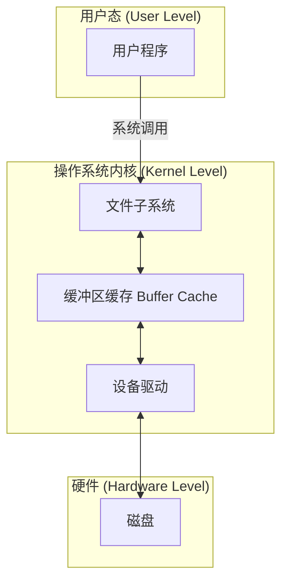
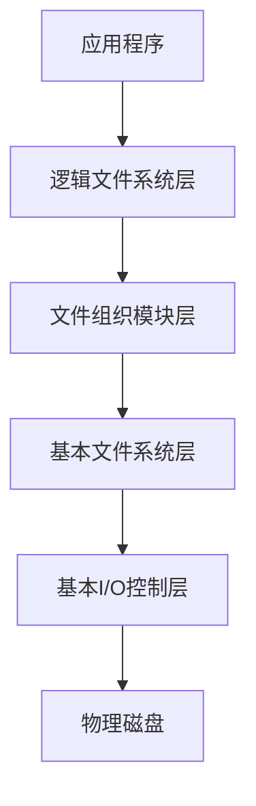
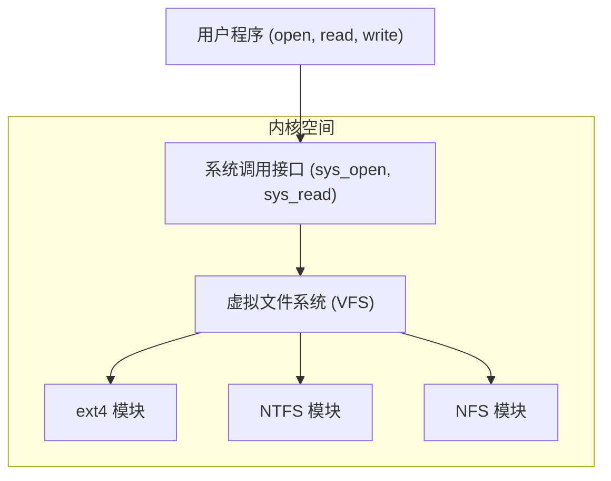
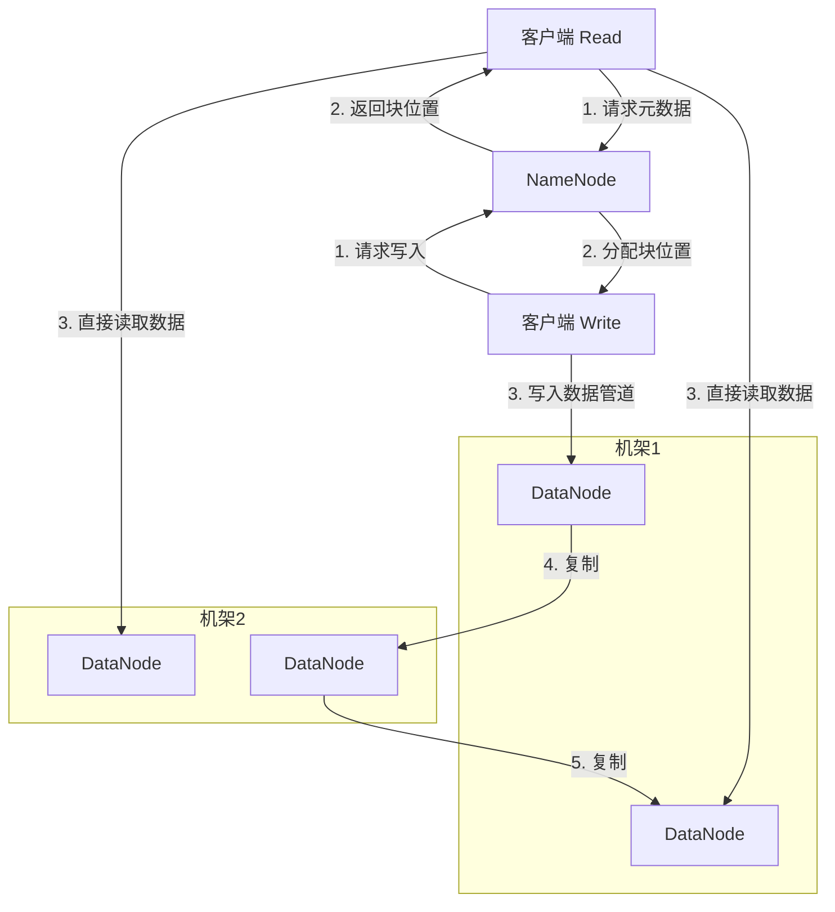

## 1. 文件系统的管理

文件系统的管理主要涵盖三个方面：**可靠性**、**一致性**和**安全性**。

### 1.1 文件系统的可靠性

可靠性指的是文件系统抵御和预防各种物理性或人为性破坏的能力。

#### 1.1.1 坏块问题
磁盘上可能会出现物理损坏的块，称为坏块。文件系统需要能够识别、标记并隔离这些坏块，避免将数据写入其中。

#### 1.1.2 备份 (Backup)
备份是通过转储操作，为文件或整个文件系统创建多个副本，以便在发生数据丢失或损坏时进行恢复。主要有以下几种备份方式：

* **全量转储 (Full Dump)**: 定期将**所有**文件完整地拷贝到备份存储器（如磁带、另一块硬盘）上。这种方式最简单，但如果数据量大且变化少，会非常耗时且浪费存储空间。
* **增量转储 (Incremental Dump)**: 只转储自上次备份以来被**修改过**的文件。这种方式可以显著减少备份所需的时间和空间开销。
* **物理转储 (Physical Dump)**: 从磁盘的第一个物理块（0号块）开始，按顺序将所有磁盘块的内容原封不动地输出到备份介质。这种方式不关心文件系统的逻辑结构，备份和恢复速度快，但不够灵活。
* **逻辑转储 (Logical Dump)**: 从一个或多个指定的目录开始，递归地遍历文件树，只转储那些自某个给定日期之后发生过修改的文件和目录。这种方式更灵活，可以支持更复杂的需求，例如恢复单个文件或目录。

### 1.2 文件系统的一致性

#### 1.2.1 问题来源
文件系统的操作通常不是原子性的。例如，更新一个文件可能需要修改数据块、i-node（索引节点）和空闲块列表。这些修改通常先在内存的缓冲区中进行，然后再一次性或分批写回磁盘。如果在数据完全写回磁盘之前系统发生崩溃（例如突然断电），磁盘上的文件系统状态就可能处于一种中间状态，导致不一致。

例如，一个数据块可能既被一个文件引用，又同时存在于空闲块列表中。

#### 1.2.2 解决方案
##### 1.2.2.1 文件系统检查工具 (fsck)
为了解决不一致问题，可以设计一个实用程序（在UNIX/Linux中通常是 `fsck`），在系统启动时运行，检查并修复文件系统的逻辑结构。

* **UNIX `fsck` 的工作过程示例**:
    `fsck` 会使用两张表来辅助检查，表的条目数与磁盘块数相同。
    * **表1**: 用于记录每个磁盘块在**文件中**被引用的次数。
    * **表2**: 用于记录每个磁盘块在**空闲块列表**中出现的次数。

    `fsck` 会遍历整个文件系统的元数据（如i-node和间接块），填充这两张表。理想情况下，对于任何一个磁盘块，它要么在表1中的计数为1，表2中的计数为0（已被分配）；要么在表1中的计数为0，表2中的计数为1（是空闲的）。

    下面是几种不一致的情况及其修复方法：
    * **情况A：一个块在空闲列表中，但未被任何文件使用。** 这是正常状态。
    * **情况B：一个块在空闲列表中，同时也被文件使用（表1计数>0，表2计数>0）。** 这是严重错误。`fsck` 会将其从空闲列表中移除来解决。
    * **情况C：一个块既不在空闲列表，也未被任何文件使用（表1计数=0，表2计数=0）。** 这会导致块资源泄露。`fsck` 会将其添加到空闲列表中。
    * **情况D：一个块被两个或多个文件同时使用（表1计数>1）。** 这也是严重错误。`fsck` 通常会复制该块，让每个文件拥有自己的副本。

    ```mermaid
    graph TD
        A[开始检查] --> B{遍历所有i-node};
        B --> C{填充'文件引用计数表'};
        A --> D{扫描空闲块列表};
        D --> E{填充'空闲块计数表'};
        F{分析两张表};
        C --> F;
        E --> F;
        F --> G{不一致?};
        G -- 是 --> H[根据规则修复];
        G -- 否 --> I[结束];
        H --> I;
    ```

##### 1.2.2.2 文件系统写入方式
为了在性能和一致性之间取得平衡，发展出了不同的写入策略。

* **通写 (Write-through)**: 内存缓冲区的修改**立即**写回磁盘。这种方式能最大程度保证数据一致性，但因为频繁的磁盘I/O，性能非常差。FAT文件系统是典型的例子。
* **延迟写 (Lazy-write)**: 修改只在内存缓冲区中进行，由操作系统决定何时将这些"脏"的缓冲区（write-back cache）写回磁盘。这种方式性能很好，但如果系统在写回前崩溃，数据丢失的风险很高，可恢复性差。
* **可恢复写 (Journaling / Transaction Log)**: 这是在安全性和性能之间的一个优秀折中。在对文件系统的元数据进行实际修改之前，先把要做的**操作步骤**（事务日志，Journal/Log）记录下来并写入磁盘。如果系统在修改过程中崩溃，重启后只需读取日志，就能重做（redo）未完成的操作，或撤销（undo）不完整的操作，从而快速恢复到一致状态。NTFS和现代Linux文件系统（如ext4）都采用了这种技术。

### 1.3 文件系统的安全性

安全性旨在确保数据不会丢失或被未经授权的用户访问。

#### 1.3.1 威胁来源
* **数据丢失**: 可能源于硬件或软件故障、自然灾害，甚至是人为失误。**备份**是应对这类威胁的主要手段。
* **入侵者**:
    * 非技术人员的偶然窥探。
    * 有目的性的入侵者窥探。
    * 明确的偷窃企图。
    * 商业或军事间谍活动。

#### 1.3.2 文件保护机制

##### 1.3.2.1 用户身份验证
这是保护的第一道防线，用于在用户登录时验证其身份。常见方法包括：
* **用户知道什么**: 口令（Password）、密码。
* **用户拥有什么**: 磁卡、智能卡、USB Key。
* **用户是什么 (生物特征)**: 指纹、虹膜、人脸识别、声纹等。
* **CAPTCHA测试**: 用于区分人类和计算机程序。

##### 1.3.2.2 访问控制
当用户身份被确认后，系统需要决定该用户能对哪些文件进行哪些操作。主要有两种实现模型：

| 特性         | 访问控制表 (ACL - Access Control List) | 能力表 (Capability List)               |
| :----------- | :------------------------------------- | :------------------------------------- |
| **核心思想** | 以 **资源 (文件)** 为中心              | 以 **用户 (主体)** 为中心              |
| **数据结构** | 每个文件附加一个列表，记录(用户, 权限) | 每个用户持有一个列表，记录(文件, 权限) |
| **查询方式** | "谁能访问我？"                         | "我能访问谁？"                         |
| **存放位置** | 内核空间                               | 内核空间                               |
| **常见场景** | 文件系统（如Unix权限、NTFS ACL）       | Kerberos, OAuth (能力凭证)             |

* **思考：这两种访问控制方式的优缺点是什么？**
    * **ACL的优点**：管理特定资源的权限非常直观和方便。很容易回答"谁能访问这个文件？"。
    * **ACL的缺点**：当需要查看某个用户的所有权限时，必须遍历系统中所有文件的ACL，效率低下。权限的撤销也很直接（从ACL中移除即可）。
    * **能力表的优点**：查看某个用户的所有权限非常高效。用户在访问时主动出示"能力凭证"，验证逻辑简单。
    * **能力表的缺点**：权限的撤销比较困难，因为能力凭证已经被分发出去，系统需要有机制让它们失效。同时，很难回答"谁能访问这个文件？"，需要检查所有用户的能力表。

##### 1.3.2.3 拓展访问控制模型
* **RBAC (Role-Based Access Control, 基于角色的访问控制)**: 在用户和权限之间引入"角色"层。权限被赋予角色，而用户被分配角色。当需要修改一组用户的权限时，只需修改角色的权限即可，大大简化了管理。例如，公司里的"财务"角色拥有访问财务报表的权限，"人事"角色拥有访问员工档案的权限。
* **ABAC (Attribute-Based Access Control, 基于属性的访问控制)**: 这是最灵活的模型。访问决策基于用户、资源、环境等多种**属性**的组合。例如，可以制定一个规则："'医生'角色的用户，在'工作时间'内，从'医院内网'访问其'自己病人'的'病历'，可以被允许"。

##### 1.3.2.4 UNIX的文件保护机制
UNIX采用了一种简化的、两级访问控制机制。
* **第一级：对访问者的识别**
    * **文件主 (owner)**: 创建文件的用户。
    * **文件主的同组用户 (group)**: 与文件主在同一个用户组的用户。
    * **其他用户 (other)**: 系统中的所有其他用户。

* **第二级：对操作权限的识别**
    * **读操作 (r)**: read
    * **写操作 (w)**: write
    * **执行操作 (x)**: execute

这两种分类组合成了经典的 `rwxrwxrwx` 9-bit 权限模式。例如：`rwx r-x r--`
* `rwx` (二进制111，八进制7): 文件主拥有读、写、执行权限。
* `r-x` (二进制101，八进制5): 同组用户拥有读、执行权限。
* `r--` (二进制100，八进制4): 其他用户仅拥有读权限。

`chmod 755 file` 命令就是将文件的权限设置为 `rwxr-xr-x`。

### 1.4 数据恢复技术
数据恢复的原理在于，当文件被删除或分区被格式化时，存储介质上的数据通常没有被立即清除，只是文件系统用于索引这些数据的元信息（如目录项、FAT表、i-node）被修改或清除了。只要这些数据没有被新的数据覆盖，就有可能被恢复。

---

## 2. 文件系统的性能
磁盘I/O是计算机系统中最慢的环节之一，因此提高文件系统性能的核心在于**减少磁盘访问次数**。

### 2.1 磁盘高速缓存 (Disk Cache / Buffer Cache)
这是最重要和最有效的性能提升手段。
* **原理**: 在内存中开辟一块区域，用于缓存从磁盘读出的数据块的副本。
* **工作流程**:
    1.  当进程请求读取某个磁盘块时，系统首先检查该块是否已在缓存中。
    2.  如果在（称为**缓存命中，Cache Hit**），则直接从内存中读取数据，无需访问磁盘。
    3.  如果不在（称为**缓存未命中，Cache Miss**），系统会从磁盘读取该块，存入缓存，然后再提供给进程。
* **局部性原理**: 由于程序的访问具有**时间局部性**（一个数据被访问后，短时间内可能再次被访问）和**空间局部性**（一个数据被访问后，其附近的数据也可能很快被访问），缓存的命中率通常很高。
* **缓存置换算法**: 当缓存满了之后，需要选择一个块来替换出去。常用算法是 **LRU (Least Recently Used, 最近最少使用)**，即替换掉最长时间没有被访问过的块。
* **一致性问题**: 延迟写（write-back）策略会带来一致性问题。如果一个被修改的缓存块（脏块）在写回磁盘前系统崩溃，修改就会丢失。



### 2.2 提前读取 (Prefetch / Read-ahead)
* **思路**: 基于**空间局部性原理**，当系统读取一个块时，它会猜测程序接下来可能会访问相邻的块，于是"提前"将这些块也读入缓存。
* **开销**: 额外开销很小，因为磁盘寻道和旋转定位的时间已经付出，多读几个连续的块只增加了少量数据传输时间。

### 2.3 合理分配磁盘空间
* **思路**: 将逻辑上连续的文件块，在物理上也存放在相邻的位置，最好是在同一个柱面上。
* **目标**: 减少磁盘臂的移动（寻道时间）。
* **例子：柱面组 (Cylinder Group)**: 像Berkeley FFS这样的文件系统会将磁盘划分为多个柱面组。每个柱面组都有自己的i-node区和数据块区。当创建一个新文件时，系统会尽量将其i-node和数据块都分配在同一个柱面组内，从而将访问局部化。

### 2.4 磁盘调度
当有多个磁盘I/O请求在队列中等待时，调度算法决定了为哪个请求服务的顺序。
一次访盘时间 = 寻道时间 + 旋转延迟时间 + 传输时间。
调度的主要目标是**减少总的寻道时间**。

* **问题示例**:
    * 磁盘请求队列 (按到达顺序): 98, 183, 37, 122, 14, 124, 65, 67
    * 磁头初始位置: 53
    * 磁盘柱面范围: 0-199 (假设)

#### 2.4.1 先来先服务 (FCFS - First-Come, First-Served)
* **策略**: 按请求到达的顺序处理。
* **服务序列**: 53 -> 98 -> 183 -> 37 -> 122 -> 14 -> 124 -> 65 -> 67
* **磁头移动距离**: (98-53) + (183-98) + (183-37) + (122-37) + (122-14) + (124-14) + (124-65) + (67-65) = 45 + 85 + 146 + 85 + 108 + 110 + 59 + 2 = **640** 个磁道。
* **评价**: 公平，但效率低下，磁头可能在磁盘两端来回移动。

#### 2.4.2 最短寻道时间优先 (SSTF - Shortest Seek Time First)
* **策略**: 优先服务与当前磁头位置最近的请求。
* **服务序列**: 53 -> 65 -> 67 -> 37 -> 14 -> 98 -> 122 -> 124 -> 183
* **磁头移动距离**: (65-53) + (67-65) + (67-37) + (37-14) + (98-14) + (122-98) + (124-122) + (183-124) = 12 + 2 + 30 + 23 + 84 + 24 + 2 + 59 = **236** 个磁道。
* **评价**: 性能比FCFS好很多，但可能导致"饥饿"现象，即离磁头较远的请求可能长时间得不到服务。

#### 2.4.3 扫描算法 (SCAN / Elevator Algorithm)
* **策略**: 磁头在一个方向上移动，服务所有沿途的请求，直到到达磁盘末端，然后反转方向继续。
* **服务序列 (假设初始向磁道号减小的方向移动)**: 53 -> 37 -> 14 -> (到达0) -> 65 -> 67 -> 98 -> 122 -> 124 -> 183
* **磁头移动距离**: (53-0) + (183-0) = 53 + 183 = **236** 个磁道。
* **评价**: 性能较好，且避免了饥饿。但对两端的请求不公平，中间区域的请求被服务得更频繁。

#### 2.4.4 单向扫描算法 (C-SCAN - Circular SCAN)
* **策略**: 磁头只在一个方向上服务请求（例如从0到199）。到达末端后，立即返回到起始端（0号），不服务任何请求，然后开始下一轮扫描。
* **服务序列 (假设初始向磁道号增加的方向移动)**: 53 -> 65 -> 67 -> 98 -> 122 -> 124 -> 183 -> (到199) -> (跳回0) -> 14 -> 37
* **评价**: 提供了更均匀的等待时间。

#### 2.4.5 N-Step-SCAN 和 FSCAN
这两种是SCAN的变种，旨在解决"磁头臂粘性"问题（即在处理当前队列时，新来的请求如果恰好在磁头附近，会插队，导致磁头长时间停留在一个区域）。
* **N-Step-SCAN**: 将请求队列分成长度为N的子队列，按顺序处理。在处理一个子队列时，新来的请求放入其他队列。
* **FSCAN**: 使用两个队列。扫描开始时，所有请求在一个队列，另一个为空。扫描期间，新请求放入空队列，直到当前队列处理完毕再切换。

#### 2.4.6 练习题解答
* **练习1**:
    * 请求列表 (柱面, 磁头, 扇区): (5,4,1), (5,1,5), (5,4,5), (5,2,8)
    * **分析**: 所有请求都在同一个柱面（5号）。因此，寻道时间为0。我们需要优化旋转延迟。假设磁头从0扇区开始旋转，服务顺序应按扇区号从小到大排列。
    * **最优次序**: (5,4,1) -> (5,1,5) -> (5,4,5) -> (5,2,8)。注意，(5,1,5)和(5,4,5)扇区号相同，可以在同一旋转位置被不同磁头服务，它们的先后顺序不影响时间。

* **练习2**:
    * 请求列表 (柱面, 磁头, 扇区): ①(9,6,3), ②(7,5,6), ③(15,20,6), ④(9,4,4), ⑤(20,9,5), ⑥(7,15,2)
    * 磁头初始位置: 8号柱面
    * **分析**: 这是一个综合优化问题，需要结合寻道和旋转。我们采用SSTF策略来决定柱面访问顺序。
        1.  当前在柱面8。最近的请求是柱面7和9。
        2.  访问柱面9的请求①和④。移动1个柱面。
        3.  访问柱面7的请求②和⑥。移动2个柱面。
        4.  访问柱面15的请求③。移动8个柱面。
        5.  访问柱面20的请求⑤。移动5个柱面。
    * **最优柱面访问次序**: 8 -> 9 -> 7 -> 15 -> 20。
    * **最终请求服务次序**: 先后访问柱面9上的请求（①和④），再访问柱面7上的请求（⑥和②），然后是柱面15（③），最后是柱面20（⑤）。在同一柱面内，按扇区号优化。所以响应次序是 **④ -> ① -> ⑥ -> ② -> ③ -> ⑤** (假设磁头从0扇区开始转，先遇到4扇区再遇到3扇区，先遇到2扇区再遇到6扇区)。

### 2.5 信息的优化分布 (Optimized Information Layout on Disk)

* **问题**: 记录在磁道上的物理排列方式会影响顺序读写操作的效率。
* **例子场景**:
    * 一个处理程序要求按顺序处理文件中的8个逻辑记录。
    * 磁盘旋转一周为20毫秒 (假设每转处理完所有可见记录)。
    * 处理器处理一个记录需要5毫秒。

* **图示分析 (Interleaving - 交叉因子)**:
    * **无交叉 (Sequential Layout)**: 逻辑记录1, 2, 3, ... 存放在物理扇区 1, 2, 3, ...
        * 读取记录1 (假设1ms传输) -> 处理记录1 (5ms)。
        * 在处理记录1的5ms期间，磁盘继续旋转。当处理完毕准备读取记录2时，记录2所在的扇区可能已经转过磁头，需要等待几乎一整圈 (接近20ms) 才能再读到记录2。
        * 总时间 = 8 * (1ms读 + 5ms处理 + ~19ms等待) = 8 * 25ms = 200ms (估算)。
    * **有交叉 (Interleaved Layout)**: 为了匹配处理速度和磁盘旋转速度，逻辑记录的存放可以跳过一些物理扇区。
        * 例如，如果每处理一个记录磁盘转过N个扇区，那么逻辑记录i和逻辑记录i+1之间应该间隔N-1个物理扇区。
        * 假设5ms处理时间对应磁盘转过1/4圈 (5ms/20ms)。如果一圈有8个扇区 (简化) ，则转过2个扇区。那么交叉因子可以是2。
        * 记录1在扇区1。读1，处理1。此时磁盘可能到了扇区3附近。如果记录2放在扇区3，则可以立即读取。
        * **物理扇区应该如何安排**:
            * 逻辑记录: 1  2  3  4  5  6  7  8
            * 物理扇区: 1  4  7  2  5  8  3  6 (假设交叉因子为2，即跳过2个物理扇区)
        * **目标**: 当CPU处理完当前记录后，下一个逻辑记录所在的物理扇区正好旋转到磁头下，从而避免或减少旋转等待时间。

### 2.6 RAID技术 (Redundant Arrays of Independent Disks)
RAID通过将多块独立的磁盘组合成一个逻辑单元，来提供比单个磁盘更高的性能、更大的容量和更好的容错能力。

* **核心思想**:
    1.  **数据分条 (Striping)**: 将数据分成小块（条带），并行地写入/读出多块磁盘，以提高吞吐率。
    2.  **冗余 (Redundancy)**: 通过镜像或校验码来提供容错能力。

* **主要RAID级别**:
    * **RAID 0 (条带化)**: 纯粹的数据分条，没有冗余。读写性能最佳，但任何一块磁盘损坏都会导致所有数据丢失。
    ```mermaid
    graph TD
        D0["Disk 0"]
        D1["Disk 1"]
        D2["Disk 2"]
        D3["Disk 3"]
        subgraph "Logic Data"
            S0[Stripe 0] --> D0;
            S1[Stripe 1] --> D1;
            S2[Stripe 2] --> D2;
            S3[Stripe 3] --> D3;
            S4[Stripe 4] --> D0;
            S5[Stripe 5] --> D1;
        end
    ```
    * **RAID 1 (镜像)**: 将数据完全复制到另一块磁盘。提供最高的数据安全性，但磁盘利用率只有50%。
    ```mermaid
    graph TD
        D0["Disk 0 (Primary)"]
        D1["Disk 1 (Mirror)"]
        subgraph "Logic Data"
            S0[Stripe 0] --> D0;
            S0_M[Stripe 0] --> D1;
            S1[Stripe 1] --> D0;
            S1_M[Stripe 1] --> D1;
        end
    ```
    * **RAID 3 (字节级带奇偶校验的条带化)**: 数据以字节为单位分条，并使用一块专用磁盘存储奇偶校验码。
    * **RAID 4 (块级带奇偶校验的条带化)**: 与RAID 3类似，但以块为单位。校验盘成为写入瓶颈。
    * **RAID 5 (块级带分布式奇偶校验的条带化)**: 将校验块分布到阵列中的所有磁盘上，消除了RAID 4的校验盘瓶颈。是性能、成本和可靠性之间的一个良好平衡。`
    * **RAID 6 (双重分布式奇偶校验)**: 在RAID 5的基础上增加了第二个独立的校验块。可以容忍两块磁盘同时损坏，可靠性更高，但写入性能和成本代价也更大。
    * **RAID 1+0 (或RAID 10)**: 先做镜像，再做条带化。性能和可靠性都很好，但成本高。
    * **RAID 0+1**: 先做条带化，再做镜像。容错性不如RAID 10。

---

## 3. 文件系统的结构

### 3.1 文件系统通用层次模型
一个典型的文件系统可以被看作是分层的结构。



* **逻辑文件系统层**: 管理元数据，如目录结构、文件属性。负责权限检查（安全）。
* **文件组织模块层**: 知道文件和它们的逻辑块是如何映射到磁盘上的物理块的。负责逻辑块号到物理块号的转换。
* **基本文件系统层**: 负责向设备驱动程序发出具体的读/写物理块的命令。
* **基本I/O控制层**: 设备驱动程序和中断处理程序，直接与硬件交互。

### 3.2 虚拟文件系统 (VFS - Virtual File System)
VFS是内核中的一个抽象层，它为用户态程序提供了一个统一的文件系统接口，从而屏蔽了底层不同类型文件系统的差异。


有了VFS，你的程序无需关心它操作的文件是在ext4分区、NTFS分区还是在一个网络文件系统（NFS）上，可以使用同样的方式来访问。

### 3.3 日志结构文件系统 (LFS - Log-structured File System)
* **核心思想**: 为了将所有随机写操作转换为顺序写，从而极大地提高写入性能，LFS将整个磁盘看作一个巨大的、只追加的日志（Log）。
* **工作方式**: 任何修改（包括数据、i-node、目录等）都会被打包成一个段（segment），然后顺序地写入到日志的末尾。一个后台的清理线程会周期性地扫描日志，回收旧的、不再有效的空间。

### 3.4 日志文件系统 (Journaling File System)
这是从LFS借鉴了"日志"思想并加以简化和实用化的产物。它不把所有数据都写入日志，通常**只记录元数据的变更**。

* **典型删除操作步骤**:
    1.  **写日志**: 向日志区写入一个条目，记录"我将要：1.从目录中删除文件X；2.释放i-node Y；3.归还数据块Z到空闲池"。
    2.  **提交日志**: 确保日志条目已安全写入磁盘。
    3.  **执行操作**: 实际地去修改目录、i-node和空闲块列表。
    4.  **清除日志**: 操作完成后，标记日志条目为已完成（或直接擦除）。

    如果在第3步时系统崩溃，重启后只需检查日志，发现有一个未完成的事务，然后重新执行这三步操作即可，保证了文件系统的一致性。

---

## 4. 分布式文件系统

分布式文件系统允许多台计算机通过网络共享文件，并且对用户来说，远程文件仿佛就在本地一样（透明性）。

### 4.1 HDFS (Hadoop Distributed File System) 概述
HDFS是专为在大规模廉价硬件集群上存储和处理海量数据而设计的。

* **HDFS架构**:
    * **NameNode (主节点)**: 负责管理文件系统的命名空间（目录树）和所有文件的元数据（文件由哪些块组成，这些块存储在哪些DataNode上）。它是系统的**单点故障**来源。
    * **DataNode (从节点)**: 负责存储实际的数据块，并响应来自客户端或NameNode的读写请求。



* **关键特性**:
    * **大文件和块存储**: 文件被切分成巨大的块（默认128MB或256MB），以块为单位存储和复制。这减少了元数据的规模。
    * **一次写入，多次读取**: 为流式数据访问优化，吞吐量高。支持文件追加，但不支持任意位置修改。
    * **数据冗余和机架感知**: 每个块默认有3个副本。HDFS会尽量将副本分散到不同的机架上（例如，1个在本地机架，2个在远程机架），以防止整个机架掉电或网络故障导致数据不可用。
    * **高可用 (High Availability)**: 为了解决NameNode的单点故障问题，引入了**Active-Standby NameNode**模式。一个Active NameNode对外服务，一个Standby NameNode作为热备份，它们通过一个共享存储（如NFS或JournalNode集群）来同步元数据。如果Active节点宕机，Standby节点可以迅速接管。
