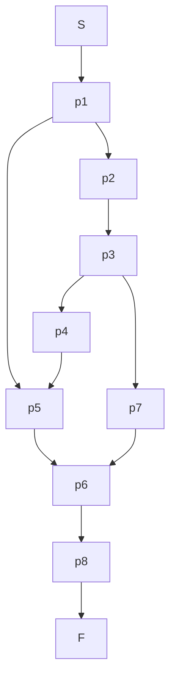

## 1. 并发的特征与挑战

并发是操作系统设计的基石。当多个执行单元（进程/线程）同时存在于一个系统中时，它们的执行具有以下特征，并带来相应的问题：

* **间断性**: 执行过程不是连续的，会被操作系统调度中断，切换到其他执行单元。
* **共享**: 多个执行单元可能会访问和操作共同的资源或数据。
* **不可预测性**: 各个执行单元的相对执行速度无法预知，取决于调度策略、系统负载等多种因素。
* **不确定性**: 由于执行速度的不可预测性，程序的执行结果可能是不确定的，这会导致与时间有关的错误。

### 1.1. 案例分析：与时间有关的错误

#### 1.1.1. 银行账户取款问题

假设一个银行账户有5000元，两个ATM机（T1和T2）同时对该账户进行取款操作。

* T1: 取款1000元
* T2: 取款2000元

一个可能的错误执行序列如下：

| 步骤 | ATM T1 操作     | ATM T2 操作     | 账户余额 (x) | 说明                        |
| :--- | :-------------- | :-------------- | :----------- | :-------------------------- |
| 1    | `read(x)`       |                 | 5000         | T1 读取余额 5000            |
| 2    |                 | `read(x)`       | 5000         | T2 也读取余额 5000          |
| 3    | `x := x - 1000` |                 | 4000         | T1 计算新余额               |
| 4    | `write(x)`      |                 | 4000         | T1 将 4000 写回             |
| 5    |                 | `x := x - 2000` | 3000         | T2 基于它**旧的**读取值计算 |
| 6    |                 | `write(x)`      | 3000         | T2 将 3000 写回             |

**最终结果**: 账户余额为3000元，但正确结果应为 5000 - 1000 - 2000 = 2000元。银行损失了1000元。这个问题的根源在于T1和T2的操作发生了**交叉**，导致T2的操作覆盖了T1的操作结果。

#### 1.1.2. 共享计数器问题 (C代码及汇编)

一个常见的并发问题是多个线程同时对一个共享变量进行自增操作。

**C 代码:**
```c
for (i = 0; i < niters; i++)
    cnt++;
```

**对应的汇编代码 (以一个线程为例):**
```assembly
L3:
    movq cnt(%rip), %rdx   ; (Li) Load: 将 cnt 的值加载到寄存器 %rdx
    addq $1, %rdx          ; (Ui) Update: 将寄存器 %rdx 的值加 1
    movq %rdx, cnt(%rip)   ; (Si) Store: 将寄存器 %rdx 的值写回内存中的 cnt
...
```
`L`, `U`, `S` 这三个步骤合起来才能完成一次 `cnt++`。在并发环境下，这三个步骤并非原子操作（不可分割），可能被中断。

**错误的执行交错:**
假设 `cnt` 初始值为 0，两个线程都想执行 `cnt++`。

| 线程 | 指令          | %rdx1 | %rdx2 | cnt  | 说明                |
| :--- | :------------ | :---- | :---- | :--- | :------------------ |
| 1    | `L1` (Load)   | 0     | -     | 0    | 线程1加载 cnt=0     |
| 2    | `L2` (Load)   | 0     | 0     | 0    | 线程2也加载 cnt=0   |
| 1    | `U1` (Update) | 1     | 0     | 0    | 线程1计算结果为 1   |
| 2    | `U2` (Update) | 1     | 1     | 0    | 线程2计算结果也为 1 |
| 1    | `S1` (Store)  | 1     | 1     | 1    | 线程1将 1 写回      |
| 2    | `S2` (Store)  | 1     | 1     | 1    | 线程2将 1 写回      |

**最终结果**: `cnt` 的值为1，而不是预期的2。这就是**竞争条件 (Race Condition)** 的典型例子。

**竞争条件 (Race Condition) 定义**: 两个或多个进程/线程读写某些共享数据，而最终的结果取决于它们运⾏的精确时序。

#### 1.1.3. 线程参数传递问题

在循环中创建线程并传递循环变量的地址是一个非常经典的错误。

**错误代码示例:**
```c
// Main Thread
void *thread(void *vargp);

int main() {
    pthread_t tid;
    int i;
    for (i = 0; i < 100; i++) {
        // 传递 i 的地址
        pthread_create(&tid, NULL, thread, &i);
    }
    ...
}

// Peer Thread
void *thread(void *vargp) {
    // 解引用指针获取值
    int i = *((int *)vargp);
    ...
    // 保存 i 的值用于后续分析
    save_value(i);
    return NULL;
}
```
**问题分析**:
所有新创建的线程都共享同一个变量 `i` 的内存地址。主线程的`for`循环可能很快就执行完毕，`i` 的值变成了100。而新创建的线程在这之后才开始执行，当它们去解引用`vargp`时，访问到的都是主线程栈上那个已经变成100（或某个中间值）的`i`。

**实验结果**: 实验表明，在多核服务器上，很多线程获取到的 `i` 值是重复的，甚至是混乱的，很少有线程能拿到从0到99的唯一值。这证明了竞争条件确实发生了。

**正确做法**:
应该为每个线程传递一个独一无二的内存地址。通常的做法是在主线程中为每个线程动态分配内存（`malloc`），或者传递值本身（如果值的大小不超过`void*`）。

```c
// 修正后的主线程循环
for (i = 0; i < 100; i++) {
    int *arg = malloc(sizeof(int));
    *arg = i;
    pthread_create(&tid, NULL, thread, arg);
}

// 修正后的子线程
void *thread(void *vargp) {
    int i = *((int *)vargp);
    free(vargp); // 释放内存
    ...
}
```

## 2. 进程/线程间的制约关系

在并发环境中，进程/线程之间主要存在两种制约关系。

### 2.1. 互斥 (Mutual Exclusion)

* **原因**: 多个进程/线程需要排他性地使用某个共享资源（如打印机、共享变量）。
* **定义**: 当一个进程在使用共享资源时，其他试图使用该资源的进程必须等待。
* **临界资源 (Critical Resource)**: 一次只允许一个进程/线程访问的资源。
* **临界区 (Critical Section)**: 程序中访问临界资源的代码片段。

**临界区使用原则**:
1.  **有空让进**: 临界区空闲时，允许一个等待的进程进入。
2.  **无空等待 (互斥)**: 临界区非空闲时，其他进程必须等待。
3.  **有限等待**: 任何进程请求进入临界区，应在有限时间内得到满足，防止"饿死"。
4.  **让权等待**: 进程在等待进入临界区时，应放弃CPU，进入阻塞状态，避免"忙等待"。

### 2.2. 同步 (Synchronization)

* **原因**: 多个进程/线程为了合作完成一个共同任务，需要按照一定的时序关系来执行。
* **定义**: 一个进程的执行需要依赖另一个进程的消息或信号。在收到信号前，该进程会阻塞等待。
* **例子**: 生产者-消费者问题。消费者必须等待生产者生产了产品后才能消费。

**用前驱图表示同步关系**:
前驱图是一个有向无环图，用于描述进程间的执行顺序。箭头 `p1 -> p2` 表示 `p1` 必须在 `p2` 之前完成。

**前驱图 (Precedence Graph)**


---

## 3. 解决互斥问题的方案

### 3.1. 软件方案

软件方案通过巧妙的算法逻辑来确保互斥，但通常较为复杂且效率不高。

* **解法1 (单一标志法)**: 使用一个`bool free`变量。
    * **问题**: 在`while(free);`和`free=true;`之间可能发生上下文切换，两个进程都可能通过`while`检查，然后都进入临界区。违反"无空等待"。
* **解法2 (轮转法)**: 使用一个`turn`变量，`turn=true`允许P进，`turn=false`允许Q进。
    * **问题**: 必须严格轮流进入临界区。如果P不想进入，但`turn`标志归它，Q也无法进入。违反"有空让进"。
* **解法3 (双标志法)**: 每个进程有自己的`pturn`, `qturn`标志，表示自己想进入。
    * **问题**: 两个进程可能同时设置自己的标志为`true`，然后都在`while`循环中等待对方，导致**死锁**。
* **Dekker算法 (1965)**: 结合解法2和3，引入`turn`变量来解决死锁。是第一个被证明正确的纯软件解法，但实现复杂。
* **Peterson算法 (1981)**: 一个更简洁优美的软件解法。

**Peterson 算法详解**

```c
#define N 2 // 进程数量
int turn; // 轮到谁
int interested[N]; // 兴趣数组，初始为FALSE

void enter_region(int process) {
    int other = 1 - process; // 另一个进程

    interested[process] = TRUE; // 1. 表示自己感兴趣
    turn = process;             // 2. 将优先权让给后一个运行这行代码的进程（即可能是对方，如果是自己，那自己就进入临界区）

    // 3. 当对方感兴趣且优先权在对方时，循环等待
    while (turn == process && interested[other] == TRUE) {
        // busy waiting
    }
}

void leave_region(int process) {
    interested[process] = FALSE; // 离开临界区，不再感兴趣
}
```
**工作原理**:
1.  **互斥**: 如果两个进程同时调用`enter_region`，它们都会设置自己的`interested`为`TRUE`。但`turn`变量的写入是原子性的，后写入的会覆盖先写入的。假设进程1后写，则`turn=1`。此时进程0在`while`中会发现`turn==0 && interested[1]==TRUE`不成立，跳出循环进入临界区。而进程1会发现`turn==1 && interested[0]==TRUE`成立，陷入等待。
2.  **有空让进**: 如果进程1不感兴趣 (`interested[1]==FALSE`)，进程0的`while`条件不成立，直接进入。
3.  **有限等待**: 不会死锁。即使一个进程在`while`中等待，一旦另一个进程离开临界区（设置`interested`为`FALSE`），等待的进程就能立即进入。

### 3.2. 硬件方案

硬件方案利用特殊的CPU指令来提供原子操作，实现起来更简单高效。

#### 3.2.1. 关闭中断 (Disable Interrupts)

```c
while (true) {
    disable_interrupts();
    // critical section
    enable_interrupts();
    // remainder section
}
```
* **原理**: 在单处理器系统中，关闭中断可以阻止操作系统进行上下文切换，从而保证临界区代码的连续执行。
* **优点**: 简单、高效。
* **缺点**:
    * **代价高**: 长期关闭中断会影响系统响应其他事件的能力。
    * **不适用于多处理器**: 在多核CPU上，一个核心关闭中断并不能阻止其他核心并发访问共享内存。
    * **滥用风险**: 如果把这个权力交给用户进程，一个恶意或有bug的程序可能会导致整个系统瘫痪。因此，它只适用于操作系统内核自身。

> **思考题提问**：单处理器下，关闭中断是否符合临界区的使用原则（有空让进、无空等待、有限等待）？
> **思考题解答**：在单处理器系统中，关闭中断的方式**符合**"有空让进"和"无空等待"原则。因为只有一个处理器，关闭中断后不会被其他进程抢占，能保证互斥和不会出现空等。但它**不一定符合**"有限等待"原则：如果某个进程长时间占用临界区，其他进程会一直等待，甚至可能被饿死。此外，这种方式**不符合**"让权等待"原则，因为等待的进程无法主动让出CPU，整个系统调度被阻塞，属于一种特殊的忙等。

#### 3.2.2. 测试并加锁 (Test-and-Set Lock, TSL) 指令

TSL是一条**原子指令**，它执行两个操作：读取一个内存位置（锁变量）的值到寄存器，然后将该内存位置设置为1。

```assembly
enter_region:
    TSL REGISTER, LOCK   ; 原子操作: 将LOCK的值复制到REGISTER, 并将LOCK设为1
    CMP REGISTER, #0     ; 比较之前LOCK的值是否为0
    JNE enter_region     ; 如果不为0 (锁已被占用), 则循环等待
    RET                  ; 如果为0 (成功获取锁), 返回并进入临界区

leave_region:
    MOVE LOCK, #0        ; 将LOCK的值设为0, 释放锁
    RET
```
* **原理**: `TSL`指令的原子性保证了在检查锁和设置锁之间不会有上下文切换。
* **忙等待 (Busy Waiting) / 自旋锁 (Spin Lock)**: 这种实现方式会让等待的进程在一个循环中持续消耗CPU时间，因此也称为自旋锁。
* **优先级反转**: 如果一个低优先级进程持有锁，而一个高优先级进程在自旋等待，就会发生优先级反转。高优先级进程无法执行，而低优先级进程可能得不到CPU时间来释放锁。

> **思考题提问**: TSL指令对多处理器系统**有效**吗？为什么？
> **思考题解答**: TSL指令对多处理器系统**有效**。因为`TSL`指令会锁定内存总线，确保在它执行期间，其他CPU核心无法访问同一个内存地址`LOCK`。这保证了操作的原子性是跨核心的。`XCHG`（原子交换）指令也能达到同样的效果。

---

## 4. 高级同步机制

软件和硬件方案都存在问题（复杂性、忙等待等）。为了解决这些问题，操作系统和编程语言提供了更高级、更易用的同步机制。

### 4.1. 信号量 (Semaphore) 及 P/V 操作

由Dijkstra在1965年提出，是一种功能强大且经典的同步工具。

* **定义**: 信号量是一个特殊的整数变量，只能通过两个原子操作来访问：`P`和`V`。
    * `P` (Proberen, test): 检查并尝试减少信号量的值。
    * `V` (Verhogen, increment): 增加信号量的值。

**本课程定义的 P/V 操作**:
```c
struct semaphore {
    int count;          // 计数值
    queueType queue;    // 等待队列
};

// P(s) 操作 - 申请资源
P(s) {
    s.count--;
    if (s.count < 0) {
        // 资源不足，阻塞当前进程
        block_process();
        add_to_queue(s.queue);
        reschedule();
    }
}

// V(s) 操作 - 释放资源
V(s) {
    s.count++;
    if (s.count <= 0) {
        // 有进程在等待，唤醒一个
        wakeup_process_from_queue(s.queue);
        move_to_ready_queue();
    }
}
```
* **`s.count`的含义**:
    * `s.count >= 0`: 表示可用资源的数量。
    * `s.count < 0`: 其绝对值表示正在等待该资源的进程数量。
* **P/V操作是原语 (Atomic Action)**: 它们的执行不可分割，通常由操作系统通过关闭中断或硬件指令来保证。

> **问题解答**: 信号量及PV操作**既可以解决互斥问题，也可以解决同步问题**。
> * **解决互斥**: 使用一个**二元信号量**（也叫互斥锁 `mutex`），初值为1。在临界区前后分别调用 `P(mutex)` 和 `V(mutex)`。
> * **解决同步**: 使用一个**计数信号量**，其初值表示可用资源的数量。例如，同步某个事件的发生，初值为0。等待事件的进程执行 `P` 操作被阻塞，触发事件的进程执行 `V` 操作来唤醒等待者。

#### 4.1.1. 案例：生产者-消费者问题

这是同步问题的经典模型。

* **问题描述**: 生产者进程向一个有界缓冲区中放入产品，消费者进程从中取出产品。
* **同步要求**:
    1.  缓冲区满时，生产者必须停止生产并等待。
    2.  缓冲区空时，消费者必须停止消费并等待。
    3.  对缓冲区的访问是临界区，必须互斥。

**信号量解决方案**:
```c
#define N 100 // 缓冲区大小
semaphore mutex = 1;      // 互斥信号量，保护缓冲区访问，初值为1
semaphore empty = N;      // 同步信号量，记录空闲缓冲区数量，初值为N
semaphore full = 0;       // 同步信号量，记录产品数量，初值为0
```

**生产者代码**:
```c
void producer() {
    while (TRUE) {
        item = produce_item();
        P(&empty); // 1. 申请一个空缓冲区 (若无则等待)
        P(&mutex); // 2. 锁住缓冲区
        insert_item(item);
        V(&mutex); // 3. 解锁缓冲区
        V(&full);  // 4. 通知有一个产品可用
    }
}
```

**消费者代码**:
```c
void consumer() {
    while (TRUE) {
        P(&full);  // 1. 申请一个产品 (若无则等待)
        P(&mutex); // 2. 锁住缓冲区
        item = remove_item();
        V(&mutex); // 3. 解锁缓冲区
        V(&empty); // 4. 通知有一个空缓冲区可用
        consume_item(item);
    }
}
```

> **思考题解答**:
> * **颠倒两个P操作的顺序会怎样?**
>     如果生产者代码变为 `P(&mutex); P(&empty);`。当缓冲区满时 (`empty=0`)，生产者会先成功执行`P(&mutex)`获得互斥锁，然后执行`P(&empty)`被阻塞。但因为它持有`mutex`锁，消费者即使消费了产品想执行`V(&empty)`，也无法进入临界区（被`P(&mutex)`阻塞），也就无法唤醒生产者。系统发生**死锁**。
> * **颠倒两个V操作的顺序会怎样?**
>     `V(&full); V(&mutex);` 颠倒为 `V(&mutex); V(&full);`。这**不会**导致逻辑错误或死锁。释放互斥锁和通知产品可用是两个独立的操作，它们的顺序不影响正确性。但通常建议先`V(mutex)`再`V(full)`，这样可以尽快释放临界区，让其他进程进入，提高并发度。

#### 4.1.2. 案例：第一类读者-写者问题

* **问题描述**: 多个进程共享数据，分为读者和写者。
* **要求**:
    1.  允许多个读者同时读。
    2.  只允许一个写者写。
    3.  读者和写者不能同时访问。

**采用读者优先解法:**

在这种策略下，只要有读者在读，后续的读者都可以直接进入，写者必须等待所有读者结束后才能进入。可能会导致写者"饿死"。

**信号量和变量**:
```c
semaphore w = 1;      // 控制写的互斥信号量
semaphore mutex = 1;  // 用于保护对 read_count 的修改
int read_count = 0;   // 记录当前正在读的读者数量
```

**写者代码**:
```c
void writer() {
    while (TRUE) {
        P(w); // 申请写权限
        // 写操作
        V(w); // 释放写权限
    }
}
```

**读者代码**:
```c
void reader() {
    while (TRUE) {
        P(mutex); // 锁住 read_count
        read_count++;
        if (read_count == 1) { // 第一个读者
            P(w); // 阻止写者进入
        }
        V(mutex); // 解锁 read_count

        // 读操作

        P(mutex); // 锁住 read_count
        read_count--;
        if (read_count == 0) { // 最后一个读者
            V(w); // 允许写者进入
        }
        V(mutex); // 解锁 read_count
    }
}
```

### 4.2. 管程 (Monitor)

信号量虽然强大，但使用时容易出错（比如P/V顺序写反导致死锁）。管程是一种更高级的、语言层面的同步机制，旨在简化并发编程。

* **定义**: 管程是一个程序模块，它包含：
    1.  一组共享数据结构。
    2.  一组操作这些数据的过程（方法）。
    3.  一个初始化部分。
* **核心特性**:
    1.  **自动互斥**: 编译器保证在任何时刻，最多只有一个进程能在管程内部执行其过程。进程调用管程过程时，会自动获得互斥锁。
    2.  **条件变量 (Condition Variable)**: 用于解决同步问题。它不是一个值，而是一个等待队列。提供`wait`和`signal`操作。
        * `c.wait()`: 调用此操作的进程会被阻塞，并**释放管程的互斥锁**，然后进入条件变量`c`的等待队列。
        * `c.signal()`: 如果有进程在条件变量`c`上等待，则唤醒其中一个。

#### 4.2.1. Hoare 管程 vs. Mesa 管程

当一个在管程中的进程P执行 `c.signal()` 唤醒了另一个等待的进程Q时，管程中就有了两个活跃进程P和Q。如何处理？

* **Hoare 管程 (P waits for Q)**:
    * **规则**: P立刻挂起，Q马上执行。P进入一个"紧急等待队列"，优先级高于管程入口的等待队列。当Q执行完毕或再次`wait`时，P才能恢复执行。
    * **优点**: `signal`之后，被唤醒的进程Q可以确定它等待的条件现在是满足的。可以用`if`来判断条件。
    * **缺点**: 实现复杂，需要多次上下文切换。

* **Mesa 管程 (P continues, Q waits)**:
    * **规则**: `signal`操作（在Mesa中称为`notify`）只是一个"提示"。P继续执行，Q从等待队列移到就绪队列，但不会立即执行。Q何时执行取决于调度器。
    * **优点**: 实现简单，上下文切换少。
    * **缺点**: 当Q最终被调度执行时，它等待的条件可能已经被其他进程改变了。因此，Q被唤醒后必须**重新检查条件**。这导致了著名的**while循环**范式。

**Hoare管程 - 生产者消费者**
```pascal
monitor ProducerConsumer
    condition full, empty;
    integer count;

    procedure insert(item: integer);
    begin
        // Hoare管程, signal后条件确定为真, 用if即可
        if count == N then wait(full);
        ...
        if count == 1 then signal(empty);
    end;
    ...
end;
```

**Mesa管程 - 生产者消费者**

核心思想是，被唤醒的线程（无论是生产者还是消费者）必须用`while`循环重新检查条件。这是因为从`c.notify`（通知）发生，到等待的线程被唤醒并重新获得管程锁的这段时间内，共享状态（如缓冲区是满是空）可能已经被其他线程改变了。

`append`和`take`函数的实现如下：

```c
// Producer Code
void append(char x) {
    // 在Mesa管程中，唤醒的线程必须重新检查条件，因为从notify()发生到线程重新获得管程锁的这段时间内，共享状态（如缓冲区是满是空）可能已经被其他线程改变了。
    // 这就是为什么必须使用while循环，而不是if语句。
    while (count == N) {
        c.wait(notfull); // 如果缓冲区满了，则等待
    }

    // 添加项目到缓冲区
    buffer[nextin] = x;
    nextin = (nextin + 1) % N;
    count++;

    c.notify(notempty);  // 通知任何等待的消费者。
}

// Consumer Code
// 注意：函数签名从 `take(char x)` 改为 `take(char *x)`
// 为了通过输出参数返回一个值，使其在C中有效。
void take(char *x) {
    while (count == 0) {
        c.wait(notempty); // 如果缓冲区为空，则等待
    }

    // 从缓冲区中移除项目
    *x = buffer[nextout];
    nextout = (nextout + 1) % N;
    count--;

    c.notify(notfull);    // 通知任何等待的生产者。
}
```

**Mesa管程的改进**:
* `broadcast`: 唤醒在某个条件变量上等待的**所有**进程。当不确定哪个进程能满足条件时非常有用。
* **超时 `wait`**: `wait`操作可以带一个超时参数，防止因信号丢失而导致的永久等待（饥饿）。

#### 4.2.2. Java 中的管程

Java的 `synchronized` 关键字和 `Object` 类的 `wait()`, `notify()`, `notifyAll()` 方法是Mesa管程模型的一种实现。

* **`synchronized`**: 任何对象都可以作为锁。当一个线程进入一个对象的`synchronized`方法或代码块时，它就获得了该对象的锁。这实现了自动互斥。
* **`wait()`, `notify()`, `notifyAll()`**: 相当于Mesa管程的 `cwait`, `cnotify`, `cbroadcast`。它们必须在`synchronized`块中调用。

**Java 实现生产者消费者**:
```java
// our_monitor 类的 insert 方法
public synchronized void insert(int val) {
    // 必须使用 while 循环检查条件
    while (count == N) {
        try {
            wait(); // 释放锁并等待
        } catch (InterruptedException e) {}
    }
    // ... 插入数据 ...
    count++;
    // 唤醒一个等待的消费者
    notifyAll(); // 使用notifyAll更健壮，防止信号丢失
}
```

### 4.3. Pthreads 同步机制

Pthreads (POSIX Threads) 是一套标准的线程API，它提供了两种主要的同步工具：互斥锁和条件变量。这套API非常接近Mesa管程模型。

#### 4.3.1. 互斥锁 (Mutex)

* `pthread_mutex_t`: 互斥锁变量类型。
* `pthread_mutex_init()`: 初始化互斥锁。
* `pthread_mutex_lock()`: 加锁。如果锁已被占用，线程阻塞。
* `pthread_mutex_unlock()`: 解锁。
* `pthread_mutex_destroy()`: 销毁互斥锁。

#### 4.3.2. 条件变量 (Condition Variable)

* `pthread_cond_t`: 条件变量类型。
* `pthread_cond_init()`: 初始化条件变量。
* `pthread_cond_wait(cond, mutex)`:
    1.  **原子地**解锁 `mutex`。
    2.  使线程阻塞在 `cond` 上。
    3.  当被唤醒后，**重新自动地**锁上 `mutex`。
* `pthread_cond_signal(cond)`: 唤醒至少一个在`cond`上等待的线程（类似`notify`）。
* `pthread_cond_broadcast(cond)`: 唤醒所有在`cond`上等待的线程（类似`broadcast`）。
* `pthread_cond_destroy()`: 销毁条件变量。

### 3.3.3. Pthreads 解决生产者-消费者问题

**代码框架**:
```c
pthread_mutex_t the_mutex;
pthread_cond_t condc, condp; // c:消费者等待条件, p:生产者等待条件
int buffer = 0;

void *producer(void *ptr) {
    for (...) {
        pthread_mutex_lock(&the_mutex); // 加锁
        // 缓冲区不为空(已被填充), 生产者等待
        while (buffer != 0) {
            pthread_cond_wait(&condp, &the_mutex);
        }
        buffer = i; // 生产
        pthread_cond_signal(&condc); // 唤醒消费者
        pthread_mutex_unlock(&the_mutex); // 解锁
    }
}

void *consumer(void *ptr) {
    for (...) {
        pthread_mutex_lock(&the_mutex); // 加锁
        // 缓冲区为空, 消费者等待
        while (buffer == 0) {
            pthread_cond_wait(&condc, &the_mutex);
        }
        buffer = 0; // 消费
        pthread_cond_signal(&condp); // 唤醒生产者
        pthread_mutex_unlock(&the_mutex); // 解锁
    }
}
```
> **重点讨论**: 为什么 `pthread_cond_wait` 必须用 `while` 循环包裹？
>
> 1.  **虚假唤醒 (Spurious Wakeup)**: 在某些系统实现中，线程可能在没有`signal`或`broadcast`的情况下被唤醒。
> 2.  **Mesa模型特性**: 正如之前讨论的，`signal`只是一个提示。从线程被唤醒到它实际运行并重新获得锁之间，它等待的条件可能已经被其他线程改变了。
>
> 如果使用 `if`，线程被唤醒后会盲目地继续执行，可能会操作一个不满足条件的共享状态，导致错误。`while`循环确保线程在继续执行前，必须重新验证条件是否为真。

---

## 5. 锁的实现与现代硬件

### 5.1. 锁 (Mutex) 的实现

锁是实现其他高级同步机制的基础。

#### 5.1.1. 基于开关中断的实现

这种方法有严重缺陷。
**错误实现**:
```c
lock() {
    disable_interrupts();
    while (value != FREE); // 忙等待，且中断被关闭
    value = BUSY;
    enable_interrupts();
}
```
**问题**: 如果锁被占用，`while`循环会一直执行，而中断是关闭的，持有锁的线程永远无法被调度来释放锁，导致系统死锁。

**稍好的实现**:
```c
lock() {
    disable_interrupts();
    while (value != FREE) {
        enable_interrupts();  // 循环时临时开中断
        // some delay...
        disable_interrupts(); // 再次检查前关中断
    }
    value = BUSY;
    enable_interrupts();
}
```
**问题**: 在 `enable_interrupts()` 和下一次 `disable_interrupts()` 之间，可能会一直被新的 `lock` 调用阻塞导致饥饿。

**正确的无忙等待实现 (OS内核级)**:
```c
lock() {
    disable_interrupts();
    if (value == FREE) {
        value = BUSY;
    } else {
        // 将当前线程加入等待队列
        add_thread_to_queue(waiting_queue);
        // 切换到下一个可运行的线程 (这会隐式地处理中断)
        switch_to_next_thread();
    }
    enable_interrupts();
}
```
> **思考题解答**: 在上述代码中，何时可以开启中断？
> * 在 `value = BUSY;` **之后**开中断是安全的。
> * 在 `switch_to_next_thread()` **之后**开中断也是安全的（通常`switch`函数内部会处理中断状态的保存和恢复）。
> * 如果在 `if (value == FREE)` 检查之后、`value = BUSY;` 赋值**之前**开启中断，就会产生竞争条件：线程A检查到锁是空闲的，但还没来得及上锁，中断发生，线程B抢先上锁。当线程A恢复执行时，它会错误地认为自己也获得了锁。

#### 5.1.2. 基于 TSL 指令的实现 (带让出CPU)

为了避免纯粹的自旋消耗CPU，可以在尝试获取锁失败后，主动让出CPU。

```assembly
mutex_lock:
    TSL REGISTER, MUTEX   ; 尝试获取锁
    CMP REGISTER, #0      ; 检查之前是否锁着
    JZE ok                ; 成功获取，跳转到ok
    CALL thread_yield     ; 失败，调用线程调度，让出CPU
    JMP mutex_lock        ; 被唤醒后，重新尝试
ok:
    RET
```
这种方式结合了硬件原子指令和操作系统的调度，比纯自旋锁要好，但仍然有尝试-失败的开销。

### 5.2. 现代并发机制拓展

#### 5.2.1. Futex (Fast Userspace Mutex)

Futex是Linux中一种高效的锁机制，它结合了用户空间和内核空间的优点。
* **快速路径 (Fast Path)**: 在无竞争的情况下，锁的获取和释放完全在用户空间通过原子操作完成，无需进入内核，开销极小。
* **慢速路径 (Slow Path)**: 当发生锁竞争时，线程通过系统调用进入内核，将自己置于等待队列并睡眠，由内核负责唤醒。
* **两阶段锁**: 这种思想可以演变为两阶段锁：第一阶段在用户态自旋一小段时间（期望锁很快被释放），如果失败，第二阶段再进入内核休眠。

#### 5.2.2. 现代硬件支持

* **指令重排 (Instruction Reordering)**: 为了优化性能，CPU和编译器可能会改变指令的执行顺序。这在单线程下不影响结果，但在多线程下可能破坏程序员预期的同步逻辑。需要使用**内存屏障 (Memory Fence/Barrier)** 来阻止重排。
* **更多原子指令**:
    * **CAS (Compare-and-Swap)**: `CAS(addr, old, new)` 原子地检查 `*addr` 是否等于 `old`，如果是，就把它更新为 `new`。这是实现**无锁数据结构**（lock-free）和乐观锁的基础。
    * **Fetch-and-Add**: 原子地读取一个值并给它加上一个数。
* **CSP (Communicating Sequential Processes) 模型**: 与通过共享内存和锁进行同步不同，CSP模型强调进程之间通过显式的**通信通道 (Channel)** 来传递消息和同步。Go语言的`channel`就是基于此模型，它能有效避免竞争条件和死锁问题。
