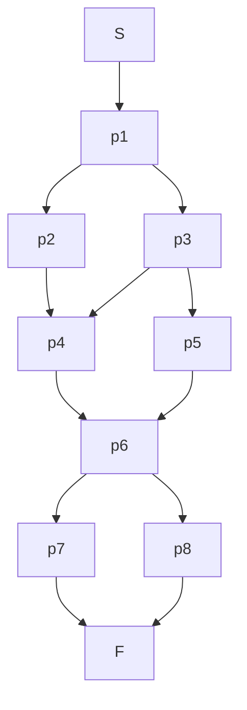

在多道程序环境下, 多个进程并发执行, 它们之间或多或少会存在一些依赖关系. 为了协调这些进程的执行, 确保程序的正确性, 我们需要一套机制来让它们进行通信和同步, 这就是所谓的IPC (Inter-Process Communication) . 本讲聚焦于几种经典的同步问题, 并要求使用信号量 (Semaphore) 的P、V操作或管程 (Monitor) 来解决. 

本课程我们主要关注以下几个问题：另类PV操作问题、食品供应问题、三峡大坝问题、狒狒过峡谷问题、睡眠理发师问题, 以及最后的一个资源管理问题. 

## 1 解决同步问题的系统方法论

无论是用信号量还是管程, 解决问题的第一步都是相同的：**分析问题本身**. 

### 1.1 分析模型 (与工具无关)

在写任何一行代码之前, 先用自然语言清晰地定义以下三个要素：

1.  **识别"角色"(Actors) 和"资源"(Resources)**
    *   **角色**: 系统中有哪些并发执行的实体？(例如：生产者、消费者、读者、写者、上行船只、东行狒狒)
    *   **资源**: 它们需要共享和访问什么？(例如：缓冲区、共享数据、船闸、绳索)

2.  **定义"规则", 即约束条件 (Constraints)**
    这是最关键的一步. 规则分为两类：
    *   **互斥 (Mutual Exclusion)**: "在任何时候, 只有**一个**角色能做某件事". 这通常是为了保护共享资源的完整性. 
        *   *例子*: 任何时候只能有一个理发师在修改 `waiting_chairs` 计数器. 任何时候只能有一艘船在使用某一级船闸 `gate[i]`. 
    *   **同步 (Synchronization / Condition Synchronization)**: "一个角色必须**等待**某个条件为真才能继续". 这是角色之间的协作和时序关系. 
        *   *例子*: 消费者必须**等待**缓冲区里有产品. 理发师必须**等待**有顾客到来. 船只要想上行, 必须**等待**航向没有被下行船只占用. 

一旦用自然语言把所有"互斥"和"同步"的规则都列出来, 问题就解决了一半. 下一步才是选择工具, 将这些规则"翻译"成代码. 

### 1.2 一个重要的问题

> 读者可能会提出两个个非常好的问题, 这两个问题意义相反, 但是背后的原因是相同的
> 1. 在睡眠理发师问题中, `customers`  (现在等待的顾客数) 不也是一个共享变量吗？为什么它被直接实现为一个信号量, 而不是一个受`mutex`保护的整数？
> 2. 为什么在读者-写者问题中, `read_count` (正在读取的读者数) 被实现为一个普通整型变量, 而不是一个信号量？

这是一个非常深刻的观察, 它揭示了信号量更强大的本质：**信号量是一种封装了"计数"和"等待"的智能变量.**

我们选择用信号量直接实现`customers`, 是因为理发师的同步规则 ("若无顾客则等待") 与信号量的P操作完美匹配. `P(customers)` 这一个动作就完成了"检查顾客数, 如果为零则睡眠"的全部逻辑. 

这是一种设计上的抽象和优化. 我们本可以这样做：

```c
// 复杂的、非必要的实现
int customers_count = 0;
semaphore mutex = 1;
semaphore barber_is_sleeping = 0; // 单独的等待工具

// 理发师
P(mutex);
if (customers_count == 0) {
    V(mutex);
    P(barber_is_sleeping); // 在独立的信号量上等待
} else { ... }
```

但这种实现更繁琐, 引入了更多的变量和复杂性. 直接使用 `semaphore customers = 0;` 更清晰、更优雅. 

**更精确的指导原则**：
*   当你的同步规则是简单的 **"等待, 直到某个资源的计数 > 0"** 时, 直接用一个信号量来代表这个资源是最佳实践. 例如：等待顾客(`customers`)、等待产品(`full`)、等待空位(`empty`). 
*   当你的同步规则**更复杂**, 需要读取一个计数值并基于它的值执行不同的逻辑分支时 (例如读者-写者问题中的`read_count`, 你需要在第一个读者进来的时候锁住写者不让他进来, 而这个操作信号量是不支持的) , 你应该使用一个普通整型变量, 并用一个互斥锁来保护它的读写操作. 

### 1.3 选择工具并进行"翻译"

#### 1.3.1 方法论一：使用信号量 (P/V 操作)

信号量的核心思想是 **"计数"**. 你把每个约束条件看作一种或多种需要计数的"资源". 

1.  **翻译「互斥」规则**:
    *   **方法**: 为每一个需要互斥访问的共享资源 (或代码段) 定义一个**二元信号量 (mutex)**, 初值为 **1**. 
    *   **模式**: 在临界区代码前 `P(mutex)`, 在之后 `V(mutex)`. 
    *   **思考**: "这个信号量代表了进入临界区的'许可', 初始时有1个许可. "

2.  **翻译「同步」规则**:
    *   **方法**: 为每一个"等待条件"定义一个**通用信号量**, 并问自己：**"这个信号量在计数什么？"**
        *   这个计数代表了角色正在等待的"资源"或"事件"的数量. 
    *   **确定初值**: 信号量的初值等于系统启动时, 它所计数的资源的**初始数量**. 
        *   *例子 (睡眠理发师)*: 顾客等待"空闲的理发师". 系统开始时, 理发师都在睡觉 (不空闲) , 所以 `barbers` 信号量初值为 **0**. 理发师等待"已到店的顾客". 系统开始时, 没有顾客, 所以 `customers` 信号量初值为 **0**. 
        *   *例子 (食品供应)*: 供应者A等待"A食品的空货架". 初始时货架全空, 所以 `emptyA` 信号量初值为 **m**. 
    *   **安排 P/V 操作**:
        *   **P 操作**: 当一个角色**需要/消耗**一个资源时, 它就执行 `P` 操作. 如果资源数 (信号量的值) 为0, 它就自动等待. 
            *   *例子*: 理发师需要一个顾客, 所以他 `P(customers)`. 
        *   **V 操作**: 当一个角色**生产/释放**一个资源时, 它就执行 `V` 操作, 通知等待者资源增加了. 
            *   *例子*: 顾客到店了, 他"生产"了一个"理发请求", 所以他 `V(customers)`. 

#### 1.3.2 方法论二：使用管程 (Monitor)

管程的核心思想是 **"封装和等待条件"**. 它将共享的所有东西都锁在一个"房间"里, 角色按规则排队进入. 

1.  **翻译「互斥」规则**:
    *   **方法**: 将所有共享变量 (如 `countA`, `up_count`, `writer_active` 等) **全部封装**在一个管程对象内部. 
    *   **思考**: 管程自动保证了所有调用其方法 (过程) 的线程都是互斥的. 你**不再需要**手动创建 `mutex` 信号量. 这是管程相比信号量的一大优势：**互斥被简化了**. 

2.  **翻译「同步」规则**:
    *   **方法**: 为每一个"等待原因"定义一个**条件变量 (Condition Variable)**. 
        *   **命名技巧**: 给条件变量起一个能反映"等待者期望什么变为真"的名字. 例如, `can_go_east` (东行狒狒等待这个条件为真), `barber_available` (理发师等待这个条件为真). 
    *   **实现管程过程 (经典模式: `while-wait-signal`)**:
        *   **`while (condition_is_not_met)`**: 在管程方法内部, **永远使用 `while` 循环**来检查等待条件, 而不是 `if`. 这是因为当你被唤醒时, 你期望的条件可能已经被另一个刚被唤醒的进程改变了. `while` 确保你继续执行时, 条件一定是满足的. 
        *   **`wait(condition_variable)`**: 在 `while` 循环中, 如果条件不满足, 就调用 `wait`. 这会**原子地**做两件事：1) 释放管程的锁；2) 在这个条件变量上睡眠. 
        *   **`signal(c)` / `broadcast(c)`**: 当你修改了共享状态后, 问自己："我的修改是否使得某个等待队列的条件成真了？" 如果是, 就调用 `signal` (唤醒一个) 或 `broadcast` (唤醒所有) 来通知等待者. 
            *   *例子 (狒狒过峡谷)*: 当最后一个东行狒狒离开后 (`east_count--` 变为 0), 它使得 `west_count > 0` 这个条件对西行狒狒不再成立, 所以它应该 `broadcast(can_go_west)` 来唤醒所有等待的西行狒狒, 让它们重新检查. 

### 1.4 总结与最佳实践

| 特性         | 信号量 (P/V)                        | 管程 (Monitor)                            |
| :----------- | :---------------------------------- | :---------------------------------------- |
| **核心思想** | 计数资源/事件                       | 封装状态, 等待条件                        |
| **互斥实现** | **手动** (使用`mutex`信号量)        | **自动** (由管程结构保证)                 |
| **同步实现** | **隐式** (通过信号量的值)           | **显式** (通过条件变量`wait/signal`)      |
| **易错点**   | 忘记`P/V`操作, 死锁, 信号量初值设错 | `wait`条件用`if`不用`while`, 忘记`signal` |
| **抽象层级** | 较低, 更接近硬件                    | 较高, 更结构化, 易于管理复杂状态          |

## 2 纯同步问题

纯同步问题是指进程之间仅仅存在执行顺序上的依赖关系, 而没有互斥访问共享资源的需求. 这种依赖关系通常可以用前驱图 (Precedence Graph) 来描述. 

### 2.1 例子：前驱图

下面是前驱图的例子, 箭头代表了进程 (或代码段) 执行的先后顺序. 例如, 从 S 指向 p1 的箭头表示 p1 必须在 S 完成后才能开始. 

**通用前驱图 (General precedence)**


**解法思路**:
解决这类问题的通用方法是, 为每一个前驱关系 (图中的每一条边) 设置一个信号量. 

1.  **信号量设置**: 对于从进程 $P_i$ 指向 $P_j$ 的每一条边, 都设置一个初始值为0的信号量 $S_{ij}$. 
2.  **进程 $P_i$**: 在 $P_i$ 执行完毕后, 对所有从 $P_i$ 发出的边所对应的信号量执行 `V` 操作. 例如, 如果 $P_i$ 是 $P_j$ 和 $P_k$ 的前驱, 则 $P_i$ 结尾处需要执行 $V(S_{ij})$ 和 $V(S_{ik})$. 
3.  **进程 $P_j$**: 在 $P_j$ 开始执行前, 对所有指向 $P_j$ 的边所对应的信号量执行 `P` 操作. 例如, 如果 $P_j$ 的前驱是 $P_i$ 和 $P_k$, 则 $P_j$ 开始处需要执行 $P(S_{ij})$ 和 $P(S_{kj})$. 

通过这种方式, 可以保证图中所定义的所有前驱关系都能得到满足. 

## 3 另类P、V操作问题

### 3.1 问题描述
有一个系统, 对P、V操作的定义如下：

* **P(s)**:
    ```c
    s.count --;
    if (s.count < 0) {
        将本进程插入相应队列末尾等待;
    }
    ```
* **V(s)**:
    ```c
    s.count ++;
    if (s.count <= 0) {
        从相应等待队列队尾唤醒一个进程, 将其插入就绪队列;
    }
    ```

**思考并回答**:
a. 这样定义P、V操作是否有问题？
b. 用这样的P、V操作实现N个进程竞争使用某一共享变量的互斥机制. 
c. 对于b的解法, 有无效率更高的方法. 如有, 试问降低了多少复杂性？

### 3.2 使用P、V操作的问题解答

**a. 这样定义P、V操作是否有问题？**

**答**: 有问题. 关键在于`V(s)`操作. 标准的`V`操作在唤醒进程时, 是从等待队列的**队头**唤醒一个进程, 这遵循了"先来先服务" (FCFS) 的原则, 可以保证等待的公平性, 避免某些进程饥饿 (长时间得不到执行) . 而题目中定义的`V`操作是从**队尾**唤醒进程, 这是一种"后来先服务" (LIFS) 的策略. 这会导致等待时间最长的进程可能一直得不到唤醒, 从而产生**饥饿**现象. 因此, 这种定义是不公平的, 在实际系统中可能会导致严重问题. 

**b. 用这样的P、V操作实现N个进程竞争共享变量的互斥**

**答**: 尽管存在公平性问题, 但我们仍然可以用它来实现互斥. 实现互斥的经典方法是使用一个初值为1的信号量. 

```c
// 信号量定义
semaphore mutex;
mutex.count = 1;

// N个进程的执行代码
Process_i() {
    while(true) {
        P(mutex);
        // --- 临界区开始 ---
        // 访问共享变量
        // --- 临界区结束 ---
        V(mutex);

        // 非临界区代码
    }
}
```

**工作原理分析**:
1.  `mutex` 信号量的初值为1, 表示允许一个进程进入临界区. 
2.  第一个进程调用 `P(mutex)`, `mutex.count` 变为0, 进程进入临界区. 
3.  此时若有第二个进程调用 `P(mutex)`, `mutex.count` 变为-1, 该进程被阻塞, 并加入等待队列. 之后再来的进程也同样被阻塞. 
4.  第一个进程完成临界区操作后, 调用 `V(mutex)`, `mutex.count` 变为0 (`-1+1=0`). 因为 `mutex.count <= 0`, 所以会从等待队列的队尾唤醒一个进程. 
5.  被唤醒的进程进入临界区, 其他进程继续等待. 这样就保证了任意时刻只有一个进程在临界区内, 实现了互斥. 

**c. 效率和复杂性分析**

**答**: 这里的"效率"可以从两个角度理解：一是算法的执行效率, 二是系统的公平性. 

1.  **执行效率**: 对于单个P或V操作来说, 无论是从队头还是队尾操作, 其时间复杂度通常都是 $O(1)$. 所以单次操作的执行效率没有太大差别. 

2.  **公平性与系统整体效率**: 标准的队头唤醒 (FIFO) 方式, 其公平性好. 而题目中的队尾唤醒 (LIFO) 方式, 公平性差, 可能导致饥饿. 从系统整体来看, 饥饿现象会降低系统的效率和响应性. 

**是否有更高效率的方法？**
如果指的是解决互斥问题的效率, 使用信号量本身就是一种非常高效的方法. 关键在于`V`操作的实现. 标准的、从队头唤醒进程的`V`操作是更优的实现, 因为它保证了公平性. 所以, **"更高效率"的方法就是使用标准定义的V操作**. 

**降低了多少复杂性？**
从实现上讲, 将队尾唤醒改为队头唤醒, 并没有增加或降低算法本身的实现复杂性. 但是, 它**降低了系统行为的复杂性**. 使用标准的FIFO策略, 我们更容易预测和分析系统的行为, 可以保证进程的等待时间是有限的, 从而避免了饥饿这个复杂且难以处理的问题. 可以说, 它通过保证公平性, 大大降低了系统出现异常行为的风险. 

## 4 食品供货问题

### 4.1 问题描述
某商店有两种食品A和B, 最大容量各为 `m` 个. 商店将A、B两种食品搭配出售 (每次各取一个) . 为保证新鲜, 遵循"先到食品先出售"原则. 有两个食品公司分别不断地供应A和B. 为保证正常销售, 当某种食品的数量比另一种的数量超过 `k` ($k < m$) 个时, 暂停对数量大的食品进货. 试用P、V操作解决同步和互斥关系. 

### 4.2 使用P、V操作的问题解答

**1. 关系分析**
* **互斥关系**: 商店的库存 (食品A和B的数量) 是共享变量, 所有进程 (供应A、供应B、销售) 在修改库存数量时都必须互斥. 我们可以用一个信号量 `mutex` 来实现. 
* **同步关系**:
    * **销售员**: 必须等到商店里同时有食品A和食品B时才能进行销售. 
    * **供应A**: 当A的数量已满(`m`个)时, 或当A比B多`k`个时, 需要暂停供应. 
    * **供应B**: 当B的数量已满(`m`个)时, 或当B比A多`k`个时, 需要暂停供应. 

**2. 信号量设置**
* `mutex`: 互斥信号量, 保护对库存数量的访问, 初值为 1. 
* `emptyA`, `emptyB`: 表示A和B的空闲货架数, 初值均为 `m`. 用于控制库存上限. 
* `foodA`, `foodB`: 表示已有的A和B食品数量, 初值均为 0. 用于销售员判断是否可以销售. 
* `limitA`: 控制"A比B数量多k个"的限制. 当A比B多`k`个时, A的供应者需要等待. 可以看作是A相对于B的"空闲容量". 初值为 `k`. 
* `limitB`: 控制"B比A数量多k个"的限制. 同理, 初值为 `k`. 

**3. 伪代码实现**

```c
// 共享变量
int countA = 0, countB = 0; // 食品数量

// 信号量
semaphore mutex = 1;
semaphore emptyA = m, emptyB = m;
semaphore foodA = 0, foodB = 0;
semaphore limitA = k, limitB = k; // A比B, B比A的富余量

// 供应A进程
ProviderA() {
    while(true) {
        P(emptyA);       // 是否还有空货架放A?
        P(limitB);       // B比A的数量是否已经多了k个？
                         // P(limitB)意味着消耗一个B对A的富余名额
        P(mutex);
        // 生产一个A并放入
        countA++;
        V(mutex);

        V(limitA);       // 增加一个A对B的富余名额
        V(foodA);        // 增加一个食品A
    }
}

// 供应B进程
ProviderB() {
    while(true) {
        P(emptyB);       // 是否还有空货架放B?
        P(limitA);       // A比B的数量是否已经多了k个？
                         // P(limitA)意味着消耗一个A对B的富余名额
        P(mutex);
        // 生产一个B并放入
        countB++;
        V(mutex);

        V(limitB);       // 增加一个B对A的富余名额
        V(foodB);        // 增加一个食品B
    }
}

// 销售员进程
Seller() {
    while(true) {
        P(foodA); // 是否有食品A?
        P(foodB); // 是否有食品B?

        P(mutex);
        // 取走A和B
        countA--;
        countB--;
        V(mutex);

        V(emptyA); // 货架空出
        V(emptyB); // 货架空出
        
        // 关键一步：取走A相当于增加了B对A的富余量
        V(limitB);
        // 取走B相当于增加了A对B的富余量
        V(limitA);
    }
}
```
**说明**:
* `ProviderA` 在放入食品A前, 检查A的货架 (`P(emptyA)`) 和数量限制 (`P(limitB)`) . 放入后, 通知有新的A可用 (`V(foodA)`) , 并更新数量限制 (`V(limitA)`) . 
* `ProviderB` 同理. 
* `Seller` 在取货前, 检查A和B是否都可用 (`P(foodA)` 和 `P(foodB)`) . 取货后, 通知货架空出 (`V(emptyA)` 和 `V(emptyB)`) , 并更新两种食品间的数量限制 (`V(limitA)` 和 `V(limitB)`) . 这样就形成了一个完整的闭环. 

### 4.3 使用管程的解决方案

使用管程可以更结构化地解决此问题. 我们将商店的库存和操作封装在一个管程内. 

**1. 管程设计**
*   **共享变量**:
    *   `countA`, `countB`: 两种食品的当前数量. 
*   **条件变量**:
    *   `canSupplyA`: 当A食品无法供应时 (已满或比B多k个), 供应者A在此等待. 
    *   `canSupplyB`: 当B食品无法供应时, 供应者B在此等待. 
    *   `canSell`: 当A或B食品缺货时, 销售员在此等待. 
*   **管程过程**:
    *   `SupplyA(item)`: 供货商A调用. 
    *   `SupplyB(item)`: 供货商B调用. 
    *   `Sell()`: 销售员调用. 

**2. 伪代码实现**
```c
monitor FoodStore {
    int countA = 0, countB = 0;
    condition canSupplyA, canSupplyB, canSell;

    // 供应A食品
    public procedure SupplyA() {
        while (countA >= m || countA - countB >= k) {
            wait(canSupplyA);
        }
        // 放入食品A
        countA++;
        // 唤醒可能在等待的销售员和供应者B
        notify(canSell);
        if (countB - countA < k) { // 检查是否可以解除对B的限制
             broadcast(canSupplyB); // 使用broadcast更安全, 唤醒所有等待的B供应者
        }
    }

    // 供应B食品
    public procedure SupplyB() {
        while (countB >= m || countB - countA >= k) {
            wait(canSupplyB);
        }
        // 放入食品B
        countB++;
        // 唤醒可能在等待的销售员和供应者A
        notify(canSell);
        if (countA - countB < k) { // 检查是否可以解除对A的限制
            broadcast(canSupplyA);
        }
    }

    // 销售
    public procedure Sell() {
        while (countA < 1 || countB < 1) {
            wait(canSell);
        }
        // 取走食品
        countA--;
        countB--;
        // 唤醒可能在等待的供应者
        broadcast(canSupplyA);
        broadcast(canSupplyB);
    }
}

// 进程调用
ProviderA() { while(true) { FoodStore.SupplyA(); } }
ProviderB() { while(true) { FoodStore.SupplyB(); } }
Seller() { while(true) { FoodStore.Sell(); } }
```

**3. 说明**
*   **封装与互斥**: 管程 `FoodStore` 封装了所有共享状态 (`countA`, `countB`), 并自动保证了对这些状态的所有操作 (`SupplyA`, `SupplyB`, `Sell`) 都是互斥的, 无需手动使用 `mutex`. 
*   **条件等待**: 每个进程在进入管程后, 使用 `while` 循环检查其执行条件. 如果条件不满足, 则调用 `wait()` 在相应的条件变量上等待, 这会自动释放管程的锁. 
*   **唤醒**: 当一个进程改变了系统状态后 (如增加或减少了食品), 它会调用 `notify()` 或 `broadcast()` 来唤醒可能在等待的其它进程. 例如, `Sell` 过程完成后, 货架空出, 两种食品的数量关系也可能改变, 因此它 `broadcast` 唤醒所有可能在等待的供应者, 让它们重新检查条件. 使用 `while` 而不是 `if` 来检查等待条件, 确保了被唤醒的进程在继续执行前, 其条件一定是满足的, 这是一种健壮的并发编程模式. 

## 5 三峡大坝船闸调度问题

### 5.1 问题描述
三峡大坝有五级船闸 $T_1 \sim T_5$. 上游船只依次通过 $T_1 \to T_2 \to T_3 \to T_4 \to T_5$ 到达下游, 下游船只依次通过 $T_5 \to T_4 \to T_3 \to T_2 \to T_1$ 到达上游. 假设船闸为单向通行, 即在同一时间段内, 所有五级船闸要么都给上游船只使用, 要么都给下游船只使用. 试用P、V操作解决该调度问题. 

### 5.2 使用P、V操作的问题解答

**1. 关系分析**
* **互斥关系**:
    1.  **船闸互斥**: 每一级船闸 ($T_1$ 到 $T_5$) 在同一时刻只能被一艘船使用. 
    2.  **方向互斥**: 整个船闸系统在同一时间只能有一个通行方向. 这是一个典型的"读者-写者问题"的变体. 我们可以将上行和下行的船队看作两类"读者", 但这两类"读者"是互斥的. 

**2. 信号量设置**
* `gate[5]`: 一个信号量数组, `gate[i]` 代表第 $i+1$ 级船闸, 初值均为 1, 用于保证每级船闸的互斥使用. 
* `up_mutex`, `down_mutex`: 两个互斥信号量, 初值为 1, 用于保护上行船只计数器 `up_count` 和下行船只计数器 `down_count`. 
* `up_count`, `down_count`: 两个整型变量, 初值为 0, 记录正在船闸系统中航行的上行和下行船只数量. 
* `direction_mutex`: 关键的"方向"信号量, 初值为 1. 用于保证同一时间只有一个方向的船只可以通过. 第一个进入系统的船 (无论是上行还是下行) 将持有这个信号量, 最后一个离开系统的船将释放它. 

**3. 伪代码实现**

```c
// 信号量和计数器
semaphore gate[5] = {1, 1, 1, 1, 1}; // 5个船闸
semaphore up_mutex = 1, down_mutex = 1;
semaphore direction_mutex = 1;
int up_count = 0, down_count = 0;

// 上行船只进程 (下游 -> 上游: T5 -> T1)
Upward_Ship() {
    // ---- 进入船闸系统 ----
    P(up_mutex);
    if (up_count == 0) { // 如果是第一艘上行船
        P(direction_mutex); // 尝试获取航行方向控制权
    }
    up_count++;
    V(up_mutex);

    // ---- 依次通过船闸 ----
    P(gate[4]); // 过 T5
    // 正在过 T5 ...
    V(gate[4]);

    P(gate[3]); // 过 T4
    // 正在过 T4 ...
    V(gate[3]);

    P(gate[2]); // 过 T3
    // 正在过 T3 ...
    V(gate[2]);

    P(gate[1]); // 过 T2
    // 正在过 T2 ...
    V(gate[1]);

    P(gate[0]); // 过 T1
    // 正在过 T1 ...
    V(gate[0]);

    // ---- 离开船闸系统 ----
    P(up_mutex);
    up_count--;
    if (up_count == 0) { // 如果是最后一艘上行船
        V(direction_mutex); // 释放航行方向控制权
    }
    V(up_mutex);
}

// 下行船只进程 (上游 -> 下游: T1 -> T5)
Downward_Ship() {
    // ---- 进入船闸系统 ----
    P(down_mutex);
    if (down_count == 0) { // 如果是第一艘下行船
        P(direction_mutex); // 尝试获取航行方向控制权
    }
    down_count++;
    V(down_mutex);

    // ---- 依次通过船闸 ----
    P(gate[0]); // 过 T1
    // 正在过 T1 ...
    V(gate[0]);
    
    P(gate[1]); // 过 T2
    // 正在过 T2 ...
    V(gate[1]);

    P(gate[2]); // 过 T3
    // 正在过 T3 ...
    V(gate[2]);

    P(gate[3]); // 过 T4
    // 正在过 T4 ...
    V(gate[3]);

    P(gate[4]); // 过 T5
    // 正在过 T5 ...
    V(gate[4]);

    // ---- 离开船闸系统 ----
    P(down_mutex);
    down_count--;
    if (down_count == 0) { // 如果是最后一艘下行船
        V(direction_mutex); // 释放航行方向控制权
    }
    V(down_mutex);
}
```

**说明**:
* `gate[i]` 保证了每个船闸的互斥使用. 
* `direction_mutex` 是解决问题的核心. 当一个方向 (例如上行) 的第一艘船到达时, 它会执行 `P(direction_mutex)`, 从而锁定了航行方向. 在此期间, 任何试图从相反方向 (下行) 进入的第一艘船都会因为 `P(direction_mutex)` 而被阻塞. 
* 只有当该方向的所有船只都通过并离开后 (`up_count` 减为 0) , 最后一艘船才会执行 `V(direction_mutex)`, 从而允许相反方向的船只开始通行. 这完美地实现了"单向通行"的要求. 

### 5.3 使用管程的解决方案
此问题本质上是"两类读者互斥"的读者-写者问题变体. 管程非常适合解决此类问题. 我们将整个船闸系统的调度逻辑封装在一个管程中. 

**1. 管程设计**
*   **共享变量**:
    *   `up_count`, `down_count`: 记录正在系统中的上行和下行船只数. 
    *   `direction`: 表示当前航行方向 (`UP`, `DOWN`, 或 `NONE`). 
*   **条件变量**:
    *   `up_q`: 上行船只在此等待. 
    *   `down_q`: 下行船只在此等待. 
*   **管程过程**:
    *   `RequestUpstreamPass()`: 上行船只请求进入. 
    *   `FinishUpstreamPass()`: 上行船只完成通过. 
    *   `RequestDownstreamPass()`: 下行船只请求进入. 
    *   `FinishDownstreamPass()`: 下行船只完成通过. 

**2. 伪代码实现**
```c
monitor DamLockControl {
    int up_count = 0, down_count = 0;
    // 使用一个枚举或整数表示方向: 0-NONE, 1-UP, 2-DOWN
    int current_direction = 0; 
    condition up_q, down_q;

    // 上行船只请求进入
    public procedure RequestUpstreamPass() {
        // 如果当前是下行方向, 则等待
        while (current_direction == 2) {
            wait(up_q);
        }
        up_count++;
        current_direction = 1; // 占定方向为上行
    }

    // 上行船只完成通过
    public procedure FinishUpstreamPass() {
        up_count--;
        if (up_count == 0) {
            current_direction = 0; // 释放方向
            broadcast(down_q);     // 通知所有等待的下行船只
        }
    }

    // 下行船只请求进入
    public procedure RequestDownstreamPass() {
        // 如果当前是上行方向, 则等待
        while (current_direction == 1) {
            wait(down_q);
        }
        down_count++;
        current_direction = 2; // 占定方向为下行
    }

    // 下行船只完成通过
    public procedure FinishDownstreamPass() {
        down_count--;
        if (down_count == 0) {
            current_direction = 0; // 释放方向
            broadcast(up_q);       // 通知所有等待的上行船只
        }
    }
}

// 船只进程
Upward_Ship() {
    DamLockControl.RequestUpstreamPass();
    // 依次通过T5 -> T1... (这部分互斥可以用信号量或更细粒度的管程)
    DamLockControl.FinishUpstreamPass();
}

Downward_Ship() {
    DamLockControl.RequestDownstreamPass();
    // 依次通过T1 -> T5...
    DamLockControl.FinishDownstreamPass();
}
```

**3. 说明**
*   **方向控制**: 管程通过 `current_direction` 变量显式地管理航行方向. 当一个方向的船只请求进入时, 它会检查 `current_direction`. 如果方向冲突, 它就在相应的条件变量上等待. 
*   **进入与离开**: 第一个进入的船只 (任一方向) 会设定 `current_direction`, 从而阻止相反方向的船只. 最后一个离开的船只负责重置 `current_direction` 并用 `broadcast` 唤醒所有等待的对向狒狒, 把通行权交给它们. 
*   **简化**: 此管程方案优雅地解决了核心的"方向互斥"问题. 对于"每级船闸只能有一艘船"的次级互斥问题, 可以使用单独的信号量数组 (如原解法) , 或者为每级船闸设计一个简单的互斥管程. 将两者结合即可得到完整解法. 

## 6 狒狒过峡谷问题

这个问题实际上是"读者-写者问题"的一个非常形象的变体. 

### 6.1 问题概述

一根绳索横跨峡谷, 狒狒可以沿绳索过峡谷. 只要方向相同, 可以有多只狒狒同时在绳索上. 但如果不同方向的狒狒同时上绳, 就会在中间相遇, 产生死锁. 编写一个避免死锁的程序. 

不考虑饥饿问题或者考虑饥饿问题. 

### 6.2 使用P、V操作的解答 (不考虑饥饿问题)

这个问题和三峡大坝问题非常相似. 我们可以把向东的狒狒看作一类"读者", 向西的狒狒看作另一类"读者", 这两类读者是互斥的. 

**1. 信号量设置**
* `mutex`: 互斥信号量, 保护对东行和西行计数器的访问, 初值为 1. 
* `east_count`, `west_count`: 计数器, 记录正在绳索上向东和向西的狒狒数量, 初值为 0. 
* `rope`: 代表绳索使用权的信号量, 初值为 1. 第一个要上绳的狒狒群体 (无论是东行还是西行) 获取它, 最后一个离开的狒狒释放它. 

**2. 伪代码实现**

```c
// 信号量和计数器
semaphore mutex = 1;
semaphore rope = 1;
int east_count = 0, west_count = 0; // 可以合并为一个方向计数器和一个方向变量

// 向东走的狒狒
Eastward_Baboon() {
    P(mutex);
    if (east_count == 0) { // 如果是第一只向东的狒狒
        P(rope);           // 尝试获取绳索
    }
    east_count++;
    V(mutex);

    // --- 过峡谷 ---
    // crossing the rope...
    // --- 过完峡谷 ---

    P(mutex);
    east_count--;
    if (east_count == 0) { // 如果是最后一只向东的狒狒
        V(rope);           // 释放绳索
    }
    V(mutex);
}

// 向西走的狒狒
Westward_Baboon() {
    P(mutex);
    // 这里我们用 west_count 来实现, 逻辑完全对称
    if (west_count == 0) { // 如果是第一只向西的狒狒
        P(rope);           // 尝试获取绳索
    }
    west_count++;
    V(mutex);

    // --- 过峡谷 ---
    // crossing the rope...
    // --- 过完峡谷 ---

    P(mutex);
    west_count--;
    if (west_count == 0) { // 如果是最后一只向西的狒狒
        V(rope);           // 释放绳索
    }
    V(mutex);
}
```
**说明**:
这个解法是"读者优先"的变体. 例如, 如果有一批狒狒正在向东走, `rope` 信号量被持有. 此时, 任何想向西走的狒狒都会在 `P(rope)` 处被阻塞. 而新来的向东的狒狒则可以不受阻碍地直接上绳. 这可能导致西行的狒狒饥饿. 

### 6.3 使用管程的解答 (不考虑饥饿问题)

**1. 管程设计**

这个管程 `RopeBridge` 将封装所有共享状态和同步逻辑. 

*   **共享变量**:
    *   `east_count`: 记录正在向东走的狒狒数量. 
    *   `west_count`: 记录正在向西走的狒狒数量. 
*   **条件变量**:
    *   `can_go_east`: 准备向东走的狒狒在此条件上等待. 
    *   `can_go_west`: 准备向西走的狒狒在此条件上等待. 
*   **管程过程 (Procedures)**:
    *   `ArriveEast()` / `LeaveEast()`: 东行狒狒调用的进入和离开方法. 
    *   `ArriveWest()` / `LeaveWest()`: 西行狒狒调用的进入和离开方法. 

**2. 伪代码实现**

```c
monitor RopeBridge {
    int east_count = 0;
    int west_count = 0;
    condition can_go_east, can_go_west;

    // 狒狒准备向东走时调用
    public procedure ArriveEast() {
        // 如果有任何狒狒正在向西走, 则必须等待
        while (west_count > 0) {
            wait(can_go_east);
        }
        // 允许通行, 东行计数加一
        east_count++;
    }

    // 狒狒向东走完后调用
    public procedure LeaveEast() {
        // 东行计数减一
        east_count--;
        // 如果我是最后一个东行的狒狒, 就唤醒所有等待西行的狒狒
        if (east_count == 0) {
            broadcast(can_go_west);
        }
    }

    // 狒狒准备向西走时调用
    public procedure ArriveWest() {
        // 如果有任何狒狒正在向东走, 则必须等待
        while (east_count > 0) {
            wait(can_go_west);
        }
        // 允许通行, 西行计数加一
        west_count++;
    }

    // 狒狒向西走完后调用
    public procedure LeaveWest() {
        // 西行计数减一
        west_count--;
        // 如果我是最后一个西行的狒狒, 就唤醒所有等待东行的狒狒
        if (west_count == 0) {
            broadcast(can_go_east);
        }
    }
}

// 外部调用逻辑
// 向东走的狒狒
Eastward_Baboon() {
    RopeBridge.ArriveEast();
    // --- 正在过峡谷 ---
    RopeBridge.LeaveEast();
}

// 向西走的狒狒
Westward_Baboon() {
    RopeBridge.ArriveWest();
    // --- 正在过峡谷 ---
    RopeBridge.LeaveWest();
}
```

**3. 说明**
这个解法是"读者优先"模式的管程实现. 例如, 当有一批狒狒正在向东走时 (`east_count > 0`), 任何新到达的、想向东走的狒狒都可以立即通过 `ArriveEast` 方法并上绳. 然而, 所有想向西走的狒狒都会在 `ArriveWest` 中的 `wait(can_go_west)` 处被阻塞. 只有当最后一个东行狒狒调用 `LeaveEast` 并执行 `broadcast(can_go_west)` 后, 西行狒狒才可能被唤醒. 

这种策略的缺点是, 如果东行狒狒源源不断地到来, 那么西行狒狒可能会永远等待下去, 导致**饥饿**. 

### 6.4 使用P、V操作的解答 (考虑饥饿问题)

在问题一的基础上, 避免饥饿. 当一只想向东的狒狒发现有狒狒正在向西走时, 它会等待. 但在至少有一只狒狒向东走过之后, 才能允许新的西行狒狒上绳. 

一次最多只允许 `N` 只狒狒从同一个方向通过. 当一个方向的狒狒队伍通过后 (无论是达到 `N` 只还是队伍中没有更多狒狒了) , 另一方向的狒狒将获得通行的机会, 从而避免饥饿. 这个方案通过为每个方向设置一个"闸机"信号量和一个批次计数器来实现. 当一个方向的批次名额用尽后, 该方向的闸机将关闭, 直到对向的狒狒通过完毕, 才会由对向最后一头离开的狒狒重新打开. 

**1. 信号量和计数器设置**
*   `N`: 常数, 定义每个方向一次最多能连续通过的狒狒数量. 
*   `mutex`: 互斥信号量, 保护所有共享计数器, 初值为 1. 
*   `rope`: 绳索信号量, 确保同一时间只有一个方向的狒狒在绳索上, 初值为 1. 
*   `east_gate`, `west_gate`: 分别代表东行和西行方向的"闸机", 是二元信号量. 我们将 `east_gate` 初始化为 1, `west_gate` 初始化为 0, 表示系统启动时允许东行狒狒先通过. 
*   `east_count`, `west_count`: 计数器, 记录正在绳索上的东行和西行狒狒数量, 初值为 0. 
*   `east_consecutive`, `west_consecutive`: 计数器, 记录当前批次中已经上绳的东行和西行狒狒数量, 初值为 0. 

**2. 伪代码实现**

```c
#define N 5 // 例如, 每批最多5只

// 信号量和计数器
semaphore mutex = 1;
semaphore rope = 1;
semaphore east_gate = 1;    // 东行闸机, 初始为开
semaphore west_gate = 0;    // 西行闸机, 初始为关
int east_count = 0, west_count = 0;
int east_consecutive = 0, west_consecutive = 0;

// 向东走的狒狒
Eastward_Baboon() {
    P(east_gate); // 尝试通过东行闸机

    P(mutex);
    east_consecutive++;
    if (east_consecutive < N) {
        V(east_gate); // 如果没到N个, 就让下一个东行狒狒进来
    } // 如果是第N个, 闸机保持关闭

    bool is_first = (east_count == 0);
    east_count++;
    V(mutex);

    if (is_first) {
        P(rope); // 第一个上绳的, 获取绳索方向权
    }

    // --- 过峡谷 ---
    // crossing the rope...
    // --- 过完峡谷 ---

    P(mutex);
    east_count--;
    bool is_last = (east_count == 0);
    if (is_last) {
        // 我是本批东行最后一个, 轮到西行了
        west_consecutive = 0; // 重置西行计数器
        V(west_gate);         // 打开西行闸机
    }
    V(mutex);

    if (is_last) {
        V(rope); // 释放绳索方向权
    }
}

// 向西走的狒狒
Westward_Baboon() {
    P(west_gate); // 尝试通过西行闸机

    P(mutex);
    west_consecutive++;
    if (west_consecutive < N) {
        V(west_gate); // 如果没到N个, 就让下一个西行狒狒进来
    } // 如果是第N个, 闸机保持关闭
    
    bool is_first = (west_count == 0);
    west_count++;
    V(mutex);

    if (is_first) {
        P(rope); // 第一个上绳的, 获取绳索方向权
    }

    // --- 过峡谷 ---
    // crossing the rope...
    // --- 过完峡谷 ---

    P(mutex);
    west_count--;
    bool is_last = (west_count == 0);
    if (is_last) {
        // 我是本批西行最后一个, 轮到东行了
        east_consecutive = 0; // 重置东行计数器
        V(east_gate);         // 打开东行闸机
    }
    V(mutex);

    if (is_last) {
        V(rope); // 释放绳索方向权
    }
}
```

**3. 说明**
*   **批次控制**: `east_gate` 和 `east_consecutive` 协同工作. 每当一个东行狒狒准备上绳, 它会尝试通过 `east_gate`. 通过后, 它检查自己是不是本批次的第 `N` 个. 如果不是, 它会再次打开 `east_gate`, 让同伴跟上；如果是, 它则让 `east_gate` 保持关闭, 阻止更多的东行狒狒. 
*   **方向切换**: 当一批狒狒 (例如东行) 中的最后一个离开绳索时 (`east_count == 0`) , 它负责"换班". 它会重置对向的批次计数器 (`west_consecutive = 0`) , 并打开对向的闸机 (`V(west_gate)`) , 明确地将通行权交给等待的西行狒狒. 
*   **避免死锁和饥饿**: `rope` 信号量保证了方向的互斥, 避免了死锁. `gate` 机制和 `N` 的限制确保了任何一个方向都不能无限地占据绳索, 从而避免了饥饿, 实现了公平调度. 

### 6.5 使用管程的解答 (考虑饥饿问题)

**1. 管程设计**
*   **共享变量**:
    *   `east_count`, `west_count`: 在绳上的狒狒数. 
    *   `east_waiting`, `west_waiting`: 在等待的狒狒数. 
    *   `turn`: 一个标志, 指示下一个该轮到哪个方向 (`EAST` 或 `WEST`), 用于在双方都有等待者时做出裁决. 
*   **条件变量**: `can_go_east`, `can_go_west`. 
*   **管程过程**: `StartEast`, `EndEast`, `StartWest`, `EndWest`. 

**2. 伪代码实现**
```c
monitor FairRopeBridge {
    int east_count = 0, west_count = 0;
    int east_waiting = 0, west_waiting = 0;
    // turn: 1 for East, 2 for West
    int turn = 1; 
    condition can_go_east, can_go_west;

    public procedure StartEast() {
        // 如果绳上有反向走, 或者有反向的在等且轮到它们, 则等待
        while (west_count > 0 || (turn == 2 && west_waiting > 0)) {
            east_waiting++;
            wait(can_go_east);
            east_waiting--;
        }
        east_count++;
    }

    public procedure EndEast() {
        east_count--;
        // 我是最后一个, 把机会让给西边
        if (east_count == 0) {
            turn = 2; // 交出通行权
            broadcast(can_go_west);
        }
    }

    public procedure StartWest() {
        // 如果绳上有反向走, 或者有反向的在等且轮到它们, 则等待
        while (east_count > 0 || (turn == 1 && east_waiting > 0)) {
            west_waiting++;
            wait(can_go_west);
            west_waiting--;
        }
        west_count++;
    }

    public procedure EndWest() {
        west_count--;
        // 我是最后一个, 把机会让给东边
        if (west_count == 0) {
            turn = 1; // 交出通行权
            broadcast(can_go_east);
        }
    }
}

// 外部调用逻辑
Eastward_Baboon() {
    FairRopeBridge.StartEast();
    // --- 正在过峡谷 ---
    FairRopeBridge.EndEast();
}

Westward_Baboon() {
    FairRopeBridge.StartWest();
    // --- 正在过峡谷 ---
    FairRopeBridge.EndWest();
}
```

**3. 说明**
*   **公平性保证**:
    *   等待条件: 东行狒狒 (`StartEast`) 的等待条件是 `west_count > 0 || (turn == 2 && west_waiting > 0)`. 这意味着, 即使绳索是空的 (`west_count == 0`), 如果轮到了西行 (`turn == 2`) 并且确实有西行狒狒在等待 (`west_waiting > 0`), 那么新来的东行狒狒也必须等待. 这确保了等待的另一方优先获得通行权. 
    *   通行权切换: 当一个方向的最后一头狒狒离开绳索时 (`east_count == 0` 或 `west_count == 0`), 它会明确地将 `turn` 变量设置为相反方向, 并通过 `broadcast` 将通行权交给所有正在等待的对向狒狒. 
*   **健壮性**: 使用 `while` 循环和 `waiting` 计数器确保了逻辑的健壮性. 当一个狒狒从等待中被唤醒时, 它会重新检查条件, 以确保现在确实轮到它可以通行了. 

## 7 睡眠理发师问题

### 7.1 问题描述
理发店有一位理发师、一把理发椅和N把供顾客等候的椅子. 
* 如果没有顾客, 理发师就在理发椅上睡觉. 
* 当一个顾客到来时, 他必须唤醒理发师. 
* 如果理发师正在理发, 新来的顾客会看是否有空椅子. 如果有, 就坐下等待；如果没有, 就离开. 

### 7.2 使用P、V操作的问题解答 (一位理发师)

**1. 关系分析**
这是一个生产者-消费者模型. 顾客是"生产者" (生产理发请求) , 理发师是"消费者" (消费理发请求) , 椅子是缓冲区. 但是和生产者-消费者模型不同的是, 不能在顾客坐下 (生产理发请求) 之后立刻结束, 必须等理发师理发结束 (消费理发请求) 之后才能结束. 

* **同步关系**:
    * 理发师需要等待顾客的到来才能开始工作. 
    * 顾客需要等待理发师空闲才能理发. 
* **互斥关系**: 对等候椅数量 `waiting_chairs` 的修改需要互斥. 

**2. 信号量设置**
* `customers`: 信号量, 表示等待理发的顾客数量. 理发师通过 `P(customers)` 来检查是否有顾客, 如果没有就会睡眠. 初值为 0. 
* `barbers`: 信号量, 表示空闲的理发师数量. 顾客通过 `P(barbers)` 来等待理发师空闲. 初值为 0 (或 1, 取决于初始状态理发师是否在睡觉). 我们设为0, 表示初始没有空闲理发师, 需要顾客唤醒. 
* `mutex`: 互斥信号量, 用于保护对 `waiting_chairs` 计数器的访问, 初值为 1. 
* `waiting_chairs`: 一个整型变量, 记录可用的等候椅数量, 初值为 N. 

**3. 伪代码实现**

```c
// 常量和变量
#define N 5 // 假设有5把椅子
int waiting_chairs = N; // 可用的等候椅数量, 就是生产者-消费者模型中的 empty 信号量

// 信号量
semaphore customers = 0; // 等待的顾客数, 就是生产者-消费者模型中的 full 信号量
semaphore barbers = 0;   // 空闲的理发师数, 加入的新信号量, 因为必须理完发才能走, 所以必须找到一个空闲的理发师
semaphore mutex = 1;     // 保护 waiting_chairs, 就是生产者-消费者模型中的 mutex 信号量

// 顾客进程-生产者
Customer() {
    P(mutex);
    if (waiting_chairs > 0) {
        waiting_chairs--; // 坐下一把椅子
        V(mutex);         // 释放锁
        V(customers);     // 通知理发师, 我来了

        // 如果是生产者-消费者模型, 这里就可以结束了, 因为进入就可以结束了, 但是理发坐下之后还得等

        P(barbers);       // 等待理发师准备好 (即理发师被叫醒给自己理发)
        
        // --- 正在理发 ---
        // get_haircut();
    } else {      // 没有空椅子了
        V(mutex); // 必须释放锁再离开
        
        // --- 顾客离开 ---
        // leave_shop();
    }
}

// 理发师进程-消费者
Barber() {
    while(true) {
        P(customers); // 等待顾客到来. 如果没有顾客, 则在椅子上睡眠. 

        // 下述三行其实就是生产者-消费者模型中的 V(empty) 操作, 因为顾客坐下之后, 等待用的椅子就多了一把, 所以 empty 信号量加一
        P(mutex);
        waiting_chairs++; // 一个顾客从等待区坐到理发椅上, 空出一把椅子
        V(mutex);

        // 如果是生产者-消费者模型, 这里就可以结束了, 因为使用完物品就可以结束了

        V(barbers); // 我这个理发师被叫醒了, 可以开始理发了

        // --- 理发进行中 ---
        // cut_hair();
        // --- 理发结束 ---
    }
}
```

可能出现饥饿问题, 也就是第一个顾客叫醒的理发师, 可能被第二个顾客抢走.

### 7.3 使用管程的解决方案 (一位理发师)
管程将理发店的状态 (等待的顾客) 和操作 (理发、等待) 封装起来, 使逻辑更清晰. 

**1. 管程设计**
*   **共享变量**: `waiting_count`, 记录在等候椅上的人数. 
*   **条件变量**:
    *   `customer_is_waiting`: 理发师在此等待顾客来. 
    *   `barber_is_ready`: 顾客在此等待理发师睡醒. 
*   **管程过程**:
    *   `GetHaircut()`: 由顾客调用. 
    *   `NextCustomer()`: 由理发师调用. 

**2. 伪代码实现**
```c
monitor BarberShop {
    int waiting_count = 0;
    final int N = 5; // 椅子数量
    condition customer_is_waiting, barber_is_ready;

    // 顾客调用的过程
    public function GetHaircut() returns bool {
        if (waiting_count == N) {
            return false; // 没有椅子, 理发失败
        }
        waiting_count++;
        // 唤醒理发师
        notify(customer_is_waiting);
        
        // 等待理发师为我服务, 如果是生产者-消费者模型, 这里就可以结束了
        wait(barber_is_ready);
        return true; // 理发成功
    }

    // 理发师调用的过程
    public procedure NextCustomer() {
        // 如果没有等待的顾客, 就睡觉
        while (waiting_count == 0) {
            wait(customer_is_waiting);
        }
        waiting_count--;
        
        // 叫醒一个顾客, 如果是生产者-消费者模型, 这里就可以结束了
        notify(barber_is_ready);
    }
}

// 进程
Customer() {
    if (BarberShop.GetHaircut()) {
        // 正在理发...
    } else {
        // 离开...
    }
}

Barber() {
    while(true) {
        BarberShop.NextCustomer();
        // cut_hair()...
    }
}
```

**3. 说明**
顾客调用 `GetHaircut`, 如果成功进入等待队列, 就 `notify` 理发师并 `wait` 在自己的条件上. 理发师调用 `NextCustomer`,  `wait` 等待顾客, 被唤醒后 `notify` 一个顾客来理发. 这种客户和理发师之间的"握手"非常清晰. 

### 7.4 问题解答 (M个理发师)

如果理发店有 M 个理发师, 如何修改？

如果有多个消费者, 不需要修改代码, 因为本身生产者-消费者模型中, 消费者是多个的, 所以不需要修改.

## 8 第二类读者写者问题 (写者优先)

### 8.1 问题描述
要求：
a. 多个读者可以同时进行读. 
b. 写者必须互斥 (一次只有一个写者, 且读写不能同时) . 
c. 写者优先于读者 (一旦有写者在等待, 后续到达的读者必须等待, 直到所有等待的写者都完成后才能读) . 

### 8.2 使用P、V操作的问题解答

**1. 关系分析**
写者优先的核心在于：当一个写者希望写入时, 它应该尽快获得访问权, 甚至要插队到已经在等待的读者前面. 

**2. 信号量设置**
* `read_count`, `write_count`: 读者和写者的计数器, 初值为 0. 
* `mutex_r`, `mutex_w`: 分别保护 `read_count` 和 `write_count` 的互斥锁, 初值为 1. 
* `r_gate`: 一个"读者大门"信号量. 当有写者在等待时, 此门关闭, 阻止新读者进入. 初值为 1. 
* `w_resource`: 代表共享资源的"写者锁", 也用于实现读者和写者的互斥. 初值为 1. 

**3. 伪代码实现**

```c
int read_count = 0, write_count = 0;
semaphore mutex_r = 1, mutex_w = 1; // 保护计数器的锁
semaphore r_gate = 1;               // 读者进入的大门
semaphore w_resource = 1;           // 资源本身的锁, 也是写者锁

// 读者进程
Reader() {
    P(r_gate);        // 尝试通过读者大门
    P(mutex_r);
    read_count++;
    if (read_count == 1) { // 如果是第一个读者
        P(w_resource); // 锁住资源, 阻止写者
    }
    V(mutex_r);
    V(r_gate);        // 通过后, 立刻让其他读者也通过大门

    // --- 读操作 ---
    // reading...
    
    P(mutex_r);
    read_count--;
    if (read_count == 0) { // 如果是最后一个读者
        V(w_resource); // 释放资源, 允许写者进入
    }
    V(mutex_r);
}

// 写者进程
Writer() {
    P(mutex_w);
    write_count++;
    if (write_count == 1) { // 如果是第一个写者
        P(r_gate);        // 关上读者大门, 阻止新读者进入
    }
    V(mutex_w);

    P(w_resource);      // 获取资源的独占访问权 (写者锁) 
    
    // --- 写操作 ---
    // writing...

    V(w_resource);      // 释放资源

    P(mutex_w);
    write_count--;
    if (write_count == 0) { // 如果是最后一个写者
        V(r_gate);        // 打开读者大门, 允许读者进入
    }
    V(mutex_w);
}
```

**说明**:
* **写者如何优先**: 当第一个写者到达时 (`write_count` 变为 1), 它会立即 `P(r_gate)`. 这会导致所有后续到来的读者全部被阻塞在 `P(r_gate)` 处. 它们甚至没有机会去修改 `read_count` 或尝试获取 `w_resource`. 
* **写者执行**: 写者进程会继续执行 `P(w_resource)`. 如果当前有读者正在读, 它会等待这些读者全部结束 (最后一个读者会 `V(w_resource)`). 一旦 `w_resource` 被释放, 等待的写者就能立刻获得它, 开始写入. 
* **写者离开**: 当最后一个等待的写者完成工作后 (`write_count` 变为 0), 它会 `V(r_gate)`, 把读者大门打开, 此时在门外等候的读者们才能进入. 

这种机制确保了只要有写者在等待, 就不会有新的读者开始读取, 体现了写者优先. 

### 8.3 使用管程的解决方案
写者优先的逻辑在管程中可以通过增加一个写者等待计数器来实现. 

**1. 管程设计**
*   **共享变量**:
    *   `read_count`: 正在读的读者数. 
    *   `write_waiting_count`: 正在等待的写者数. 
    *   `writer_active`: 是否有写者正在写. 
*   **条件变量**: `can_read`, `can_write`. 
*   **管程过程**: `StartRead`, `EndRead`, `StartWrite`, `EndWrite`. 

**2. 伪代码实现**
```c
monitor WriterPriorityRW {
    int read_count = 0;
    int write_waiting_count = 0;
    bool writer_active = false;
    condition can_read, can_write;

    public procedure StartWrite() {
        write_waiting_count++;
        // 如果有读者在读, 或者有写者在写, 则等待
        while (read_count > 0 || writer_active) {
            wait(can_write);
        }
        write_waiting_count--;
        writer_active = true;
    }

    public procedure EndWrite() {
        writer_active = false;
        // 优先唤醒等待的写者
        if (write_waiting_count > 0) {
            notify(can_write);
        } else { // 否则唤醒所有等待的读者
            broadcast(can_read);
        }
    }

    public procedure StartRead() {
        // 如果有写者在写, 或者有写者在等待, 则等待
        while (writer_active || write_waiting_count > 0) {
            wait(can_read);
        }
        read_count++;
    }

    public procedure EndRead() {
        read_count--;
        // 如果是最后一个读者, 则唤醒一个写者
        if (read_count == 0) {
            notify(can_write);
        }
    }
}
```

**3. 说明**
*   **写者优先的实现**: 关键在于 `StartRead` 和 `StartWrite` 中的 `write_waiting_count` 计数器. 
    *   一个写者到达时, 先将 `write_waiting_count` 加一, 表明"有写者驾到". 
    *   一个读者准备读之前, 必须检查 `writer_active` 和 `write_waiting_count`. 只要 `write_waiting_count > 0`, 即使当前没有写者在写, 读者也必须等待. 这就赋予了写者优先权. 
*   **唤醒逻辑**: 在 `EndWrite` 中, 优先检查并唤醒其他等待的写者. 只有在没有写者等待时, 才会唤醒读者. 在 `EndRead` 中, 最后一个读者离开时, 需要检查是否有写者在等待, 并负责唤醒它们. 

## 9 利用信号量管理共享资源

这是一个复杂的问题, 通过分析一个有问题的代码, 逐步引出两种经典的并发编程模式. 

### 9.1 问题描述
一个共享资源有如下特性：
1.  当使用者少于3个时, 新进程可以立刻获得资源. 
2.  当3个资源都被占用后, 新进程必须等待. 直到**当前使用资源的3个进程都释放完资源**后, 其他等待的进程才能获得资源 (一批一批地进入) . 

### 9.2 初始的错误程序分析

**程序代码 (简化版)**:
```c
// 申请资源
P(mutex);
if (must_wait) { // must_wait is (active == 3)
    waiting++;
    V(mutex);
    P(block);
    P(mutex); // 再次获取锁, 修改waiting
    waiting--;
}
active++;
must_wait = (active == 3);
V(mutex);

// 释放资源
P(mutex);
active--;
if (active == 0) {
    int n = min(waiting, 3);
    for (i=0; i<n; i++) V(block);
    must_wait = false;
}
V(mutex);
```

**a. 解释其出错的位置**

**答**: 错误发生在被 `P(block)` 唤醒之后. 
1.  假设进程$P_4$, $P_5$, $P_6$... 都在 `P(block)` 处等待. 
2.  当 `active` 变为 0 时, 最后一个离开的进程 (比如$P_3$) 会执行 `V(block)` 三次, 唤醒 $P_4$, $P_5$, $P_6$. 
3.  这三个进程被唤醒后, 会**依次**尝试获取 `mutex`. 
4.  假设 $P_4$ 第一个获取 `mutex`. 它执行 `waiting--`, 然后 `active++` (此时 `active`=1), `must_wait` 仍然是 `false`, 然后释放 `mutex`. 
5.  现在轮到 $P_5$. 它获取 `mutex`, 执行 `waiting--`, `active++` (此时 `active`=2), `must_wait` 仍然是 `false`, 释放 `mutex`. 
6.  **问题来了**: 此时, 如果一个**新进程** $P_{10}$ 到达, 它执行申请资源的代码. 它会发现 `must_wait` 是 `false`！于是它不会去 `P(block)` 等待, 而是直接 `active++` (此时 `active`=3), 并将 `must_wait` 设置为 `true`. $P_{10}$"插队"成功了. 
7.  之后, 之前被唤醒的 $P_6$ 才能获取 `mutex`, 它执行时 `active` 已经变成3, `must_wait` 已经为 `true`, 但它还是会执行 `active++`, 导致 `active` 变成4, 这违反了最多3个进程使用的规则. 

**根本原因**: 进程被唤醒后, 它所处的"环境" (即 `must_wait` 的状态) 可能已经被其他进程改变了. 

**b. `if` 换成 `while` 是否解决问题？**

**答**: 将 `if(must_wait)` 换成 `while(must_wait)` **可以解决"插队"和 `active` 超出3的问题**, 但会引入**新的问题**. 

* **如何解决**: 如果P10插队并设置了 `must_wait = true`, 那么当P6被唤醒并再次检查 `while(must_wait)` 条件时, 它会发现条件成立, 于是重新执行 `V(mutex)` 和 `P(block)`, 再次进入等待状态. 这避免了 `active > 3` 的情况. 这种"**循环检查条件**"是并发编程的一个重要原则. 

* **有什么难点仍然存在？**: **死锁**. 
    在上面的场景中, $P_6$被唤醒后, 发现条件不满足, 又回去睡觉了. 但是谁来唤醒它呢？最后一个离开者 ($P_3$) 已经完成了它的唤醒任务 (`V(block)`了三次) . 现在 `active` 是3 ($P_4$, $P_5$, $P_{10}$), 在它们全部离开之前, 不会有新的 `V(block)` 操作. 而 $P_6$ 却在 `P(block)` 上永久地等待下去. 这就造成了**死锁**. 

### 9.3 正确解法一: "I'll Do It for You" 模式

**程序代码**:
```c
// 申请资源 (Acquire)
P(mutex);
if (must_wait) {
    waiting++;
    V(mutex);
    P(block); // 等待被别人处理
} else {
    active++;
    must_wait = (active == 3);
    V(mutex);
}

// 释放资源 (Release)
P(mutex);
active--;
if (active == 0) {
    int n = min(waiting, 3);
    waiting -= n;
    active = n;
    must_wait = (active == 3);
    while(n > 0) {
        V(block);
        n--;
    }
}
V(mutex);
```

**a. 解释工作方式和正确性**
这种模式被称为 "I'll Do It for You" (我来帮你做). 
* **核心思想**: 申请资源的进程如果需要等待, 它什么都不做, 只是排队 (`P(block)`). 唤醒它的进程 (即释放资源的进程) 会**替它完成**所有状态变量的修改. 
* **工作流程**:
    1.  **申请**: 进程检查 `must_wait`. 如果为 `true`, 则 `waiting++` 然后就去 `P(block)` 睡觉. 它**不自己**去 `active++`. 
    2.  **释放**: 当最后一个使用者 (`active`变为0) 释放资源时, 它扮演了"组织者"的角色. 它查看有多少进程在等待 (`waiting`), 决定唤醒 `n` 个 (最多3个) . **关键在于**：它在唤醒它们之前, 就**预先**把 `active` 设置为 `n`, 把 `waiting` 减去 `n`, 并更新好 `must_wait` 状态. 
    3.  **唤醒后**: 被唤醒的进程从 `P(block)` 返回后, **什么也不用做**, 它已经被"记作"是 `active` 状态了, 可以直接去使用资源. 

**正确性**: 这种方法是正确的, 因为所有状态变量的修改都在一个单一的临界区内 (释放者的临界区) 完成. 这避免了多个被唤醒进程之间以及新来进程之间的竞争和状态不一致问题. 

**b. 给出新进程插队的例子**
这个程序**不能完全避免**新进程插队. 
* **场景**:
    1.  假设 `active=2`, `must_wait=false`, `waiting=0`. 
    2.  进程 $P_{new}$ 到达, 执行申请代码. 它通过了 `if(must_wait)` 检查, 即将执行 `active++`. 
    3.  在 $P_{new}$ 执行 `active++` 之前, 发生上下文切换. 一个正在使用资源的进程 $P_{old}$ 执行释放代码. 它将 `active` 减为 1. 
    4.  此时, 另一个等待了很久的进程 $P_{waiter}$ 正在 `P(block)` 等待 (假设之前有等待队列) . 
    5.  现在切换回 $P_{new}$. 它继续执行, `active` 变成 2. 它没有插在 $P_{waiter}$ 前面, 因为 $P_{waiter}$ 的唤醒条件 (`active==0`) 还没满足. 

**重新审视问题**: "这个程序不能完全避免新到达的进程插到已有等待进程前得到资源". 
* **场景**:
    1. `active=2`, `waiting=5`, `must_wait=true`. 
    2. $P_1$, $P_2$ 正在使用资源. $P_3$-$P_7$ 在 `P(block)` 等待. 
    3. $P_1$ 释放资源, `active` 变为 1. `must_wait` 仍然是 `true`. 
    4. 此时, 一个新进程 $P_8$ 到达. 它执行申请代码, 看到 `must_wait` 为 `true`, 于是 `waiting++` (变为6), 然后去 `P(block)` 等待. 
    5. $P_2$ 释放资源, `active` 变为 0. 它看到 `waiting=6`, 于是唤醒3个进程 ($P_3$,$P_4$,$P_5$). 它将 `active` 设为 3, `waiting` 设为 3, `must_wait` 设
    6. 现在 $P_3$, $P_4$, $P_5$ 在使用资源. $P_6$, $P_7$, $P_8$ 在等待. 
    7. **此时, 如果一个新进程 $P_9$ 到达, 它会发现 `must_wait` 是 `false` 吗？** 不会, 因为 `must_wait` 已经被设为 `true`. 

**真正的插队机会**:
插队发生于**信号量本身**的等待队列和我们自己维护的 `waiting` 计数器之间. 
1. `active=2`, `must_wait=false`. 
2. 进程 $P_{waiter}$ 到达, 执行 `P(mutex)`. 
3. 切换到新进程 $P_{new}$, 它也执行 `P(mutex)`, 于是被阻塞在 `mutex` 的等待队列里. 
4. 切换回 $P_{waiter}$. 它执行 `active++` 使 `active=3`, 设置 `must_wait=true`, 然后 `V(mutex)`. 
5. `V(mutex)` 唤醒了 $P_{new}$. $P_{new}$ 看到 `must_wait=true`, 于是去 `P(block)` 等待. 
在这个场景里, 先到达的 $P_{waiter}$ 获得了资源. 

这个模式下的插队问题非常微妙, 通常与"Thundering Herd Problem"有关, 即多个进程被唤醒去竞争同一个锁. 这里的模型简化了这个问题. 它的主要优点是逻辑清晰, 由一个进程负责管理状态. 

**c. 解释 "I'll Do It for You" 模式**
该模式的核心是, 当一个进程需要等待某个条件满足时, 它不主动在唤醒后重新检查条件或修改状态. 它仅仅是作为一个被动的等待者. 而负责满足这个条件的进程 (通常是释放资源的进程) , 会主动地、代替那些等待者完成所有的状态转换. 就像一个秘书, 把所有事情都安排好了, 然后通知老板们："你们现在可以开始工作了", 老板们 (被唤醒的进程) 无需再关心任何准备工作. 

### 9.4 正确解法二: "Pass the Baton" 模式

**程序代码**:
```c
// 申请资源 (Acquire)
P(mutex);
if (must_wait) {
    waiting++;
    V(mutex);
    P(block); // 等待接力棒
    // 唤醒后, 我获得了mutex的所有权 (接力棒) 
    // 无需再次P(mutex)
}
active++;
must_wait = (active == 3);
if (waiting > 0 && !must_wait) {
    V(block); // 传递接力棒
} else {
    V(mutex); // 释放锁
}

// 释放资源 (Release)
P(mutex);
active--;
must_wait = false;
if (waiting > 0) {
    V(block); // 开始传递接力棒
} else {
    V(mutex); // 释放锁
}
```

**a. 解释工作方式和正确性**
该模式被称为 "Pass the Baton" (传递接力棒). 
* **核心思想**: 互斥锁 `mutex` 在被唤醒的进程间直接传递, 就像接力赛中的"接力棒". 一个进程完成自己的临界区后, 不直接释放锁给公众, 而是直接将"锁的所有权"传递给下一个需要进入的、正在等待的进程. 
* **工作流程**:
    1.  **申请**: 如果需要等待 (`must_wait` 为 `true`), 进程释放 `mutex` 并 `P(block)` 等待. 
    2.  **释放/传递**: 当一个进程 (无论是释放者还是刚进入的申请者) 完成操作后, 它会检查是否还有进程在等待 (`waiting > 0`) 并且进入条件满足 (`!must_wait`). 如果满足, 它不执行 `V(mutex)`, 而是执行 `V(block)`. 
    3.  **接力棒传递**: `V(block)` 唤醒一个在 `P(block)` 处等待的进程. 这个被唤醒的进程在返回时, **它就拥有了互斥锁 `mutex` 的所有权**, 因为它没有通过 `P(mutex)` 来获得, 而是由上一个进程"递给"它的. 然后它继续执行临界区代码 (`active++` 等) . 
    4.  **最后一人**: 当最后一个需要被唤醒的进程完成操作后, 它检查条件, 发现不再需要唤醒别人了, 于是它执行 `V(mutex)`, 将锁"放回"架子上, 供所有新来的进程竞争. 

**正确性**: 这种方式保证了被唤醒的进程可以立即执行, 无需再次竞争 `mutex`, 从而避免了"唤醒后发现条件又变了"的问题. 它形成了一个"唤醒链", 效率很高. 

**b. 与上一解法在唤醒进程个数上的不同**
* **"I'll Do It for You"**: 是一次性唤醒一批进程. 释放者在一个循环里执行 `V(block)` `n` 次, **同时**唤醒 `n` 个进程. 这 `n` 个进程随后会并发执行. 
* **"Pass the Baton"**: 是一次只唤醒一个进程. 一个进程 `V(block)` 唤醒下一个, 下一个再唤醒下下一个, 形成一个**串行**的唤醒链. 每次只有一个进程在临界区内活动. 

**c. 解释 "Pass the Baton" 模式**
这个模式的精髓在于**将锁的所有权和唤醒信号绑定**. 执行 `V(block)` 的进程不仅是在唤醒一个等待者, 更是在对它说："我把临界区的钥匙 (mutex) 现在直接交给你了, 你继续". 这避免了被唤醒的进程再去和外面那些新来的进程一起竞争锁, 保证了等待队列的公平性和执行的有序性, 是一种非常高效和优雅的并发控制模式. 

### 9.5 使用管程的正确解法
对于这种"分批处理"的资源管理问题, 管程可以提供一个清晰且正确的解决方案. 

**1. 管程设计**
*   **共享变量**:
    *   `active_count`: 当前正在使用资源的进程数. 
    *   `must_wait`: 一个布尔标志, 当资源满员后设置为 `true`, 阻止新进程进入, 直到下一批开始. 
*   **条件变量**:
    *   `next_batch_q`: 等待下一批的进程在此睡眠. 
*   **管程过程**: `Acquire()` 和 `Release()`. 

**2. 伪代码实现**
```c
monitor ResourceManager {
    int active_count = 0;
    bool must_wait = false;
    condition next_batch_q;

    // 申请资源
    public procedure Acquire() {
        // 如果上一批已满员, 则必须等待
        while (must_wait) {
            wait(next_batch_q);
        }

        active_count++;
        // 如果我是本批的第3个, 则关上大门
        if (active_count == 3) {
            must_wait = true;
        }
    }

    // 释放资源
    public procedure Release() {
        active_count--;
        // 如果我是本批最后一个释放资源的
        if (active_count == 0) {
            // 打开大门, 并通知所有等待者
            must_wait = false;
            broadcast(next_batch_q);
        }
    }
}

// 进程代码
Process_i() {
    while(true) {
        ResourceManager.Acquire();
        // --- 使用资源 ---
        ResourceManager.Release();
    }
}
```

**3. 说明**
*   **批次控制**: `must_wait` 标志是实现"批处理"的关键. 当第三个进程获得资源时, 它将 `must_wait` 设置为 `true`, 这就像关上了一扇大门, 所有后续到来的进程都会在 `wait(next_batch_q)` 处被阻塞. 
*   **批次切换**: 只有当 `active_count` 降为0时 (即上一批的所有3个进程都已释放资源), 最后一个离开的进程才会将 `must_wait` 设回 `false` 并 `broadcast` 唤醒所有等待的进程. 
*   **健壮性**: 被 `broadcast` 唤醒的进程会重新检查 `while (must_wait)`. 虽然所有等待者都被唤醒, 但只有前3个能够成功通过循环并获得资源. 第4个及以后的进程会发现 `active_count` 又变成了3, `must_wait` 再次变为 `true`, 于是它们会继续 `wait`, 等待再下一批. 这种 `while` 循环检查机制是管程编程的黄金法则, 确保了逻辑的正确性. 
