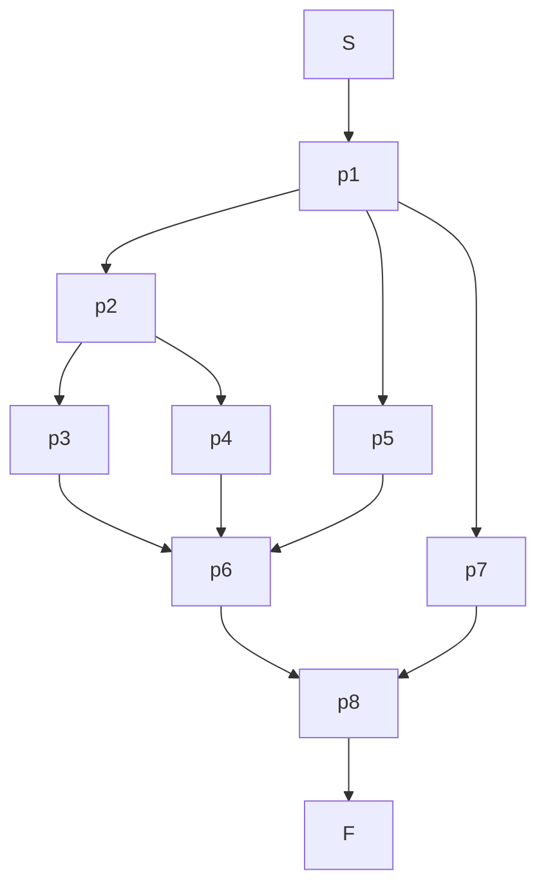
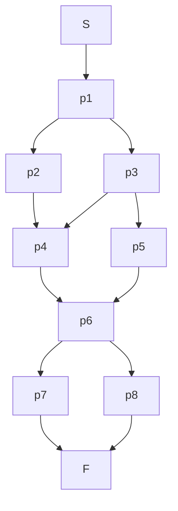

## 1. 经典的IPC（进程间通信）问题

在多道程序环境下，多个进程并发执行，它们之间或多或少会存在一些依赖关系。为了协调这些进程的执行，确保程序的正确性，我们需要一套机制来让它们进行通信和同步，这就是所谓的IPC（Inter-Process Communication）。本讲聚焦于几种经典的同步问题，并要求使用信号量（Semaphore）的P、V操作或管程（Monitor）来解决。

**解题要求**:
1.  **分析问题的关键点**: 仔细分析问题中存在的同步和互斥关系。哪些是进程间的协同关系（一个进程需要等待另一个进程完成某项操作）？哪些是资源访问的互斥关系（同一时间只允许一个进程访问某个资源）？
2.  **给出问题的解法**: 使用伪代码或具体的代码（如C++、Java）来描述你的解决方案。
3.  **对解法进行说明**: 详细解释你的设计思路，特别是信号量的初值是如何设置的，以及每个P、V操作的含义和作用。

我们主要关注以下几个问题：另类PV操作问题、食品供应问题、三峡大坝问题、狒狒过峡谷问题、睡眠理发师问题，以及一个资源管理问题。

### 1.1 纯同步问题

纯同步问题是指进程之间仅仅存在执行顺序上的依赖关系，而没有互斥访问共享资源的需求。这种依赖关系通常可以用前驱图（Precedence Graph）来描述。

#### 1.1.1 例子：前驱图

下面是两个前驱图的例子，箭头代表了进程（或代码段）执行的先后顺序。例如，从 S 指向 p1 的箭头表示 p1 必须在 S 完成后才能开始。

**图1：串并联前驱图 (Series/parallel)**



**图2：通用前驱图 (General precedence)**


**解法思路**:
解决这类问题的通用方法是，为每一个前驱关系（图中的每一条边）设置一个信号量。

1.  **信号量设置**: 对于从进程 $P_i$ 指向 $P_j$ 的每一条边，都设置一个初始值为0的信号量 $S_{ij}$。
2.  **进程 $P_i$**: 在 $P_i$ 执行完毕后，对所有从 $P_i$ 发出的边所对应的信号量执行 `V` 操作。例如，如果 $P_i$ 是 $P_j$ 和 $P_k$ 的前驱，则 $P_i$ 结尾处需要执行 $V(S_{ij})$ 和 $V(S_{ik})$。
3.  **进程 $P_j$**: 在 $P_j$ 开始执行前，对所有指向 $P_j$ 的边所对应的信号量执行 `P` 操作。例如，如果 $P_j$ 的前驱是 $P_i$ 和 $P_k$，则 $P_j$ 开始处需要执行 $P(S_{ij})$ 和 $P(S_{kj})$。

通过这种方式，可以保证图中所定义的所有前驱关系都能得到满足。

### 1.2 另类P、V操作问题

#### 1.2.1 问题描述
有一个系统，对P、V操作的定义如下：

* **P(s)**:
    ```
    s.count --;
    if (s.count < 0) {
        将本进程插入相应队列末尾等待;
    }
    ```
* **V(s)**:
    ```
    s.count ++;
    if (s.count <= 0) {
        从相应等待队列队尾唤醒一个进程, 将其插入就绪队列;
    }
    ```

**思考并回答**:
a. 这样定义P、V操作是否有问题？
b. 用这样的P、V操作实现N个进程竞争使用某一共享变量的互斥机制。
c. 对于b的解法，有无效率更高的方法。如有，试问降低了多少复杂性？

#### 1.2.2 问题解答

**a. 这样定义P、V操作是否有问题？**

**答**: 有问题。关键在于`V(s)`操作。标准的`V`操作在唤醒进程时，是从等待队列的**队头**唤醒一个进程，这遵循了"先来先服务"（FCFS）的原则，可以保证等待的公平性，避免某些进程饥饿（长时间得不到执行）。而题目中定义的`V`操作是从**队尾**唤醒进程，这是一种"后来先服务"（LIFS）的策略。这会导致等待时间最长的进程可能一直得不到唤醒，从而产生**饥饿**现象。因此，这种定义是不公平的，在实际系统中可能会导致严重问题。

**b. 用这样的P、V操作实现N个进程竞争共享变量的互斥**

**答**: 尽管存在公平性问题，但我们仍然可以用它来实现互斥。实现互斥的经典方法是使用一个初值为1的信号量。

```c
// 信号量定义
semaphore mutex;
mutex.count = 1;

// N个进程的执行代码
Process_i() {
    while(true) {
        P(mutex);
        // --- 临界区开始 ---
        // 访问共享变量
        // --- 临界区结束 ---
        V(mutex);

        // 非临界区代码
    }
}
```

**工作原理分析**:
1.  `mutex` 信号量的初值为1，表示允许一个进程进入临界区。
2.  第一个进程调用 `P(mutex)`，`mutex.count` 变为0，进程进入临界区。
3.  此时若有第二个进程调用 `P(mutex)`，`mutex.count` 变为-1，该进程被阻塞，并加入等待队列。之后再来的进程也同样被阻塞。
4.  第一个进程完成临界区操作后，调用 `V(mutex)`，`mutex.count` 变为0 (`-1+1=0`)。因为 `mutex.count <= 0`，所以会从等待队列的队尾唤醒一个进程。
5.  被唤醒的进程进入临界区，其他进程继续等待。这样就保证了任意时刻只有一个进程在临界区内，实现了互斥。

**c. 效率和复杂性分析**

**答**: 这里的"效率"可以从两个角度理解：一是算法的执行效率，二是系统的公平性。

1.  **执行效率**: 对于单个P或V操作来说，无论是从队头还是队尾操作，其时间复杂度通常都是 $O(1)$。所以单次操作的执行效率没有太大差别。

2.  **公平性与系统整体效率**: 标准的队头唤醒（FIFO）方式，其公平性好。而题目中的队尾唤醒（LIFO）方式，公平性差，可能导致饥饿。从系统整体来看，饥饿现象会降低系统的效率和响应性。

**是否有更高效率的方法？**
如果指的是解决互斥问题的效率，使用信号量本身就是一种非常高效的方法。关键在于`V`操作的实现。标准的、从队头唤醒进程的`V`操作是更优的实现，因为它保证了公平性。所以，**"更高效率"的方法就是使用标准定义的V操作**。

**降低了多少复杂性？**
从实现上讲，将队尾唤醒改为队头唤醒，并没有增加或降低算法本身的实现复杂性。但是，它**降低了系统行为的复杂性**。使用标准的FIFO策略，我们更容易预测和分析系统的行为，可以保证进程的等待时间是有限的，从而避免了饥饿这个复杂且难以处理的问题。可以说，它通过保证公平性，大大降低了系统出现异常行为的风险。

### 1.3 食品供货问题

#### 1.3.1 问题描述
某商店有两种食品A和B，最大容量各为 `m` 个。商店将A、B两种食品搭配出售（每次各取一个）。为保证新鲜，遵循“先到食品先出售”原则。有两个食品公司分别不断地供应A和B。为保证正常销售，当某种食品的数量比另一种的数量超过 `k` ($k < m$) 个时，暂停对数量大的食品进货。试用P、V操作解决同步和互斥关系。

#### 1.3.2 问题解答

**1. 关系分析**
* **互斥关系**: 商店的库存（食品A和B的数量）是共享变量，所有进程（供应A、供应B、销售）在修改库存数量时都必须互斥。我们可以用一个信号量 `mutex` 来实现。
* **同步关系**:
    * **销售员**: 必须等到商店里同时有食品A和食品B时才能进行销售。
    * **供应A**: 当A的数量已满(`m`个)时，或当A比B多`k`个时，需要暂停供应。
    * **供应B**: 当B的数量已满(`m`个)时，或当B比A多`k`个时，需要暂停供应。

**2. 信号量设置**
* `mutex`: 互斥信号量，保护对库存数量的访问，初值为 1。
* `emptyA`, `emptyB`: 表示A和B的空闲货架数，初值均为 `m`。用于控制库存上限。
* `foodA`, `foodB`: 表示已有的A和B食品数量，初值均为 0。用于销售员判断是否可以销售。
* `limitA`: 控制“A比B数量多k个”的限制。当A比B多`k`个时，A的供应者需要等待。可以看作是A相对于B的“空闲容量”。初值为 `k`。
* `limitB`: 控制“B比A数量多k个”的限制。同理，初值为 `k`。

**3. 伪代码实现**

```c
// 共享变量
int countA = 0, countB = 0; // 食品数量

// 信号量
semaphore mutex = 1;
semaphore emptyA = m, emptyB = m;
semaphore foodA = 0, foodB = 0;
semaphore limitA = k, limitB = k; // A比B，B比A的富余量

// 供应A进程
ProviderA() {
    while(true) {
        P(emptyA);       // 是否还有空货架放A?
        P(limitB);       // B比A的数量是否已经多了k个？
                         // P(limitB)意味着消耗一个B对A的富余名额
        P(mutex);
        // 生产一个A并放入
        countA++;
        V(mutex);

        V(limitA);       // 增加一个A对B的富余名额
        V(foodA);        // 增加一个食品A
    }
}

// 供应B进程
ProviderB() {
    while(true) {
        P(emptyB);       // 是否还有空货架放B?
        P(limitA);       // A比B的数量是否已经多了k个？
                         // P(limitA)意味着消耗一个A对B的富余名额
        P(mutex);
        // 生产一个B并放入
        countB++;
        V(mutex);

        V(limitB);       // 增加一个B对A的富余名额
        V(foodB);        // 增加一个食品B
    }
}

// 销售员进程
Seller() {
    while(true) {
        P(foodA);        // 是否有食品A?
        P(foodB);        // 是否有食品B?
        
        // 此处两个P操作的顺序是关键。
        // 如果 Seller 在 P(foodA) 后被中断, 此时 ProviderA 因为 P(limitA) 而阻塞
        // ProviderB 仍可继续，但若B比A多了k个，则ProviderB也会阻塞。
        // 此时Seller再P(foodB)也会阻塞，可能死锁。
        // 一个改进是销售员也需要持有锁来修改两个limit信号量。
        // 让我们看一个更健壮的实现：

        // ---- 销售员（改进版）----
        // P(foodA);
        // P(foodB);
        // P(mutex);
        // // 取走A和B
        // countA--;
        // countB--;
        // V(mutex);
        // V(emptyA);
        // V(emptyB);

        // 上面的朴素方法没有处理limit信号量，会导致limit信号量只增不减。
        // 正确的做法是销售员也需要调整limit
        
        P(foodA);
        P(foodB);

        P(mutex);
        // 取走A和B
        countA--;
        countB--;
        V(mutex);

        V(emptyA);
        V(emptyB);
        
        // 关键一步：取走A相当于增加了B对A的富余量
        V(limitB);
        // 取走B相当于增加了A对B的富余量
        V(limitA);
    }
}
```
**说明**:
* `ProviderA` 在放入食品A前，检查A的货架（`P(emptyA)`）和数量限制（`P(limitB)`）。放入后，通知有新的A可用（`V(foodA)`），并更新数量限制（`V(limitA)`）。
* `ProviderB` 同理。
* `Seller` 在取货前，检查A和B是否都可用（`P(foodA)` 和 `P(foodB)`）。取货后，通知货架空出（`V(emptyA)` 和 `V(emptyB)`），并更新两种食品间的数量限制（`V(limitA)` 和 `V(limitB)`）。这样就形成了一个完整的闭环。

### 1.4 三峡大坝船闸调度问题

#### 1.4.1 问题描述
三峡大坝有五级船闸 $T_1 \sim T_5$。上游船只依次通过 $T_1 \to T_2 \to T_3 \to T_4 \to T_5$ 到达下游，下游船只依次通过 $T_5 \to T_4 \to T_3 \to T_2 \to T_1$ 到达上游。假设船闸为单向通行，即在同一时间段内，所有五级船闸要么都给上游船只使用，要么都给下游船只使用。试用P、V操作解决该调度问题。

#### 1.4.2 问题解答

**1. 关系分析**
* **互斥关系**:
    1.  **船闸互斥**: 每一级船闸（$T_1$ 到 $T_5$）在同一时刻只能被一艘船使用。
    2.  **方向互斥**: 整个船闸系统在同一时间只能有一个通行方向。这是一个典型的“读者-写者问题”的变体。我们可以将上行和下行的船队看作两类“读者”，但这两类“读者”是互斥的。

**2. 信号量设置**
* `gate[5]`: 一个信号量数组，`gate[i]` 代表第 $i+1$ 级船闸，初值均为 1，用于保证每级船闸的互斥使用。
* `up_mutex`, `down_mutex`: 两个互斥信号量，初值为 1，用于保护上行船只计数器 `up_count` 和下行船只计数器 `down_count`。
* `up_count`, `down_count`: 两个整型变量，初值为 0，记录正在船闸系统中航行的上行和下行船只数量。
* `direction_mutex`: 关键的“方向”信号量，初值为 1。用于保证同一时间只有一个方向的船只可以通过。第一个进入系统的船（无论是上行还是下行）将持有这个信号量，最后一个离开系统的船将释放它。

**3. 伪代码实现**

```c
// 信号量和计数器
semaphore gate[5] = {1, 1, 1, 1, 1}; // 5个船闸
semaphore up_mutex = 1, down_mutex = 1;
semaphore direction_mutex = 1;
int up_count = 0, down_count = 0;

// 上行船只进程 (下游 -> 上游: T5 -> T1)
Upward_Ship() {
    // ---- 进入船闸系统 ----
    P(up_mutex);
    if (up_count == 0) { // 如果是第一艘上行船
        P(direction_mutex); // 尝试获取航行方向控制权
    }
    up_count++;
    V(up_mutex);

    // ---- 依次通过船闸 ----
    P(gate[4]); // 过 T5
    // 正在过 T5 ...
    V(gate[4]);

    P(gate[3]); // 过 T4
    // 正在过 T4 ...
    V(gate[3]);

    P(gate[2]); // 过 T3
    // 正在过 T3 ...
    V(gate[2]);

    P(gate[1]); // 过 T2
    // 正在过 T2 ...
    V(gate[1]);

    P(gate[0]); // 过 T1
    // 正在过 T1 ...
    V(gate[0]);

    // ---- 离开船闸系统 ----
    P(up_mutex);
    up_count--;
    if (up_count == 0) { // 如果是最后一艘上行船
        V(direction_mutex); // 释放航行方向控制权
    }
    V(up_mutex);
}

// 下行船只进程 (上游 -> 下游: T1 -> T5)
Downward_Ship() {
    // ---- 进入船闸系统 ----
    P(down_mutex);
    if (down_count == 0) { // 如果是第一艘下行船
        P(direction_mutex); // 尝试获取航行方向控制权
    }
    down_count++;
    V(down_mutex);

    // ---- 依次通过船闸 ----
    P(gate[0]); // 过 T1
    // 正在过 T1 ...
    V(gate[0]);
    
    P(gate[1]); // 过 T2
    // 正在过 T2 ...
    V(gate[1]);

    P(gate[2]); // 过 T3
    // 正在过 T3 ...
    V(gate[2]);

    P(gate[3]); // 过 T4
    // 正在过 T4 ...
    V(gate[3]);

    P(gate[4]); // 过 T5
    // 正在过 T5 ...
    V(gate[4]);

    // ---- 离开船闸系统 ----
    P(down_mutex);
    down_count--;
    if (down_count == 0) { // 如果是最后一艘下行船
        V(direction_mutex); // 释放航行方向控制权
    }
    V(down_mutex);
}
```

**说明**:
* `gate[i]` 保证了每个船闸的互斥使用。
* `direction_mutex` 是解决问题的核心。当一个方向（例如上行）的第一艘船到达时，它会执行 `P(direction_mutex)`，从而锁定了航行方向。在此期间，任何试图从相反方向（下行）进入的第一艘船都会因为 `P(direction_mutex)` 而被阻塞。
* 只有当该方向的所有船只都通过并离开后（`up_count` 减为 0），最后一艘船才会执行 `V(direction_mutex)`，从而允许相反方向的船只开始通行。这完美地实现了“单向通行”的要求。

### 1.5 狒狒过峡谷问题

这个问题实际上是“读者-写者问题”的一个非常形象的变体。

#### 1.5.1 问题一：避免死锁
**描述**:
一根绳索横跨峡谷，狒狒可以沿绳索过峡谷。只要方向相同，可以有多只狒狒同时在绳索上。但如果不同方向的狒狒同时上绳，就会在中间相遇，产生死锁。编写一个避免死锁的程序。不要求考虑饥饿问题。

**解答**:
这个问题和三峡大坝问题非常相似。我们可以把向东的狒狒看作一类“读者”，向西的狒狒看作另一类“读者”，这两类读者是互斥的。

**1. 信号量设置**
* `mutex`: 互斥信号量，保护对东行和西行计数器的访问，初值为 1。
* `east_count`, `west_count`: 计数器，记录正在绳索上向东和向西的狒狒数量，初值为 0。
* `rope`: 代表绳索使用权的信号量，初值为 1。第一个要上绳的狒狒群体（无论是东行还是西行）获取它，最后一个离开的狒狒释放它。

**2. 伪代码实现**

```c
// 信号量和计数器
semaphore mutex = 1;
semaphore rope = 1;
int east_count = 0, west_count = 0; // 可以合并为一个方向计数器和一个方向变量

// 向东走的狒狒
Eastward_Baboon() {
    P(mutex);
    if (east_count == 0) { // 如果是第一只向东的狒狒
        P(rope);           // 尝试获取绳索
    }
    east_count++;
    V(mutex);

    // --- 过峡谷 ---
    // crossing the rope...
    // --- 过完峡谷 ---

    P(mutex);
    east_count--;
    if (east_count == 0) { // 如果是最后一只向东的狒狒
        V(rope);           // 释放绳索
    }
    V(mutex);
}

// 向西走的狒狒
Westward_Baboon() {
    P(mutex);
    // 这里我们用 west_count 来实现，逻辑完全对称
    if (west_count == 0) { // 如果是第一只向西的狒狒
        P(rope);           // 尝试获取绳索
    }
    west_count++;
    V(mutex);

    // --- 过峡谷 ---
    // crossing the rope...
    // --- 过完峡谷 ---

    P(mutex);
    west_count--;
    if (west_count == 0) { // 如果是最后一只向西的狒狒
        V(rope);           // 释放绳索
    }
    V(mutex);
}
```
**说明**:
这个解法是“读者优先”的变体。例如，如果有一批狒狒正在向东走，`rope` 信号量被持有。此时，任何想向西走的狒狒都会在 `P(rope)` 处被阻塞。而新来的向东的狒狒则可以不受阻碍地直接上绳。这可能导致西行的狒狒饥饿。

#### 1.5.2 问题二：避免饥饿
**描述**:
在问题一的基础上，避免饥饿。当一只想向东的狒狒发现有狒狒正在向西走时，它会等待。但在至少有一只狒狒向东走过之后，才能允许新的西行狒狒上绳。

**解答**:
要避免饥饿，就不能让一个方向的狒狒无限制地持续通过。我们需要增加一个“门卫”或“信号灯”的角色，来控制准入。

**1. 信号量设置**
* 保留 `mutex`, `east_count`, `west_count`, `rope`。
* `turnstile`: 一个“旋转门”或“闸机”信号量，初值为 1。它确保在两个方向之间公平地切换，防止一个方向持续霸占绳索。

**2. 伪代码实现**

```c
// 信号量和计数器 - 与之前相同
semaphore mutex = 1, rope = 1, turnstile = 1;
int east_count = 0, west_count = 0;

// 向东走的狒狒
Eastward_Baboon() {
    P(turnstile); // 在上绳之前，先通过闸机
    P(rope);      // 获取绳索的独占方向权
    V(turnstile); // 通过后立即释放闸机，允许其他人排队

    P(mutex);
    east_count++;
    V(mutex);

    // --- 过峡谷 ---
    // crossing the rope...
    // --- 过完峡谷 ---

    P(mutex);
    east_count--;
    if (east_count == 0) { // 如果是最后一只
        V(rope);           // 释放绳索方向权
    }
    V(mutex);
}

// 向西走的狒狒（对称实现）
Westward_Baboon() {
    P(turnstile); // 在上绳之前，先通过闸机
    P(rope);      // 获取绳索的独占方向权
    V(turnstile); // 通过后立即释放闸机，允许其他人排队

    P(mutex);
    west_count++;
    V(mutex);

    // --- 过峡谷 ---
    // crossing the rope...
    // --- 过完峡谷 ---

    P(mutex);
    west_count--;
    if (west_count == 0) { // 如果是最后一只
        V(rope);           // 释放绳索方向权
    }
    V(mutex);
}
```
**说明**:
这个解法存在一个严重问题。`P(rope)` 被 `P(turnstile)` 包围，但 `V(rope)` 却在很后面。如果一只东行狒狒通过了 `turnstile` 和 `rope`，然后第二只东行狒狒过来，它会卡在 `P(rope)`。此时如果西行狒狒过来，它会卡在 `P(turnstile)`。这会产生死锁。

**正确的防饥饿解法**:
正确的思路是，只允许等待的狒狒进入，而不是新来的狒狒。当一个方向的狒狒过完后，它应该优先唤醒等待的反向狒狒，而不是同向的新来狒狒。这与“写者优先”的读者-写者问题类似。

让我们重新设计，引入一个“看门人”信号量 `gate`。

```c
// 信号量和计数器
semaphore east_mutex = 1, west_mutex = 1; // 保护各自计数器的锁
semaphore gate = 1; // 控制进入的大门，保证公平
int east_count = 0, west_count = 0;

// 向东走的狒狒
Eastward_Baboon() {
    P(gate); // 尝试进入通道
    P(east_mutex);
    east_count++;
    if (east_count == 1) { // 第一只东行狒狒
        // 此处需要一个机制锁住西行方向
        // 这个问题实际上需要更复杂的读者写者模型
    }
    V(east_mutex);
    V(gate); // 允许其他狒狒排队进入

    // crossing...

    P(east_mutex);
    east_count--;
    if (east_count == 0) { // 最后一只东行狒狒
        // 解锁西行方向
    }
    V(east_mutex);
}
```
这个问题最经典的解法是使用一个更高层次的锁。一个简单的“闸机” `gate` 可以解决饥饿问题。当有狒狒在绳索上时，新来的反方向狒狒在 `gate` 处等待。当绳索变空时，第一个通过 `gate` 的狒狒（无论哪个方向）决定了下一个通行方向。

**更公平的解法（带闸机的读者优先变体）**:

```c
semaphore mutex = 1;     // 保护计数器
semaphore rope_access = 1; // 控制方向的锁
semaphore turnstile = 1; // 闸机，用于防止饥饿

int east_count = 0;
// west_count同理，这里只展示一个方向

Eastward_Baboon() {
    P(turnstile); // 在尝试获取绳索前，先过闸机
    V(turnstile); // 立刻释放，让其他人也能排队
    
    P(mutex);
    if (east_count == 0) {
        P(rope_access); // 第一个来的，锁住方向
    }
    east_count++;
    V(mutex);

    // ... crossing ...

    P(mutex);
    east_count--;
    if (east_count == 0) {
        V(rope_access); // 最后一个走的，释放方向
    }
    V(mutex);
}
```
这个解法的问题在于，如果东行狒狒持续不断地到达，它们会持续通过 `turnstile` 并保持 `east_count > 0`，西行狒狒将一直无法获得 `rope_access`，饥饿问题依然存在。

**最终的公平解法**:
需要一个信号量来显式地传递“轮到你了”的信号。

```c
// (此解法比课程要求的要复杂，但能真正解决饥饿)
int read_count = 0, write_count = 0; // 把east/west看作read/write
semaphore mutex1 = 1, mutex2 = 1, mutex3 = 1;
semaphore r = 1, w = 1; // r是读锁，w是写锁

// East (Reader)
P(mutex3);
P(r);
P(mutex1);
read_count++;
if (read_count == 1) P(w); // 第一个读者锁住写者
V(mutex1);
V(r);
V(mutex3);

// ... crossing ...

P(mutex1);
read_count--;
if (read_count == 0) V(w); // 最后一个读者释放写者
V(mutex1);

// West (Writer-like, but symmetrical)
P(mutex2);
write_count++;
if (write_count == 1) P(r); // 第一个“写者”锁住读者
V(mutex2);

P(w); // 获取写锁
// ... crossing ...
V(w);

P(mutex2);
write_count--;
if (write_count == 0) V(r); // 最后一个“写者”释放读者
V(mutex2);
```
这个解法模拟了写者优先的读者-写者问题，通过 `mutex3` 和 `r` 的嵌套来给读者排队，避免了饥饿。

### 1.6 睡眠理发师问题

#### 1.6.1 问题描述
理发店有一位理发师、一把理发椅和N把供顾客等候的椅子。
* 如果没有顾客，理发师就在理发椅上睡觉。
* 当一个顾客到来时，他必须唤醒理发师。
* 如果理发师正在理发，新来的顾客会看是否有空椅子。如果有，就坐下等待；如果没有，就离开。

#### 1.6.2 问题解答

**1. 关系分析**
这是一个典型的生产者-消费者模型。顾客是“生产者”（生产理发请求），理发师是“消费者”（消费理发请求）。
* **同步关系**:
    * 理发师需要等待顾客的到来才能开始工作。
    * 顾客需要等待理发师空闲才能理发。
* **互斥关系**: 对等候椅数量 `waiting_chairs` 的修改需要互斥。

**2. 信号量设置**
* `customers`: 信号量，表示等待理发的顾客数量。理发师通过 `P(customers)` 来检查是否有顾客，如果没有就会睡眠。初值为 0。
* `barbers`: 信号量，表示空闲的理发师数量。顾客通过 `P(barbers)` 来等待理发师空闲。初值为 0 (或 1，取决于初始状态理发师是否在睡觉)。我们设为0，表示初始没有空闲理发师，需要顾客唤醒。
* `mutex`: 互斥信号量，用于保护对 `waiting_chairs` 计数器的访问，初值为 1。
* `waiting_chairs`: 一个整型变量，记录可用的等候椅数量，初值为 N。

**3. 伪代码实现**

```c
// 常量和变量
#define N 5 // 假设有5把椅子
int waiting_chairs = N;

// 信号量
semaphore customers = 0; // 等待的顾客数
semaphore barbers = 0;   // 空闲的理发师数
semaphore mutex = 1;     // 保护 waiting_chairs

// 理发师进程
Barber() {
    while(true) {
        P(customers); // 等待顾客到来。如果没有顾客，则在此睡眠。

        P(mutex);
        waiting_chairs++; // 一个顾客从等待区坐到理发椅上，空出一把椅子
        V(barbers);   // 通知顾客，我已经准备好了
        V(mutex);

        // --- 理发进行中 ---
        // cut_hair();
        // --- 理发结束 ---
    }
}

// 顾客进程
Customer() {
    P(mutex);
    if (waiting_chairs > 0) {
        waiting_chairs--; // 坐下一把椅子
        V(customers);     // 通知理发师，我来了
        V(mutex);         // 释放锁

        P(barbers);       // 等待理发师准备好（即轮到自己）
        // --- 正在理发 ---
        // get_haircut();
    } else {
        // 没有空椅子了
        V(mutex); // 必须释放锁再离开
        // --- 顾客离开 ---
        // leave_shop();
    }
}
```

#### 1.6.3 思考：N个理发师的解决方案

如果理发店有 M 个理发师，如何修改？

**解答**:
非常简单，只需要将代表理发师资源的信号量 `barbers` 的初值从 1（如果初始有一个空闲理发师）或 0 改为 M 即可。

* **`barbers`**: 信号量，表示空闲理发师的数量。初值设为 M。

顾客进程不需要改变。理发师进程的逻辑也基本相同。

**伪代码 (M个理发师)**:
```c
#define N 5 // 等候椅数量
#define M 3 // 理发师数量

int waiting_chairs = N;
semaphore customers = 0;
semaphore barbers = M; // M个空闲理发师资源
semaphore mutex = 1;

// 理发师进程（M个实例在运行）
Barber() {
    while(true) {
        P(customers); // 等待顾客

        // 注意：这里不再需要理发师去V(barbers)
        // 因为顾客直接消费barbers资源
        // barber和customer的交互通过customers和另一个信号量完成
        
        // 让我们重新思考这个模型
        // 顾客需要被某个特定理发师服务
        // 这是一个更复杂的匹配问题
    }
}
```

**正确的 M 理发师模型**:
将理发师看作是消费者，顾客是生产者。`customers` 仍然是等待的顾客数。`barbers` 现在代表 **等待工作** 的理发师。

* `customers`: 等待理发的顾客。初值 0。
* `barbers`: 等待顾客的理发师。初值 0。
* `mutex`: 保护 `waiting` 计数器。初值 1。
* `waiting`: 等候区坐着的顾客数。初值 0。

```c
#define CHAIRS 5

int waiting = 0;
semaphore customers = 0;
semaphore barbers = 0;
semaphore mutex = 1;

Barber() {
    while(true) {
        P(customers); // 等待顾客。如果没有，则在此睡眠
        P(mutex);
        waiting--;   // 一个顾客被叫去理发
        V(barbers);  // 我（理发师）现在空闲出来，准备为下一个顾客服务
        V(mutex);
        // cut_hair()
    }
}

Customer() {
    P(mutex);
    if (waiting < CHAIRS) {
        waiting++;
        V(customers); // 通知理发师有顾客在等
        V(mutex);
        P(barbers);   // 等待有理发师空闲来叫我
        // get_haircut()
    } else {
        V(mutex);
        // leave
    }
}
```
这个版本才是 M 个理发师和 N 个椅子的标准解法。`barbers` 信号量现在代表一个“服务已就绪”的信号，而不是代表理发师资源本身。M 个理发师进程都可以运行这段代码，通过 `P(customers)` 竞争顾客。

### 1.7 第二类读者写者问题（写者优先）

#### 1.7.1 问题描述
要求：
a. 多个读者可以同时进行读。
b. 写者必须互斥（一次只有一个写者，且读写不能同时）。
c. 写者优先于读者（一旦有写者在等待，后续到达的读者必须等待，直到所有等待的写者都完成后才能读）。

#### 1.7.2 问题解答

**1. 关系分析**
写者优先的核心在于：当一个写者希望写入时，它应该尽快获得访问权，甚至要插队到已经在等待的读者前面。

**2. 信号量设置**
* `read_count`, `write_count`: 读者和写者的计数器，初值为 0。
* `mutex_r`, `mutex_w`: 分别保护 `read_count` 和 `write_count` 的互斥锁，初值为 1。
* `r_gate`: 一个“读者大门”信号量。当有写者在等待时，此门关闭，阻止新读者进入。初值为 1。
* `w_resource`: 代表共享资源的“写者锁”，也用于实现读者和写者的互斥。初值为 1。

**3. 伪代码实现**

```c
int read_count = 0, write_count = 0;
semaphore mutex_r = 1, mutex_w = 1; // 保护计数器的锁
semaphore r_gate = 1;               // 读者进入的大门
semaphore w_resource = 1;           // 资源本身的锁，也是写者锁

// 读者进程
Reader() {
    P(r_gate);        // 尝试通过读者大门
    P(mutex_r);
    read_count++;
    if (read_count == 1) { // 如果是第一个读者
        P(w_resource); // 锁住资源，阻止写者
    }
    V(mutex_r);
    V(r_gate);        // 通过后，立刻让其他读者也通过大门

    // --- 读操作 ---
    // reading...
    
    P(mutex_r);
    read_count--;
    if (read_count == 0) { // 如果是最后一个读者
        V(w_resource); // 释放资源，允许写者进入
    }
    V(mutex_r);
}

// 写者进程
Writer() {
    P(mutex_w);
    write_count++;
    if (write_count == 1) { // 如果是第一个写者
        P(r_gate);        // 关上读者大门，阻止新读者进入
    }
    V(mutex_w);

    P(w_resource);      // 获取资源的独占访问权（写者锁）
    
    // --- 写操作 ---
    // writing...

    V(w_resource);      // 释放资源

    P(mutex_w);
    write_count--;
    if (write_count == 0) { // 如果是最后一个写者
        V(r_gate);        // 打开读者大门，允许读者进入
    }
    V(mutex_w);
}
```

**说明**:
* **写者如何优先**: 当第一个写者到达时 (`write_count` 变为 1)，它会立即 `P(r_gate)`。这会导致所有后续到来的读者全部被阻塞在 `P(r_gate)` 处。它们甚至没有机会去修改 `read_count` 或尝试获取 `w_resource`。
* **写者执行**: 写者进程会继续执行 `P(w_resource)`。如果当前有读者正在读，它会等待这些读者全部结束（最后一个读者会 `V(w_resource)`)。一旦 `w_resource` 被释放，等待的写者就能立刻获得它，开始写入。
* **写者离开**: 当最后一个等待的写者完成工作后 (`write_count` 变为 0)，它会 `V(r_gate)`，把读者大门打开，此时在门外等候的读者们才能进入。

这种机制确保了只要有写者在等待，就不会有新的读者开始读取，体现了写者优先。

### 1.8 利用信号量管理共享资源

这是一个复杂的问题，通过分析一个有问题的代码，逐步引出两种经典的并发编程模式。

#### 1.8.1 问题描述
一个共享资源有如下特性：
1.  当使用者少于3个时，新进程可以立刻获得资源。
2.  当3个资源都被占用后，新进程必须等待。直到**当前使用资源的3个进程都释放完资源**后，其他等待的进程才能获得资源（一批一批地进入）。

#### 1.8.2 初始的错误程序分析

**程序代码 (简化版)**:
```c
// 申请资源
P(mutex);
if (must_wait) { // must_wait is (active == 3)
    waiting++;
    V(mutex);
    P(block);
    P(mutex); // 再次获取锁，修改waiting
    waiting--;
}
active++;
must_wait = (active == 3);
V(mutex);

// 释放资源
P(mutex);
active--;
if (active == 0) {
    int n = min(waiting, 3);
    for (i=0; i<n; i++) V(block);
    must_wait = false;
}
V(mutex);
```

**a. 解释其出错的位置**

**答**: 错误发生在被 `P(block)` 唤醒之后。
1.  假设进程$P_4$, $P_5$, $P_6$... 都在 `P(block)` 处等待。
2.  当 `active` 变为 0 时，最后一个离开的进程（比如$P_3$）会执行 `V(block)` 三次，唤醒 $P_4$, $P_5$, $P_6$。
3.  这三个进程被唤醒后，会**依次**尝试获取 `mutex`。
4.  假设 $P_4$ 第一个获取 `mutex`。它执行 `waiting--`，然后 `active++` (此时 `active`=1)，`must_wait` 仍然是 `false`，然后释放 `mutex`。
5.  现在轮到 $P_5$。它获取 `mutex`，执行 `waiting--`，`active++` (此时 `active`=2)，`must_wait` 仍然是 `false`，释放 `mutex`。
6.  **问题来了**: 此时，如果一个**新进程** $P_{10}$ 到达，它执行申请资源的代码。它会发现 `must_wait` 是 `false`！于是它不会去 `P(block)` 等待，而是直接 `active++` (此时 `active`=3)，并将 `must_wait` 设置为 `true`。$P_{10}$“插队”成功了。
7.  之后，之前被唤醒的 $P_6$ 才能获取 `mutex`，它执行时 `active` 已经变成3，`must_wait` 已经为 `true`，但它还是会执行 `active++`，导致 `active` 变成4，这违反了最多3个进程使用的规则。

**根本原因**: 进程被唤醒后，它所处的“环境”（即 `must_wait` 的状态）可能已经被其他进程改变了。

**b. `if` 换成 `while` 是否解决问题？**

**答**: 将 `if(must_wait)` 换成 `while(must_wait)` **可以解决“插队”和 `active` 超出3的问题**，但会引入**新的问题**。

* **如何解决**: 如果P10插队并设置了 `must_wait = true`，那么当P6被唤醒并再次检查 `while(must_wait)` 条件时，它会发现条件成立，于是重新执行 `V(mutex)` 和 `P(block)`，再次进入等待状态。这避免了 `active > 3` 的情况。这种“**循环检查条件**”是并发编程的一个重要原则。

* **有什么难点仍然存在？**: **死锁**。
    在上面的场景中，$P_6$被唤醒后，发现条件不满足，又回去睡觉了。但是谁来唤醒它呢？最后一个离开者（$P_3$）已经完成了它的唤醒任务（`V(block)`了三次）。现在 `active` 是3 ($P_4$, $P_5$, $P_{10}$)，在它们全部离开之前，不会有新的 `V(block)` 操作。而 $P_6$ 却在 `P(block)` 上永久地等待下去。这就造成了**死锁**。

#### 1.8.3 正确解法一: "I'll Do It for You" 模式

**程序代码**:
```c
// 申请资源 (Acquire)
P(mutex);
if (must_wait) {
    waiting++;
    V(mutex);
    P(block); // 等待被别人处理
} else {
    active++;
    must_wait = (active == 3);
    V(mutex);
}

// 释放资源 (Release)
P(mutex);
active--;
if (active == 0) {
    int n = min(waiting, 3);
    waiting -= n;
    active = n;
    must_wait = (active == 3);
    while(n > 0) {
        V(block);
        n--;
    }
}
V(mutex);
```

**a. 解释工作方式和正确性**
这种模式被称为 "I'll Do It for You" (我来帮你做)。
* **核心思想**: 申请资源的进程如果需要等待，它什么都不做，只是排队 (`P(block)`)。唤醒它的进程（即释放资源的进程）会**替它完成**所有状态变量的修改。
* **工作流程**:
    1.  **申请**: 进程检查 `must_wait`。如果为 `true`，则 `waiting++` 然后就去 `P(block)` 睡觉。它**不自己**去 `active++`。
    2.  **释放**: 当最后一个使用者（`active`变为0）释放资源时，它扮演了“组织者”的角色。它查看有多少进程在等待 (`waiting`)，决定唤醒 `n` 个（最多3个）。**关键在于**：它在唤醒它们之前，就**预先**把 `active` 设置为 `n`，把 `waiting` 减去 `n`，并更新好 `must_wait` 状态。
    3.  **唤醒后**: 被唤醒的进程从 `P(block)` 返回后，**什么也不用做**，它已经被“记作”是 `active` 状态了，可以直接去使用资源。

**正确性**: 这种方法是正确的，因为所有状态变量的修改都在一个单一的临界区内（释放者的临界区）完成。这避免了多个被唤醒进程之间以及新来进程之间的竞争和状态不一致问题。

**b. 给出新进程插队的例子**
这个程序**不能完全避免**新进程插队。
* **场景**:
    1.  假设 `active=2`, `must_wait=false`, `waiting=0`。
    2.  进程 $P_{new}$ 到达，执行申请代码。它通过了 `if(must_wait)` 检查，即将执行 `active++`。
    3.  在 $P_{new}$ 执行 `active++` 之前，发生上下文切换。一个正在使用资源的进程 $P_{old}$ 执行释放代码。它将 `active` 减为 1。
    4.  此时，另一个等待了很久的进程 $P_{waiter}$ 正在 `P(block)` 等待（假设之前有等待队列）。
    5.  现在切换回 $P_{new}$。它继续执行，`active` 变成 2。它没有插在 $P_{waiter}$ 前面，因为 $P_{waiter}$ 的唤醒条件（`active==0`）还没满足。

**重新审视问题**: “这个程序不能完全避免新到达的进程插到已有等待进程前得到资源”。
* **场景**:
    1. `active=2`, `waiting=5`, `must_wait=true`。
    2. $P_1$, $P_2$ 正在使用资源。$P_3$-$P_7$ 在 `P(block)` 等待。
    3. $P_1$ 释放资源, `active` 变为 1。`must_wait` 仍然是 `true`。
    4. 此时，一个新进程 $P_8$ 到达。它执行申请代码，看到 `must_wait` 为 `true`，于是 `waiting++` (变为6)，然后去 `P(block)` 等待。
    5. $P_2$ 释放资源, `active` 变为 0。它看到 `waiting=6`，于是唤醒3个进程（$P_3$,$P_4$,$P_5$）。它将 `active` 设为 3，`waiting` 设为 3，`must_wait` 设
    6. 现在 $P_3$, $P_4$, $P_5$ 在使用资源。$P_6$, $P_7$, $P_8$ 在等待。
    7. **此时，如果一个新进程 $P_9$ 到达，它会发现 `must_wait` 是 `false` 吗？** 不会，因为 `must_wait` 已经被设为 `true`。

**真正的插队机会**:
插队发生于**信号量本身**的等待队列和我们自己维护的 `waiting` 计数器之间。
1. `active=2`, `must_wait=false`。
2. 进程 $P_{waiter}$ 到达，执行 `P(mutex)`。
3. 切换到新进程 $P_{new}$，它也执行 `P(mutex)`，于是被阻塞在 `mutex` 的等待队列里。
4. 切换回 $P_{waiter}$。它执行 `active++` 使 `active=3`，设置 `must_wait=true`，然后 `V(mutex)`。
5. `V(mutex)` 唤醒了 $P_{new}$。$P_{new}$ 看到 `must_wait=true`，于是去 `P(block)` 等待。
在这个场景里，先到达的 $P_{waiter}$ 获得了资源。

这个模式下的插队问题非常微妙，通常与“Thundering Herd Problem”有关，即多个进程被唤醒去竞争同一个锁。这里的模型简化了这个问题。它的主要优点是逻辑清晰，由一个进程负责管理状态。

**c. 解释 "I'll Do It for You" 模式**
该模式的核心是，当一个进程需要等待某个条件满足时，它不主动在唤醒后重新检查条件或修改状态。它仅仅是作为一个被动的等待者。而负责满足这个条件的进程（通常是释放资源的进程），会主动地、代替那些等待者完成所有的状态转换。就像一个秘书，把所有事情都安排好了，然后通知老板们：“你们现在可以开始工作了”，老板们（被唤醒的进程）无需再关心任何准备工作。

#### 1.8.4 正确解法二: "Pass the Baton" 模式

**程序代码**:
```c
// 申请资源 (Acquire)
P(mutex);
if (must_wait) {
    waiting++;
    V(mutex);
    P(block); // 等待接力棒
    // 唤醒后，我获得了mutex的所有权（接力棒）
    // 无需再次P(mutex)
}
active++;
must_wait = (active == 3);
if (waiting > 0 && !must_wait) {
    V(block); // 传递接力棒
} else {
    V(mutex); // 释放锁
}

// 释放资源 (Release)
P(mutex);
active--;
must_wait = false;
if (waiting > 0) {
    V(block); // 开始传递接力棒
} else {
    V(mutex); // 释放锁
}
```

**a. 解释工作方式和正确性**
该模式被称为 "Pass the Baton" (传递接力棒)。
* **核心思想**: 互斥锁 `mutex` 在被唤醒的进程间直接传递，就像接力赛中的“接力棒”。一个进程完成自己的临界区后，不直接释放锁给公众，而是直接将“锁的所有权”传递给下一个需要进入的、正在等待的进程。
* **工作流程**:
    1.  **申请**: 如果需要等待 (`must_wait` 为 `true`)，进程释放 `mutex` 并 `P(block)` 等待。
    2.  **释放/传递**: 当一个进程（无论是释放者还是刚进入的申请者）完成操作后，它会检查是否还有进程在等待 (`waiting > 0`) 并且进入条件满足 (`!must_wait`)。如果满足，它不执行 `V(mutex)`，而是执行 `V(block)`。
    3.  **接力棒传递**: `V(block)` 唤醒一个在 `P(block)` 处等待的进程。这个被唤醒的进程在返回时，**它就拥有了互斥锁 `mutex` 的所有权**，因为它没有通过 `P(mutex)` 来获得，而是由上一个进程“递给”它的。然后它继续执行临界区代码（`active++` 等）。
    4.  **最后一人**: 当最后一个需要被唤醒的进程完成操作后，它检查条件，发现不再需要唤醒别人了，于是它执行 `V(mutex)`，将锁“放回”架子上，供所有新来的进程竞争。

**正确性**: 这种方式保证了被唤醒的进程可以立即执行，无需再次竞争 `mutex`，从而避免了“唤醒后发现条件又变了”的问题。它形成了一个“唤醒链”，效率很高。

**b. 与上一解法在唤醒进程个数上的不同**
* **"I'll Do It for You"**: 是一次性唤醒一批进程。释放者在一个循环里执行 `V(block)` `n` 次，**同时**唤醒 `n` 个进程。这 `n` 个进程随后会并发执行。
* **"Pass the Baton"**: 是一次只唤醒一个进程。一个进程 `V(block)` 唤醒下一个，下一个再唤醒下下一个，形成一个**串行**的唤醒链。每次只有一个进程在临界区内活动。

**c. 解释 "Pass the Baton" 模式**
这个模式的精髓在于**将锁的所有权和唤醒信号绑定**。执行 `V(block)` 的进程不仅是在唤醒一个等待者，更是在对它说：“我把临界区的钥匙（mutex）现在直接交给你了，你继续”。这避免了被唤醒的进程再去和外面那些新来的进程一起竞争锁，保证了等待队列的公平性和执行的有序性，是一种非常高效和优雅的并发控制模式。
