## 1. 核心概念

我们首先要对死锁以及与它相关的几个概念有一个清晰的认识。

### 1.1 并发编程的问题

在复杂的并发程序（如数据库MySQL、Web服务器Apache等）中，开发者会遇到各种各样的缺陷。研究表明，这些缺陷主要分为两大类：死锁缺陷和非死锁缺陷（如原子性违背、顺序错误等）。其中，非死锁的缺陷占了绝大多数（约97%），但这并不意味着死锁不重要。一旦发生死锁，其后果往往是灾难性的，可能导致整个系统挂起。

### 1.2 死锁 (Deadlock)

#### 1.2.1 定义
我们来看两个定义：
1.  一个进程如果正在等待一个永远也不可能为真的条件，那么这个进程就陷入了死锁。
2.  在一组进程中，每个进程都在无限期地等待该组中另一个进程所占有的资源，因而永远无法获取到自己所需的资源，这种现象称为**进程死锁**。这组进程就称为**死锁进程**。

简单来说，就是两个或多个进程形成了一个"僵局"，比如进程A等着进程B手里的资源，而进程B又恰好在等进程A的资源，谁也不肯先放手，就这么永远地等下去了。

**关键结论**:
* 所有参与死锁的进程都处于**等待**状态。
* 死锁的进程只是当前系统中所有进程的一个子集。

#### 1.2.2 为什么会发生死锁？
死锁的根源在于**资源**的争夺和不当的分配策略。

1.  **资源特性**:
    * **可重用资源 (Reusable Resource)**: 可被多个进程多次使用，不会被消耗掉。例如：CPU、内存、磁盘、文件、数据库、信号量。
    * **可消耗资源 (Consumable Resource)**: 只能使用一次，可以被创建和销毁。例如：信号、中断、消息。
    * 资源的**数量是有限的**，如果无限，自然就没有争抢了。
    * 资源的使用模式通常是"**申请-分配-使用-释放**"。

2.  **编程实践中的原因**:
    * **复杂的依赖关系**: 在大型软件中，不同模块间的调用关系复杂，可能在不经意间形成一个锁的循环依赖，导致死锁。
    * **封装的副作用**: 模块化编程隐藏了实现细节，这本是好事。但调用者可能不知道一个看似简单的接口内部会去获取某个锁，当多个这样的接口被组合调用时，就可能意外地触发死锁。

### 1.3 活锁 (Livelock)

活锁很有意思，它和死锁很像，但又有所不同。

* **定义**: 进程没有被阻塞（Block），它们的状态在持续改变，看起来很"活跃"，但却无法向前推进任何有效的工作。
* **例子**: 想象两个人（进程）在一条狭窄的走廊相遇，都想给对方让路。A向左让，B也向左让，结果又堵住了；A向右让，B也向右让，又堵住了。两者都在不停地"尝试"和"让步"（状态在改变），但就是过不去（没有进展）。

在代码中，活锁通常表现为进程在循环中不断尝试获取锁，但因为某些条件（例如礼让策略）总是失败。

### 1.4 饥饿 (Starvation)

* **定义**: 一个或多个进程由于资源分配策略不公，导致长时间甚至永远无法获得所需的资源，从而无法向前推进。
* **例子**: 在一个优先级调度系统中，如果总有高优先级的任务到来，那么低优先级的任务可能永远也得不到CPU时间，这就"饿"死了。

### 1.5 死锁、活锁与饥饿的区别

| 特征         | 死锁 (Deadlock)        | 活锁 (Livelock)       | 饥饿 (Starvation)          |
| :----------- | :--------------------- | :-------------------- | :------------------------- |
| **进程状态** | 阻塞 (Waiting/Blocked) | 运行 (Running/Active) | 阻塞或就绪 (Blocked/Ready) |
| **系统进展** | 无进展                 | 无进展                | 可能有其他进程在进展       |
| **原因**     | 循环等待资源且不释放   | 错误的重试/礼让逻辑   | 不公平的资源分配策略       |

---

## 2. 死锁的产生

一个系统中要发生死锁，必须**同时**满足以下四个必要条件。只要能破坏其中任意一个，死锁就不会发生。

### 2.1 四大必要条件

1.  **互斥使用 (Mutual Exclusion)**
    * **描述**: 一个资源在同一时刻只能被一个进程使用。如果其他进程请求该资源，则必须等待。
    * **本质**: 这是资源本身的固有属性，比如打印机，不可能两个进程同时打印。

2.  **占有且等待 (Hold and Wait)**
    * **描述**: 进程至少占有一个资源，并且在等待获取其他进程占有的额外资源。
    * **例子**: 进程P1占有了资源R1，然后又去请求资源R2，但R2被P2占有。此时P1就处于"占有R1且等待R2"的状态。

3.  **不可抢占 (No Preemption)**
    * **描述**: 资源不能被强制地从占有它的进程中夺走，只能由占有者在使用完毕后自愿释放。
    * **例子**: 一个进程打开了一个文件并持有文件锁，操作系统不能在它主动关闭文件前把这个锁抢走给别人。

4.  **循环等待 (Circular Wait)**
    * **描述**: 存在一个进程-资源的循环链，P1在等P2的资源，P2在等P3的资源，...，Pn在等P1的资源，形成一个闭环。
    * **数学表示**: 存在一个进程集合 $\{P_0, P_1, ..., P_n\}$，使得 $P_0$ 等待 $P_1$ 持有的资源，$P_1$ 等待 $P_2$ 持有的资源，...，$P_n$ 等待 $P_0$ 持有的资源。

---

## 3. 资源分配图 (Resource Allocation Graph - RAG)

为了更直观地描述和分析死锁，我们引入了资源分配图。

### 3.1 RAG的构成

RAG是一个有向图 $G=(V, E)$，包含两类节点：
* **进程节点 (P)**: 用圆形表示，如 $P_1, P_2$。
* **资源节点 (R)**: 用方形表示。方框内的点表示该类资源的**实例**数量。例如，一个方框代表"打印机"这类资源，里面的两个点代表有两台打印机。

图中包含两类有向边：
* **申请边 (Request Edge)**: 从进程指向资源类，表示该进程正在申请该类资源的一个实例。$P_i \rightarrow R_j$。
* **分配边 (Assignment Edge)**: 从资源实例指向进程，表示该资源实例已经被分配给了这个进程。$R_j \rightarrow P_i$。

### 3.2 RAG 图例

下面是一些RAG的例子，我们可以用Mermaid流程图来表示它们。

#### 3.2.1 交通路口死锁

十字路口的四个区域可以看作四个资源，四辆车看作四个进程。每辆车都占用了自己当前的路口，同时又想进入前方的路口。

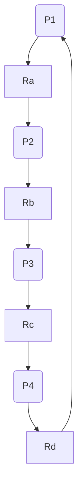
这就形成了一个 `P1 -> R_a -> P2 -> R_b -> P3 -> R_c -> P4 -> R_d -> P1` 的循环等待，导致死锁。

### 3.3 死锁定理

RAG和死锁之间存在一个重要的关系，我们称之为死锁定理：

1.  如果RAG中**没有环路**，则系统中**一定没有**死锁。
2.  如果RAG中**存在环路**，则系统中**可能存在**死锁。
    * **特殊情况**：如果每个资源类都**只有一个实例**，那么环路是死锁存在的**充分必要条件**（即有环必死锁）。

#### 3.3.1 有环但无死锁的例子

为什么有环路却"可能"没有死锁呢？这通常用来阐明在每类资源拥有多个实例的情况下，**环路是死锁的必要不充分条件**。看下面这个例子。

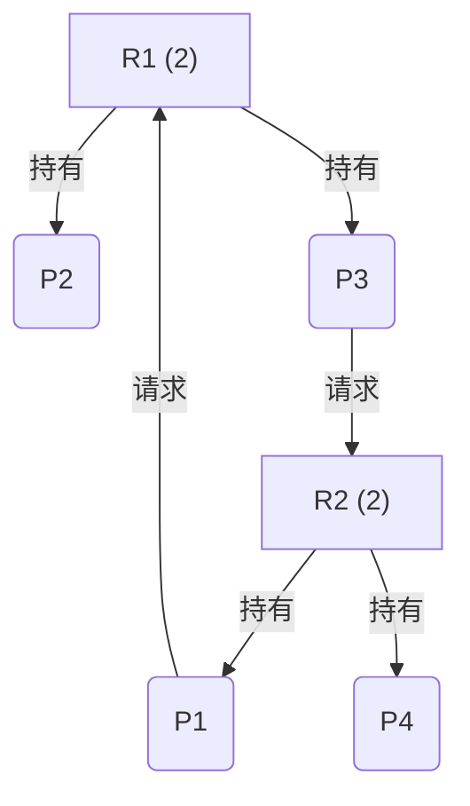

在这个图中，存在环路 `P1 → R1 → P3 → R2 → P1`。

虽然图中存在一个 `P1 → R1 → P3 → R2 → P1` 的循环等待，但我们可以通过一个简单的推演（这其实就是资源图化简法的思路）发现，系统仍然可以找到一个让所有进程都完成的执行序列，因此没有死锁：

1.  我们观察到进程 `P2` 和 `P4`。它们虽然持有资源，但**没有请求任何新资源**（即没有从它们出发的指向资源框的请求边）。这意味着它们不处于等待状态，可以顺利执行完毕并释放资源。

2.  **P2 (或 P4) 先完成**：假设 `P2` 先执行完毕，它会释放它持有的1个 `R1` 资源实例。
    *   此时，系统可用的 `R1` 资源变为1个 (`Available R1 = 1`)。

3.  **P1的请求被满足**：`P1` 一直在等待 `R1`。现在系统有可用的 `R1` 了，于是就可以把这个 `R1` 实例分配给 `P1`。
    *   `P1` 获得了所需的全部资源（它原来持有的`R2`和新获得的`R1`），可以继续执行直到完成。僵局被打破。

4.  **P1完成并释放资源**：`P1` 完成后，会释放它持有的所有资源：1个 `R1` 实例和1个 `R2` 实例。
    *   此时系统中有更多的可用资源。

5.  **其他进程相继完成**：`P1` 释放的 `R2` 可以满足 `P3` 的请求，`P3` 也能完成。`P4` 本来就可以自己完成。最终，所有进程都能顺利结束。

因为存在一个可以让所有进程都完成的执行序列（例如 `<P2, P1, P4, P3>`），所以系统**没有发生死锁**。这个例子完美地说明了：当每个资源类有多个实例时，**资源分配图中存在环路是死锁的必要条件，但不是充分条件**。

### 3.4 资源分配图化简

我们可以通过一种称为"图化简"的方法来检测死锁。基本思想是：模拟系统资源的分配和释放过程，看看是否能满足所有进程的需求。

**化简步骤**:
1.  在图中寻找一个既不阻塞（没有申请边）也非孤立的进程节点 $P_i$。
2.  释放该进程 $P_i$ 所占有的所有资源，抹去所有与它相连的分配边，使其变为孤立节点。这些释放的资源现在可用于满足其他进程的请求。
3.  检查这些新释放的资源是否能满足某个正在等待的进程 $P_j$ 的请求。如果可以，将 $P_j$ 的申请边变为分配边。现在 $P_j$ 获得了所需资源，可以继续运行，未来它也会释放所有资源。我们可以把它也看作一个可以被"消去"的节点。
4.  重复以上步骤，直到无法再找到可化简的进程。

**结论**: 如果最终图中所有的进程都被化简掉（成为孤立节点），则称该图是**可完全化简的**，系统**没有死锁**。反之，如果最后还剩下无法化简的进程节点，则系统存在死锁。

---

## 4. 解决死锁的方法

面对死锁，主要有四大类处理策略：

1.  **忽略该问题（鸵鸟算法）**: 就像鸵鸟把头埋进沙子里一样，假装问题不存在。适用于发生概率极低，且处理代价远高于其危害的系统。很多主流操作系统（如Windows, UNIX）都采用此策略，它们假设死锁不会发生，将处理死锁的责任留给了程序员。
2.  **死锁预防 (Deadlock Prevention)**: 在系统设计时，通过施加某些限制，从根本上破坏死锁产生的四个必要条件之一。这是一种**静态**策略。
3.  **死锁避免 (Deadlock Avoidance)**: 在系统运行时，动态地跟踪资源分配，每当有资源请求时，先判断分配后是否会导致系统进入"不安全状态"。如果会，则拒绝分配。这是一种**动态**策略。
4.  **死锁检测与解除 (Deadlock Detection and Recovery)**: 允许死锁发生，但系统有能力检测到它，并采取措施（如剥夺资源、终止进程）来解除死锁。

### 4.1 死锁预防

这是最直接的思路，即破坏四个必要条件中的一个。

#### 4.1.1 破坏"互斥使用"

* **思路**: 让资源变得可共享，而不是独占。
* **方法**: **资源转换技术**。一个典型的例子是 **SPOOLing 技术** (Simultaneous Peripheral Operations On-Line)。以打印机为例，它本身是独占设备。但系统可以设立一个打印机守护进程（daemon），所有进程不直接访问打印机，而是将打印内容发送给这个 daemon 进程，由 daemon 统一管理打印队列。这样，对于进程来说，它们访问的"打印服务"是共享的，不会被阻塞。

#### 4.1.2 破坏"占有且等待"

* **思路**: 不允许进程在占有资源的同时去等待新资源。
* **方案1**: **一次性申请**。进程在开始运行前，必须一次性地申请它在整个运行过程中所需要的所有资源。只有系统能满足其全部请求时，才分配给它。
    * **缺点**: 严重降低资源利用率（一个进程可能很早就申请了某个资源，但很晚才用）；可能导致"饥饿"（一个需要很多资源的进程可能永远也等不到所有资源都空闲的时刻）。
* **方案2**: **释放已有资源**。允许进程动态申请资源，但当它申请的新资源无法被满足时，它必须释放掉已经占有的所有资源。等以后需要时再重新申请。
    * **缺点**: 大大增加系统开销，进程可能要反复申请和释放资源。

#### 4.1.3 破坏"不可抢占"

* **思路**: 允许系统强行剥夺已被占有的资源。
* **方法**: 当一个高优先级的进程请求一个被低优先级进程占有的资源时，操作系统可以抢占这个资源。
* **局限性**: 这种方法只适用于那些状态容易保存和恢复的资源，如CPU、内存。对于像打印机这样的设备，你总不能抢占一个打印到一半的任务吧。

#### 4.1.4 破坏"循环等待"

* **思路**: 避免形成等待环路。
* **方法**: **资源有序分配法 (Resource Ordering)**。将系统中所有的资源类型进行线性排序（例如，R1=1, R2=2, R3=3...）。然后强制规定：任何进程在申请资源时，都必须严格按照资源编号的**递增顺序**进行申请。
* **为什么能行？**: 假设一个进程已经申请了资源 $R_i$，它接下来只能申请编号大于 $i$ 的资源 $R_j$ ($j > i$)。这样就不可能出现一个进程占有 $R_j$ 反过来去申请 $R_i$ 的情况，从而保证了资源分配图不会出现环路。
* **缺点**: 资源编号需要精心设计，可能会给编程带来不便。

### 4.2 死锁避免

死锁避免不像预防那样施加严格的限制，而是更加灵活。它允许前三个条件的存在，但在分配资源时会小心翼翼，确保不会踏入死胡同。这里的核心概念是**安全状态**。

#### 4.2.1 安全状态 (Safe State)

* **安全状态**: 如果系统能找到一个**安全序列**，那么系统就处于安全状态。
* **安全序列**: 一个进程序列 `$<P_1, P_2, ..., P_n>$` 是安全的，指的是对于序列中的每一个进程 $P_i$，它未来所需要的最大资源量，可以被**系统当前剩余的资源**加上**所有排在它前面的进程 ($P_j, j\le i$) 所持有的资源**所满足。
* **直白解释**: 安全状态意味着，系统有一种资源分配的调度顺序，可以保证所有进程都能在有限时间内获得所需资源，顺利执行完毕。

**状态关系**:
* 系统状态分为**安全状态**和**不安全状态**。
* **死锁状态** 是一种**不安全状态**。
* **安全状态**一定**没有死锁**。
* **不安全状态** **不一定**会**导致死锁**，只是系统无法再保证能按某种顺序为所有进程分配资源，存在进入死锁的可能性。

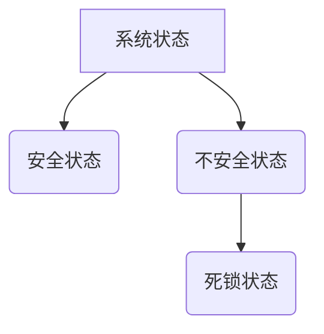

#### 4.2.2 银行家算法 (Banker's Algorithm)

就是资源分配图化简法，但是考虑了进程的**最大需求**。

这是由Dijkstra提出的最著名的死锁避免算法。它模拟银行家审批贷款的过程：银行家（操作系统）在批出贷款（分配资源）前，要确保即使这笔钱放出去了，自己手头的资金（剩余资源）依然能满足其他客户（进程）后续的最大需求，从而保证银行不会倒闭（系统不会死锁）。

**算法所需的数据结构**:
假设有n个进程和m类资源。
* `Available[m]`: 一个向量，表示每类资源当前还**可用**的实例数量。
* `Max[n][m]`: 一个矩阵，表示每个进程对每类资源**最大**的需求量。
* `Allocation[n][m]`: 一个矩阵，表示每个进程当前已**分配**到的每类资源的实例数量。
* `Need[n][m]`: 一个矩阵，表示每个进程**还需**要的每类资源的实例数量。
    * 这个矩阵是推算出来的：`Need[i][j] = Max[i][j] - Allocation[i][j]`

**算法核心**:
1.  **资源请求**: 当进程 $P_i$ 请求资源 `Request[i]` 时：
    a. 检查请求是否合法：`Request[i] <= Need[i]`？如果一个进程请求的超过了它声明的最大需求，则为非法请求。
    b. 检查系统是否有足够资源：`Request[i] <= Available`？如果没有，进程必须等待。
    c. **假装分配**: 如果前两步都通过，系统**暂时**将资源分配给它，并更新数据结构：
       * `Available = Available - Request[i]`
       * `Allocation[i] = Allocation[i] + Request[i]`
       * `Need[i] = Need[i] - Request[i]`
    d. **安全检查**: 调用**安全性算法**，检查分配后的新状态是否安全。
       * 如果安全，则正式完成分配。
       * 如果不安全，则撤销刚才的"假装分配"，恢复到原来的状态，让进程 $P_i$ 等待。

2.  **安全性算法**:
    a. 初始化工作向量 `Work = Available`，和完成标记 `Finish[n]`（所有元素为`false`）。
    b. 从进程中寻找一个满足以下两个条件的进程 $P_i$：
       * `Finish[i] == false` (还没执行完)
       * `Need[i] <= Work` (它需要的资源小于等于系统当前可用的资源)
    c. 如果找不到这样的进程，直接跳到第 e 步。
    d. 如果找到了 $P_i$，则假设它执行完毕并释放所有资源。更新 `Work` 和 `Finish`：
       * `Work = Work + Allocation[i]`
       * `Finish[i] = true`
       * 返回第 b 步，继续寻找下一个可以满足的进程。
    e. 检查 `Finish` 数组，如果所有元素都为 `true`，则说明系统处于**安全状态**。否则，为**不安全状态**。

#### 4.2.3 银行家算法应用示例1

* **状态**: 1类资源，总量12。P1, P2, P3。

| 进程 | 目前占有量 | 最大需求量 | 尚需要量 (Need) |
| :--- | :--------: | :--------: | :-------------: |
| P1   |     1      |     4      |        3        |
| P2   |     4      |     6      |        2        |
| P3   |     5      |     8      |        3        |

* **系统剩余量 (Available)**: `12 - (1+4+5) = 2`

**安全性检查**:
1.  `Work = 2`, `Finish = [F, F, F]`
2.  **找 $P_i$ s.t. $Need[i] \leq Work$**:
    * P1: `Need=3 > Work=2` (不行)
    * P2: `Need=2 <= Work=2` (**可以！**)
    * P3: `Need=3 > Work=2` (不行)
3.  **模拟P2执行**:
    * `Work = Work + Allocation[P2] = 2 + 4 = 6`
    * `Finish = [F, T, F]`
4.  **回到第2步，用新的Work=6找**:
    * P1: `Need=3 <= Work=6` (**可以！**)
5.  **模拟P1执行**:
    * `Work = Work + Allocation[P1] = 6 + 1 = 7`
    * `Finish = [T, T, F]`
6.  **回到第2步，用新的Work=7找**:
    * P3: `Need=3 <= Work=7` (**可以！**)
7.  **模拟P3执行**:
    * `Work = Work + Allocation[P3] = 7 + 5 = 12`
    * `Finish = [T, T, T]`

**结论**: 由于所有进程的 `Finish` 标记都为 `true`，所以**当前状态是安全的**。一个安全序列是 `<P2, P1, P3>`。

#### 4.2.4 银行家算法应用示例2
* **状态**: 5个进程 (P1-P5)，3类资源 (A,B,C)。

|        | 已分配 (Allocation) | 最大需求 (Max) | 尚需要 (Need) |
| :----- | :-----------------: | :------------: | :-----------: |
|        |        A B C        |     A B C      |     A B C     |
| **P1** |        0 1 0        |     7 5 3      |     7 4 3     |
| **P2** |        2 0 0        |     3 2 2      |     1 2 2     |
| **P3** |        3 0 2        |     9 0 2      |     6 0 0     |
| **P4** |        2 1 1        |     2 2 2      |     0 1 1     |
| **P5** |        0 0 2        |     4 3 3      |     4 3 1     |

* **剩余资源 (Available)**: A=3, B=3, C=2

**问题1：此状态是否安全？**
1.  `Work = [3, 3, 2]`, `Finish = [F, F, F, F, F]`
2.  **找 $P_i$ s.t. $Need[i] \leq Work$**:
    * P1: `[7,4,3] > [3,3,2]` (不行)
    * P2: `[1,2,2] <= [3,3,2]` (**可以！**) -> 找到 P2。
3.  **模拟P2执行**:
    * `Work = [3,3,2] + [2,0,0] = [5,3,2]`
    * `Finish = [F, T, F, F, F]`
4.  **用新的Work=[5,3,2]找**:
    * P1: `[7,4,3] > [5,3,2]` (不行)
    * P3: `[6,0,0] > [5,3,2]` (不行)
    * P4: `[0,1,1] <= [5,3,2]` (**可以！**) -> 找到 P4。
5.  **模拟P4执行**:
    * `Work = [5,3,2] + [2,1,1] = [7,4,3]`
    * `Finish = [F, T, F, T, F]`
6.  **用新的Work=[7,4,3]找**:
    * P1: `[7,4,3] <= [7,4,3]` (**可以！**) -> 找到 P1。
7.  **模拟P1执行**:
    * `Work = [7,4,3] + [0,1,0] = [7,5,3]`
    * `Finish = [T, T, F, T, F]`
8.  **用新的Work=[7,5,3]找**:
    * P3: `[6,0,0] <= [7,5,3]` (**可以！**) -> 找到 P3。
9.  **模拟P3执行**:
    * `Work = [7,5,3] + [3,0,2] = [10,5,5]`
    * `Finish = [T, T, T, T, F]`
10. **用新的Work=[10,5,5]找**:
    * P5: `[4,3,1] <= [10,5,5]` (**可以！**) -> 找到 P5。
11. **模拟P5执行**:
    * `Work = [10,5,5] + [0,0,2] = [10,5,7]`
    * `Finish = [T, T, T, T, T]`

**结论**: 是安全状态。一个安全序列为 `<P2, P4, P1, P3, P5>`。

**问题2：P1申请(0,2,0)能否分配？**
1.  **检查请求**:
    * `Request_P1 = [0,2,0] <= Need_P1 = [7,4,3]` (合法)
    * `Request_P1 = [0,2,0] <= Available = [3,3,2]` (有资源)
2.  **假装分配**:
    * `Available = [3,3,2] - [0,2,0] = [3,1,2]`
    * `Allocation_P1 = [0,1,0] + [0,2,0] = [0,3,0]`
    * `Need_P1 = [7,4,3] - [0,2,0] = [7,2,3]`
3.  **用新状态进行安全检查**:
    * `Work = [3,1,2]`, `Finish = [F,F,F,F,F]`
    * P1: `[7,2,3] > [3,1,2]` (不行)
    * P2: `[1,2,2] > [3,1,2]` (不行)
    * P3: `[6,0,0] > [3,1,2]` (不行)
    * P4: `[0,1,1] <= [3,1,2]` (**可以！**) -> 找到 P4
    * `Work = [3,1,2] + [2,1,1] = [5,2,3]`
    * `Finish = [F,F,F,T,F]`
    * **用新的Work=[5,2,3]找**:
    * P1: `[7,2,3] > [5,2,3]` (不行)
    * P2: `[1,2,2] <= [5,2,3]` (**可以！**) -> 找到 P2
    * `Work = [5,2,3] + [2,0,0] = [7,2,3]`
    * `Finish = [F,T,F,T,F]`
    * **用新的Work=[7,2,3]找**:
    * P1: `[7,2,3] <= [7,2,3]` (**可以！**) -> 找到 P1
    * ... 后续可以完成。

**结论**: 可以分配。安全序列存在。

### 4.3 死锁检测与解除

这种策略不预防也不避免，而是采取"亡羊补牢"的方式。

#### 4.3.1 死锁检测

* **何时检测**:
    1.  当有进程因资源请求失败而阻塞时。 (开销大)
    2.  定时检测，比如每隔一段时间。
    3.  当系统资源利用率明显下降时，可能是死锁的征兆。
* **检测算法**:
    * 最常用的方法是维护一个**等待图 (Wait-for Graph)**，它是资源分配图的简化版，只包含进程节点。
    * 如果 $P_i$ 正在等待 $P_j$ 持有的资源，就在图中画一条从 $P_i$ 到 $P_j$ 的边。
    * 然后，在等待图中运行**环路检测算法**。如果发现环路，就意味着系统存在死锁。

#### 4.3.2 死锁解除 (恢复)

一旦检测到死锁，就需要采取措施打破僵局。代价越小越好。

1.  **撤销所有死锁进程**: 最简单粗暴，但代价巨大，所有进程的工作成果都丢失了。
2.  **进程回退 (Rollback)**: 利用系统的检查点（Checkpoint）机制，让死锁的进程回退到某个未发生死锁的先前状态，然后重新执行。
3.  **逐一撤销死锁进程**: 按照某种原则（如进程优先级、已执行时间、占有资源多少等）选择一个"牺牲品"进程并终止它，释放其资源。然后再次检测死锁，如果还存在，再撤销下一个，直到死锁解除。
4.  **逐一抢占资源**: 同样按某种原则，从一个死锁进程中抢占部分资源分配给其他进程，以打破环路。被抢占资源的进程必须回退到安全状态。

---

## 5. 经典问题：哲学家就餐问题

这个问题是Dijkstra提出的一个经典的并发同步问题，用以说明死锁。

### 5.1 问题描述
* 五个哲学家围坐在一张圆桌旁。
* 每人面前一盘意面，每两人之间放着一只筷子，共五只。
* 哲学家的动作是：思考 -> 感到饥饿 -> 拿筷子吃饭 -> 放下筷子 -> 继续思考。
* **规则**: 必须同时拿到左右两边的两只筷子才能吃饭。

### 5.2 解决方案分析

#### 方案1：朴素的信号量解法
每个筷子是一个信号量。哲学家`i`先拿左边的筷子`fork[i]`，再拿右边的`fork[(i+1)%5]`。

```c
// 伪代码
void philosopher(int i) {
    while(true) {
        think();
        P(fork[i]);              // 拿左筷子
        P(fork[(i+1) % 5]);      // 拿右筷子
        eat();
        V(fork[(i+1) % 5]);      // 放右筷子
        V(fork[i]);              // 放左筷子
    }
}
```
* **问题**: **会发生死锁**。如果五个哲学家同时感到饥饿，并同时拿起自己左手边的筷子，那么他们每个人都将永远等待自己右手边的筷子，而那只筷子正被邻座拿着。这就形成了循环等待。

#### 方案2：使用管程 (Monitor)
将获取和释放筷子的操作封装在管程内部。但幻灯片中给出的`get_forks`实现是有问题的，它依然是顺序地申请左右筷子，如果获取左筷子后在等待右筷子时被阻塞，同样会造成死锁，并没有解决根本问题。一个正确的管程实现需要能**原子地**检查并获取两只筷子。

#### 方案3：状态数组法 (推荐)
这是 Tanenbaum 提出的一个经典解法，可以避免死锁和饥饿。
* **核心思想**: 引入`state`数组记录每个哲学家的状态（思考、饥饿、进食）。一个哲学家只有在他**左右两边的邻居都没有在进食**时，才允许他从"饥饿"状态转为"进食"状态。这个检查和状态转换是**原子**的（通过`mutex`互斥锁保护）。

```c
// 伪代码
#define N 5
#define THINKING 0
#define HUNGRY 1
#define EATING 2
int state[N];
semaphore mutex = 1; // 保护对state数组的访问
semaphore s[N] = {0}; // 每个哲学家一个信号量，用于阻塞

void philosopher(int i) {
    while(true) {
        think();
        take_forks(i); // 核心逻辑
        eat();
        put_forks(i);  // 核心逻辑
    }
}

void take_forks(int i) {
    P(mutex); // 进入临界区
    state[i] = HUNGRY;
    test(i); // 尝试获取筷子
    V(mutex); // 退出临界区
    P(s[i]); // 如果不能吃，则在此阻塞
}

void put_forks(int i) {
    P(mutex); // 进入临界区
    state[i] = THINKING;
    test((i+N-1) % N); // 检查左邻居能否开吃
    test((i+1) % N); // 检查右邻居能否开吃
    V(mutex); // 退出临界区
}

void test(int i) {
    // 如果哲学家i饿了，并且左右邻居都没在吃
    if (state[i] == HUNGRY &&
        state[(i+N-1) % N] != EATING &&
        state[(i+1) % N] != EATING)
    {
        state[i] = EATING;
        V(s[i]); // 唤醒哲学家i（如果他被阻塞了）
    }
}
```
* **优点**: 这个方案不会死锁，因为获取筷子的条件是两只都可用。同时，通过`test`邻居，它也能保证一定的公平性，避免饥饿。

#### 方案4：限制就餐人数 (破坏循环等待的变种)
* **思想**: 最多只允许 N-1 (即4个) 哲学家**同时**进入餐厅（尝试拿筷子）。
* **实现**: 引入一个计数信号量 `room`，并初始化为4。

```c
// 伪代码
semaphore room = 4; // 餐厅最多坐4人
void philosopher(int i) {
    while(true) {
        think();
        P(room); // 进入餐厅
        P(fork[i]);
        P(fork[(i+1) % 5]);
        eat();
        V(fork[(i+1) % 5]);
        V(fork[i]);
        V(room); // 离开餐厅
    }
}
```
* **为什么能行？**: 因为桌上总共5只筷子，4个哲学家最多拿走4x2=8只（理论上），但实际上他们最多一人拿一只，也就是4只筷子。总有1只筷子是空闲的。这意味着，在最坏情况下（4个哲学家都拿了左手筷子），那个没能进入餐厅的第5位哲学家的邻座，总能拿到他右手的筷子，从而吃上饭，吃完释放两只筷子，打破僵局。这实际上破坏了循环等待。

---

## 6. 思考题解答

### 思考题1：画出5个进程陷入死锁的所有非同构模型

这实际上是寻找5个节点的所有强连通有向图的非同构类。我按最小边数和结构复杂度系统分析：

#### 第1类：最小强连通图（5条边）
**模型1: 单个5环**
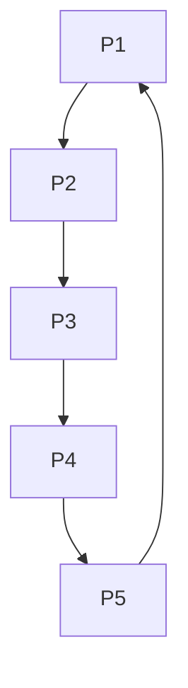

#### 第2类：6条边的强连通图
**模型2: 5环+1条弦（跨2个节点）**
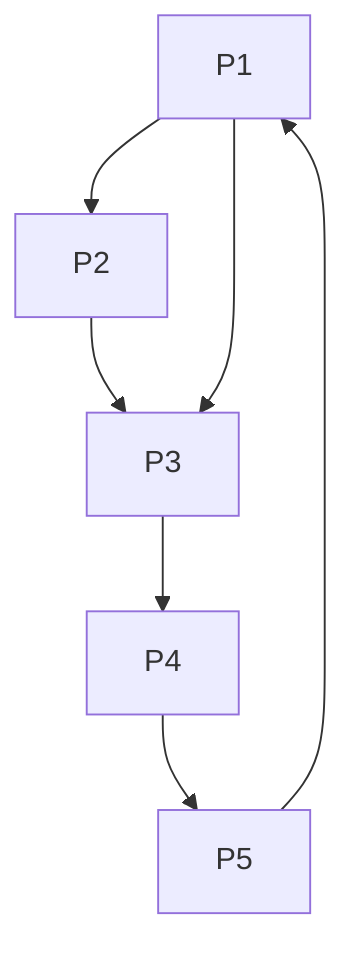

**模型3: 4环+分支链**
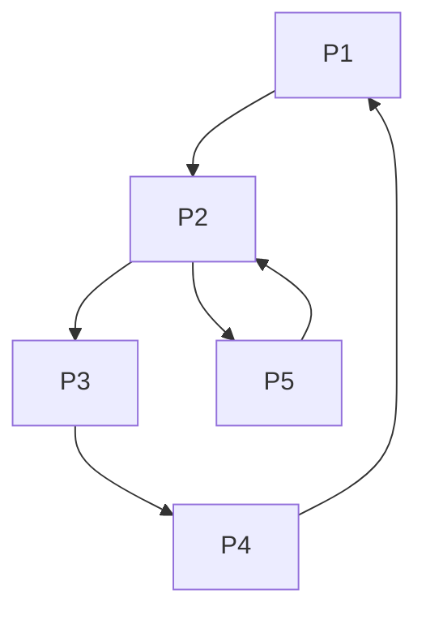

#### 第3类：7条边的强连通图
**模型4: 5环+2条相邻弦**
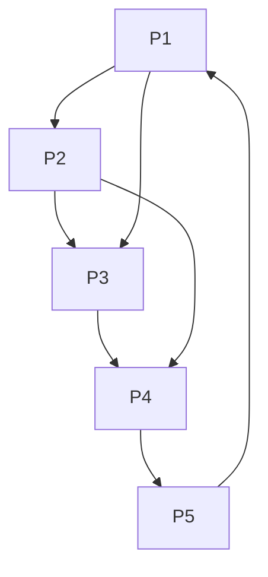

**模型5: 5环+2条对称弦**
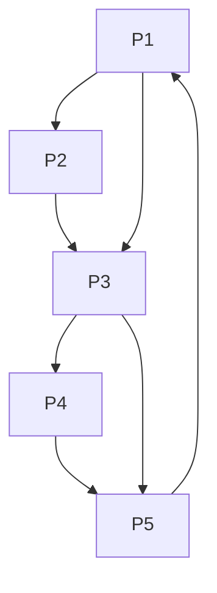

**模型6: 3环+2环（共享1个节点）**
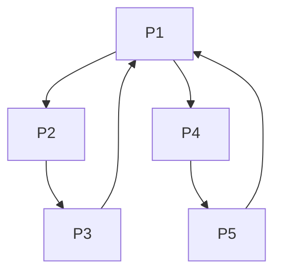

**模型7: 5环+2条非相邻、非对称弦**
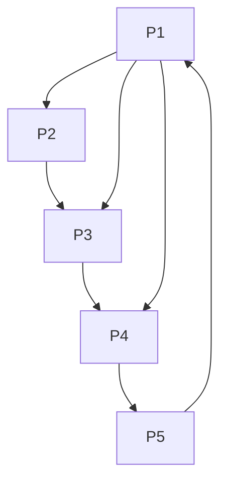

**模型8: 双4环结构（共享1条边）**
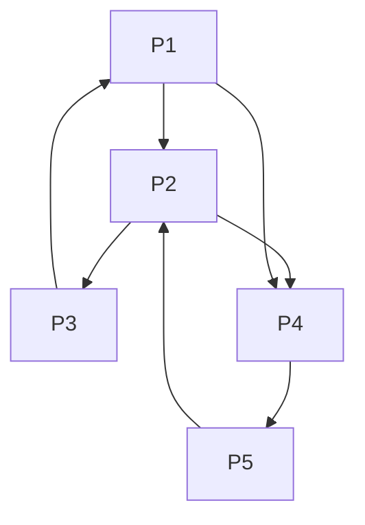

#### 第4类：8条边的强连通图
**模型9: 3环+双分支汇聚**
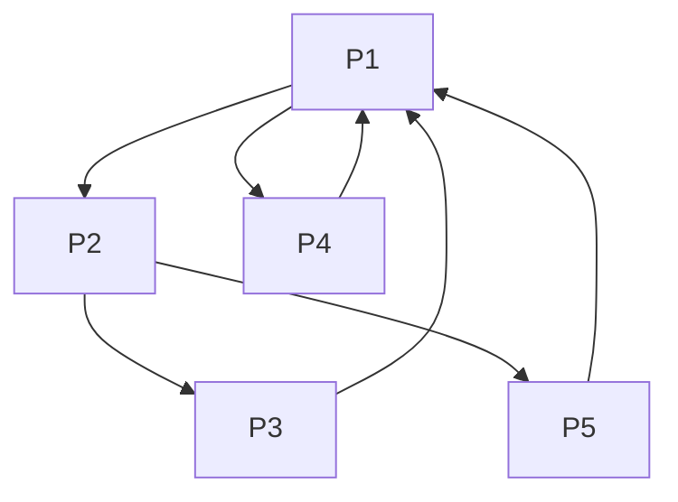

**模型10: 中心星型+反向环**
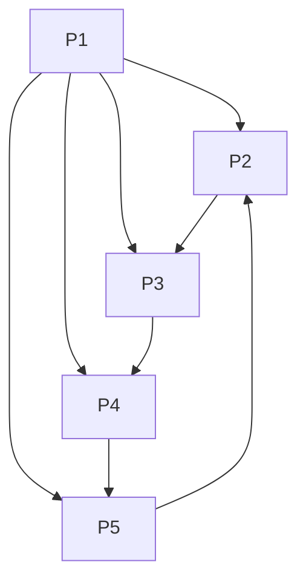

**模型11: 双3环交叉结构**
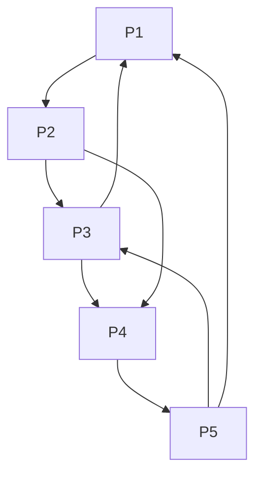

#### 第5类：9条边及以上的复杂结构
**模型12: 准完全图（缺少部分边的强连通图）**
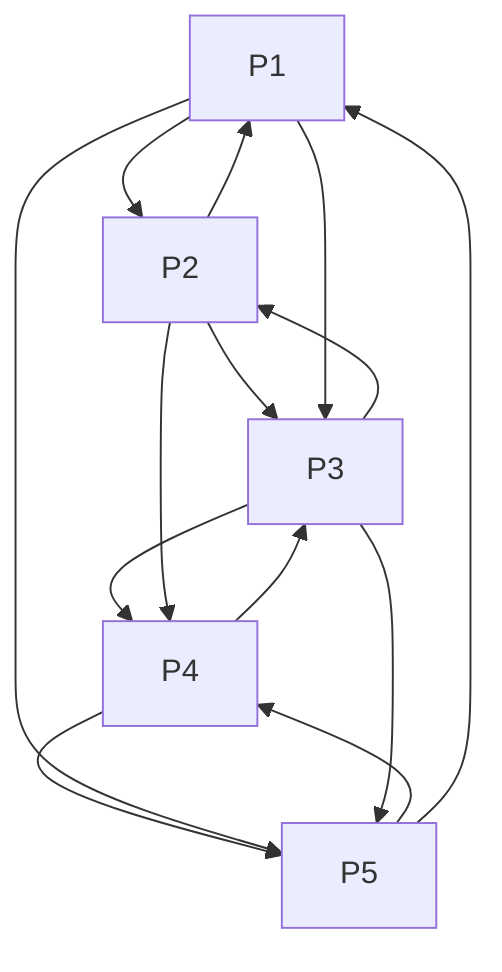

**模型13: 高度连接的复杂图**
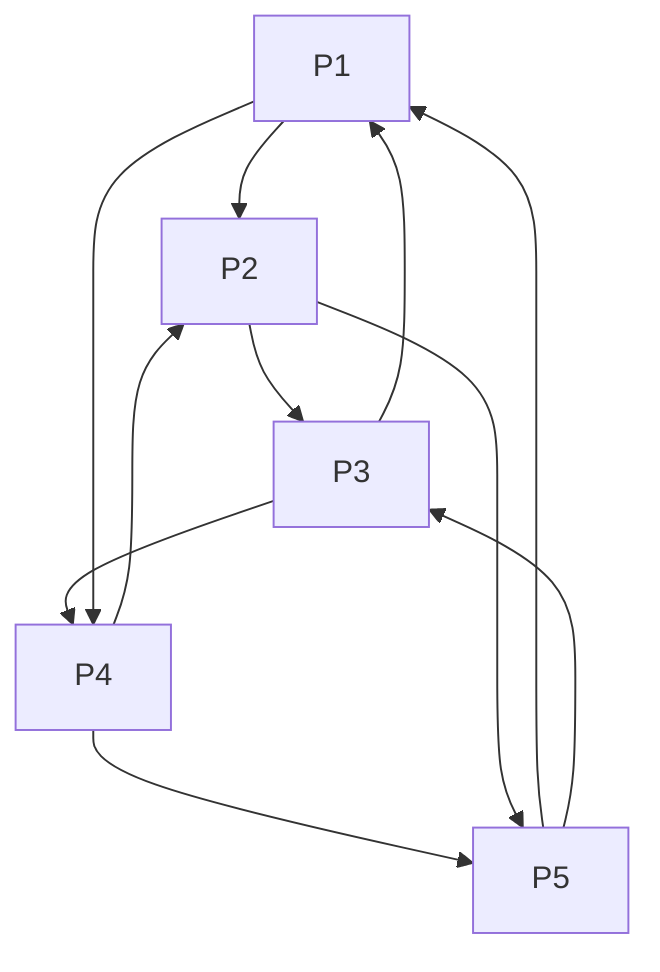

#### 总结
根据图论分析，5个节点的强连通有向图共有**13种**主要的非同构类。这些结构可以按边数分类：
- **5条边**: 1种（单5环）
- **6条边**: 2种  
- **7条边**: 5种
- **8条边**: 3种
- **9条边及以上**: 2种典型结构

每种结构都代表了一种可能的5进程死锁模式，死锁问题的复杂性远超简单的环形等待。

### 思考题2：学生用"超时"方法解决死锁，该给多少分？

**问题**: 进程请求资源时启动计时器。如果因阻塞超时，就"释放"该进程并让它重新执行。

**我的评价**:
作为老师，我会给这位同学一个**及格分，但不会给高分**。比如 60-70分。

**优点 (为什么给分)**:
1.  **抓住了问题**: 学生意识到了死锁是进程无限等待，并试图通过打破"无限"这个条件来解决问题，思路是对的。
2.  **提出了一种可行的恢复策略**: 这本质上是一种**死锁解除**机制，通过强制终止（或重启）进程来打破等待。在某些实时系统或健壮性要求高的系统中，类似"看门狗"(Watchdog Timer)的机制确实在被使用，防止任务卡死。
3.  **简单易行**: 实现起来相对简单，不需要复杂的图算法或状态跟踪。

**缺点 (为什么不能给高分)**:
1.  **治标不治本**: 它没有解决死锁产生的根本原因，只是在死锁发生后进行粗暴的干预。死锁问题依然会反复出现。
2.  **超时阈值难以确定**:
    * 如果时间设得太**短**，一个正常的、只是计算时间或I/O时间稍长的进程可能会被无辜"杀死"。
    * 如果时间设得太**长**，系统可能已经在死锁状态下浪费了大量时间，才被发现。
3.  **可能导致活锁**: 想象两个进程总是以同样的时序去申请同样的两个资源，它们可能都会因为超时而被反复重启，然后又在同一点上卡住，再次超时、重启……系统在不停地忙碌，但没有做任何有效的工作，这就是一种活锁。
4.  **数据一致性问题**: 强行"释放"或重启一个进程，可能会导致它操作的数据处于不一致或损坏的状态。例如，一个事务只完成了一半。这就需要非常复杂的事务和回滚机制来配合，学生的方法里没有提到这一点。
5.  **效率低下**: 反复重启进程的代价非常高。
