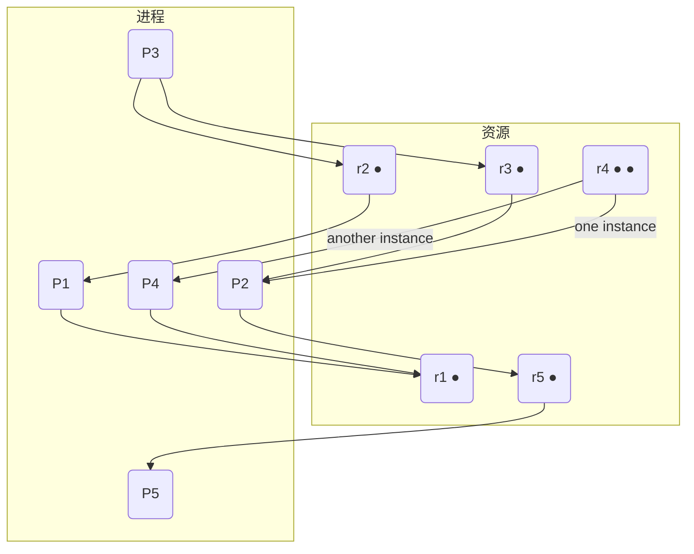

## 02. 中断异常机制

### 01. 其他ISA的状态控制寄存器

**问题**: 其他ISA的状态控制寄存器有哪些? (ARM, RISC-V)

**解答**:

不同的指令集架构（ISA）都有用于控制和表示处理器状态的特殊寄存器。

* **ARM**: 在ARM架构中，核心的状态控制寄存器是 **CPSR (Current Program Status Register)**。它包含了：
    * **条件码标志 (Condition Code Flags)**: 如N (Negative), Z (Zero), C (Carry), V (Overflow)。
    * **中断禁止位**: I (IRQ) 和 F (FIQ) 用于屏蔽中断。
    * **处理器模式位**: 用于切换用户模式、系统模式、中断模式等多种特权级别。
* **RISC-V**: 在RISC-V架构中，关键的状态控制寄存器是 **`mstatus` (Machine Status Register)**。它控制着处理器的全局状态，主要包括：
    * **全局中断使能位**: 如 `MIE` (Machine Interrupt Enable) 和 `SIE` (Supervisor Interrupt Enable)。
    * **当前特权级别**: 处理器可以在不同的特权模式下运行，主要是 **U-Mode (User/Application)**, **S-Mode (Supervisor)**, 和 **M-Mode (Machine)**。

### 02. 系统调用指令与对应体系结构

**问题**: `int`, `trap`, `syscall`, `sysenter/sysexit`, `ecall` 这些指令分别对应哪些体系结构?

**解答**:

这些都是用于从用户态陷入内核态以请求操作系统服务的指令，但它们属于不同的体系结构或在同一体系结构的不同发展阶段使用：

* **`int`**: **x86** 架构。`int n` 是一条软件中断指令。在早期的Linux中，`int 0x80` 是发起系统调用的标准方式。
* **`trap`**: 这是一个通用术语，指代由程序主动触发的异常。在某些 **RISC** 架构中，`trap` 指令被直接用于系统调用。
* **`sysenter`/`sysexit`**: **x86** 架构。从Pentium II开始引入，是一种比 `int 0x80` 更快速的系统调用机制，但使用起来也更复杂。
* **`syscall`/`sysret`**: **x86-64** 架构。这是现代64位x86处理器上进行系统调用的标准和高效方式。
* **`ecall`**: **RISC-V** 架构。`ecall` (Environment Call) 是RISC-V中用于发起系统调用的标准指令。

### 03. 操作系统初始化与中断/异常的关联

**问题**: 操作系统初始化与中断/异常有哪些关联?

**解答**:

操作系统在启动和初始化阶段，必须为处理中断和异常做好充分的准备，否则整个系统将无法正常响应外部事件和内部错误。这其中的关联主要体含在：

1.  **建立中断描述符表 (IDT)**: 操作系统必须在内存中创建一个 **IDT**。
2.  **注册中断处理程序**: 对于每一个操作系统计划处理的中断或异常（如时钟中断、键盘中断、缺页异常、系统调用等），都必须有一个对应的处理程序。操作系统需要将这些处理程序的入口地址填入IDT的相应表项中。
3.  **加载IDT寄存器 (IDTR)**: 操作系统需要执行一条特权指令，将IDT的基地址和长度加载到CPU的 **IDTR** 寄存器中。这样，当硬件检测到中断或异常时，CPU才能根据IDTR找到IDT，并根据中断向量号查询到正确的处理程序地址。

没有这个初始化过程，CPU在遇到中断时将不知道跳转到何处执行，系统会立刻崩溃。

### 04. Linux中断处理的上下半部机制

**问题**: 理解Linux的中断处理流程, 解释为什么引入上半部和下半部处理?

**解答**:

Linux将中断处理分为两个部分——**上半部 (Top Half)** 和 **下半部 (Bottom Half)**，是为了在 **处理效率** 和 **系统响应性** 之间取得平衡。

* **上半部 (Top Half)**:
    * **执行时机**: 中断发生后立即执行，通常在关中断的上下文中运行，以保证其原子性。
    * **任务**: 只处理最紧急、最耗时短的工作。例如，从硬件设备（如网卡）的缓冲区读取数据到内存中，然后对硬件进行应答，并标记一个“下半部”任务需要被执行。
    * **目标**: 尽快完成，以便重新开启中断，让系统能响应其他（可能是更高优先级的）中断。

* **下半部 (Bottom Half)**:
    * **执行时机**: 在上半部执行完之后，由内核在稍后的一个安全时刻（当中断开启时）来调用。
    * **任务**: 处理那些不那么紧急、但可能更耗时的工作。例如，对从网卡拷贝到内存的数据进行协议栈处理，并将其递交给应用程序。
    * **实现方式**: Linux提供了多种实现机制，如 softirqs、tasklets 和 workqueues。

**引入原因**:
如果不分上下半部，所有处理都在关中断的情况下完成，那么如果一个中断处理逻辑很复杂、耗时很长，就会导致CPU长时间无法响应其他中断，严重影响系统性能和实时性。通过将耗时任务推迟到下半部处理，可以 **显著缩短关中断的时间**，从而提高整个系统的吞吐量和响应能力。

---
## 03. 进程与线程模型

### 01. 进程地址空间与ASLR

**问题**: 为什么两个进程中变量的虚拟地址相同，但值可以不同？为什么有时候地址又会不同？

**解答**:

这个现象的核心在于理解 **虚拟地址空间 (Virtual Address Space)** 和 **地址空间布局随机化 (ASLR)**。

1.  **为什么地址相同，值不同**:
    每个进程都拥有自己独立的、私有的虚拟地址空间。当你运行两个相同的程序实例时，它们各自看到一组相同的虚拟地址（例如 `0x804968c`）。然而，操作系统通过 **页表 (Page Table)** 机制，将这两个进程中相同的虚拟地址映射到物理内存中 **两个不同的物理地址**。因此，一个进程修改其`myval`变量，实际上是修改它自己对应的物理内存，完全不会影响到另一个进程。

2.  **为什么地址会不同**:
    这是由一种叫做 **地址空间布局随机化 (ASLR)** 的安全机制导致的。为了防止缓冲区溢出等攻击，现代操作系统在每次运行程序时，都会随机化其关键数据区域（如栈、堆、共享库）的基地址。因此，即使是同一个程序，两次运行它的虚拟地址空间布局也是不同的，变量`myval`的虚拟地址也就会不同。通过 `sudo sysctl -w kernel.randomize_va_space=0` 命令可以关闭ASLR，这时地址就会变得固定和可预测。

### 02. fork、exec、wait与Shell的关系

**问题**: 阅读OSTEP第五章Process API, 了解系统调用shell `fork()`、 `exec()`、`wait()`之间的关联, 体会这样设计的好处。

**解答**:

Shell、`fork()`、`exec()` 和 `wait()` 共同构成 Unix/Linux 系统中执行命令的基础流程，这个设计非常经典和优雅。

* **流程**:
    1.  当你在Shell中输入一个命令（如 `ls -l`）并回车时，正在运行的Shell进程会调用 **`fork()`**。
    2.  `fork()` 会创建一个几乎与Shell进程完全一样的子进程。子进程拥有父进程地址空间的副本。
    3.  `fork()` 调用在父进程和子进程中都会返回。在父进程中，它返回新创建子进程的PID；在子进程中，它返回0。
    4.  子进程通过判断`fork()`的返回值为0，得知自己是子进程，然后它会调用 **`exec()`** 系列函数之一。
    5.  `exec()` 会根据指定的程序（如 `/bin/ls`）完全替换掉子进程当前的地址空间，加载新程序并开始执行。此时，子进程就变成了 `ls -l` 进程。
    6.  与此同时，父进程（Shell）通过判断`fork()`的返回值大于0，得知自己是父进程。它通常会调用 **`wait()`**，暂停自己的执行，直到子进程执行完毕。
    7.  当子进程（`ls -l`）执行结束并退出后，操作系统会唤醒正在 `wait()` 的父进程（Shell），父进程回收子进程资源后，继续打印提示符，等待下一个命令。

* **设计优点**:
    * **职责分离**: 将 **创建进程 (`fork`)** 和 **加载新程序 (`exec`)** 这两个截然不同的功能分离开，非常灵活。它允许子进程在调用 `exec` 之前执行一些设置工作，比如重定向I/O（管道 `|` 和重定向 `>` 就是这样实现的）、修改环境变量等。
    * **简洁高效**: `fork()` 利用了 **写时复制 (Copy-on-Write)** 技术，创建子进程的开销很小，只有在子进程或父进程尝试写入时，才会真正复制内存页。这对于后面马上要调用 `exec` 的情况非常高效，避免了无用的内存复制。

### 03. 线程间栈的访问

**问题**: 线程1是否可以访问线程2的栈？

**解答**:

**可以，但不应该**。

从技术上讲，同一进程内的所有线程共享同一个虚拟地址空间。这意味着，线程1的栈、线程2的栈以及进程的堆、全局数据等，都位于同一个地址空间内。因此，只要线程1能获得一个指向线程2栈空间的有效指针，它就 **可以** 对该内存区域进行读写操作。

然而，在正常的编程实践中，这是一种 **非常危险且错误的行为**。每个线程的栈都应该被视为该线程的私有区域，用于存放其局部变量、函数调用记录等。跨线程访问对方的栈会破坏线程的独立性和封装性，极易导致难以调试的竞态条件和数据污染问题。

---
## 04. 进程与线程调度

### 01. SRTN调度算法模拟

**问题**: 对于给定的进程信息，列出抢占式SJF（即SRTN）情形下时刻7之前的各任务剩余运行时间表格。
* P1: 到达时刻 0, 运行时间 7
* P2: 到达时刻 2, 运行时间 4
* P3: 到达时刻 4, 运行时间 1
* P4: 到达时刻 5, 运行时间 4

**解答**:

SRTN（Shortest Remaining Time Next）算法是抢占式的，总是在就绪队列中选择剩余时间最短的进程执行。

| 时刻  | 当前运行进程 | 就绪队列 (进程, 剩余时间) | P1剩余 | P2剩余 | P3剩余 | P4剩余 | 说明                                                              |
| :---- | :----------- | :------------------------ | :----- | :----- | :----- | :----- | :---------------------------------------------------------------- |
| **0** | P1           | {}                        | 7      | -      | -      | -      | P1到达，开始运行。                                                |
| **1** | P1           | {}                        | 6      | -      | -      | -      | P1继续运行。                                                      |
| **2** | P2           | {(P1, 5)}                 | 5      | 4      | -      | -      | P2到达，剩余时间(4) < P1剩余时间(5)，P2抢占P1。                   |
| **3** | P2           | {(P1, 5)}                 | 5      | 3      | -      | -      | P2继续运行。                                                      |
| **4** | P3           | {(P1, 5), (P2, 2)}        | 5      | 2      | 1      | -      | P3到达，剩余时间(1)最短，P3抢占P2。                               |
| **5** | P2           | {(P1, 5), (P4, 4)}        | 5      | 2      | 0      | 4      | P3运行结束。P4到达。比较就绪队列，P2剩余时间(2)最短，P2运行。     |
| **6** | P2           | {(P1, 5), (P4, 4)}        | 5      | 1      | 0      | 4      | P2继续运行。                                                      |
| **7** | P4           | {(P1, 5)}                 | 5      | 0      | 0      | 4      | P2运行结束。比较就绪队列，P4剩余时间(4) < P1剩余时间(5)，P4运行。 |

### 02. I/O密集型与CPU密集型进程调度分析

**问题**: 假设一个I/O密集型进程C（运行1ms，I/O 10ms）和两个CPU密集型进程A, B（各需计算1000ms），分析FCFS, RR(100ms), RR(1ms), SRTN调度算法的效果。

**解答**:

这个例子的核心目标是保持CPU和I/O设备都尽可能地忙碌。

* **FCFS (先来先服务)**: 如果A或B先运行，它们将各自独占CPU 1000ms，在这期间I/O密集型的C无法运行，导致I/O设备完全空闲。这是一种非常低效的调度方式。
* **RR (时间片=100ms)**: 调度顺序可能像 `C -> A -> B -> A -> B -> ...`。C运行1ms后发起I/O，然后阻塞。CPU会切换到A和B，它们会轮流用完各自的100ms时间片。在A和B运行期间，I/O设备可以和CPU并行工作。但是，由于A和B的运行时间很长，C需要等待很长时间才能再次被调度，可能在它的I/O操作完成后，CPU正忙于A或B，C无法立即再次发起I/O请求。这导致I/O设备的利用率不高。
* **RR (时间片=1ms)**: 这种方式下，C几乎可以在它的I/O操作一完成就能立刻得到CPU，运行1ms并发起下一次I/O，从而使I/O设备利用率接近饱和。同时，A和B在C的间隙中交替运行。虽然进程切换开销增大了，但对于最大化I/O吞吐量来说，这是非常有效的。
* **SRTN (最短剩余时间优先)**: 这是最理想的情况。I/O密集型进程C每次需要CPU时，其服务时间（1ms）都远小于CPU密集型进程A和B的剩余时间。因此，只要C的I/O操作一完成并进入就绪队列，它就能立刻抢占A或B，得到CPU。这保证了C可以连续地工作，最大限度地利用了I/O设备，同时也让CPU在C进行I/O的间隙中能被A和B充分利用。

### 03. 其他交互式系统调度算法

**问题**: 学习并总结公平共享调度、保证调度、彩票调度算法。

**解答**:

* **公平共享调度 (Fair-share Scheduling)**:
    * **原理**: 它将调度的公平性从单个进程扩展到 **用户组**。系统会确保CPU时间在不同的用户组之间公平分配。例如，如果有两个用户组，一个组有1个进程，另一个组有5个进程，系统会努力保证这两个组各获得50%的CPU时间，而不是让那5个进程主导CPU。
    * **优缺点**: 适用于多用户环境，防止单个用户通过创建大量进程来霸占系统资源。实现相对复杂。

* **保证调度 (Guaranteed Scheduling)**:
    * **原理**: 对用户做出明确的性能保证。它承诺如果系统中有N个用户，每个用户将获得 `1/N` 的CPU处理能力。算法会跟踪每个进程自创建以来已获得的CPU时间，并计算其应得的CPU时间与实际获得的CPU时间的比率。调度器会优先运行该比率最低的进程。
    * **优缺点**: 提供了非常可预测的性能，但实现复杂，需要精确跟踪CPU使用时间。

* **彩票调度 (Lottery Scheduling)**:
    * **原理**: 一种基于概率的调度算法。它为每个进程分配一定数量的“彩票”，进程拥有的彩票越多，被选中运行的概率就越大。每次调度时，系统随机“抽取”一张中奖彩票，持有该彩票的进程获得CPU。
    * **优缺点**: 实现简单，响应速度快。通过转让彩票，进程可以很容易地协作。它能近似地实现按比例共享，但结果具有随机性，不能提供绝对的保证。

---
## 05. 内存管理概述

### 01. 地址绑定时机

**问题**: 何时将数据和指令绑定到内存地址?

**解答**:

程序中的地址与物理内存地址的绑定（或称重定位）可以发生在程序生命周期的不同阶段：

1.  **编译时 (Compile time)**: 如果在编译时就知道程序将驻留在内存的哪个位置，编译器就可以直接生成绝对地址代码。但这种方式缺乏灵活性，一旦起始地址改变，程序就必须重新编译。
2.  **加载时 (Load time)**: 如果编译时不能确定程序的内存位置，编译器会生成可重定位代码（通常是相对于程序起始地址的地址）。当加载器将程序装入内存时，根据分配到的内存起始地址，对程序中的所有逻辑地址进行一次性转换，生成物理地址。
3.  **运行时 (Run time)**: 这是最灵活的方式。程序在运行过程中，其生成的地址（逻辑地址或虚拟地址）在每次被CPU访问时，都会由硬件（如内存管理单元MMU）动态地转换成物理地址。这种方式允许程序在内存中移动，是实现虚拟内存等高级功能的必要基础。

### 02. VMS内存管理问题

**问题**: VMS的内核是如何在进程之间共享的? VMS有哪两种减轻页表增长压力的方式?

**解答**:

根据课程资料，VAX/VMS的32位地址空间被分为两部分：P0/P1供用户使用，S空间供操作系统内核使用。

* **内核共享**: 所有进程共享同一个S空间。这意味着当进程切换时，内核部分的地址映射保持不变，只有用户空间的映射（P0/P1）需要改变。这提高了上下文切换的效率。
* **减轻页表压力**:
    1.  **分段**: VMS的地址空间本身就是分段的（P0, P1, S），这本身就是一种管理大地址空间的方式，可以将不同的逻辑部分分开管理。
    2.  **分页页表**: VMS可以将页表本身也进行分页。这意味着管理整个虚拟地址空间的巨大页表，不需要一次性全部加载到物理内存中，只有当前需要的页表部分才会被调入，从而节省了物理内存。

### 03. 大页模式的优缺点

**问题**: 大页模式解决了什么问题, 又有什么代价?

**解答**:

* **解决的问题**:
    大页（如使用2MB或1GB的页面，而不是传统的4KB页面）主要解决了 **TLB (Translation Lookaside Buffer) 覆盖率** 的问题。TLB是用于缓存虚拟地址到物理地址映射关系的高速缓存，其条目数量有限。使用大页，一个TLB条目可以映射更大的物理内存区域。这对于需要访问大量连续内存的应用程序（如数据库、科学计算）非常有利，因为它能 **显著减少TLB Miss的次数**，从而提高内存访问性能。

* **代价**:
    主要代价是 **内部碎片 (Internal Fragmentation)** 的增加。如果一个程序只需要几KB的内存，但操作系统为它分配了一个2MB的大页，那么绝大部分的页面空间就被浪费了。这个被浪费的空间就是内部碎片。

### 04. mmap思考题

**问题**:
1.  如果mmap映射的文件大小超过“物理内存+Swap空间”的总和，是否有问题？
2.  使用mmap代替read/write系统调用进行文件读写，有什么优势？

**解答**:
1.  **没有问题**。`mmap` 是将文件映射到进程的 **虚拟地址空间**，而不是直接加载到物理内存。操作系统采用 **按需分页 (Demand Paging)** 的策略，只有当进程真正访问到某个页面时，才会触发一个缺页中断，然后由操作系统从磁盘上的文件中读取相应的页面内容到物理内存中。文件本身充当了后备存储（backing store），所以它的大小不受物理内存或交换空间的限制。

2.  **优势主要有**:
    * **减少内存拷贝**: 使用`read`时，数据从内核的页面缓存（Page Cache）拷贝到用户的缓冲区。而使用`mmap`，文件直接映射到用户地址空间，内核和用户共享同一份物理内存，免去了这次拷贝，提高了I/O效率。
    * **简化编程模型**: 程序员可以像访问内存数组一样直接访问文件内容，而无需管理文件指针和缓冲区，代码更简洁。
    * **进程间通信**: 多个进程可以映射同一个文件到各自的地址空间，从而实现高效的共享内存通信。

---
## 06. 虚拟存储技术

### 01. 32位和64位页表大小计算

**问题**: 计算32位和64位虚拟地址空间的页表规模。

**解答**:

1.  **32位地址空间**:
    * 虚拟地址空间总大小: $2^{32}$ 字节 (4 GB)
    * 页面大小: 4 KB = $2^{12}$ 字节
    * 页表项 (PTE) 大小: 4 字节
    * **计算过程**:
        * 一个进程最多有 $2^{32} / 2^{12} = 2^{20}$ 个页面。
        * 存储这么多页面的页表需要 $2^{20} \times 4$ 字节 = 4 MB 的空间。
        * 4 MB 的页表自身就需要 $4\text{MB} / 4\text{KB} = 1024$ 个页框来存储。
    * **结论**: 对于每个进程，仅单级页表就需要4MB的连续物理内存，这非常巨大且不切实际。因此必须采用 **多级页表**。

2.  **64位地址空间**:
    * 假设使用48位虚拟地址（x86-64的实际情况）。
    * 虚拟地址空间大小: $2^{48}$ 字节。
    * 页面大小: 4 KB = $2^{12}$ 字节。
    * PTE大小: 8 字节。
    * **计算过程**:
        * 一个进程最多有 $2^{48} / 2^{12} = 2^{36}$ 个页面。
        * 单级页表需要 $2^{36} \times 8$ 字节 = $2^{39}$ 字节 = 512 GB 的空间。
    * **结论**: 512 GB 的页表是绝对无法接受的。因此，64位系统 **必须** 使用多级页表（如x86-64使用四级页表）来稀疏地管理这个巨大的虚拟地址空间，只为实际使用的地址范围创建页表。

### 02. 页面置换算法模拟

**问题**: 给定页面访问序列 `2,3,2,1,5,2,4,5,3,2,5,2` 和3个页框，计算OPT, FIFO, LRU算法的缺页次数。

**解答**:

(F表示缺页)

**OPT (最优算法)**: 淘汰未来最长时间内不会被访问的页面。
```
访问: 2  3  2  1  5  2  4  5  3  2  5  2
------------------------------------------
框1:  2  2  2  1  5  5  4  4  3  3  3  3
框2:     3  3  3  3  2  2  5  5  2  2  2
框3:                 4  4     5  5
------------------------------------------
缺页:  F  F     F  F     F     F  F
```
**OPT缺页次数: 7次**

**FIFO (先进先出)**: 淘汰在内存中驻留时间最长的页面。
```
访问: 2  3  2  1  5  2  4  5  3  2  5  2
------------------------------------------
框1:  2  2  2  1  5  5  4  4  4  3  3  3
框2:     3  3  3  2  2  2  5  5  5  2  2
框3:           2  1  1  1  3  3  3  5
------------------------------------------
缺页:  F  F     F  F  F  F  F  F  F
```
**FIFO缺页次数: 9次**

**LRU (最近最少使用)**: 淘汰最长时间未被访问的页面。
```
访问: 2  3  2  1  5  2  4  5  3  2  5  2
------------------------------------------
框1:  2  2  2  1  5  5  4  4  3  3  5  5
框2:     3  3  3  1  2  2  5  5  2  2  2
框3:           1  2  1  1  3  3  5  3  3
------------------------------------------
缺页:  F  F     F  F  F  F  F  F  F  F
```
**LRU缺页次数: 10次**

### 03. Belady异常现象

**问题**: 使用FIFO算法和页面访问序列 `1,2,3,4,1,2,5,1,2,3,4,5`，分别在3个和4个页框下计算缺页次数，以验证Belady异常。

**解答**:

**3个页框**:
```
访问: 1  2  3  4  1  2  5  1  2  3  4  5
------------------------------------------
框1:  1  1  1  4  4  4  5  5  5  3  3  3
框2:     2  2  2  1  1  1  2  2  2  4  4
框3:        3  3  3  2  2  1  1  1  5
------------------------------------------
缺页:  F  F  F  F  F  F  F  F  F
```
**3个页框缺页次数: 9次**

**4个页框**:
```
访问: 1  2  3  4  1  2  5  1  2  3  4  5
------------------------------------------
框1:  1  1  1  1  1  1  5  5  5  5  4  4
框2:     2  2  2  2  2  2  1  1  1  1  5
框3:        3  3  3  3  3  2  2  2  2  3
框4:           4  4  4  4  4  3  3  3  4
------------------------------------------
缺页:  F  F  F  F        F  F  F  F  F  F
```
**4个页框缺页次数: 10次**

**结论**: 当分配的页框数从3增加到4时，缺页次数反而从9次增加到10次。这就是 **Belady异常**。LRU和OPT等具有栈属性的算法不会出现此异常。

### 04. 编程方法对缺页的影响

**问题**: 假设按行存放的二维数组 `int A[1024][1024]`，页面大小为4K，进程只有一个页框。分析两种不同循环方式的缺页次数。

**解答**:
* **前提**: 一个`int`占4字节，页面大小4KB = 4096字节。因此，一个页面可以存放 $4096 / 4 = 1024$ 个整数，正好是一行。

* **方法1 (按列访问)**:
    ```c
    for (j = 0; j < 1024; j++)
        for (i = 0; i < 1024; i++)
            A[i][j] = 0;
    ```
    * **访问模式**: `A[0][0]`, `A[1][0]`, `A[2][0]`, ... , `A[1023][0]`, `A[0][1]`, ...
    * **分析**: 访问`A[0][0]`时，包含第一行的页面被调入。但接下来访问`A[1][0]`时，这个元素在第二行，需要调入第二个页面，此时唯一的页框被换出。访问`A[2][0]`时又需要调入第三个页面... 每次访问都跨越了一个页面。
    * **缺页次数**: 每次访问 `A[i][j]` 都会导致一次缺页（因为上一个被访问的元素 `A[i-1][j]` 在不同的页面，而那个页面已经被换出）。总共有 $1024 \times 1024$ 次访问，所以缺页次数为 **$1024 \times 1024$ 次**。

* **方法2 (按行访问)**:
    ```c
    for (i = 0; i < 1024; i++)
        for (j = 0; j < 1024; j++)
            A[i][j] = 0;
    ```
    * **访问模式**: `A[0][0]`, `A[0][1]`, ... , `A[0][1023]`, `A[1][0]`, ...
    * **分析**: 访问`A[0][0]`时，包含第一行的整个页面被调入。接下来对`A[0][1]`到`A[0][1023]`的访问都在同一个页面内，不会产生缺页。直到访问`A[1][0]`时，才需要调入第二个页面，产生一次新的缺页。
    * **缺页次数**: 每一行会产生一次缺页，总共有1024行。所以缺页次数为 **1024次**。

**结论**: 程序的访存模式（即局部性）对缺页率有巨大影响。编写具有良好空间局部性的代码是优化性能的关键。

---
## 07. 文件系统1

### 01. 不同文件物理结构的磁盘访问次数

**问题**: 一个文件系统，根目录常驻内存。目录文件为链接结构，一个磁盘块可存10个目录项。要访问文件 `\A\D\G\I\K` 中的某一块。
1.  若文件为**UNIX三级索引**结构，读一块最少/最多要启动磁盘几次？
2.  若文件为**链接**结构，读第55块最少/最多要启动磁盘几次？
3.  若文件为**顺序**结构，读第5555块最少/最多要启动磁盘几次？

**解答**:

首先计算目录检索的访盘次数。路径为 `\A\D\G\I\K`，根目录在内存。
* 读目录 A: 1次 (假设A的目录项在ROOT的第一块，但题目说最多60个，所以A的目录可能跨块，这里做最坏打算)
* 读目录 D: 1次
* 读目录 G: 1次
* 读目录 I: 1次
* 读文件 K 的FCB/i-node: 1次

总共需要 **5次** 访盘来定位到文件K的元数据（FCB或i-node）。

1.  **UNIX三级索引**:
    * **最少**: 读文件数据块本身需要1次。总次数 = 5 (目录) + 1 (数据块) = **6次**。这种情况发生在要读的数据块地址在前10个直接指针中。
    * **最多**: 需要通过三级间接索引。总次数 = 5 (目录) + 1 (三级索引块) + 1 (二级索引块) + 1 (一级索引块) + 1 (数据块) = **9次**。

2.  **链接结构**:
    * 要读第55块，必须从第一块开始，沿着指针链顺序访问54次，才能找到第55块的地址。
    * **最少/最多**: 都是一样的。总次数 = 5 (目录) + 54 (读指针) + 1 (读第55块数据) = **60次**。

3.  **顺序结构**:
    * 文件的所有块是连续存放的。一旦从FCB中读到起始块号，第5555块的地址就可以直接计算出来（起始块号 + 5554），不需要额外读盘。
    * **最少/最多**: 总次数 = 5 (目录) + 1 (读数据块) = **6次**。

### 02. UNIX和FAT16布局模拟

**问题**: 假设2M磁盘，块大小512字节，模拟一系列文件操作后的UNIX和FAT16布局。

**解答**:

这个问题非常复杂，难以用简单的文本或图表完整展示。我将概述两种文件系统在这些操作后的最终状态。

* **磁盘参数**: 2M = 2048 KB = $2048 \times 1024$ 字节。块/簇大小 = 512 字节。总块数 = $2048 \times 1024 / 512 = 4096$ 块。

* **最终目录结构**:
    ```
    /
    ├── A
    │   └── B
    │       └── File1 (4 块)
    ├── C
    │   └── E
    │       ├── File2 (16 块)
    │       └── F
    │           ├── File3 (8 块)
    │           └── File4 (2 块)
    └── D
    ```

* **UNIX (i-node)**:
    * **超级块**: 记录文件系统元信息（总块数、i-node数等）。
    * **i-node区**: 会为每个文件和目录（A, B, C, D, E, F, File1, File2, File3, File4 以及根目录`/`）分配一个i-node。每个i-node记录了文件元数据和数据块指针。
    * **数据区**:
        * 每个目录（/, A, B, C, E, F）都是一个文件，其数据块内容是一系列的（文件名, i-node号）对。
        * 每个普通文件（File1, File2, File3, File4）的数据块会根据i-node中的地址指针被找到。例如，File2有16块，它的i-node的前12个指针是直接指针，第13个指针会指向一个一级间接块，这个间接块里存放着剩下4个数据块的地址。

* **FAT16**:
    * **引导区 (DBR)**: 包含文件系统信息。
    * **FAT表**: 文件分配表。是一个大数组，每个表项对应一个簇（块），记录了该簇的下一簇号。
        * `File1` 会形成一个长度为4的簇链。
        * `File2` 会形成一个长度为16的簇链。
        * `File3` 会形成一个长度为8的簇链。
        * `File4` 会形成一个长度为2的簇链。
    * **根目录区**: 存放 A, C, D 的目录项。
    * **数据区**:
        * 目录 A, C, E, F 本身也是文件，它们的目录项会指向它们的数据区的起始簇号。它们的内容是其子目录/文件的32字节目录项。
        * `File1` 的目录项会记录其文件名、属性、大小和起始簇号。通过这个起始簇号，可以在FAT表中查到它的完整簇链。其他文件同理。

---
## 08. 文件系统2

### 01. 访问控制方式优缺点

**问题**: 思考访问控制列表(ACL)和能力表(Capabilities)这两种访问控制方式的优缺点。

**解答**:

* **访问控制列表 (Access Control List, ACL)**:
    * **模型**: 以 **资源为中心**。每个文件（或其他资源）都附有一个列表，指明了哪些用户可以对它进行哪些操作（读、写、执行）。
    * **优点**:
        * **管理方便**: 很容易查看和修改“谁能访问我这个文件”。
        * **权限撤销简单**: 想要撤销某个用户的权限，只需从文件的ACL中移除对应的条目即可。
    * **缺点**:
        * **效率问题**: 难以回答“某个用户能访问哪些文件”，需要遍历系统中所有文件的ACL。
        * 在分布式系统中，每次访问都需要向资源所有者验证权限，可能成为瓶颈。

* **能力表 (Capability List)**:
    * **模型**: 以 **用户为中心**。每个用户都持有一张“能力表”或一组“能力凭证”，每个凭证都像一把钥匙，指明了用户可以访问哪个文件以及允许的操作。
    * **优点**:
        * **访问高效**: 用户访问资源时，只需出示对应的能力凭证，系统验证凭证有效性即可，无需再查询资源的访问控制信息。
        * **天然适用于分布式系统**。
    * **缺点**:
        * **权限撤销困难**: 一旦能力凭证分发出去，就很难收回。如果一个用户的权限需要被撤销，系统需要找到并作废所有已分发给他的相关凭证，这在实践中很复杂。
        * **凭证管理**: 能力凭证本身需要被保护，防止被窃取或篡改。

### 02. 磁盘调度练习

**问题**:
1.  **练习1**: 一系列磁盘请求，求最优响应次序。
2.  **练习2**: 磁头在8号柱面，一系列磁盘请求，求最省时间的响应次序。

**解答**:

磁盘访问时间主要由 **寻道时间** 和 **旋转延迟** 构成。最优次序的目标是最小化这两者的总和。通常采用的策略是电梯算法（SCAN/C-SCAN）来最小化寻道，并在同一柱面上按扇区号顺序服务以减少旋转延迟。

**练习1**: `(5,4,1), (5,1,5), (5,4,5), (5,2,8)`
* 所有请求都在 **5号柱面**，所以 **寻道时间为0**。只需考虑旋转延迟。
* 假设磁头当前刚过8号扇区，旋转方向是 1 -> 5 -> 8。
* 最优次序是按扇区号递增：`(5,1,5) -> (5,2,8) -> (5,4,1) -> (5,4,5)`。

**练习2**: 磁头在8号柱面，请求: `(9,6,3), (7,5,6), (15,2,6), (9,4,4), (20,9,5), (7,15,2)`
* **分析**: 采用电梯算法（SCAN）的思想。磁头从8开始，可以先向磁道号减少的方向移动，也可以向增加的方向移动。
* **向外扫描 (8 -> 20)**:
    1.  移动到柱面 **9** (寻道1次)。服务(9,6,3)和(9,4,4)，按扇区顺序先4后3。
    2.  移动到柱面 **15** (寻道6次)。服务(15,2,6)。
    3.  移动到柱面 **20** (寻道5次)。服务(20,9,5)。
    4.  改变方向，向内扫描。移动到柱面 **7** (寻道13次)。服务(7,5,6)和(7,15,2)，按扇区顺序先6后2。
* **向内扫描 (8 -> 7)**:
    1.  移动到柱面 **7** (寻道1次)。服务(7,5,6)和(7,15,2)，按扇区顺序先6后2。
    2.  改变方向，向外扫描。移动到柱面 **9** (寻道2次)。服务(9,6,3)和(9,4,4)，按扇区顺序先4后3。
    3.  移动到柱面 **15** (寻道6次)。服务(15,2,6)。
    4.  移动到柱面 **20** (寻道5次)。服务(20,9,5)。
* **结论**: 第二种方案（先向内）的总寻道距离更短，可能更优。**最优次序**: 先服务柱面7的请求，再服务柱面9，然后是15，最后是20。在每个柱面内，按扇区号顺序服务。
    * **最终次序**: `(7,5,6) -> (7,15,2) -> (9,4,4) -> (9,6,3) -> (15,2,6) -> (20,9,5)`

---
## 09. 并发机制

### 01. lock()需要满足的性质

**问题**: `lock()` 必须满足什么性质？

**解答**:

为了正确解决临界区问题，`lock()` 和 `unlock()` 这一对操作必须协同满足以下三个基本性质：

1.  **互斥 (Mutual Exclusion)**: 如果一个进程正在其临界区内执行，那么其他任何进程都不能进入其临界区。这是最基本的要求。
2.  **进步 (Progress)**: 如果没有进程在其临界区内，并且有若干进程希望进入临界区，那么只有那些不在剩余区（remainder section）执行的进程可以参与选择，并且这个选择不能被无限期地推迟。
3.  **有限等待 (Bounded Waiting)**: 从一个进程发出进入临界区的请求，到该请求被允许为止，其他进程进入临界区的次数必须是有限的。这可以防止饥饿现象。

课件中给出的简单软件锁方案都因为存在竞态条件而无法满足这些性质。

### 02. TSL指令在多处理器系统中的有效性

**问题**: TSL指令对多处理器系统有效吗？为什么？

**解答**:

**有效**。TSL (Test and Set Lock) 指令的有效性关键在于其 **原子性**。这条指令在硬件层面被设计为不可中断的原子操作。当一个处理器核心执行TSL指令访问某个内存地址时，硬件机制（通常是通过 **锁住内存总线**）会保证在“读取-修改-写回”这个完整周期内，其他任何处理器核心都无法访问该内存地址。这样就避免了多个处理器同时读取到锁的旧值并都认为自己成功获取了锁的竞态条件，从而保证了在多处理器环境下的互斥性。

### 03. 生产者-消费者问题中P/V操作顺序

**问题**: 在生产者-消费者问题的信号量解法中，若颠倒两个P操作的顺序或两个V操作的顺序会怎样？

**解答**:
标准顺序：
* **Producer**: `P(empty)`, `P(mutex)`, ..., `V(mutex)`, `V(full)`
* **Consumer**: `P(full)`, `P(mutex)`, ..., `V(mutex)`, `V(empty)`

1.  **颠倒P操作的顺序**: (`P(mutex)` 在前)
    * **Producer**: `P(mutex)`, `P(empty)`, ...
    * **后果**: **会导致死锁**。
    * **场景**: 生产者先执行`P(mutex)`成功获取了互斥锁。然后它检查缓冲区，发现缓冲区已满，于是执行`P(empty)`而被阻塞。此时，因为它仍然持有`mutex`锁，消费者无法进入临界区去消费产品（即无法执行`P(mutex)`），也就无法执行`V(empty)`来唤醒生产者。两者相互等待，形成死锁。

2.  **颠倒V操作的顺序**: (`V(full)` 或 `V(empty)` 在 `V(mutex)` 之前)
    * **Producer**: `V(full)`, `V(mutex)`
    * **后果**: **没有问题**。
    * **分析**: 生产者先通过`V(full)`增加了“满缓冲区”的计数，唤醒可能在等待的消费者，然后再通过`V(mutex)`释放临界区的互斥锁。这个顺序是安全的。消费者先被唤醒，但它会因为无法获得`mutex`锁而继续等待，直到生产者释放锁为止，逻辑正确。

### 04. 读者-写者问题应用场景

**问题**: 给出读者-写者问题的一种应用场景。

**解答**:

读者-写者问题模型在现实中非常常见，典型的应用场景包括：

* **数据库系统**: 一个数据库的某个数据项（如航班票务信息、银行账户余额），可以被多个客户端并发地读取（查询余票、查询余额），但当有事务需要更新这个数据项时（订票、转账），必须获得独占访问权，此时其他所有读写操作都必须等待。
* **在线票务系统**: 多个用户可以同时浏览（读）某个演出的座位情况，但当一个用户决定锁座并支付（写）时，该座位信息必须被独占锁定。
* **共享配置文件**: 在一个大型网络服务中，许多工作线程需要读取一个全局配置文件来获取服务参数。这个文件可以被所有线程并发读取。但当管理员需要更新配置时，更新进程（写者）需要独占访问该文件以保证配置的一致性。

### 05. 基于开关中断的锁实现分析

**问题**: 分析基于开关中断的锁实现的正确性，并讨论在不同位置开中断是否可行。

**解答**:

使用开关中断来实现锁，是在单处理器系统上实现原子性的古老方法。其核心思想是，在进入修改锁变量的临界区前关闭中断，完成操作后再开启中断。

* **幻灯片91的实现**:
    ```c
    lock() {
        disable_interrupts();
        while (value != FREE); // 忙等待
        value = BUSY;
        enable_interrupts();
    }
    ```
    这个实现是 **错误的**。如果在获取锁时发现锁已被占用，它会在 **关中断** 的情况下进入`while`循环忙等。此时CPU无法响应任何中断，包括时钟中断，因此不会发生进程调度，持有锁的进程也无法运行并释放锁，整个系统将 **死锁**。

* **幻灯片93的实现**:
    ```c
    lock() {
        disable_interrupts();
        if (value == FREE) {
            value = BUSY; // (1)
        } else {
            add_thread_to_queue; // (2)
            switch_to_next_thread; // (3)
        }
        enable_interrupts();
    }
    ```
    **讨论在(1), (2), (3)处开中断的可行性**:
    **绝对不可行**。`lock()`函数的整个逻辑，从`disable_interrupts()`到`enable_interrupts()`，必须作为一个原子操作来执行。如果在中间任何一步开启中断，都会导致竞态条件，破坏互斥性。
    * 如果在检查`value == FREE`之后，但在设置`value = BUSY`之前（即在(1)处）开启中断，那么另一个进程可能被调度运行，它也会调用`lock()`，同样检查到`value == FREE`，于是两个进程都认为自己获取了锁，互斥性被破坏。
    * 如果在将当前线程加入等待队列之后（(2)处）或切换线程之前（(3)处）开启中断，同样可能发生中断，导致对等待队列的并发修改或其他不一致状态。

**结论**: 在使用开关中断实现锁的机制中，从检查锁状态到完成锁状态修改（或将当前线程置于等待状态并切换）的整个过程都必须在关中断的情况下完成，不能在中间开启中断。

---
## 11. 死锁

### 01. 课堂练习：资源分配图分析

**问题**: 分析下图资源分配图是否存在死锁。


**解答**:

为了判断是否存在死锁，我们可以尝试 **化简资源分配图**。化简的规则是：寻找一个不被阻塞的进程（其所有申请的资源都可以被满足），释放它占有的资源，然后重复这个过程。如果最终所有进程都能被消除，则无死锁；否则，剩余的进程就是死锁进程。

1.  **P5**: 进程P5占有资源r5，没有申请任何资源。它可以执行完毕并释放r5。
    * **化简后**: r5变为空闲。
2.  **P2**: 进程P2申请r5，现在r5空闲了，可以分配给P2。P2得到r5后，可以执行完毕，并释放它占有的r2和一个r4实例。
    * **化简后**: r2 和一个 r4 实例变为空闲。
3.  **P3**: 进程P3申请r2和r3。现在r2空闲，但r3仍被P2占有（*修正：上一步P2释放了r3*）。实际上r3是被P2占有，P2执行完释放了r3。P3申请r2和r3。r2由P1占有，r3由P2占有。在P2释放资源后，r3空闲。但r2不空闲。所以P3阻塞。
    
    让我们重新分析图：
    * **P1** 占有 **r2**, 申请 **r1**
    * **P2** 占有 **r3** 和 **r4的一个实例**, 申请 **r5**
    * **P3** 申请 **r2** 和 **r3**
    * **P4** 占有 **r4的一个实例**, 申请 **r1**
    * **P5** 占有 **r5**

    化简步骤：
    1.  **P5** 不申请任何资源，可以运行。运行结束后释放 **r5**。
    2.  现在 **r5** 空闲。**P2** 的申请可以被满足。P2运行，结束后释放 **r3** 和 **r4的一个实例**。
    3.  现在 **r3** 和 **r4的一个实例** 空闲。**P3** 申请的 **r2** 和 **r3** 中，r3可以满足，但r2仍被P1占有，所以P3依然阻塞。
    4.  我们检查图中是否存在环路。
        * `P1 -> r1`
        * `P4 -> r1` (两个进程竞争r1)
        * `r2 -> P1`
        * `P3 -> r2`
        * `r3 -> P2`
        * `P3 -> r3`
        * 存在环路 **`P1 -> r2 <- P3 -> r3 -> P2 ...`** 这种画法不对。
        
        正确的环路分析:
        `P3 -> r2 -> P1 -> r1 <- P4` 这不是一个等待环。
        存在一个等待环 **`P3 -> r3 -> P2 -> (r4,r5)`**
        让我们重新看图。
        - `P3` 申请 `r2` (被`P1`持有) 和 `r3` (被`P2`持有)。
        - `P1` 申请 `r1`。
        - `P4` 申请 `r1`。
        - `P2` 申请 `r5` (被`P5`持有)。
        
        图中没有明显的循环等待环。我们继续化简。
    
        1. **P5** 运行，释放 **r5**。
        2. **r5** 满足 **P2** 的请求，**P2** 运行，释放 **r3** 和一个 **r4** 实例。
        3. 现在 **r3** 和一个 **r4** 空闲。**P3** 申请的 **r3** 满足，但 **r2** 仍被 **P1** 持有。P3阻塞。
        4. 此时，没有进程可以继续运行。**P1** 等待 **r1**, **P3** 等待 **r2**, **P4** 等待 **r1**。
        5. 这是一个死锁状态。**P1, P3, P4** 无法继续，它们构成了死锁。虽然没有一个简单的 `P1->P2->P1` 这样的环，但存在一个资源无法满足的僵局。
        
        让我们再次审视，图中`r4`有两个实例，一个给了`P2`，一个给了`P4`。这是正确的。
        `P1` 拥有 `r2`，请求 `r1`。
        `P3` 请求 `r2`(被P1拥有) 和 `r3`(被P2拥有)。
        
        即使在P2，P5运行完毕后，**r1**仍然没有被释放，**P1**和**P4**都在等待它。而**r2**也被P1持有，导致**P3**等待。这是一个死锁。**死锁进程为 {P1, P3, P4}**。

### 02. 资源有序分配法能否产生死锁

**问题**: 采用资源有序分配法会产生死锁吗?

**解答**:

**不会**。

资源有序分配法是通过破坏“**循环等待**”这个死锁必要条件来预防死锁的。

该方法要求系统中的所有资源类型都被赋予一个唯一的序号，并且规定所有进程在申请资源时，必须严格按照资源序号的 **递增顺序** 进行申请。

**证明**:
假设一个进程P_i持有资源R_a，并申请资源R_b。根据规则，必然有 `序号(R_a) < 序号(R_b)`。现在我们假设存在一个循环等待环 `{P_1, P_2, ..., P_n}`，其中：
* $P_1$ 等待 $P_2$ 持有的资源 $R_2$
* $P_2$ 等待 $P_3$ 持有的资源 $R_3$
* ...
* $P_n$ 等待 $P_1$ 持有的资源 $R_1$

根据资源有序分配法的规则，我们必然得到以下不等式：
* $P_1$ 申请 $R_2$，所以它持有的资源序号必须小于 `序号(R_2)`。
* $P_2$ 申请 $R_3$，所以它持有的 $R_2$ 的序号必须小于 `序号(R_3)`。即 `序号(R_2) < 序号(R_3)`。
* ...
* $P_n$ 申请 $R_1$，所以它持有的资源序号必须小于 `序号(R_1)`。

将这些不等式串联起来，我们得到：
`序号(R_2) < 序号(R_3) < ... < 序号(R_1)`
然而，从 $P_n$ 等待 $P_1$ 持有的 $R_1$ 这一条件，我们又知道 $P_n$ 申请的资源是 $R_1$，它自身持有的资源序号必然小于 `序号(R_1)`。

让我们从头开始。
假设存在循环等待 $P_1 \rightarrow P_2 \rightarrow \dots \rightarrow P_n \rightarrow P_1$。
令 $P_i$ 持有资源 $R_i$ 并请求资源 $R_{i+1}$（其中 $P_{n+1}=P_1$）。
根据规则：
* $P_1$ 请求 $R_2$，所以 $序号(R_1) < 序号(R_2)$
* $P_2$ 请求 $R_3$，所以 $序号(R_2) < 序号(R_3)$
* ...
* $P_n$ 请求 $R_1$，所以 $序号(R_n) < 序号(R_1)$

将这些不等式链组合起来，我们得到一个矛盾的结论：
$序号(R_1) < 序号(R_2) < \dots < 序号(R_n) < 序号(R_1)$
这是不可能成立的。因此，循环等待的假设不成立。资源有序分配法从根本上消除了产生死锁的可能性。

### 03. 银行家算法应用

**问题**:
给定一个系统状态，判断：
1.  此状态是否为安全状态？
2.  P2申请(1,0,2)能否分配？
3.  P5申请(3,3,0)能否分配？
4.  P1申请(0,2,0)能否分配？

**系统状态**:
* **剩余可用 (Available)**: A=3, B=3, C=2
* **已分配 (Allocation)**:
    * P1: (0,1,0)
    * P2: (2,0,0)
    * P3: (3,0,2)
    * P4: (2,1,1)
    * P5: (0,0,2)
* **最大需求 (Max)**:
    * P1: (7,5,3)
    * P2: (3,2,2)
    * P3: (9,0,2)
    * P4: (2,2,2)
    * P5: (4,3,3)

**解答**:
首先，计算每个进程的 **尚需 (Need)** 矩阵：`Need = Max - Allocation`。
* Need P1: (7,4,3)
* Need P2: (1,2,2)
* Need P3: (6,0,0)
* Need P4: (0,1,1)
* Need P5: (4,3,1)

**1. 判断当前状态是否安全**

使用安全性算法。`Work = Available = (3,3,2)`。`Finish = {F,F,F,F,F}`。
* **Step 1**: 找一个 `Need[i] <= Work` 的进程。
    * P1? (7,4,3) > (3,3,2) No
    * P2? (1,2,2) <= (3,3,2) Yes. P2可以执行。
    * `Work = Work + Allocation[P2] = (3,3,2) + (2,0,0) = (5,3,2)`. `Finish[P2]=T`.
* **Step 2**:
    * P1? (7,4,3) > (5,3,2) No
    * P3? (6,0,0) > (5,3,2) No
    * P4? (0,1,1) <= (5,3,2) Yes. P4可以执行。
    * `Work = Work + Allocation[P4] = (5,3,2) + (2,1,1) = (7,4,3)`. `Finish[P4]=T`.
* **Step 3**:
    * P1? (7,4,3) <= (7,4,3) Yes. P1可以执行。
    * `Work = Work + Allocation[P1] = (7,4,3) + (0,1,0) = (7,5,3)`. `Finish[P1]=T`.
* **Step 4**:
    * P3? (6,0,0) <= (7,5,3) Yes. P3可以执行。
    * `Work = Work + Allocation[P3] = (7,5,3) + (3,0,2) = (10,5,5)`. `Finish[P3]=T`.
* **Step 5**:
    * P5? (4,3,1) <= (10,5,5) Yes. P5可以执行。
    * `Work = Work + Allocation[P5] = (10,5,5) + (0,0,2) = (10,5,7)`. `Finish[P5]=T`.
所有进程都可执行完毕，所以 **当前状态是安全的**。一个安全序列是 **<P2, P4, P1, P3, P5>**。

**2. P2申请 (1,0,2)**
* **检查1**: `Request[P2] <= Need[P2]`? (1,0,2) <= (1,2,2) Yes.
* **检查2**: `Request[P2] <= Available`? (1,0,2) <= (3,3,2) Yes.
* **假定分配**:
    * `Available = (3,3,2) - (1,0,2) = (2,3,0)`
    * `Allocation[P2] = (2,0,0) + (1,0,2) = (3,0,2)`
    * `Need[P2] = (1,2,2) - (1,0,2) = (0,2,0)`
* **安全性检查**: 新状态下的 `Work = (2,3,0)`.
    * P2? `Need=(0,2,0) <= (2,3,0)` Yes. `Work = (2,3,0)+(3,0,2) = (5,3,2)`.
    * P4? `Need=(0,1,1) <= (5,3,2)` Yes. `Work = (5,3,2)+(2,1,1) = (7,4,3)`.
    * P1? `Need=(7,4,3) <= (7,4,3)` Yes. `Work = (7,4,3)+(0,1,0) = (7,5,3)`.
    * P3? `Need=(6,0,0) <= (7,5,3)` Yes. `Work = (7,5,3)+(3,0,2) = (10,5,5)`.
    * P5? `Need=(4,3,1) <= (10,5,5)` Yes.
    * 系统仍然安全。所以 **可以分配**。

**3. P5申请 (3,3,0)**
* **检查1**: `Request[P5] <= Need[P5]`? (3,3,0) <= (4,3,1) Yes.
* **检查2**: `Request[P5] <= Available`? (3,3,0) <= (3,3,2) Yes.
* **假定分配**:
    * `Available = (3,3,2) - (3,3,0) = (0,0,2)`
    * `Allocation[P5] = (0,0,2) + (3,3,0) = (3,3,2)`
    * `Need[P5] = (4,3,1) - (3,3,0) = (1,0,1)`
* **安全性检查**: 新状态下的 `Work = (0,0,2)`.
    * 此时，没有一个进程的`Need`向量小于等于`Work`向量。系统进入不安全状态。
    * 所以 **不能分配**。

**4. P1申请 (0,2,0)**
* **检查1**: `Request[P1] <= Need[P1]`? (0,2,0) <= (7,4,3) Yes.
* **检查2**: `Request[P1] <= Available`? (0,2,0) <= (3,3,2) Yes.
* **假定分配**:
    * `Available = (3,3,2) - (0,2,0) = (3,1,2)`
    * `Allocation[P1] = (0,1,0) + (0,2,0) = (0,3,0)`
    * `Need[P1] = (7,4,3) - (0,2,0) = (7,2,3)`
* **安全性检查**: 新状态下的 `Work = (3,1,2)`.
    * P1? No. P2? No. P3? No. P4? (0,1,1) <= (3,1,2) Yes.
    * `Work = (3,1,2) + (2,1,1) = (5,2,3)`
    * P2? `Need=(1,2,2) <= (5,2,3)` Yes. `Work = (5,2,3) + (2,0,0) = (7,2,3)`
    * P1? `Need=(7,2,3) <= (7,2,3)` Yes. `Work = (7,2,3) + (0,3,0) = (7,5,3)`
    * P3? `Need=(6,0,0) <= (7,5,3)` Yes. `Work = (7,5,3) + (3,0,2) = (10,5,5)`
    * P5? `Need=(4,3,1) <= (10,5,5)` Yes.
    * 系统仍然安全。所以 **可以分配**。

### 04. 哲学家就餐问题讨论

**问题**: 哲学家就餐问题何时发生死锁？如何预防或避免？

**解答**:

* **何时发生死锁**:
    当五个哲学家 **同时** 决定就餐，并且每一个人都先拿起自己 **左手边**（或都先拿起右手边）的筷子时，就会发生死锁。此时，每个哲学家都持有了一只筷子，并等待他另一侧那只被邻居拿走的筷子。这就形成了一个循环等待，没有哲学家能凑齐两只筷子，所有人都将永远等待下去。

* **如何预防/避免死锁**:
    可以通过破坏死锁的四个必要条件之一来解决。
    1.  **破坏“占有且等待”条件**: 要求哲学家必须 **同时拿起左右两只筷子**，如果不能同时获得，则一只也不拿（放下已拿到的），过会儿再试。这可以通过一个互斥锁（如`mutex`）来保护“拿筷子”这个复合操作的原子性。
    2.  **破坏“循环等待”条件 (资源有序分配法)**: 给所有筷子从1到5编号。规定所有哲学家必须先拿序号较小的筷子，再拿序号较大的筷子。这样，持有5号筷子的哲学家就不会去等1号筷子，打破了循环。另一种类似的方法是，让奇数号哲学家先拿左手筷子，偶数号哲学家先拿右手筷子。
    3.  **限制进入系统的进程数 (破坏“请求和保持”的隐含条件)**: 最多只允许 **四位** 哲学家同时坐在桌边尝试就餐。这样，至少会有一位哲学家能够拿到两只筷子，吃完后释放筷子，从而打破僵局。这可以通过一个计数信号量 `room`（初值为4）来实现，哲学家进入餐厅前必须先执行 `P(room)` 操作。

### 05. 5个进程陷入死锁的所有非同构模型

**问题**: 画出5个进程陷入死锁的所有非同构模型。

**解答**:

死锁的本质是资源分配图中存在无法化简的环路。对于5个进程（P1-P5），它们可以形成的死锁环路结构有以下几种非同构（结构上不相同）的模型：

1.  **一个包含5个进程的大环**:
    * 这是最简单的情况，所有5个进程形成一个单一的等待环。
    * 例如: $P1 \rightarrow P2 \rightarrow P3 \rightarrow P4 \rightarrow P5 \rightarrow P1$
    ```mermaid
    graph TD
        P1 --> P2 --> P3 --> P4 --> P5 --> P1
    ```

2.  **一个包含4个进程的环和一个独立的进程**:
    * 这种情况不可能发生。如果一个进程独立，它就不在任何环中，因此它不属于死锁集合。

3.  **一个包含3个进程的环和一个包含2个进程的环**:
    * 5个进程被分成了两个独立的死锁环。
    * 例如: $P1 \rightarrow P2 \rightarrow P3 \rightarrow P1$ 和 $P4 \rightarrow P5 \rightarrow P4$
    ```mermaid
    graph TD
        subgraph 死锁环1
            P1 --> P2 --> P3 --> P1
        end
        subgraph 死锁环2
            P4 --> P5 --> P4
        end
    ```

4.  **一个包含3个进程的环，其中一个进程参与另一个2进程环**:
    * 这种情况是不可能的，因为一个进程不能同时等待两个不同的进程。在资源图中，进程节点出度只能指向资源。更复杂的死锁是多个环共享节点。

我们考虑由进程和资源组成的环。最简单的模型是每个进程请求下一个进程持有的单一资源。

* **模型1: 5-进程环 (1个环)**
    $P_1 \xrightarrow{req} R_2 \xrightarrow{held} P_2 \xrightarrow{req} R_3 \xrightarrow{held} \dots \xrightarrow{held} P_5 \xrightarrow{req} R_1 \xrightarrow{held} P_1$
    ```mermaid
    graph TD
      P1 --> R1(R1)
      R1 --> P2
      P2 --> R2(R2)
      R2 --> P3
      P3 --> R3(R3)
      R3 --> P4
      P4 --> R4(R4)
      R4 --> P5
      P5 --> R5(R5)
      R5 --> P1
    ```
    *简化为进程等待图*:
    ```mermaid
    graph TD
        P1 --> P2 --> P3 --> P4 --> P5 --> P1;
    ```
* **模型2: 3-进程环 和 2-进程环 (2个环)**
    * 进程集 {P1, P2, P3} 形成一个死锁环。
    * 进程集 {P4, P5} 形成另一个独立的死锁环。
    ```mermaid
    graph TD
        subgraph 环1
          P1 --> P2 --> P3 --> P1;
        end
        subgraph 环2
          P4 --> P5 --> P4;
        end
    ```

* **模型3: 4-进程环，一个进程等待环外进程**
    * 这种情况不会构成5个进程的死锁。例如 P1->P2->P3->P4->P1，如果P5等待P1，但P1只等待P4，那么P5不属于死锁环。

因此，对于5个进程，只有两种基本的非同构死锁模型：一个包含所有5个进程的大环，或者一个3进程环和一个2进程环。

### 06. 思考题：超时重启的死锁消除方法

**问题**: 一个学生提出用“超时-释放-重试”的方法来消除死锁。如果你是教师，会给他多少分？为什么？

**解答**:

作为老师，我会给这个学生一个 **较低的分数**，可能是不及格，但会肯定他的创新思考。

**评分理由**:

1.  **概念错误**: 这个方法属于 **死锁解除 (Deadlock Recovery)**，而不是 **死锁消除/预防 (Deadlock Prevention/Avoidance)**。他混淆了问题的处理阶段。他允许死锁（或类似死锁的等待）发生，然后试图从中恢复，而不是从一开始就设计一个不会产生死锁的系统。

2.  **方案的严重缺陷 (可能导致活锁)**:
    * 这个方案最大的问题是，它可能导致 **活锁 (Livelock)** 或 **饥饿 (Starvation)**。
    * 想象两个进程P1和P2都需要资源A和B。P1获取A，P2获取B。它们都等待对方的资源，然后都超时了。它们同时释放资源并重新开始。很可能下一次它们又以同样的顺序获取了资源（P1拿A，P2拿B），然后再次超时。
    * 这个过程中，两个进程都在不断地尝试、失败、重试，消耗了大量的CPU时间，但任务 **没有任何实际进展**。这就是活锁。系统看起来在忙碌，但有效工作为零。

3.  **效率低下**:
    * 频繁的超时和重启会浪费大量已经完成的工作。如果一个进程在超时前已经计算了很长时间，这些计算成果都将付之东流。
    * 如何设定一个合理的“时间限”本身就是一个难题。太短会导致误判和不必要的重启；太长则意味着资源被无效占用的时间过长，系统响应慢。

**总结**:
虽然学生试图解决一个复杂的问题，但他的方案没有考虑到更深层次的并发问题（如活锁），并且效率低下。这表明他对死锁、活锁和饥饿等概念的理解还不够深入。我会鼓励他继续思考，如何改进这个方案，比如引入随机的退避（backoff）时间来避免同步重试，从而打破活锁。
