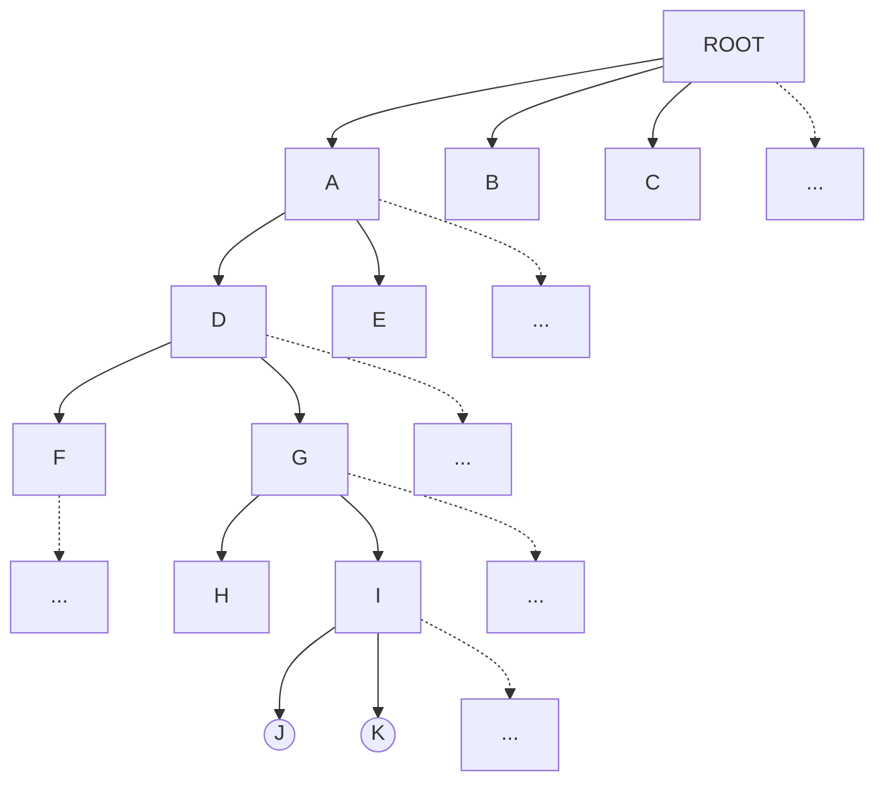

HDD与SSD的最小读写（管理）单位是什么？通常多大？

HDD与SSD的最小读写（管理）单位是什么？通常多大？

HDD和SSD中，LBA到PBA的映射是怎么完成的？对操作系统是否可见？

现代的HDD使用LBA（Logical Block Addressing）模式，将扇区映射为线性地址，这种映射是怎么完成的？

了解一下LBA的寻址方式？它能支持多大的硬盘容量？

有一个文件系统，根目录常驻内存，如图所示。
       目录文件采用链接结构，规定一个目录下最多存放60个下级文件。下级文件可以是目录文件，也可以是普通文件。每个磁盘块可存放10个下级文件的目录项，若下级文件为目录文件，则目录项给出该目录文件的第一块地址，否则给出普通文件的FCB的地址。
       假设文件按自左向右的顺序建立，…表示有若干内容未显示。
  （1）假设普通文件采用UNIX的三级索引结构，即FCB中给出13个地址，前10个地址指出文件前10块的磁盘块地址，第11个地址指向一级索引表（给出256个磁盘块地址）；第12个地址指向二级索引表，二级索引表中指出256个一级索引表的地址；第13个地址指向三级索引表，三级索引表中指出256个二级索引表的地址。若要读文件\A\D\G\I\K中的某一块，最少要启动磁盘几次？最多要启动磁盘几次？
（2）若普通文件采用链接结构，要读\A\D\G\I\K的第55块，最少启动硬盘几次？最多几次？
（3）若普通文件采用顺序结构，要读\A\D\G\I\K的第5555块，最少启动硬盘几次？最多几次？

ext2文件系统的布局是什么样的？

块组是个什么样的概念？为什么引入块组？

对比ext2，ext3有哪些扩展？

对比ext2，ext4又有哪些扩展？为什么需要扩展？

什么是延迟分配？ext4的延迟分配（Delayed Allocation）工作原理是什么？

ext4的extent机制的思路是什么？为什么引入这一机制？

怎样计算一个文件系统支持的最大文件？请给出计算方法，并以ext2和ext3为例进行计算。

ext2文件系统的布局是什么样的？块组的概念是什么？为什么引入块组？

什么是CSP模型？

CSP模型可以应用于哪一些软件系统？
