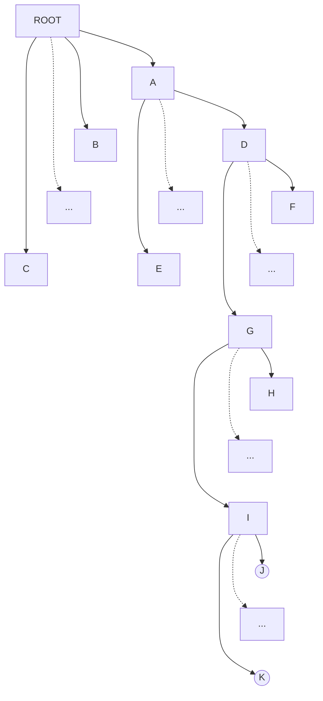

> [!note]
> Model: `gemini-2.5-pro-preview-06-05`
> 本文使用大语言模型（LLM）来提高效率，可能会出现错误，我已尽力检查校对。另一个较好的模型为 `claude-sonnet-4`，但是更适合代码工作，复杂的问题分析不如 `gemini-2.5-pro-preview-06-05`。

1. HDD与SSD的最小读写 (管理) 单位是什么？通常多大？

**解答**:
*   **HDD (硬盘)**:
    *   最小**物理**读写单位是 **扇区 (Sector)**。
    *   传统扇区大小为 512 字节。现代硬盘（采用先进格式化技术）的物理扇区大小通常是 **4KB**。为了兼容性，硬盘控制器可以向操作系统模拟512字节的逻辑扇区。
    *   操作系统（文件系统）管理的最小单位是 **块 (Block)**，通常为4KB，是扇区大小的整数倍。

*   **SSD (固态硬盘)**:
    *   最小**读取**单位是 **页 (Page)**。
    *   最小**写入/擦除**单位是 **块 (Block)**，一个SSD块由多个页组成。写入前必须先擦除整个块。
    *   页的大小通常为 **4KB**、8KB 或 16KB。
    *   块的大小通常为 **256KB** 到几 MB 不等（例如，一个块可以包含64或128个页）。

2. HDD与SSD的最小读写 (管理) 单位是什么？通常多大？

**解答**: 同上题。

3. HDD和SSD中，LBA到PBA的映射是怎么完成的？对操作系统是否可见？

**解答**:
*   **映射执行者**: LBA (Logical Block Address, 逻辑块地址) 到 PBA (Physical Block Address, 物理块地址) 的映射是由存储设备自身的**控制器固件**完成的。
    *   **HDD**: 控制器将操作系统发来的线性LBA，根据内置的算法和磁道几何信息（考虑到ZBR、坏道重映射等），转换为物理的 **柱面-磁头-扇区 (Cylinder-Head-Sector, CHS)** 地址。
    *   **SSD**: 控制器内部的 **闪存转换层 (Flash Translation Layer, FTL)** 负责这一映射。FTL维护一个动态更新的映射表，将LBA映射到闪存芯片上的具体物理页地址。这个过程极为复杂，还包含了**磨损均衡 (Wear-Leveling)** 和 **垃圾回收 (Garbage Collection)** 等关键功能，以优化性能和延长寿命。

*   **对操作系统可见性**: 这个映射过程对操作系统是 **完全透明（不可见）** 的。操作系统只看到一个连续、线性的逻辑块地址空间，并使用LBA进行读写。底层的物理复杂性被设备控制器完全屏蔽，极大地简化了操作系统的驱动程序设计。

4. 现代的HDD使用LBA (Logical Block Addressing) 模式，将扇区映射为线性地址，这种映射是怎么完成的？

**解答**:
这个问题可以理解为，HDD控制器是如何将LBA这个"线性地址"对应到其内部复杂的物理结构的。

这个映射是由 **HDD控制器** 内部完成的，它综合考虑了多个物理因素：
1.  **物理几何**: 柱面数、磁头数、每磁道扇区数等。
2.  **区域位记录 (Zone Bit Recording, ZBR)**: 现代硬盘外圈磁道的扇区数远多于内圈磁道。控制器内部有一张表或算法来记录每个区域（Zone）的磁道范围和对应的扇区数。LBA的映射必须考虑这种非线性的扇区分布。
3.  **缺陷管理 (Defect Management)**: 硬盘在出厂时和使用中都可能出现坏扇区。控制器会将这些坏扇区的地址记录下来，并使用备用扇区进行替换（重映射）。当操作系统请求一个已被重映射的LBA时，控制器会自动将其重定向到备用扇区的物理位置。

因此，LBA到PBA的映射并非一个简单的数学公式，而是一个由控制器固件执行的、考虑了上述所有复杂物理细节的内部算法。

5. 了解一下LBA的寻址方式？它能支持多大的硬盘容量？

**解答**:
*   **寻址方式**:
    LBA (Logical Block Addressing) 是一种极其简洁的寻址模式。它将存储设备（如硬盘或SSD）的所有扇区从0开始编号，形成一个巨大的一维数组。操作系统想要读写数据时，不再需要提供复杂的物理参数（如柱面、磁头、扇区号），而只需要提供一个简单的整数——逻辑块号（即LBA地址）即可。这种方式完全屏蔽了设备的物理细节，大大简化了访问。

*   **支持的最大容量**:
    LBA能支持的最大容量完全取决于用于表示LBA地址的**位数**。
    *   **LBA-28**: 这是早期IDE/ATA标准中使用的28位地址。
        *   总共可以表示 2²⁸个不同的扇区。
        *   如果每个扇区大小为512字节 (2⁹ Bytes)，最大支持容量为：2²⁸ × 512 B = 2²⁸ × 2⁹ B = 2³⁷ B = **128 GiB** (约 137 GB)。
    *   **LBA-48**: 为了突破128GiB的限制，ATA-6标准引入了48位地址。
        *   总共可以表示 2⁴⁸个不同的扇区。
        *   如果每个扇区大小为512字节，最大支持容量为：2⁴⁸ × 512 B = 2⁴⁸ × 2⁹ B = 2⁵⁷ B = **128 PiB** (Pebibytes, 约 144 PB)。
        *   如果扇区大小为4KB (2¹² B)，最大支持容量则为 2⁴⁸ × 4KB = 2⁴⁸ × 2¹² B = 2⁶⁰ B = **1 EiB** (Exbibyte)。

6. 有一个文件系统，根目录常驻内存，如图所示的目录结构。
    *   目录文件采用链接结构，规定一个目录下最多存放60个下级文件/目录项。每个磁盘块可存放10个目录项。若下级文件为目录文件，则目录项给出该目录文件的第一块地址；若为普通文件，则目录项给出该普通文件的FCB的地址。
    *   假设文件按自左向右的顺序建立 (`A`->`B`->`C`, `D`->`E`, `F`->`G`, etc.)。图中省略号表示有若干内容未显示。
    

*   **(1) 假设普通文件采用UNIX的三级索引结构：** FCB中给出13个磁盘地址。前10个是直接地址，指向文件前10块；第11个指向一级索引表 (含256个地址)；第12个指向二级索引表 (含256个一级索引表地址)；第13个指向三级索引表 (含256个二级索引表地址)。若要读取文件 `/A/D/G/I/K` 中的**某一块**，最少要启动磁盘几次？最多要启动磁盘几次？
*   **(2) 若普通文件采用链接结构：** 要读取 `/A/D/G/I/K` 的**第55块**，最少启动硬盘几次？最多几次？
*   **(3) 若普通文件采用顺序结构 (连续分配)：** 要读取 `/A/D/G/I/K` 的**第5555块**，最少启动硬盘几次？最多几次？

**解答**:

首先要分两步计算磁盘访问次数：
1.  **定位文件FCB**: 从根目录开始，逐级解析路径 `/A/D/G/I/K`，直到找到文件 `K` 的FCB。这部分的磁盘访问次数对于三种物理结构都是相同的。
2.  **读取文件数据块**: 在找到FCB后，根据文件不同的物理结构（索引、链接、顺序），计算读取指定数据块所需的磁盘访问次数。

总的磁盘访问次数是以上两步之和。

**第一步**：定位文件 `/A/D/G/I/K` 的 FCB

*   **`ROOT` -> `A`**: 根目录常驻内存，查找 `A` 的目录项不访问磁盘。**0次**。
*   **`A` -> `D`**: 读取目录 `A` 查找 `D`。
    *   **最少**: 目录 `A` 的第一个盘块就被读入，且 `D` 的目录项就在其中。**1次**。
    *   **最多**: `D` 在目录 `A` 的靠前位置。此处最坏情况也只算作 **1次** 访问（即`D`在第一个盘块内）。
*   **`D` -> `G`**: 读取目录 `D` 查找 `G`。目录 `D` 的结构是链接式，每块存10个条目，最多60个条目（即6块）。
    *   **最少**: `G` 的条目在 `D` 的第一个盘块。**1次**。
    *   **最多**: `G` 的条目在 `D` 的最后一个盘块（第6块），需要遍历前面5个盘块的指针链。**6次**。
*   **`G` -> `I`**: 读取目录 `G` 查找 `I`。同理。
    *   **最少**: **1次**。
    *   **最多**: **6次**。
*   **`I` -> `K`**: 读取目录 `I` 查找 `K`。同理，`K` 是一个普通文件，其目录项包含FCB的地址。
    *   **最少**: **1次**。
    *   **最多**: **6次**。
*   **读取 `K` 的 FCB**: 从上一步获得了FCB的磁盘地址，读取它。
    *   **最少/最多**: **1次**。

综上，定位并读取到 `K` 的 FCB 所需的磁盘访问次数为：
*   **最少次数**: 0 + 1 + 1 + 1 + 1 + 1 = **5次**
*   **最多次数**: 0 + 1 + 6 + 6 + 6 + 1 = **20次**

**第二步**：根据不同物理结构计算总访问次数

**(1) UNIX三级索引结构**

在FCB已读入内存的基础上，读取**某一块**数据：
*   **最少**: 读取的数据块是**直接索引**的前10块之一。FCB中直接存有该块的地址，只需访问一次数据块即可。**1次**。
*   **最多**: 读取的数据块位于**三级索引**。需要依次读取：三级索引块 -> 二级索引块 -> 一级索引块 -> 最终的数据块。共 **4次**。

**最终总访问次数**:
*   **最少总次数**: 5 (定位FCB) + 1 (读数据) = **6次**
*   **最多总次数**: 20 (定位FCB) + 4 (读数据) = **24次**

**(2) 链接结构**

读取**第55块**:
*   对于链接文件，要访问第 `n` 块，必须先访问第 `n-1` 块以获得指向第 `n` 块的指针。FCB中只存有第一块的地址。因此，要读第55块，必须从第1块开始，顺序读完前54块以找到第55块的地址，最后再读第55块。
*   **最少/最多**: 共需访问55次磁盘。**55次**。

**最终总访问次数**:
*   **最少总次数**: 5 (定位FCB) + 55 (读数据) = **60次**
*   **最多总次数**: 20 (定位FCB) + 55 (读数据) = **75次**

**(3) 顺序结构 (连续分配)**

读取**第5555块**:
*   对于顺序结构，FCB中记录了文件的起始块号和长度。要访问的第 `n` 块的物理地址可以通过 `起始地址 + n - 1` 的公式直接计算出来，无需访问任何中间块。
*   **最少/最多**: 计算出地址后，直接读取该数据块。**1次**。

**最终总访问次数**:
*   **最少总次数**: 5 (定位FCB) + 1 (读数据) = **6次**
*   **最多总次数**: 20 (定位FCB) + 1 (读数据) = **21次**

7. ext2文件系统的布局是什么样的？

**解答**:
ext2文件系统在磁盘上有一个非常规整的布局，它将整个磁盘分区划分为一系列的 **块组 (Block Groups)**。
一个典型的ext2文件系统布局如下：

1.  **引导块 (Boot Block)**: 位于文件系统的最开始，大小通常为1KB。它被保留用于分区的引导扇区，但ext2本身并不使用它。
2.  **块组 (Block Groups)**: 在引导块之后，文件系统被分割成连续的块组。每个块组都是一个相对独立的"子文件系统"，包含自己的元数据和数据块。

每个块组内部结构如下:
*   **超级块 (Super Block)**: 每个块组都包含一个超级块的**副本**（或者只有第0、1以及3、5、7...次方的块组才包含副本），但文件系统只使用第0个块组中的主超级块。它包含了整个文件系统的关键元数据，如总块数、总inode数、每个块组的块数等。副本用于在主超级块损坏时进行恢复。
*   **块组描述符表 (Group Descriptors)**: 类似于超级块，每个块组都包含整个文件系统所有块组描述符表的副本。它描述了文件系统中每个块组的属性，例如块位图和inode位图的位置、空闲块和inode的数量等。
*   **块位图 (Block Bitmap)**: 一个比特位代表一个数据块，用于标识块组内的数据块是"空闲"还是"已分配"。
*   **i节点位图 (Inode Bitmap)**: 一个比特位代表一个i节点，用于标识i节点表中的i节点是"空闲"还是"已分配"。
*   **i节点表 (Inode Table)**: 包含该块组内所有文件和目录的i节点 (inode)。每个i节点存储了文件的元数据（如大小、权限、时间戳）以及指向文件数据块的指针。
*   **数据块 (Data Blocks)**: 存储文件内容和目录内容的实际区域。

这种基于块组的设计是ext2的核心。

8. 块组是个什么样的概念？为什么引入块组？

**解答**:
*   **概念**: 块组 (Block Group) 是将一个大的文件系统分区划分为若干个较小、更易于管理的逻辑单元。每个块组都可以被看作是一个迷你的文件系统，因为它包含了描述自身状态的元数据（位图、i节点表）和用于存储数据的空间（数据块）。

*   **引入原因**:
    1.  **提高性能/减少寻道时间**: 这是最主要的原因。通过将一个文件的i节点 (inode) 和它的数据块 (data blocks) 存放在同一个块组内，可以显著减少磁盘磁头的移动距离。例如，当读取一个文件时，系统可以先在同一个块组里找到它的inode，然后紧接着在同一个块组（物理上很近的位置）里读取它的数据。这大大减少了在inode区和数据区之间漫长的寻道时间，尤其对机械硬盘 (HDD) 效果显著。
    2.  **提高可靠性**: 通过在多个块组中存放超级块和块组描述符表的副本，文件系统的容灾能力得到了增强。如果文件系统最开始的超级块损坏了，系统可以从其他块组的副本中恢复关键元数据，从而挽救整个文件系统。
    3.  **局部化管理**: 当分配新块或新i节点时，文件系统可以在一个局部范围内（块组内）进行搜索和操作，而不是扫描整个庞大的文件系统，提高了分配效率。

9. 对比ext2，ext3有哪些扩展？

**解答**:
ext3相对于ext2最核心、最关键的扩展是增加了 **日志 (Journaling)** 功能。这使得ext3成为一个日志文件系统，极大地提高了断电或系统崩溃后的数据一致性和恢复速度。

*   **日志功能**:
    在ext3中，对文件系统的元数据（甚至数据）的修改，在实际写入磁盘前，会先以"事务"的形式写入到一个特殊的日志区域。
    *   **优点**: 当系统发生意外崩溃后，重启时无需像ext2那样运行耗时极长的 `fsck` 程序来扫描整个文件系统以检查不一致性。系统只需读取日志，重放 (replay) 未完成的事务，就能快速地将文件系统恢复到一个一致的状态。
    *   **三种日志模式**:
        1.  **Journal (日志模式)**: 安全性最高。所有的数据和元数据在写入其最终位置前，都会先写入日志。这保证了最高的一致性，但因为所有数据都要写两次，所以性能最低。
        2.  **Ordered (有序模式)**: 默认模式，兼顾性能和一致性。只有元数据的更改被写入日志，但它强制一个约束：相关的数据块必须在元数据被提交到日志**之前**写入磁盘。这可以防止文件在崩溃后出现内容错乱（例如，文件大小增加了，但实际写入的数据是旧的垃圾数据）。
        3.  **Writeback (回写模式)**: 性能最高，但安全性最低。只有元数据的更改被写入日志，并且不保证数据和元数据写入磁盘的顺序。崩溃后可能导致文件内容与元数据不匹配。

*   **其他改进**:
    *   **目录索引 (H-Tree)**: 对于包含大量文件的目录，ext2使用线性列表来存储目录项，查找效率很低。ext3引入了H-Tree（哈希树）索引，大大提高了大目录的查找性能。
    *   **在线调整大小**: ext3支持在文件系统挂载状态下增加其容量。

10. 对比ext2，ext4又有哪些扩展？为什么需要扩展？

**解答**:
ext4是对ext2/3的一次重大升级，旨在提高性能、可靠性，并支持更大的文件和文件系统。

*   **为什么需要扩展?**
    随着磁盘容量越来越大、文件越来越多、CPU速度越来越快，ext2/3的设计瓶颈逐渐显现。例如，16TB的文件系统大小限制、基于块的分配方式导致的性能低下和文件碎片化、`fsck`检查时间过长等问题，都促使了ext4的诞生。

*   **ext4的主要扩展**:
    1.  **支持超大容量 (Large File System)**: ext4使用48位块地址，将文件系统的最大容量从ext3的16TB提升到了 **1EB** (Exbibyte)，最大单文件大小也提升到16TB。
    2.  **Extent机制**: 这是对文件块分配方式的根本性改变。它不再像ext2/3那样为每个数据块都记录一个指针，而是记录一段连续的块（称为一个Extent）。例如，一个100MB的连续文件，在ext3中需要25600个指针，而在ext4中可能只需要1个Extent描述符。这大大减少了元数据开销，提高了大文件的读写性能，并减少了文件碎片。
    3.  **延迟分配 (Delayed Allocation)**: 当程序写入数据时，ext4并不立即分配磁盘块，而是将数据保存在缓存中，并把分配任务延迟到数据真正需要写回磁盘时才执行。这使得文件系统可以收集更多的写操作，然后一次性分配一大块连续的空间，从而极大地减少碎片，提高分配效率。
    4.  **持久化预分配 (Persistent Pre-allocation)**: 允许应用程序为一个文件预留确定大小的磁盘空间，确保空间不会被其他文件占用，对数据库或P2P下载等应用很有用。
    5.  **更快的fsck**: ext4会标记块组中未使用的i节点，`fsck`程序可以直接跳过这些区域，从而大幅缩短文件系统检查时间。
    6.  **日志校验和 (Journal Checksumming)**: 通过为日志数据添加校验和，可以检测日志是否损坏，提高了文件系统的可靠性。
    7.  **纳秒级时间戳**: 将时间戳的分辨率提高到纳秒级别，并增加了文件创建时间戳。

11. 什么是延迟分配？ext4的延迟分配 (Delayed Allocation) 工作原理是什么？

**解答**:
*   **什么是延迟分配**:
    延迟分配 (Delayed Allocation, 或称 delalloc) 是一种文件系统性能优化技术。其核心思想是：当应用程序请求写入数据时，文件系统**不立即**为这些数据在磁盘上分配物理块，而是将分配决策推迟到最后一刻——即数据不得不从内存缓存刷写到磁盘上时。

*   **工作原理**:
    1.  **写入缓存**: 当一个程序执行 `write()` 系统调用时，内核将数据复制到内存中的页缓存 (Page Cache) 中，并将这些页面标记为"脏页"。在ext2/3中，此时就会立即开始为这些数据分配磁盘块。
    2.  **延迟决策**: 在ext4中，系统此时并**不分配**任何磁盘块。它只是在内存中记录下"这些数据需要被写入"，但具体写到哪里，还不知道。
    3.  **批量分配**: 分配工作被延迟到内核决定将脏页写回 (writeback) 磁盘时才触发（例如，内存不足、数据在缓存中停留过久、或用户调用 `sync()`）。
    4.  **智能决策**: 到写回时，文件系统可能已经收到了对同一个文件的多次、连续的写操作。此时，ext4的分配器就能获得更全面的信息（比如文件最终需要多大空间），从而可以一次性地分配一个更大、更连续的块（即Extent），而不是像ext3那样一次分配一小块、一小块，导致文件碎片化。

    **优点**: 延迟分配通过"等待和批量处理"的策略，将多次小的、零散的分配请求合并为一次大的、连续的分配，从而显著**减少文件碎片**并**提高I/O性能**。

12. ext4的extent机制的思路是什么？为什么引入这一机制？

**解答**:
*   **思路**:
    Extent机制的核心思路是用一种更紧凑、更高效的方式来描述文件数据在磁盘上的位置。传统的ext2/3使用"直接/间接块映射"：无论文件数据在磁盘上是否连续，元数据（i节点）中都需要为每一个数据块都保存一个指针。
    而Extent机制则将文件数据看作由一段段**连续的物理块**组成。它不再记录单个块的地址，而是记录一个"区段" (Extent) 的信息，每个区段包含三个核心部分：
    1.  **起始物理块号**: 这段连续空间的第一个块在磁盘上的地址。
    2.  **长度**: 这段空间包含了多少个连续的块。
    3.  **起始逻辑块号**: 这段数据对应于文件内的第几个块。

    例如，一个4MB的文件，如果存储在1024个连续的4KB物理块上，ext3需要1024个指针来描述它，而ext4只需要一个Extent条目，如 `(起始块: 5000, 长度: 1024, 文件内起始: 0)`。

*   **引入原因**:
    1.  **提升大文件性能**: 对于大文件，特别是连续存储的大文件（如视频、磁盘镜像），Extent极大地减少了元数据查找的开销。读取文件时，系统可以一次性获知一大段连续数据的地址，从而发起更高效的I/O操作，减少磁盘寻道。
    2.  **减少元数据开销**: Extent表示法比块指针列表紧凑得多，节省了存储元数据的空间。这使得i节点中可以存放更多的文件位置信息，减少了访问间接块的需求。
    3.  **减少文件碎片**: Extent机制与延迟分配策略相辅相成。延迟分配更容易找到连续空间，而Extent机制则能高效地记录这些连续空间。
    4.  **更快的操作**: 对文件进行整理、截断或删除等操作时，处理以Extent为单位的连续块远比处理大量零散的单个数据块要快得多。

13. 怎样计算一个文件系统支持的最大文件？请给出计算方法，并以ext2和ext3为例进行计算。

**解答**:
**计算方法**:
一个文件系统支持的最大文件大小，取决于其i节点 (inode) 结构中能够寻址（指向）多少个数据块。计算公式为：
**最大文件大小 = 可寻址的最大块数 × 每个块的大小**

**以ext2/ext3为例计算 (假设块大小为4KB)**:
ext2和ext3使用相同的"直接+间接"指针结构来寻址数据块。一个标准的i节点中有15个指针（`i_block`数组），每个指针大小为4字节。

1.  **直接指针 (Direct Pointers)**:
    *   i节点中有 **12** 个直接指针。
    *   每个指针直接指向一个数据块。
    *   可寻址块数 = 12
    *   大小 = 12 × 4KB = **48 KB**

2.  **一级间接指针 (Singly Indirect Pointer)**:
    *   i节点中有 **1** 个一级间接指针。
    *   它指向一个"指针块"，这个块里装满了指向数据块的指针。
    *   一个4KB的指针块可以存放 4096 / 4 = **1024** 个指针。
    *   可寻址块数 = 1024
    *   大小 = 1024 × 4KB = **4 MB**

3.  **二级间接指针 (Doubly Indirect Pointer)**:
    *   i节点中有 **1** 个二级间接指针。
    *   它指向一个"二级指针块"，该块里装满了指向"一级指针块"的指针。
    *   可寻址块数 = 1024 (二级指针块) × 1024 (一级指针块) = 1024²
    *   大小 = 1024² × 4KB = **4 GB**

4.  **三级间接指针 (Triply Indirect Pointer)**:
    *   i节点中有 **1** 个三级间接指针。
    *   它指向一个"三级指针块"，该块装满了指向"二级指针块"的指针。
    *   可寻址块数 = 1024 (三级) × 1024 (二级) × 1024 (一级) = 1024³
    *   大小 = 1024³ × 4KB = **4 TB**

**总计**:
最大文件大小 = (12 + 1024 + 1024² + 1024³) × 4KB
≈ 4TB + 4GB + 4MB + 48KB

因此，在4KB块大小的设定下，ext2/ext3理论上支持的最大单个文件大小约为 **4TB**。 (实际实现中，由于其他限制，通常被限制在2TB)。

14. ext2文件系统的布局是什么样的？块组的概念是什么？为什么引入块组？

**解答**: 
此题与第7、8题完全相同。
*   **布局**: ext2文件系统由一个引导块和随后的一系列**块组 (Block Groups)**构成。每个块组都包含超级块副本、块组描述符表副本、块位图、i节点位图、i节点表和数据块。
*   **块组概念**: 块组是文件系统分区的逻辑划分，每个块组如同一个微型文件系统，管理着自己区域内的i节点和数据块。
*   **引入原因**: 主要为了**性能**和**可靠性**。
    *   **性能**: 将文件的i节点和其数据块放在同一块组，减少磁盘寻道时间。
    *   **可靠性**: 在多个块组中备份超级块等关键元数据，防止单点故障导致整个文件系统损坏。

15. 什么是CSP模型？

**解答**:
CSP (Communicating Sequential Processes, 通信顺序进程) 是由 Tony Hoare 提出的一个用于描述并发系统中交互模式的**形式化语言**或**理论模型**。它不关注进程内部的计算，而专注于进程之间的**通信**行为。

其核心概念包括：
1.  **进程 (Process)**: 系统由多个独立的、并发执行的顺序进程组成。每个进程都是一个独立的执行单元。
2.  **事件 (Event) / 动作 (Action)**: 进程的行为由一系列事件组成。事件是原子性的，不可分割。
3.  **通信 (Communication)**: 进程之间通过**通道 (Channel)**进行通信。通道是单向或双向的，用于传递消息。
4.  **同步 (Synchronization)**: CSP的核心特征是**同步通信**，也称为"**会合 (Rendezvous)**"。当一个进程通过通道发送消息时，它会**阻塞**，直到通道另一端的接收进程准备好接收。发送和接收是一个同步发生的原子操作。
5.  **选择 (Choice)**: 进程可以非确定性地从多个可行的事件中选择一个来执行。例如，一个进程可以同时监听多个通道，并与第一个准备好通信的进程进行交互。

Go语言中的 Goroutine 和 Channel 的设计深受CSP模型的影响，是其思想的一个著名实践。

16. CSP模型可以应用于哪一些软件系统？

**解答**:
CSP模型作为一个描述并发协作的通用理论，可以广泛应用于任何涉及多个并发组件交互的软件系统。其主要应用领域包括：

1.  **并发编程语言设计**:
    *   **Go语言**: Goroutine作为轻量级进程，Channel作为通信通道，是CSP模型的直接体现。
    *   **Occam语言**: 一种早期基于CSP设计的编程语言。

2.  **操作系统**:
    *   用于建模和分析内核中不同子系统（如进程调度、内存管理、I/O）之间的交互。
    *   进程间通信 (IPC)，例如管道 (Pipe) 的工作方式，就可以用CSP来描述。

3.  **分布式系统和网络协议**:
    *   描述和验证网络协议，如TCP握手、客户端-服务器交互模型。
    *   在微服务架构中，用于建模服务之间的调用、数据流和协作关系。

4.  **嵌入式与实时系统**:
    *   在资源受限且可靠性要求极高的系统中，CSP的数学严谨性有助于设计和验证无死锁、无竞争的并发控制逻辑。

5.  **并行计算**:
    *   用于设计在多核处理器上运行的并行算法，特别是那些需要大量任务间数据交换的算法。

6.  **软件建模与验证**:
    *   软件工程师可以使用FDR等工具，基于CSP对并发系统的设计进行形式化建模，并自动验证其是否具有死锁、活锁等不良属性，从而在设计阶段就发现潜在的并发错误。

总而言之，只要一个系统可以被抽象为一组通过消息传递进行协作的独立组件，CSP就能为其提供强大的理论框架和分析工具。
